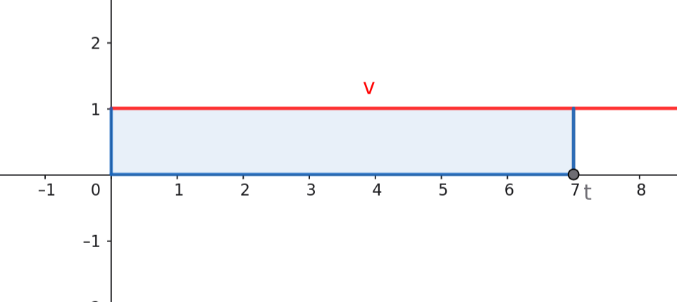
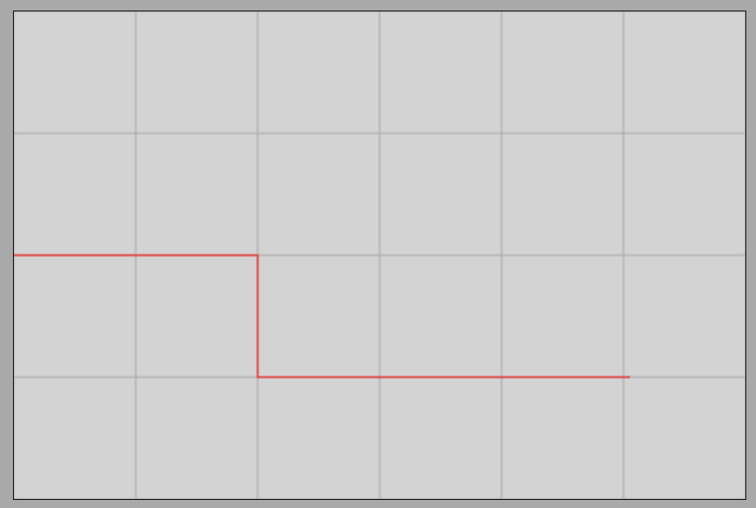

# Átlagsebesség

## A pillanatnyi sebesség

### Egyenletes mozgás sebesség-idő grafikonja

[Egyenesvonalú, egyenletes mozgás](https://alexerdei73.github.io/physics-engine/project/#c1c7278a-8c14-4386-ad82-477930ee81d2)

Újra vizsgáljuk meg az egyenletes mozgást, de most készítsük el a sebesség-idő grafikont! Ezt gyakorlásképp az olvasóra bízzuk. Tudjuk, hogy a sebesség nagysága állandó (esetünkben $1 \frac {m} {s}$), tehát minden időpontban ugyanaz az érték. A grafikon az x-tengellyel párhuzamosan haladó egyenes.

Megfigyelhetjük, hogy a grafikon görbéje alatti terület az a megtett utat adja. Ez a terület az amit az y-tengely, az x-tengely, az adott t időpontban az y-tengellyel párhuzamos egyenes és a grafikon görbéje (a vízszintes egyenes ez esetben) zárnak körbe (az ábrán a kék téglalap). 

### Szakaszonként egyenletes mozgás

Egy test 0 és 2s között egyenletesen halad $2 \frac {m} {s}$ sebességgel, majd hirtelen egy másik testnek ütközik és innentől $1 \frac {m} {s}$ sebességgel halad tovább egészen 5s-ig, 2s és 5s között. Mekkora a megtett út az első 2s alatt? Mekkora a megtett út 2s és 5s között? Mekkora a teljes megtett út? Mekkora az átlagsebesség a teljes 5s időtartam alatt? 

$$
v_1 = \frac {s_1} {t_1}
$$

$$
2 = \frac {s_1} {2}
$$

$$
s_1 = 2 \times 2 = 4m
$$

Tehát a test az első 2s alatt 4m utat tesz meg. Ekkor hirtelen egy  másik testtel ütközik és sebessége szinte azonnal felére csökken. Még 3s hosszan mozog az új sebességével egészen 5s-ig.

$$
v_2 = \frac {s_2} {t_2}
$$

$$
t_2 = 5s - 2s = 3s
$$

$$
1 = \frac {s_2} {3}
$$

$$
s_2 = 1 \times 3 = 3m
$$

Tehát a mozgás második szakaszában az ütközés után a test további 3m utat tesz meg.

$$
s = s_1 + s_2 = 4m + 3m = 7m
$$

A teljes megtett út tehát 7m. Ez láthatóan megegyezik a sebesség-idő grafikon alatti területtel, hiszen az pont 7 egység négyzet, ahogy az ábráról látható.

### Pillanatnyi sebesség

Látjuk, hogy változó sebességű mozgás esetén is igaz, hogy a sebesség-idő grafikon alatti terület a megtett út. A sebességmérő műszerek pont a pillanatnyi sebességet mérik, melyre ez az állítás általánosan igaz.

> **A pillanatnyi sebesség az a mennyiség, melynek grafikonját ábrázolja az idő függvényében, a megtett út bármely időpillanatban a grafikon görbéje alatti területtel egyezik meg.**

A fenti állítás tetszőleges mozgásra igaz, bár mi csak arra a speciális esetre láttunk példát, amikor a sebesség ugrásszerűen hirtelen változik, tehát a mozgás szakaszonként egyenletes. Ilyenkor az egyes szakaszok az egyenletes mozgás képletével számíthatók.

## Az átlagsebesség

Változó mozgásnál a megtett út és a megtételéhez szükséges idő hányadosa az nem adja meg a sebességet. Ez a mennyiség az átlagsebesség, mely csak egyenletes mozgás esetén egyezik a pillanatnyi sebességgel.

>**A teljes megtett út és a megtételéhez szükséges idő hányadosa az átlagsebesség. Ennek jele: $\overline{v}$.**

$$
\overline{v} = \frac {s} {t}
$$

Példánkban a teljes megtett út 7m és az idő 5s. Az átlagsebesség tehát:

$$
\overline{v} = \frac {s} {t} = \frac {7m} {5s} = 1.4 \frac {m} {s}
$$

Látjuk, hogy az átlagsebesség, csak az ütközés során lesz egyenlő a pillanatnyi sebességgel egy pillanatra, amikor a sebesség lecsökken. Sem a $2 \frac {m} {s}$ kezdeti, sem az $1 \frac {m} {s}$ ütközés utáni sebességgel nem egyenlő.

## Feladatok

### 1. feladat

Egy test 0 és 3s között egyenletesen halad $3 \frac {m} {s}$ sebességgel, majd hirtelen egy akadálynak ütközik. Az ütközés időtartama elhanyagolható, innentől $2 \frac {m} {s}$ sebességgel halad tovább egészen 8s-ig. Mekkora a megtett út az első 3s alatt? Mekkora a megtett út 3s és 8s között? Mekkora a teljes megtett út? Mekkora az átlagsebesség a teljes 8s időtartam alatt?

### 2. feladat

Egy autó 0 és 50s között egyenletesen halad $20 \frac {m} {s}$ sebességgel, majd hirtelen fékezni kezd. A sebesség csökkenésének időtartama mindössze 0,5s és elhanyagolható az egész folyamathoz képest, innentől $10 \frac {m} {s}$ sebességgel halad tovább egészen 150s-ig. Mekkora a megtett út az első 50s alatt? Mekkora a megtett út 50s és 150s között? Mekkora az átlagsebesség a teljes 150s időtartam alatt?

### 3. feladat

Egy kerékpáros 0 és 20s között egyenletesen halad $5 \frac {m} {s}$ sebességgel, majd hirtelen felgyorsít. A sebesség növekedésének időtartama mindössze 0,2s és elhanyagolható az egész folyamathoz képest, innentől $8 \frac {m} {s}$ sebességgel halad tovább egészen 60s-ig. Mekkora a megtett út az első 20s alatt? Mekkora a megtett út 20s és 60s között? Mekkora a teljes megtett út? Mekkora az átlagsebesség a teljes 60s időtartam alatt?

### 4. feladat

Egy vonat 0 és 100s között egyenletesen halad $15 \frac {m} {s}$ sebességgel, majd hirtelen lassít egy állomás megközelítésekor. A sebesség csökkenésének időtartama mindössze 1s és elhanyagolható az egész folyamathoz képest, innentől $5 \frac {m} {s}$ sebességgel halad tovább egészen 300s-ig. Mekkora a megtett út az első 100s alatt? Mekkora a megtett út 100s és 300s között? Mekkora az átlagsebesség a teljes 300s időtartam alatt?

### 5. feladat

Gyakorlásképp változtasd meg az adatokat a alábbi szimulációs projektben úgy, hogy a szövegben szereplő példa sebesség-idő grafikonját kapd!

[Rugalmatlan ütközés](https://alexerdei73.github.io/physics-engine/project/#8fb6472a-0612-4261-a3c6-468de892e9b9)

Az első test sebességét meg kell növelni $2 \frac {m} {s}$-ra, a másik test kezdeti x pozícióját pedig 4,2m-re. Az anim time paramétert 10-edére kell csökkenteni és a point-point coll. beta paraméterét pedig tízszeresére növelni, hogy a sebesség-idő grafikonra a példában szereplő grafikont kapjuk.