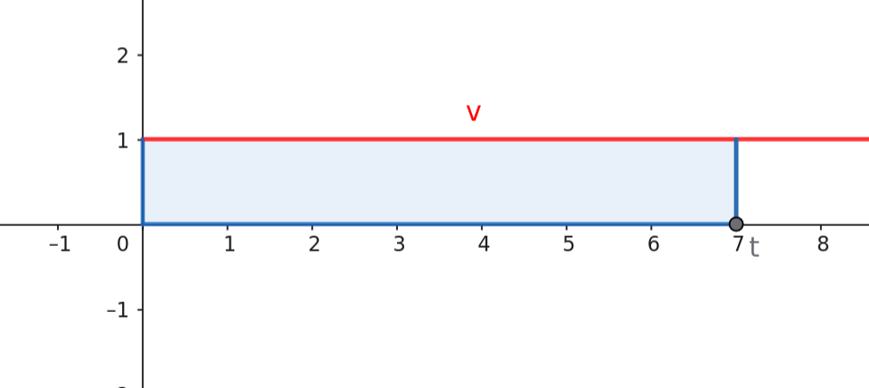
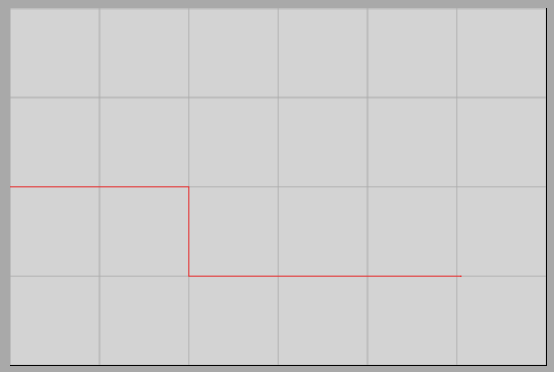

# Átlagsebesség és pillanatnyi sebesség

## A pillanatnyi sebesség

### Egyenletes mozgás sebesség-idő grafikonja

[Egyenes vonalú, egyenletes mozgás szimulátor](https://alexerdei73.github.io/physics-engine/project/#c1c7278a-8c14-4386-ad82-477930ee81d2)

Vizsgáljuk meg ismét az egyenes vonalú, egyenletes mozgást, de ezúttal a megtett út helyett a **sebesség-idő grafikont** készítsük el! (A grafikon önálló előállítását gyakorlásképpen az olvasóra bízzuk.) Mivel a mozgás egyenletes, a sebesség nagysága állandó (példánkban $1\text{ }\frac{\text{m}}{\text{s}}$), vagyis a test minden időpillanatban ugyanezzel az értékkel halad. A sebesség-idő grafikon képe így egy, az időtengellyel (vízszintes tengellyel) párhuzamos egyenes lesz.

Nagyon fontos geometriai megfigyelés, hogy a **grafikon görbéje alatti terület számszerűen megadja a test által megtett utat**. Ez a terület az a síkidom (példánkban a kék színű téglalap), amelyet a függőleges tengely, a vízszintes időtengely, a választott $t$ időpillanathoz tartozó függőleges egyenes, valamint maga a grafikon vonala zár közre.

### Szakaszonként egyenletes mozgás

Egy test a $0\text{ s}$ és $2\text{ s}$ közötti időintervallumban egyenletesen halad $2\text{ }\frac{\text{m}}{\text{s}}$ sebességgel, majd hirtelen egy másik testnek ütközik. Emiatt a sebessége megváltozik, és a $2\text{ s}$ és $5\text{ s}$ közötti szakaszon már $1\text{ }\frac{\text{m}}{\text{s}}$ állandó sebességgel halad tovább. 

Mekkora a megtett út az első $2\text{ s}$ alatt? Mekkora a megtett út $2\text{ s}$ és $5\text{ s}$ között? Mekkora a teljes megtett út? Mekkora a mozgás átlagsebessége a teljes $5\text{ s}$-os időtartam alatt?

Az első szakaszban megtett út az egyenletes mozgás alapképletéből kiszámítva:

$$
v_1 = \frac {s_1} {t_1}
$$

$$
2 = \frac {s_1} {2}
$$

$$
s_1 = 2 \cdot 2 = 4\text{ m}
$$

A test tehát az első $2\text{ s}$ alatt $4\text{ m}$ utat tesz meg. Ekkor hirtelen egy másik testtel ütközik, és a sebessége szinte azonnal a felére csökken. Ezzel az új sebességgel halad tovább egészen az $5\text{ s}$-os időpillanatig, vagyis a második szakasz időtartama:

$$
t_2 = 5\text{ s} - 2\text{ s} = 3\text{ s}
$$

A második szakaszban megtett út:

$$
v_2 = \frac {s_2} {t_2}
$$

$$
1 = \frac {s_2} {3}
$$

$$
s_2 = 1 \cdot 3 = 3\text{ m}
$$

Az ütközés után a test tehát további $3\text{ m}$ utat tesz meg. A teljes mozgás során megtett út a részutak összege:

$$
s = s_1 + s_2 = 4\text{ m} + 3\text{ m} = 7\text{ m}
$$

A teljes megtett út $7\text{ m}$. Ha megnézzük a sebesség-idő grafikont, ez az érték pontosan megegyezik a grafikon alatti két téglalap területének összegével ($4\text{ egység} + 3\text{ egység} = 7\text{ egység}$), ahogyan az az ábrán is látható.

### Pillanatnyi sebesség

A fenti geometriai szabály nemcsak a szakaszonként egyenletes, hanem a tetszőlegesen változó mozgásokra is általánosan érvényes: a sebesség-idő grafikon alatti terület mindig a test által megtett utat adja meg. A járművek sebességmérő műszerei (a kilométerórák) egy-egy adott időpillanathoz tartozó értéket mutatnak, ezt nevezzük **pillanatnyi sebességnek**.

> **A pillanatnyi sebesség a mozgó test egy adott időpillanathoz tartozó sebessége. Ha a pillanatnyi sebességet az idő függvényében grafikonon ábrázoljuk, a görbe alatti terület tetszőleges időintervallumban számszerűen megegyezik a test által megtett úttal.**

A fenti állítás minden mozgásra igaz, bár a valóságban a sebesség ritkán változik olyan ugrásszerűen és pillanatszerűen, mint az itt bemutatott szakaszonként egyenletes modellben. Az ilyen idealizált esetek nagy előnye, hogy az egyes szakaszok egyszerűen az egyenletes mozgás képletével számíthatók.

## Az átlagsebesség

Változó mozgás esetén a teljes megtett út és a teljes eltelt idő hányadosa általában nem egyezik meg a test pillanatnyi sebességével. Ezt a hányadost **átlagsebességnek** nevezzük. Az átlagsebesség csak és kizárólag egyenletes mozgás esetén egyenlő a pillanatnyi sebességgel.

> **A teljes megtett út és a megtételéhez szükséges teljes időtartam hányadosát átlagsebességnek nevezzük. Jele: $\overline{v}$ (v-vonás).**

$$
\overline{v} = \frac {s} {t}
$$

A szakaszonként egyenletes példánkban a teljes megtett út $7\text{ m}$, a teljes idő pedig $5\text{ s}$ volt. Az átlagsebesség erre a folyamatra:

$$
\overline{v} = \frac {s} {t} = \frac {7\text{ m}} {5\text{ s}} = 1{,}4\text{ }\frac {\text{m}} {\text{s}}
$$

Látható, hogy az átlagsebesség ($1{,}4\text{ }\frac{\text{m}}{\text{s}}$) a mozgás során mindössze egyetlen rövid pillanatra – az ütközés közben, a sebesség visszaesésekor – egyezik meg a test pillanatnyi sebességével. Sem a kezdeti $2\text{ }\frac{\text{m}}{\text{s}}$-os, sem az ütközés utáni $1\text{ }\frac{\text{m}}{\text{s}}$-os sebességgel nem egyenlő.

## Feladatok

### 1. feladat
Egy test a $0\text{ s}$ és $3\text{ s}$ közötti időintervallumban egyenletesen halad $3\text{ }\frac{\text{m}}{\text{s}}$ sebességgel, majd hirtelen egy akadálynak ütközik. Az ütközés lefolyási ideje elhanyagolhatóan rövid; a test innentől kezdve $2\text{ }\frac{\text{m}}{\text{s}}$ sebességgel halad tovább egészen a $8\text{ s}$-os időpillanatig.
* Mekkora a megtett út az első $3\text{ s}$ alatt?
* Mekkora a megtett út $3\text{ s}$ és $8\text{ s}$ között?
* Mekkora a teljes megtett út?
* Mekkora az átlagsebesség a teljes $8\text{ s}$-os időtartam alatt?

### 2. feladat
Egy autó a $0\text{ s}$ és $50\text{ s}$ közötti időtartamban egyenletesen halad $20\text{ }\frac{\text{m}}{\text{s}}$ sebességgel, majd hirtelen intenzíven fékezni kezd. A sebességcsökkenés ideje mindössze $0{,}5\text{ s}$, ami az egész folyamathoz képest elhanyagolható. Az autó innentől kezdve $10\text{ }\frac{\text{m}}{\text{s}}$ sebességgel halad tovább egészen a $150\text{ s}$-os időpillanatig.
* Mekkora a megtett út az első $50\text{ s}$ alatt?
* Mekkora a megtett út $50\text{ s}$ és $150\text{ s}$ között?
* Mekkora az átlagsebesség a teljes $150\text{ s}$-os időtartam alatt?

### 3. feladat
Egy kerékpáros a $0\text{ s}$ és $20\text{ s}$ közötti intervallumban egyenletesen halad $5\text{ }\frac{\text{m}}{\text{s}}$ sebességgel, majd hirtelen felgyorsít. A sebességnövekedés ideje mindössze $0{,}2\text{ s}$, ami a teljes mozgáshoz képest elhanyagolható. A kerékpáros innentől kezdve $8\text{ }\frac{\text{m}}{\text{s}}$ sebességgel halad tovább egészen a $60\text{ s}$-os időpillanatig.
* Mekkora a megtett út az első $20\text{ s}$ alatt?
* Mekkora a megtett út $20\text{ s}$ és $60\text{ s}$ között?
* Mekkora a teljes megtett út?
* Mekkora az átlagsebesség a teljes $60\text{ s}$-os időtartam alatt?

### 4. feladat
Egy vonat a $0\text{ s}$ és $100\text{ s}$ közötti időtartamban egyenletesen halad $15\text{ }\frac{\text{m}}{\text{s}}$ sebességgel, majd egy állomás megközelítésekor hirtelen lassít. A lassítás időtartama mindössze $1\text{ s}$, ami a teljes folyamat mellett elhanyagolható. A vonat innentől kezdve $5\text{ }\frac{\text{m}}{\text{s}}$ sebességgel halad tovább egészen a $300\text{ s}$-os időpillanatig.
* Mekkora a megtett út az első $100\text{ s}$ alatt?
* Mekkora a megtett út $100\text{ s}$ és $300\text{ s}$ között?
* Mekkora az átlagsebesség a teljes $300\text{ s}$-os időtartam alatt?

### 5. feladat (Szimulációs feladat)
Gyakorlásképpen változtasd meg a fizikai paramétereket az alábbi interaktív szimulációs projektben úgy, hogy pontosan a leckében szereplő mintapélda sebesség-idő grafikonját kapd eredményül!

[Rugalmatlan ütközés interaktív szimuláció](https://alexerdei73.github.io/physics-engine/project/#8fb6472a-0612-4261-a3c6-468de892e9b9)

*Segítség a beállításhoz:* Az első test kezdősebességét (`vx`) meg kell növelni $2\text{ }\frac{\text{m}}{\text{s}}$-ra, a második test kezdeti x-pozícióját pedig $4{,}2\text{ m}$-re kell állítani. Az `anim time` paramétert az eredeti tizedére kell csökkenteni, míg a `point-point coll. beta` paraméter értékét a tízszeresére kell növelni. Így az ütközés lefolyása kellően gyors lesz ahhoz, hogy a sebesség-idő grafikonon a példában bemutatott szakaszonként egyenletes mozgás rajzolódjon ki.
