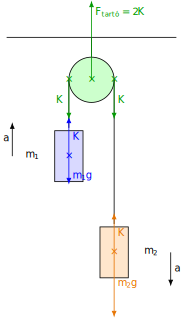

# Atwood ejtőgépe

## Elhanyagolható tömegű, nyújthatatlan fonal

Ez egy fizikafeladatokban gyakran szereplő idealizáció. A fonal tömege általában elhanyagolható a kísérletekben, és a megnyúlása is. Milyen egyszerűsítést is jelent ez pontosan? 

1. Az elhanyagolható tömeg azt jelenti, hogy a fonal gyorsításához nem szükséges erő, tehát a végein pontosan ugyanakkora erőt fejt ki.
Ha ugyanis a fonal egyenes, meg van feszítve (vagy ilyen darabokra osztható), akkor a gyorsulása a második törvény alapján:

$$
F_e = ma
$$

$$
K_1 - K_2 = ma
$$

Itt $K_1$ és $K_2$ a két végen kifejtett erők, melyek ellentétes irányúak. Ha $m = 0$, akkor:

$$
K_1 - K_2 = 0
$$

$$
K_1 = K_2
$$

>**Az elhanyagolható tömegű, egyenesre kifeszített fonal a két végén egyenlő erőt fejt ki. A fonal által kifejtett erő természetesen a fonal irányába mutat, nincs a fonalra merőleges komponense.**

2. A nyújthatatlan fonal két vége megfeszített állapotban egyenlő mértékben mozdul el a fonal irányába. Ezáltal a fonal hossza nem változik az elmozdulás során. Legyen a végpontok által a fonal irányába megtett út $s_1$ és $s_2$. Ekkor:

$$
\Delta l = |s_2 - s_1|
$$

Itt $\Delta l$ a fonal megnyúlása. Ez nulla, tehát:

$$
0 = |s_2 - s_1|
$$

$$
s_1 = s_2
$$

$$
\frac {s_1} {t} = \frac {s_2} {t}
$$

$$
v_{1,f} = v_{2,f}
$$

Itt a sebességek a végpontok sebességeinek fonalirányú komponensei. Ha a fonal végei csak a fonal irányába mozdulnak el, tehát nincs a fonal végpontjának a fonalra merőleges sebességkomponense, akkor a végpontok gyorsulásai is egyenlők:

$$
\frac {\Delta v_{1,f}} {t} = \frac {\Delta v_{2,f}} {t}
$$

$$
a_1 = a_2
$$

Itt tehát a gyorsulások megegyeznek, de ez csak akkor igaz, ha a végpontok elmozdulása tisztán a fonalirányú haladó mozgás következménye. Ez tehát nem igaz például egy ingára, ahol az inga sebessége merőleges a fonalra. Ingánál a fonal hossza nem változik, ha a fonal nyújthatatlan, de nincs a sebességnek a lengő végpontnál fonalirányú komponense. A fonalra kötött test körmozgásával, mint amilyen az inga lengése is, majd a későbbiekben foglalkozunk részletesebben.

>**A nyújthatatlan fonal két végpontjának gyorsulása egyenlő nagyságú, amennyiben a végpontok sebessége tisztán fonalirányú.**

## Elhanyagolható tömegű csiga

Később a forgómozgás tanulmányozása során látni fogjuk, hogy az elhanyagolható tömegű csiga megforgatásához nincs szükség forgató hatásra, tehát az ilyen csiga csupán megváltoztatja a rajta átvetett kötél és ezzel a kötél által kifejtett erő irányát, viszont nem változtatja meg a kötél által kifejtett erő nagyságát. A csigára ható eredő erő is mindig nulla, hisz a csiga tömege nullának tekinthető.

>**Az elhanyagolható tömegű csiga szerepe csupán a kötélerő irányának megváltoztatása, de az erő nagyságát nem változtatja meg. Az elhanyagolható tömegű csigára ható erők eredője is nulla.**

## Atwood ejtőgépe

Rögzítsünk egy csigát a plafonhoz, amelyen fonalat vetünk át. A fonal két végére egy-egy testet akasztunk, a fonal szálai függőlegesek a testeknél. A fonal elhanyagolható tömegű, nyújthatatlan fonal. A csiga is elhanyagolható tömegű. A súrlódást és közegellenállást is elhanyagoljuk. Mekkora a fonalra kötött testek gyorsulása? Mekkora a fonalban ébredő erő? Mekkora erővel húzza a csiga a felfüggesztést a plafonon?

Az alábbi ábra az ideális Atwood-ejtőgépet mutatja:

Felírjuk a második törvényt mindkét testre:

$$
K - m_1g = m_1a
$$

$$
m_2g - K = m_2a
$$

A kötélerőt kifejezzük az első egyenletből és beírjuk a második egyenletbe, majd az egyenletet megoldjuk $a$-ra.

$$
K = m_1g + m_1a
$$

$$
m_2g - (m_1g + m_1a) = m_2a
$$

$$
m_2g - m_1g - m_1a = m_2a
$$

$$
m_2g - m_1g = m_1a + m_2a
$$

$$
(m_2 - m_1)g = (m_1 + m_2)a
$$

$$
a = \frac {m_2 - m_1} {m_1 + m_2} g
$$

Most kiszámítjuk a $K$-t:

$$
K = m_1g + m_1a = m_1g + m_1\frac {m_2 - m_1} {m_1 + m_2} g
$$

$$
K = \frac {m_1(m_1 + m_2) + m_1(m_2 -m_1)} {m_1 + m_2} g = \frac {2m_1m_2} {m_1 + m_2} g
$$

A rendszer súlya:

$$
F_s = 2K = \frac {4m_1m_2} {m_1 + m_2} g
$$

### Kísérlet

[Kísérlet kis súrlódású Atwood-géppel](https://www.youtube.com/watch?v=4ovhEkSIqV0)

### Feladatok
1. Számítsuk ki a videón látható Atwood-gép gyorsulását a tömegek alapján! Számítsuk ki ugyanezt az elmozdulás és az idő alapján! Hasonlítsuk össze az eredményeket is!
2. A videón látható Atwood-gép esetében mutassuk ki, hogy a mechanikai energia megmarad, tehát az indítás pillanatában a helyzeti energia és mozgási energia összege egyenlő az érkezéskor a helyzeti és mozgási energia összegével, a padlóval való ütközést közvetlenül megelőző pillanatban!
3. Mennyivel süllyedt a rendszer tömegközéppontja? Mennyi idő alatt történt a változás? Számítsuk ebből ki a tömegközéppont gyorsulását! Mutassuk meg, hogy ez megegyezik a tömegközéppont-tételből számított gyorsulással!