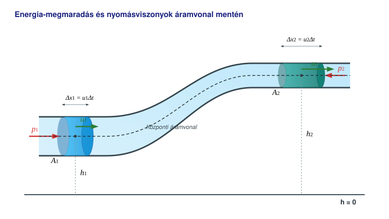

# A Bernoulli-törvény

## Kísérletek

* [Sas Elemér kísérletei a Bernoulli-törvényre](https://www.youtube.com/watch?v=Fodof4gSIA0&t=36m18s)
* [Hatalmas zsák felfújása egyetlen lélegzettel](https://www.youtube.com/shorts/rAAelB7nN14)
* [Nagy gumilabda lebegtetése lombfúvóval](https://www.youtube.com/watch?v=Ye3QPgDdJNg)
* [Pingponglabda lebegtetése hajszárítóval](https://www.youtube.com/watch?v=KFE98nje_L0)
* [A Venturi-cső](https://www.youtube.com/watch?v=hLZkPFrQCDk)

Láttuk, hogy a szűkületben a folyadék gyorsabban áramlik a kontinuitási egyenlet következtében, mint a tágabb csőszakaszokon. Nézzük most meg, hogyan változik a nyomás a csőszakaszokban! A kísérletek szerint a nyomás lecsökken azokon a helyeken, ahol a sebesség az áramlásban nagyobb, azokhoz a helyekhez képest, ahol a sebesség kisebb.

## Az energia megmaradása ideális folyadék stacionárius, örvénymentes áramlásakor

Képzeljünk el egy változó keresztmetszetű csövet, melynek végei különböző magasságban vannak. A folyadék áramlása a csőben időben állandó (stacionárius), örvények nem alakulnak ki. A folyadék ideális, tehát összenyomhatatlan és súrlódásmentes.

Ekkor egy kis $\Delta t$ időközi tömegáramlásra a munkatétel alapján a következő összefüggések érvényesek a csőszakaszra:

$$
W = \Delta E_m + \Delta E_h
$$

$$
p_1A_1u_1\Delta t - p_2A_2u_2\Delta t = \left(\frac{1}{2}\rho A_2u_2\Delta t \cdot u_2^2 - \frac{1}{2}\rho A_1u_1\Delta t \cdot u_1^2\right) + (\rho A_2u_2\Delta t \cdot gh_2 - \rho A_1u_1\Delta t \cdot gh_1)
$$

$$
A_1u_1\Delta t = A_2u_2\Delta t
$$

A közös tényezőkkel ($\Delta V = A_1u_1\Delta t = A_2u_2\Delta t$) egyszerűsítve, majd az egyenletet átrendezve megkapjuk a Bernoulli-törvényt a csőre:

$$
p_1 - p_2 = \frac{1}{2}\rho u_2^2 - \frac{1}{2}\rho u_1^2 + \rho gh_2 - \rho gh_1
$$

$$
p_1 + \frac{1}{2}\rho u_1^2 + \rho gh_1 = p_2 + \frac{1}{2}\rho u_2^2 + \rho gh_2
$$

Ez azt jelenti, hogy a cső mentén az alábbi mennyiség állandó:

$$
p + \frac{1}{2}\rho u^2 + \rho gh = \text{állandó}
$$

Ez az összefüggés érvényes egy áramvonal (végtelenül vékony áramcső) esetén is. Mi garantálja, hogy az állandó ugyanaz az érték az összes áramvonalra? Ezt úgy lehet belátni, ha elképzeljük, hogy a csőbeli áramlást két, csővel összekötött edény közötti folyadékszint-különbség okozza. Ilyen esetben az áramvonalak a folyadék felszínéről indulnak. Vegyünk két igen közeli áramvonalat, és válasszunk két pontot azonos magasságban az egyik edényben. Ekkor a folyadék örvénymentessége miatt a két pontban a sebesség (mely itt függőlegesen lefelé mutat) egyenlő nagyságú. Ha ugyanis lenne örvény az áramlásban, akkor a két függőleges sebesség kissé eltérő távolságra lenne az örvény középpontjától, tehát a sebességeknek is különbözniük kellene. A nyomások is megegyeznek, hiszen a sebesség itt igen kicsi (mivel az edények nagyok a csőhöz képest), így a nyomás a külső és a hidrosztatikai nyomás összege. Így a két különböző áramvonalra az állandó ugyanaz. Távolabbi áramvonalak esetében egy sor pontot veszünk azonos magasságban egy sor különböző áramvonalon, így igen kis lépésekkel eljuthatunk az egyik áramvonaltól a másikig minden esetben.

## Az érvényesség határai

* A levezetés csak ideális, súrlódásmentes és összenyomhatatlan folyadékra (vagy gázra) vonatkozik.
* Az áramlás stacionárius, vagyis az áramlási kép időben állandó.
* Az áramlás mindenütt örvénymentes, különben a tétel csak egy adott áramvonal mentén érvényes, de a különböző áramvonalakon az állandók értéke eltérhet.

## Szuperfolyékonyság

A természetben a folyadékok belsejében szinte mindig fellép a belső súrlódás (viszkozitás), amely ellenállást fejt ki az áramlással szemben. A mechanikai energia csökkenése ilyenkor – ahogyan korábban is láttuk – hő formájában a belső energiát növeli meg. Van azonban egy igen különleges eset, amelyet a hélium cseppfolyósítása után fedeztek fel. A hélium rendkívül nehezen cseppfolyósítható, és normál nyomáson még az abszolút nulla fok közelében sem válik szilárd halmazállapotúvá. Forráspontja $-268{,}93\text{ }^{\circ}\text{C}$ ($4{,}22\text{ K}$). Ha a cseppfolyós héliumot tovább hűtjük, akkor $-270{,}97\text{ }^{\circ}\text{C}$-on ($2{,}17\text{ K}$, az úgynevezett lambda-ponton) átalakul szuperfolyékony héliummá (hélium-II).

Ennek az anyagfázisnak rendkívül magas a hővezető képessége, és a belső súrlódása gyakorlatilag teljesen zérus, amikor kis sebességgel áramlik át akár a legvékonyabb hajszálcsöveken is. Tisza László és Lev Landau kétfolyadék-elmélete alapján a hélium-II egy normál (viszkózus) és egy szuperfolyékony komponens keverékeként viselkedik. Ha megforgatjuk, a folyadékban belső súrlódás nélkül forgó, parányi, úgynevezett *kvantált örvények* alakulnak ki, amelyek a végtelenségig képesek pörögni.

Azt mondhatjuk, hogy ez az igen ritka és különleges kvantumfolyadék az, amely a makroszkopikus világban a leginkább képes megvalósítani a Bernoulli-törvény esetében tárgyalt ideális, súrlódásmentes állapotot. Akit ez az igen érdekes jelenség mélyebben is érdekel, annak az alábbi archív dokumentumfilmet ajánljuk:

* [Szuperfolyékony hélium kisérletek](https://www.youtube.com/watch?v=ixsYmygNfs4&t=2247s)

Bár a valódi fluidumok áramlásakor a szuperfolyékony hélium kivételével mindig fellép mechanikai energiaveszteség, az áramlás sok esetben közelítőleg stacionáriusnak tekinthető. Így a Bernoulli-törvény a gyakorlatban kiválóan alkalmazható, a nagyobb pontosságot igénylő mérnöki számítások során pedig a súrlódásból adódó nyomásveszteséget korrekciós tényezőkkel veszik figyelembe.

## Példa

Egy vízszintes Venturi-csőben a levegő sebessége a tágabb csőszakaszban $u_1 = 2\text{ m/s}$, átmérője itt $d_1 = 1\text{ cm}$. A szűkület átmérője $d_2 = 4\text{ mm}$. Mekkora a szűkületben a sebesség és a statikus nyomás? Az áramlás stacionárius, örvénymentes, és a levegőt ideális gáznak tekintjük (a súrlódástól és az összenyomhatóságtól eltekintünk). A levegő sűrűsége $\rho = 1{,}20\text{ kg/m}^3$, kezdeti nyomása $p_1 = 101\ 300\text{ Pa}$.

A szűkületben a sebességet a kontinuitási egyenletből számíthatjuk ki:

$$
u_2 = \frac{A_1 u_1}{A_2} = \frac{d_1^2 u_1}{d_2^2} = \frac{10^2 \cdot 2}{4^2} = \frac{200}{16} = 12{,}5\text{ m/s}
$$

Mivel a cső vízszintes ($h_1 = h_2$), a Bernoulli-törvény a következő alakra egyszerűsödik:

$$
p_1 + \frac{1}{2}\rho u_1^2 = p_2 + \frac{1}{2}\rho u_2^2
$$

Ebből a szűkületben mérhető $p_2$ nyomás:

$$
p_2 = p_1 - \frac{1}{2}\rho(u_2^2 - u_1^2)
$$

$$
p_2 = 101\ 300 - \frac{1}{2} \cdot 1{,}20 \cdot (12{,}5^2 - 2^2) = 101\ 208{,}65\text{ Pa}
$$

## Feladatok

1. Egy vízszintes kerti locsolócső belső átmérője a vastagabb szakaszon $d_1 = 2\text{ cm}$, itt a víz sebessége $u_1 = 1{,}5\text{ m/s}$. A cső végére egy szűkítő fejet szerelünk, amelynek kimeneti átmérője mindössze $d_2 = 5\text{ mm}$.
Mekkora a víz kiáramlási sebessége a szűkítésnél? (A vizet tekintsük ideális, összenyomhatatlan folyadéknak).

2. Egy repülőgép szárnya felett a levegő sebessége egy adott ponton $u_2 = 60\text{ m/s}$, míg a szárny alatt a zavartalan áramlásban $u_1 = 50\text{ m/s}$. A szárny alatti áramlásban a statikus légnyomás $p_1 = 100\ 000\text{ Pa}$. A levegő sűrűsége $\rho = 1{,}2\text{ kg/m}^3$.
Mekkora a nyomás a szárny feletti pontban? (A szárny vastagságából adódó magasságkülönbséget hanyagoljuk el).

3. Egy függőlegesen felfelé szűkülő csőben víz áramlik. A cső alsó, tágasabb keresztmetszeténél az átmérő $d_1 = 10\text{ cm}$, a víz sebessége $u_1 = 2\text{ m/s}$, a nyomás pedig $p_1 = 200\ 000\text{ Pa}$. A cső $h = 3\text{ méterrel}$ magasabban lévő felső végénél az átmérő $d_2 = 5\text{ cm}$-re szűkül. 
$\rho_{\text{víz}} = 1000\text{ kg/m}^3$, $g = 10\text{ m/s}^2$
Mekkora a sebesség és a statikus nyomás a cső felső, szűkebb keresztmetszetében?
