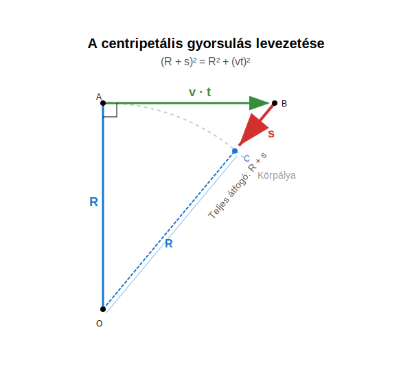

# Centripetális gyorsulás

Az előző leckében a kísérletből és a szimulációból is látható, hogy az egyenletes körmozgás fenntartásához a kör középpontja felé mutató erőre van szükség. Ez az erő a centripetális erő.

Newton második törvénye alapján a centripetális erő a kör középpontja felé mutató gyorsulással jár együtt. Ez a centripetális gyorsulás. Ez azért lép fel, mert a test sebességének iránya folyamatosan változik. A test elmozdulása minden pillanatban összetethető egy egyenes vonalú, egyenletes sebességű elmozdulásból és egy a kör középpontja felé mutató, egyenletesen gyorsuló mozgás elmozdulásából.

>**Az egyenletes körmozgást végző test körmozgásának fenntartásához a kör középpontja felé mutató centripetális erő szükséges. A centripetális erő centripetális gyorsulással jár együtt.**

## A centripetális gyorsulás kiszámítása

Vezessük le a centripetális gyorsulásra vonatkozó formulát! Legyen a test a körpálya legfelső pontjában és mozgását vizsgáljuk $t$ ideig! A $t$ idő sokkal kisebb, mint a $T$ periódusidő, hogy néhány közelítéssel élhessünk.

A test elmozdulása összetethető a vízszintes, egyenes vonalú, egyenletes mozgás elmozdulásából és a középpont felé mutató, egyenletesen gyorsuló mozgás elmozdulásából. A függőleges sugár, az elmozdulások és a sugár, mely az elmozdulás végpontjába mutat, egy derékszögű háromszöget alkot.

$$
(R + s)^2 = R^2 + (vt)^2
$$

$$
R^2 + 2Rs + s^2 = R^2 + v^2t^2
$$

$$
2Rs + s^2 = v^2t^2
$$

$$
t \ll T
$$

Az időtartam igen kicsiny, tehát a $t^4$-t tartalmazó tag elhanyagolható a $t^2$-tel arányos tagok mellett.

$$
s = \frac {a} {2}t^2
$$

$s^2$ elhanyagolható, hisz ez $t^4$-el arányos tag.

$$
2Rs = v^2t^2
$$

$$
s = \frac {\frac {v^2} {R}} {2} t^2
$$

Ezt a formulát összehasonlítva az egyenletesen gyorsuló mozgásra vonatkozó képletünkkel, kapjuk:

$$
a = \frac {v^2} {R}
$$

>**A centripetális gyorsulás a sebesség négyzetének és a sugárnak a hányadosa.**

Ez a szimulációval is könnyen ellenőrizhető.

### Példa
Egy $0,100 \text{ kg}$ tömegű követ egy parittyában pörgetünk $0,4 \text{ s}$ periódusidővel $0,200 \text{ m}$ sugarú körpályán. A kő egyenletes körmozgást végez. Mekkora a kő sebessége? Mekkora a kő mozgási energiája? Mekkora a kő centripetális gyorsulása? Mekkora erő tartja pályáján a követ?

$$
v = \frac {2 \pi R} {T} = \frac {2 \times 3,1415 \times 0,2} {0,4} = 3,142 \frac {\text{m}} {\text{s}}
$$

$$
E_m = \frac {mv^2} {2} = \frac {0,1 \times 3,142^2} {2} = 0,4933 \text{ J}
$$

$$
a = \frac {v^2} {R} = \frac {3,142^2} {0,2} = 49,36 \frac {\text{m}} {\text{s}^2}
$$

$$
F_e = ma = 0,1 \times 49,36 = 4,936 \text{ N}
$$

***

### Feladatok:

1. Egy forma-1-es autó $180 \frac{\text{km}}{\text{h}}$ ($50 \frac{\text{m}}{\text{s}}$) sebességgel halad egy $100 \text{ m}$ sugarú kanyarban. Mekkora a jármű centripetális gyorsulása?
2. Egy műhold a Föld felszíne felett kering. A keringési sebessége $7800 \frac{\text{m}}{\text{s}}$, a pályasugara pedig (a Föld középpontjától számítva) kb. $6600 \text{ km}$. Számítsd ki a műholdra ható centripetális gyorsulást! Hasonlítsd össze ezt az értéket a földi nehézségi gyorsulással ($g \approx 9,81 \frac{\text{m}}{\text{s}^2}$)!
3. Egy atléta a $7,26 \text{ kg}$ tömegű kalapácsot $2 \text{ m}$ sugarú körpályán forgatja. A kalapács sebessége a kidobás pillanatában $28 \frac{\text{m}}{\text{s}}$. Mekkora erővel húzza a kalapács az atléta karját (mekkora a centripetális erő)?
4. Egy űrállomás gyűrű alakú lakóegysége forog, hogy mesterséges gravitációt hozzon létre. A gyűrű sugara $20 \text{ m}$. Mekkora kerületi sebességgel kell forognia a gyűrűnek, hogy a peremén a centripetális gyorsulás megegyezzen a földi gravitációs gyorsulással ($g = 9,81 \frac{\text{m}}{\text{s}^2}$)?
5. Egy láncos körhintán a gyerekek a középponttól $5 \text{ m}$ távolságra keringenek. A hinta szögsebessége $\omega = 0,8 \frac{\text{rad}}{\text{s}}$. Használd az $a_{cp} = \omega^2 \cdot R$ összefüggést (vagy számold át kerületi sebességre), és határozd meg a gyerekek centripetális gyorsulását!