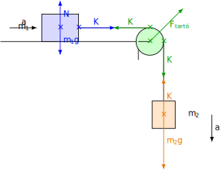

# Atwood-gép jellegű feladatok

## A második törvény mérése

### Kísérlet

[Newton második törvényének mérése](https://www.youtube.com/watch?v=9WdTzubd89M)

Ebben a kísérletben a kicsiny súly gyorsítja a teljes tömeget, ahogy nemsokára ezt az elmélettel is megmagyarázzuk. A gyorsító erő egyenesen arányos a gyorsulással, amit egy gyorsulásérzékelővel mérünk, mely rádióval össze van kapcsolva a telefonnal. A gyorsító erő egyenesen arányos a gyorsulással, ahogyan azt Newton második törvénye alapján tudjuk. Az arányossági tényező az össztömeg. Mi arra fogunk koncentrálni, hogy megmutassuk, hogy itt valóban csak a kicsiny súly a gyorsító erő, mely a teljes össztömeget gyorsítja.

Legyen a kocsi tömege, mely a vízszintes asztallapon mozog, az $m_1$-es tömeg, míg a függőlegesen lefelé gyorsuló tömeg $m_2$. A két tömeget egy csigán keresztül egy fonal köti össze. A fonal nyújthatatlan és elhanyagolható tömegű, akárcsak a csiga. A súrlódás és légellenállás is elhanyagolható. Számítsuk ki a rendszer gyorsulását és a fonalban ébredő erőt is!

$$
K = m_1a
$$

$$
m_2g - K = m_2a
$$

Ezek az egyenletek Newton második törvényét fejezik ki az első és a második testre. Ha az első egyenletből $K$-t beírjuk a második egyenletbe, akkor ki tudjuk fejezni az $a$ gyorsulást.

$$
m_2g - m_1a = m_2a
$$

$$
m_2g = (m_1 + m_2)a
$$

$$
a = \frac {m_2g} {m_1 + m_2}
$$

A gyorsulás az $m_2g$ súly és az $m_1 + m_2$ össztömeg hányadosa, tehát valóban a kis lefelé mozgó súly gyorsítja a rendszer teljes össztömegét.

$$
K = \frac {m_1m_2} {m_1 + m_2} g
$$

### Példa
A videóból látszik, hogy $200 g$ lefelé gyorsuló tömeg $2 \frac {m} {s^2}$ gyorsulással mozog. Mekkora a rendszer össztömege? Mennyi a kocsi tömege? Mekkora a fonalerő?

$$
m_2g = (m_1 + m_2)a
$$

$$
m_1 + m_2 = \frac {m_2g} {a} = \frac {0,2 \times 9,81} {2} = 0,981 kg = 981 g
$$

$$
m_1 = 781g
$$

$$
K = m_1a = 0,781 \times 2 = 1,562N
$$

### Feladatok
1. Mekkora a példában a rendszer mechanikai energiája, ha a gyorsító tömeg $200 g$, és a rendszer $0,5 s$-on át gyorsul? Mitől függ ez a mechanikai energia? Válasszuk a helyzeti energia nullaszintjét az első test magasságában, és kezdetben a második test legyen $-0,1 m$ magasságban!

2. Számítsuk ki a testek elmozdulásait $0,5 s$ alatt! Számítsuk ki a tömegközéppont koordinátáit is a kezdeti és a végső pillanatban is! Mekkora a tömegközéppont gyorsulásának x és y komponense? Mutassuk meg, hogy ugyanezt kapjuk, ha a tömegközéppont-tétel alapján számolunk!

3. Legyen az asztallap síkja $30^\circ$-os szögben a vízszintessel úgy, hogy a rajta lévő $500 g$-os test emelkedjen a másik test süllyedésekor. Milyen nagy a rendszer gyorsulása, ha az egyensúlyi tömegnél $50 g$-mal nagyobb a függőlegesen mozgó test tömege? Mekkora a kötélben ébredő erő? A rendszer ideális, veszteségmentes.

4. Egy asztallapon vízszintesen mozoghat egy $300 g$ tömegű test. Az asztal két végén egy-egy elhanyagolható tömegű csiga van, melyeken átvetett fonalak a testet egy $150 g$-os és egy $250 g$-os testtel kötik össze. Ezek a testek függőlegesen mozognak, és a fonalak elhanyagolható tömegűek és nyújthatatlanok. A súrlódás elhanyagolható. Mekkora a rendszer gyorsulása? Mekkora erők ébrednek a fonalakban?

5. Mekkorák a 4. feladatbeli rendszer tömegközéppontjának gyorsuláskomponensei, ha a testek álló helyzetből $0,2 s$-on át gyorsulnak? Számítsuk ki a tömegközéppont elmozdulásának komponenseit, és ez alapján a gyorsuláskomponenseket is! Mutassuk ki, hogy érvényes a tömegközéppont tétele, mert az ez alapján kiszámított gyorsuláskomponensek megegyeznek a tömegközéppont előző úton kiszámított gyorsuláskomponenseivel!