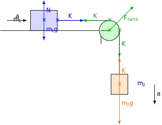

# Atwood-gép jellegű feladatok

## A második törvény mérése

### Kísérlet

[Newton második törvényének mérése](https://www.youtube.com/watch?v=9WdTzubd89M)

Ebben a kísérletben a kicsiny súly gyorsítja a teljes tömeget, ahogy nemsokára ezt az elmélettel is megmagyarázzuk. A gyorsító erő egyenesen arányos a gyorsulással, amit egy gyorsulásérzékelővel mérünk, mely Bluetooth segítségével össze van kapcsolva a telefonnal. A gyorsító erő egyenesen arányos a gyorsulással, ahogyan azt Newton második törvénye alapján tudjuk. Az arányossági tényező az össztömeg. Mi arra fogunk koncentrálni, hogy megmutassuk: itt valóban csak a kicsiny súly a gyorsító erő, mely a teljes össztömeget gyorsítja.

Legyen a kocsi tömege, mely a vízszintes asztallapon mozog, az $m_1$ tömeg, míg a függőlegesen lefelé gyorsuló tömeg $m_2$. A két tömeget egy csigán keresztül egy fonal köti össze. A fonal nyújthatatlan és elhanyagolható tömegű, akárcsak a csiga. A súrlódás és a légellenállás is elhanyagolható. Számsítsuk ki a rendszer gyorsulását és a fonalban ébredő erőt is!

$$
K = m_1 a
$$

$$
m_2 g - K = m_2 a
$$

Ezek az egyenletek Newton második törvényét fejezik ki az első és a második testre. Ha az első egyenletből $K$ értékét beírjuk a második egyenletbe, akkor ki tudjuk fejezni az $a$ gyorsulást.

$$
m_2 g - m_1 a = m_2 a
$$

$$
m_2 g = (m_1 + m_2)a
$$

$$
a = \frac{m_2 g}{m_1 + m_2}
$$

A gyorsulás az $m_2 g$ súly és az $m_1 + m_2$ össztömeg hányadosa, tehát valóban a kis lefelé mozgó súly gyorsítja a rendszer teljes össztömegét.

$$
K = \frac{m_1 m_2}{m_1 + m_2}g
$$

### Példa

A videóból látszik, hogy $200\text{ g}$ lefelé gyorsuló tömeg $2,0\text{ m/s}^2$ gyorsulással mozog. Mekkora a rendszer össztömege? Mennyi a kocsi tömege? Mekkora a fonalerő? (A számítás során használjuk a $g = 9,81\text{ m/s}^2$ értéket, a videóban látható kerekített $g \approx 10\text{ m/s}^2$ helyett.)

$$
m_2 g = (m_1 + m_2)a
$$

$$
m_1 + m_2 = \frac{m_2 g}{a} = \frac{0,2 \cdot 9,81}{2} = 0,981\text{ kg} = 981\text{ g}
$$

$$
m_1 = 781\text{ g}
$$

$$
K = m_1 a = 0,781 \cdot 2 = 1,562\text{ N}
$$

---

## Feladatok

1. Mekkora a példában a rendszer mechanikai energiája, ha a gyorsító tömeg $200\text{ g}$, és a rendszer $0,5\text{ s}$-on át gyorsul? Mitől függ ez a mechanikai energia? Válasszuk a helyzeti energia nullaszintjét az első test magasságában, és kezdetben a második test legyen $-0,1\text{ m}$ magasságban!

2. Számítsuk ki a testek elmozdulásait $0,5\text{ s}$ alatt! Számítsuk ki a tömegközéppont koordinátáit a kezdeti és a végső pillanatban is! Mekkora a tömegközéppont gyorsulásának $x$ és $y$ komponense? Mutassuk meg, hogy ugyanezt kapjuk, ha a tömegközéppont-tétel alapján számolunk!

3. Legyen az asztallap síkja $30^\circ$-os szögben a vízszintessel úgy, hogy a rajta lévő $500\text{ g}$-os test emelkedjen a másik test süllyedésekor. Milyen nagy a rendszer gyorsulása, ha az egyensúlyi tömegnél $50\text{ g}$-mal nagyobb a függőlegesen mozgó test tömege? Mekkora a kötélben ébredő erő? A rendszer ideális, veszteségmentes.

4. Egy asztallapon vízszintesen mozoghat egy $300\text{ g}$ tömegű test. Az asztal két végén egy-egy elhanyagolható tömegű csiga van, melyeken átvetett fonalak a testet egy $150\text{ g}$-os és egy $250\text{ g}$-os testtel kötik össze. Ezek a testek függőlegesen mozognak, és a fonalak elhanyagolható tömegűek és nyújthatatlanok. A súrlódás elhanyagolható. Mekkora a rendszer gyorsulása? Mekkora erők ébrednek a fonalakban?

5. Mekkorák a 4. feladatbeli rendszer tömegközéppontjának gyorsuláskomponensei, ha a testek álló helyzetből $0,2\text{ s}$-on át gyorsulnak? Számítsuk ki a tömegközéppont elmozdulásának komponenseit, és ez alapján a gyorsuláskomponenseket is! Mutassuk ki, hogy érvényes a tömegközéppont tétele, mert az ez alapján kiszámított gyorsuláskomponensek megegyeznek a tömegközéppont előző úton kiszámított gyorsuláskomponenseivel!
