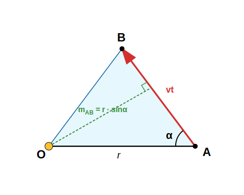

# Feladatok a bolygómozgásra

## Példák Kepler harmadik törvényére
1. A Nap–Föld átlagos távolság az ún. csillagászati egység (CSE). Tudjuk, hogy a Föld egy csillagászati egységre van tehát a Naptól és keringési ideje 1 év. Mekkora a Mars bolygó keringési ideje, ha átlagos Naptól mért távolsága 1,52 csillagászati egység? A Vénusz bolygó keringési ideje 0,6152 év. Milyen messze van átlagosan a Naptól?

$$
\frac {a^3} {T^2} = 1
$$

Itt $a$-t csillagászati egységben, $T$-t években adtuk meg. 

$$
T_{Mars} = \sqrt {a_{Mars}^3} = \sqrt {1,524^3} = 1,881ev = 687,0nap
$$

$$
a_{Vénusz} = \sqrt [3] {T_{Vénusz}^2} = \sqrt [3] {0,6152^2} = 0,7233 CSE
$$

2. Geostacionárius pályán keringő műholdak a Földdel együtt forognak, tehát keringési idejük 1nap. Az első kozmikus sebesség alapján számítsuk ki, milyen magasságban vannak a felszín felett az ilyen távközlési műholdak!

$$
\frac {a^3} {T^2} = \frac {R^3} {(\frac {2 \pi R} {\sqrt {gR}})^2}
$$

$$
\frac {a^3} {T^2} = \frac {gR^2} {4 \pi^2}
$$

$$
a^3 = \frac {gR^2T^2} {4 \pi^2} = \frac {9,81 \times 6370000^2 \times 86400^2} {4 \times 3,1415^2} = 7,527 \times 10^{22}m^3
$$

$$
a = \sqrt [3] {7,527 \times 10^{22}} = 42220000m = 42220km
$$

A magasság:

$$
h = a - R = 42220 - 6370 = 35850km
$$

A valóságban a 35786km magasságot használnak, amely 3 értékes jegyre megegyezik a mi számításunkból kapott értékkel. 

3. A nemzetközi űrállomás 420km magasságban kering a Földfelszín felett. Számítsuk ki a keringési idejét! Mekkora a sebessége ebben a magasságban? Hány százaléka ez az első kozmikus sebességnek?

$$
\frac {a^3} {T^2} = \frac {gR^2} {4 \pi^2}
$$

$$
T^2 = \frac {4 \pi^2 a^3} {gR^2} = \frac {4 \pi^2 \times (6370000 + 420000)^3} {9,81 \times 6370000^2}
$$

$$
T = 5572s = 93min
$$

$$
v = \frac {2 \pi a} {T} = \frac {2 \times 3,1415 \times (6370000 + 420000)} {5572} = 7656 \frac {m} {s}
$$

$$
\frac {7656} {7905} \times 100 = 96,86\%
$$

Ez tehát 96,9%-a az első kozmikus sebességnek. Azért van ilyen közel, mivel a magasság viszonylag kicsi a Föld sugarához képest, tehát szinte olyan a keringés, mint az első kozmikus sebesség kiszámításakor feltételeztük. Ebben a magasságban a légellenállás még nem teljesen nulla, ezért időnként alkalmaznak egy kis meghajtást, hogy az űrállomás ne veszítsen a magasságából.

## A területi sebesség kiszámítása pályaadatok alapján

A következőkben szükségünk lesz a területi sebesség és a pálya menti sebesség közti összefüggésre. Legyen a bolygó kezdetben az A pontban és igen rövid $t \ll T$ idő alatt eljut a B pontba. A Nap az O pontban van. Jelöljük $r$-rel a Naptól a bolygóhoz húzott szakasz hosszát! Legyen $\alpha$ az $r$ és $\overline{AB}$ által bezárt $90\degree$-nál nem nagyobb szög. 

Ekkor:

$$
\overline {AB} = vt
$$

A területi sebesség:

$$
\frac {T_{OAB}} {t} = \frac {\frac {\overline {AB} m_{AB}} {2}} {t} = \frac {vt rsin \alpha} {2t} = \frac {1} {2} vrsin \alpha
$$

Ha $\alpha = 90\degree$, akkor $sin \alpha = 1$, tehát a területi sebesség a sugár és sebesség szorzatának a fele.

## Példák Kepler második törvényére

1. A Mars legkisebb távolsága a Naptól ellipszis pályáján (Perihélium) 206,6 millió km, a legtávolabbi pontja a pályának pedig 249,2 millió km. Mekkora a Mars átlagos távolsága a Naptól, tehát a nagytengely hosszának fele? Hány csillagászati egység (CSE) ez a távolság? Ha a Mars keringési ideje 687,0nap, akkor mekkora a területi sebesség? Használd az ellipszis területképletet! $T_{ellipszis} = ab\pi$! Mekkora a bolygó sebessége a Naphoz legközelebbi és a Naptól legtávolabbi pontokban?

$$
2a = r_{min} + r_{max} = 206,6 + 249,2 = 455,8 \times 10^6km
$$

$$
a = 227,9 \times 10^6km
$$

$$
a = \frac {227,9 \times 10^6 km} {149,6 \times 10^6 km} = 1,523 CSE
$$

A területi sebességhez ki kell számítanunk az ellipszis kistengelyét!

$$
c = a - r_{min} = 227,9 - 206,6 = 21,3 \times 10^6km
$$

$$
b = \sqrt {a^2 - c^2} = \sqrt {227,9^2 - 21,3^2} = 226,9 \times 10^6km
$$

Most már könnyű az ellipszis területét kiszámolni:

$$
T_{ellipszis} = ab \pi = 227,9 \times 226,9 \times 3,1415 = 162400 \times 10^{12} km^2
$$

Ha ezt elosztjuk a keringési idővel, megkapjuk a területi sebességet.

$$
\frac {T_{ellipszis}} {T} = \frac {162400 \times 10^{12}} {687 \times 86400} = 2736 \times 10^6 \frac {km^2} {s}
$$

A perihélium és afélium pontokban a területi sebesség a sugár és a sebesség szorzatának fele. Ezekben a pontokban a sugár merőleges a sebességre.

$$
\frac {1} {2} r_{min}v_{max} = \frac {1} {2} r_{max}v_{min} = 2,736 \times 10^9 \frac {km^2} {s}
$$

Így:

$$
v_{max} = \frac {2 \times 2,736 \times 10^9} {206,6 \times 10^6} = 26,48 \frac {km} {s}
$$

$$
v_{min} = \frac {2 \times 2,736 \times 10^9} {249,2 \times 10^6} = 21,96 \frac {km} {s}
$$

2. Számítsuk ki ugyanazt, mint az első példában, de most a Hold esetében. A legkisebb Hold–Föld távolság (perigeum) 363300km, a legnagyobb (apogeum) pedig 405500km. Mekkora a Hold–Föld átlagos távolság (a nagytengely fele)? Mekkora a területi sebesség, ha a keringési idő 27,32nap? Mekkora a minimális és maximális sebesség? (Használjuk az ellipszis területére a $T_{ellipszis} = ab \pi$ képletet!)

Legyen M a Föld, m a Hold tömege. 

$$
2a = r_{min} + r_{max} = 363300km + 405500km = 768800km
$$

$$
a = 384400km
$$

Az ellipszis adatainak kiszámítása:

$$
c = a - r_{min} = 384400 - 363300 = 21100km
$$

$$
b = \sqrt {a^2 - c^2} = \sqrt {384400^2 - 21100^2} = 383820km
$$

A területi sebesség:

$$
\frac {ab \pi} {T} = \frac {384400 \times 383820 \times \pi} {27,32 \times 86400} = 196400 \frac {km^2} {s}
$$

Tudjuk, hogy:

$$
\frac {1} {2} r_{min} v_{max} = \frac {1} {2} r_{max} v_{min} = 196400 \frac {km^2} {s}
$$

$$
v_{max} = \frac {2 \times 196400} {363300} = 1,081 \frac {km} {s}
$$

$$
v_{min} = \frac {2 \times 196400} {405500} = 0,9687 \frac {km} {s}
$$