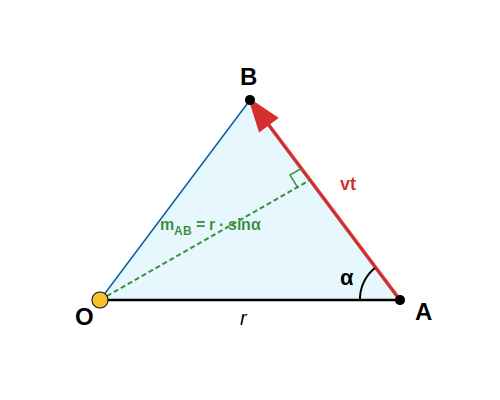
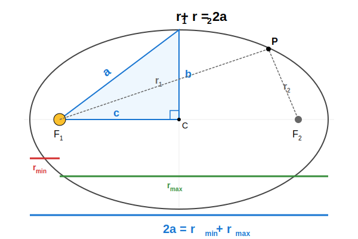

# Feladatok a bolygómozgásra

## Példák Kepler harmadik törvényére

1. A Nap–Föld átlagos távolság az ún. csillagászati egység (CSE). Tudjuk, hogy a Föld egy csillagászati egységre van a Naptól, és keringési ideje 1\ év. Mekkora a Mars bolygó keringési ideje, ha átlagos Naptól mért távolsága $1,524\text{ CSE}$? A Vénusz bolygó keringési ideje $0,6152\text{ év}$. Milyen messze van átlagosan a Naptól?

$$
\frac{a^3}{T^2} = 1
$$

Itt $a$-t csillagászati egységben, $T$-t években adtuk meg.

$$
T_{\text{Mars}} = \sqrt{a_{\text{Mars}}^3} = \sqrt{1,524^3} \approx 1,881\text{ év} = 687,0\text{ nap}
$$

$$
a_{\text{Vénusz}} = \sqrt[3]{T_{\text{Vénusz}}^2} = \sqrt[3]{0,6152^2} \approx 0,7233\text{ CSE}
$$

2. Geostacionárius pályán keringő műholdak a Földdel együtt forognak, tehát keringési idejük 1\ nap. Az első kozmikus sebesség alapján számítsuk ki, milyen magasságban vannak a felszín felett az ilyen távközlési műholdak!

$$
\frac{a^3}{T^2} = \frac{R^3}{(\frac{2\pi R}{\sqrt{gR}})^2}
$$

$$
\frac{a^3}{T^2} = \frac{gR^2}{4\pi^2}
$$

$$
a^3 = \frac{gR^2 T^2}{4\pi^2} = \frac{9,81 \cdot 6\ 370\ 000^2 \cdot 86\ 400^2}{4 \cdot 3,1415^2} \approx 7,527 \cdot 10^{22}\text{ m}^3
$$

$$
a = \sqrt[3]{7,527 \cdot 10^{22}} \approx 42\ 220\ 000\text{ m} = 42\ 220\text{ km}
$$

A felszín feletti magasság:

$$
h = a - R = 42\ 220 - 6\ 370 = 35\ 850\text{ km}
$$

A valóságban a $35\ 786\text{ km}$ magasságot használják, amely 3 értékes jegyre megegyezik a mi számításunkból kapott értékkel.

3. A Nemzetközi Űrállomás (ISS) $420\text{ km}$ magasságban kering a Föld felszíne felett. Számítsuk ki a keringési idejét! Mekkora a sebessége ebben a magasságban? Hány százaléka ez az első kozmikus sebességnek?

$$
\frac{a^3}{T^2} = \frac{gR^2}{4\pi^2}
$$

$$
T^2 = \frac{4\pi^2 a^3}{gR^2} = \frac{4\pi^2 \cdot (6\ 370\ 000 + 420\ 000)^3}{9,81 \cdot 6\ 370\ 000^2}
$$

$$
T \approx 5\ 572\text{ s} \approx 93\text{ min}
$$

$$
v = \frac{2\pi a}{T} = \frac{2 \cdot 3,1415 \cdot (6\ 370\ 000 + 420\ 000)}{5\ 572} \approx 7\ 656\text{ m/s}
$$

$$
\frac{7\ 656}{7\ 905} \cdot 100 \approx 96,85\%
$$

Ez tehát $96,9\%$-a az első kozmikus sebességnek. Azért van ilyen közel, mivel a magasság viszonylag kicsi a Föld sugarához képest, így a keringés nagyon hasonló ahhoz, amit az első kozmikus sebesség kiszámításakor feltételeztük. Ebben a magasságban a légellenállás még nem teljesen nulla, ezért időnként alkalmaznak egy kis meghajtást, hogy az űrállomás ne veszítsen a magasságából.

## A területi sebesség kiszámítása pályaadatok alapján

A következőkben szükségünk lesz a területi sebesség és a pályamenti sebesség közötti összefüggésre. Legyen a bolygó kezdetben az $A$ pontban, és igen rövid $t \ll T$ idő alatt eljut a $B$ pontba. A Nap az $O$ pontban van. Jelöljük $r$-rel a Naptól a bolygóhoz húzott szakasz hosszát! Legyen $\alpha$ az $r$ és $\overline{AB}$ által bezárt, $90^\circ$-nál nem nagyobb szög.

Ekkor:

$$
\overline{AB} = vt
$$

A területi sebesség:

$$
\frac{T_{OAB}}{t} = \frac{\frac{\overline{AB} \cdot m_{AB}}{2}}{t} = \frac{vt \cdot r \sin \alpha}{2t} = \frac{1}{2}vr \sin \alpha
$$

Ha $\alpha = 90^\circ$, akkor $\sin \alpha = 1$, vagyis a területi sebesség a sugár és a sebesség szorzatának a fele.

## Példák Kepler második törvényére

1. A Mars legkisebb távolsága a Naptól az ellipszispályáján (perihélium) $206,6\text{ millió km}$, a legtávolabbi pontja (afélium) pedig $249,2\text{ millió km}$. Mekkora a Mars átlagos távolsága a Naptól, vagyis a nagytengely hosszának fele? Hány csillagászati egység (CSE) ez a távolság? Ha a Mars keringési ideje $687,0\text{ nap}$, akkor mekkora a területi sebesség? Használd az ellipszis területképletét: $T_{\text{ellipszis}} = ab\pi$! Mekkora a bolygó sebessége a Naphoz legközelebbi és a Naptól legtávolabbi pontokban?

$$
2a = r_{\text{min}} + r_{\text{max}} = 206,6 \cdot 10^6 + 249,2 \cdot 10^6 = 455,8 \cdot 10^6\text{ km}
$$

$$
a = 227,9 \cdot 10^6\text{ km}
$$

$$
a = \frac{227,9 \cdot 10^6\text{ km}}{149,6 \cdot 10^6\text{ km}} \approx 1,523\text{ CSE}
$$

A területi sebességhez ki kell számítanunk az ellipszis kistengelyét!

$$
c = a - r_{\text{min}} = 227,9 \cdot 10^6 - 206,6 \cdot 10^6 = 21,3 \cdot 10^6\text{ km}
$$

$$
b = \sqrt{a^2 - c^2} = \sqrt{(227,9 \cdot 10^6)^2 - (21,3 \cdot 10^6)^2} \approx 226,9 \cdot 10^6\text{ km}
$$

Most már könnyű az ellipszis területét kiszámolni:

$$
T_{\text{ellipszis}} = ab\pi = 227,9 \cdot 10^6 \cdot 226,9 \cdot 10^6 \cdot 3,1415 \approx 162\ 400 \cdot 10^{12}\text{ km}^2
$$

Ha ezt elosztjuk a keringési idővel, megkapjuk a területi sebességet:

$$
\frac{T_{\text{ellipszis}}}{T} = \frac{162\ 400 \cdot 10^{12}}{687 \cdot 86\ 400} \approx 2\ 736 \cdot 10^6\text{ km}^2\text{/s}
$$

A perihélium- és aféliumpontokban a területi sebesség a sugár és a sebesség szorzatának a fele. Ezekben a pontokban a sugár merőleges a sebességvektorra.

$$
\frac{1}{2}r_{\text{min}} v_{\text{max}} = \frac{1}{2}r_{\text{max}} v_{\text{min}} = 2,736 \cdot 10^9\text{ km}^2\text{/s}
$$

Így:

$$
v_{\text{max}} = \frac{2 \cdot 2,736 \cdot 10^9}{206,6 \cdot 10^6} \approx 26,48\text{ km/s}
$$

$$
v_{\text{min}} = \frac{2 \cdot 2,736 \cdot 10^9}{249,2 \cdot 10^6} \approx 21,96\text{ km/s}
$$

2. Számítsuk ki ugyanazt, mint az első példában, de most a Hold esetében. A legkisebb Hold–Föld távolság (perigeum) $363\ 300\text{ km}$, a legnagyobb (apogeum) pedig $405\ 500\text{ km}$. Mekkora a Hold–Föld átlagos távolság (a nagytengely fele)? Mekkora a területi sebesség, ha a keringési idő $27,32\text{ nap}$? Mekkora a minimális és maximális sebesség? (Használjuk az ellipszis területére a $T_{\text{ellipszis}} = ab\pi$ képletet!)

Legyen $M$ a Föld, $m$ a Hold tömege. 

$$
2a = r_{\text{min}} + r_{\text{max}} = 363\ 300 + 405\ 500 = 768\ 800\text{ km}
$$

$$
a = 384\ 400\text{ km}
$$

An ellipszis adatainak kiszámítása:

$$
c = a - r_{\text{min}} = 384\ 400 - 363\ 300 = 21\ 100\text{ km}
$$

$$
b = \sqrt{a^2 - c^2} = \sqrt{384\ 400^2 - 21\ 100^2} \approx 383\ 820\text{ km}
$$

A területi sebesség:

$$
\frac{ab\pi}{T} = \frac{384\ 400 \cdot 383\ 820 \cdot 3,14159}{27,32 \cdot 86\ 400} \approx 196\ 400\text{ km}^2\text{/s}
$$

Tudjuk, hogy:

$$
\frac{1}{2}r_{\text{min}} v_{\text{max}} = \frac{1}{2}r_{\text{max}} v_{\text{min}} = 196\ 400\text{ km}^2\text{/s}
$$

$$
v_{\text{max}} = \frac{2 \cdot 196\ 400}{363\ 300} \approx 1,081\text{ km/s}
$$

$$
v_{\text{min}} = \frac{2 \cdot 196\ 400}{405\ 500} \approx 0,9687\text{ km/s}
$$

---

## Feladatok

1. A Jupiter bolygó átlagos távolsága a Naptól $a_{\text{Jupiter}} = 5,203\text{ CSE}$. A Föld adatai alapján ($a_{\text{Föld}} = 1\text{ CSE}$, $T_{\text{Föld}} = 1\text{ év}$) számítsd ki a Kepler III. törvényének egyszerűsített alakjával ($\frac{a^3}{T^2} = 1$), hány földi év alatt kerüli meg a Napot a Jupiter!

2. Az Eris törpebolygó keringési ideje rendkívül hosszú, $T_{\text{Eris}} = 558\text{ földi év}$. Számítsd ki, mekkora az Eris átlagos távolsága a Naptól csillagászati egységben (CSE)!

3. Alacsony pályás műhold mozgása:
Egy megfigyelő műhold $250\text{ km}$ magasságban kering a Föld felszíne felett. 
    * Mekkora a pálya sugara ($a$), ha a Föld sugara $R = 6\ 370\text{ km}$?
    * Számítsd ki a műhold keringési idejét ($T$) másodpercben!

4. Egy üstökös a Nap körüli pályáján a napközelpontban (perihélium) $r_{\text{min}} = 0,6\text{ CSE}$ távolságra van a Naptól, és itt a sebessége $v_{\text{max}} = 55\text{ km/s}$. Mekkora lesz a sebessége a naptávolpontban (afélium), ha ott a távolsága $r_{\text{max}} = 35\text{ CSE}$?

5. Egy képzeletbeli bolygó keringési ideje $T = 8\text{ év}$. A pályájának kistengelye $b = 3,8\text{ CSE}$, nagytengelyének fele $a = 4\text{ CSE}$.
    * Számítsd ki a pálya területét a $T_{\text{ellipszis}} = ab\pi$ képlettel!
    * Mekkora a bolygó területi sebessége $\frac{\text{CSE}^2}{\text{év}}$ egységben?

