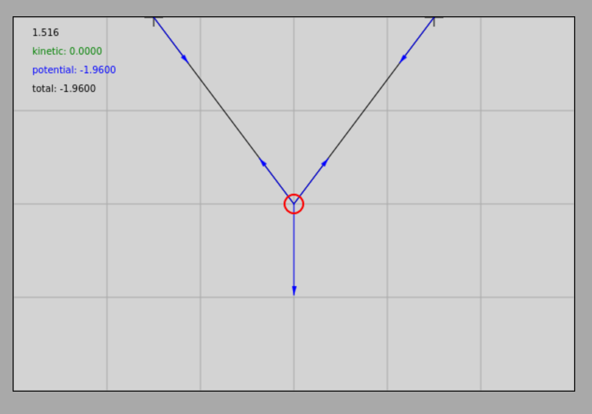
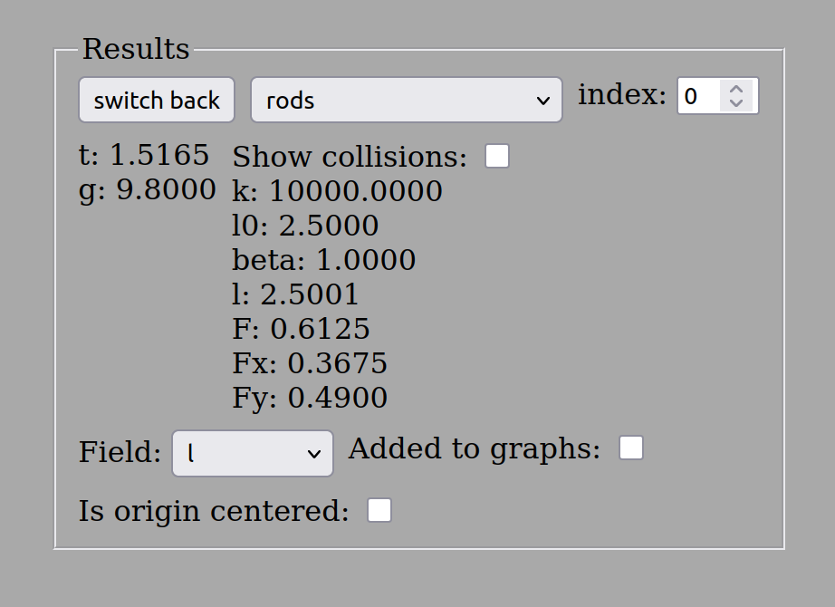
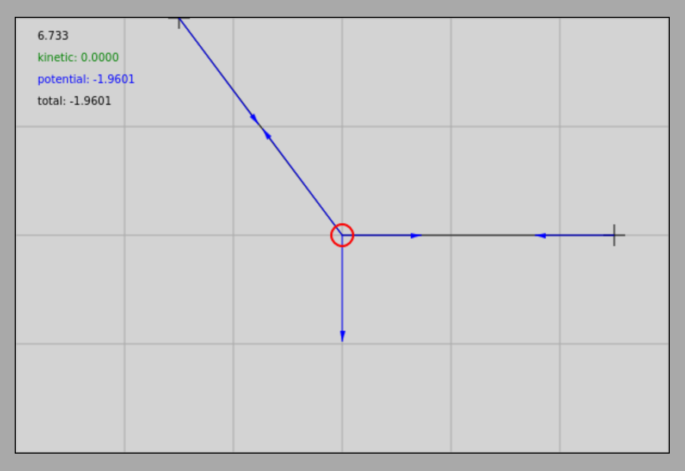
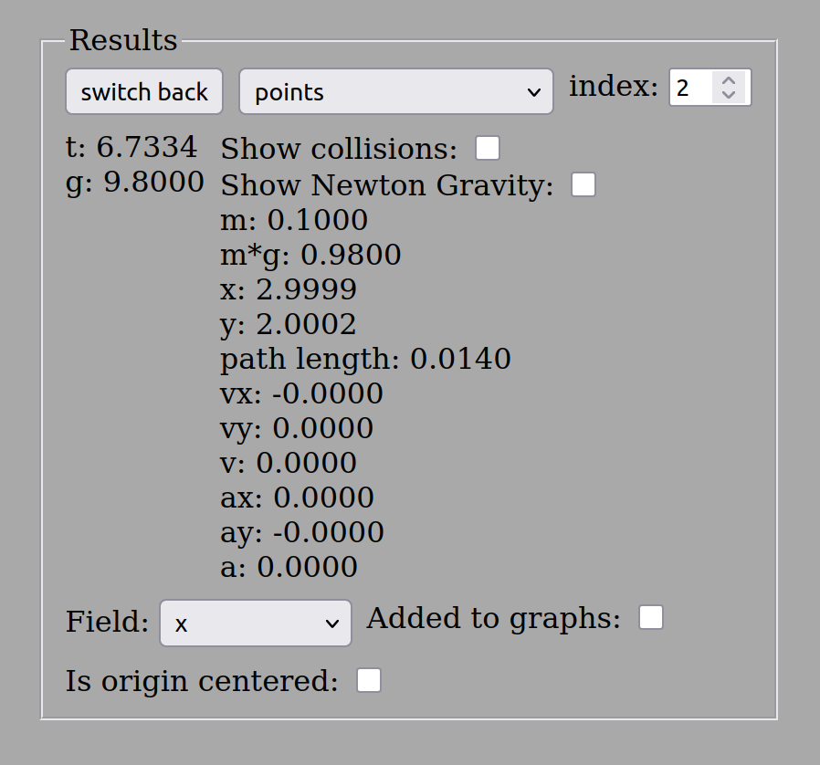
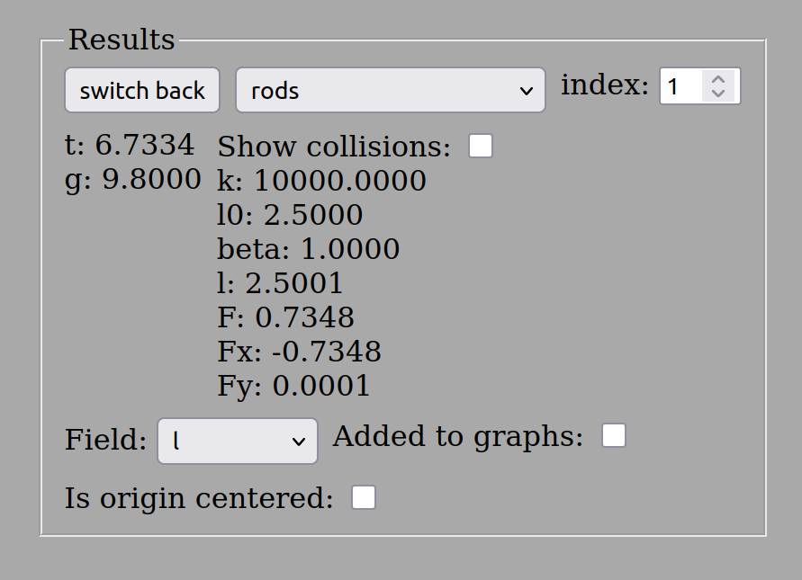

# Feladatok az egyensulyra

## Peldak
1. Egy vizszintes plafonon egymastol $3,00m$ tavolsagra van ket kampo, melyekre kotelet akasztunk, ugy hogy a kotel kozepen egy $0,10kg$ tomegu test log. A test a kotel kozepen van, ugy hogy a kotel szarak egyenlok es a test a plafon szintje alatt $2,00m$-rel helyezkedik el. Mekkora a kotel hossza? Mekkora a kotelben ebredo huzoero, ha a test egyensulyban van?

### Szimulacio
[Statika elso pelda](https://alexerdei73.github.io/physics-engine/project/#d90c17ac-3c4c-47fa-b91e-46157c5a3069)

A pelda az abran lathato. Megmutatjuk a szimulacio eredmenyet is a testet es az egyik kotelszarat illetoen.

Vegezzuk el a szamitasokat!
A kotelszarak egyenlo hosszuak es a szimmetria miatt az ero is egyenlo nagysagu bennuk, jeloljuk ezt K-val. Legyen a koordinata rendszer x tengelye vizszintes es jobbra mutato az y tengely meg fuggoleges es felfele mutato.
A kotelszarak hossza legyen l:

$$
l = \sqrt {1.5^2 + 2^2} = 2.50m
$$

Tehat a kotel teljes hossza ($2l$), $5,00m$. Legyen a kotelszar fuggolegessel bezart szoge $\alpha$. Ekkor:

$$
sin \alpha = \frac {1.5} {2.5} = 0.6
$$

$$
cos \alpha = \frac {2} {2.5} = 0.8
$$

Az egyensuly feltetele:

$$
\overrightarrow {K_1} + \overrightarrow {K_2} + \overrightarrow {G} = \overrightarrow {0}
$$

Itt 1-es a bal kotelszar indexe es 2-es a jobboldali kotelszare.

$$
|\overrightarrow {K_1}| = |\overrightarrow {K_2}| = K
$$

Az egyenletek a koordinatakban:

$$
K_{1,x} + K_{2,x} + G_x = 0 
$$

$$
K_{1,y} + K_{2,y} + G_y = 0
$$

$$
K_{1,x} = -K \times sin \alpha
$$

$$
K_{2,x} = K \times sin \alpha
$$

$$
K_{1,y} = K_{2,y} = K \times cos \alpha
$$

$$
G_x = 0, G_y = -G
$$

Ezeket beirva kapjuk:

$$
-K \times sin \alpha + K \times sin \alpha + 0 = 0
$$

$$
K \times cos \alpha + K \times cos \alpha - G = 0
$$

Az elso egyenlet azonossag, a masodik egyenlet:

$$
2K \times cos \alpha = G
$$

$$
K = \frac {G} {2cos \alpha} = \frac {0.98N} {2 \times 0.8} = 0.6125N
$$

Tehat a kotelben ebredo ero $0,613N$.

2. Egy $0,10kg$ tomegu testet kotelre kotunk, mely a vizszintes mennyezethez van rogzitve. Egy masik kotellel a testet vizszintesen jobbra huzzuk, ugy hogy a felfuggesztesi ponttol $1,50m$-rel jobbra mozdul el es igy lesz egyensulyban a mennyezet alatt $2,00m$-rel. Milyen hosszu a testet a mennyezethez rogzito kotel? Mekkora erok tartjak egyensulyban a testet a kotelekben?

### Szimulacio

[Statika masodik pelda](https://alexerdei73.github.io/physics-engine/project/#69d5f6ba-1609-4b80-b2ef-e200344051f2)

Az abra a peldahoz es az eredmenyek a kovetkezok:

