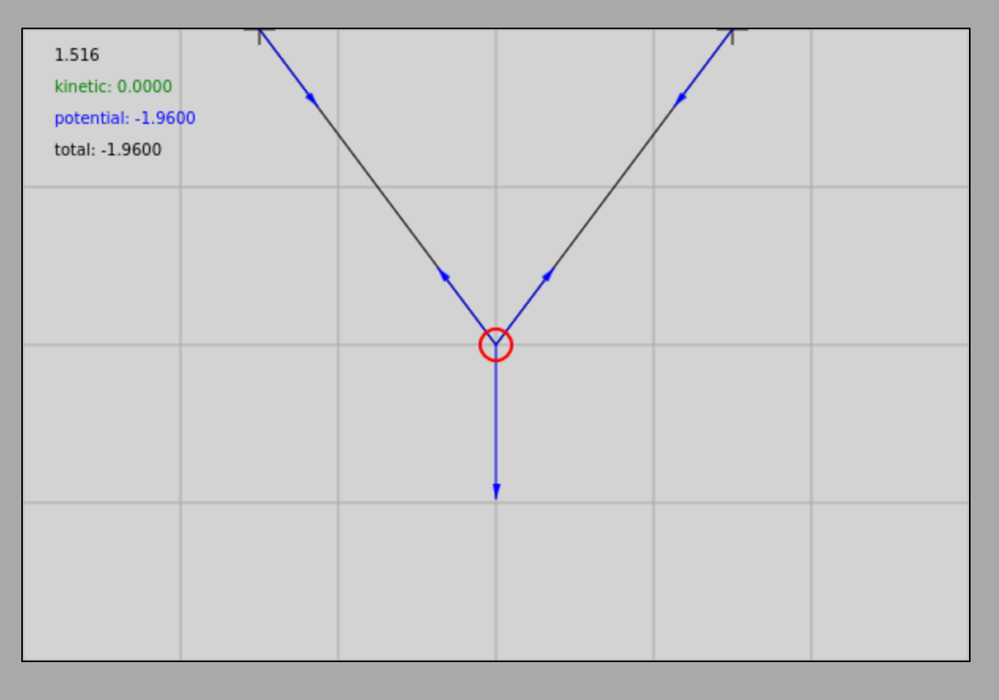
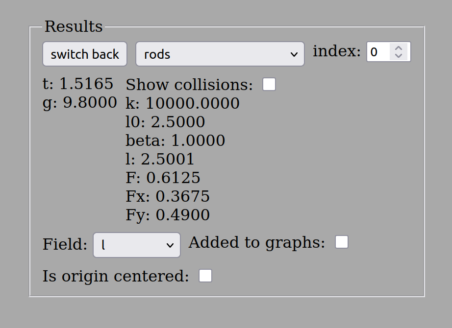
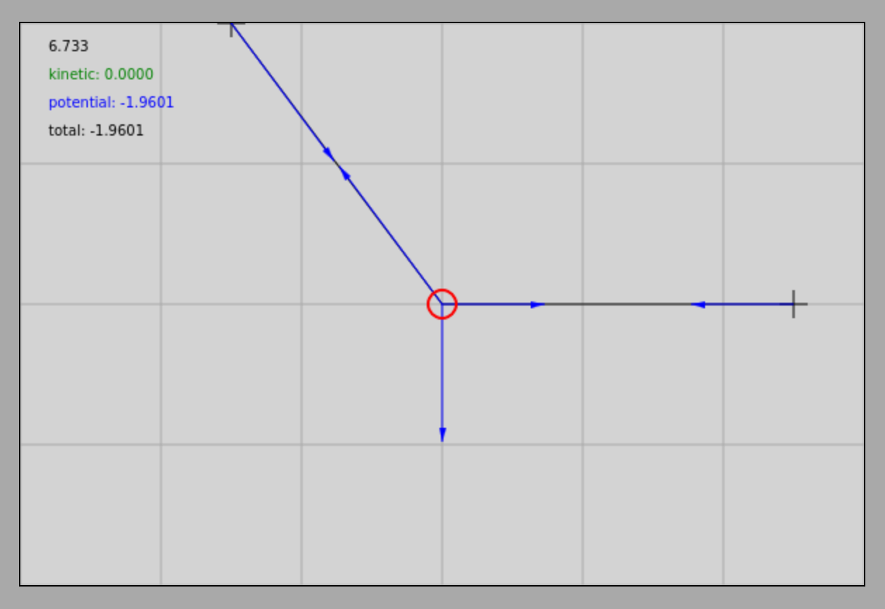
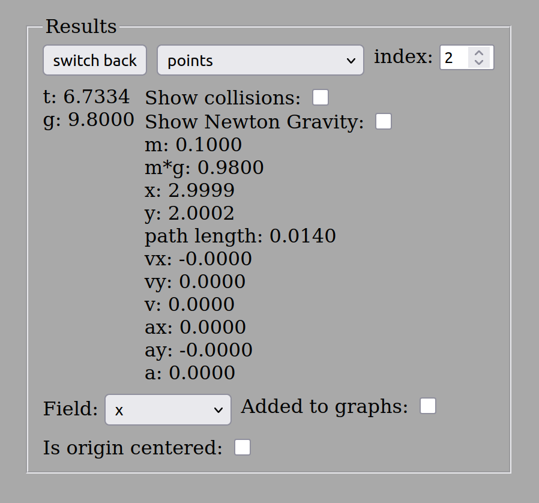
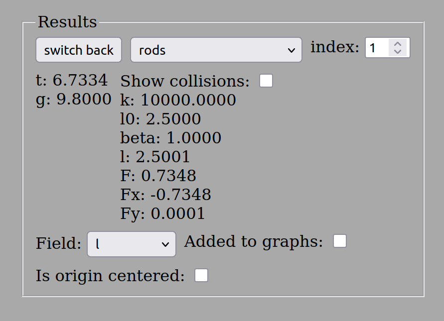

# Feladatok az egyensúlyra

## Példák

1. Egy vízszintes plafonon egymástól $3{,}00\text{ m}$ távolságra van két kampó, amelyekre kötelet akasztunk úgy, hogy a kötél közepén egy $0{,}10\text{ kg}$ tömegű test lóg. A test pontosan a kötél felezőpontján helyezkedik el, így a kötélszárak egyenlő hosszúak, és a test a plafon szintje alatt $2{,}00\text{ m}$-rel függőlegesen lejjebb van. Mekkora a kötél hossza? Mekkora a kötélben ébredő húzóerő, ha a test egyensúlyban van? A nehézségi gyorsulás $g = 9{,}81\text{ }\frac{\text{m}}{\text{s}^2}$, de a szimuláció a kerekített $g = 9{,}80\text{ }\frac{\text{m}}{\text{s}^2}$ értéket használja, így a számításban is ezzel dolgozunk.

### Szimuláció
[Statika első példa interaktív szimuláció](https://alexerdei73.github.io/physics-engine/project/#d90c17ac-3c4c-47fa-b91e-46157c5a3069)

A példa elrendezése és a szimuláció eredményei az alábbi ábrákon láthatók a testre és az egyik kötélszárra vonatkozóan:

Végezzük el a számításokat!
A kötélszárak egyenlő hosszúak, és a geometriai szimmetria miatt a bennük ébredő húzóerő is egyenlő nagyságú, jelöljük ezt egyszerűen $K$-val. Legyen a koordináta-rendszer $x$-tengelye vízszintes és jobbra mutató, az $y$-tengelye pedig függőleges és felfelé irányuló.
A derékszögű háromszög alapján az egyik kötélszár hossza ($l$):

$$
l = \sqrt {1{,}5^2 + 2^2} = \sqrt{2{,}25 + 4} = \sqrt{6{,}25} = 2{,}50\text{ m}
$$

Tehát a kötél teljes hossza ($2l$) pontosan $5{,}00\text{ m}$. Jelölje a kötélszár függőlegessel bezárt szögét $\alpha$. Ekkor a szögfüggvények értékei:

$$
\sin \alpha = \frac {1{,}5} {2{,}5} = 0{,}6
$$

$$
\cos \alpha = \frac {2} {2{,}5} = 0{,}8
$$

A test statikus egyensúlyának feltétele, hogy a rá ható erők eredője nullvektor legyen:

$$
\vec{K}_1 + \vec{K}_2 + \vec{G} = \vec{0}
$$

Itt $1$-es a bal oldali kötélszár indexe, $2$-es pedig a jobb oldali kötélszáré. A szimmetria miatt az erők nagysága megegyezik:

$$
|\vec{K}_1| = |\vec{K}_2| = K
$$

Írjuk fel a vektoregyenletet a tengelyirányú koordináták szerint:

$$
K_{1x} + K_{2x} + G_x = 0 
$$

$$
K_{1y} + K_{2y} + G_y = 0
$$

A geometriai felbontás alapján a komponensek értékei:

$$
K_{1x} = -K \cdot \sin \alpha
$$

$$
K_{2x} = K \cdot \sin \alpha
$$

$$
K_{1y} = K_{2y} = K \cdot \cos \alpha
$$

$$
G_x = 0,\ \ G_y = -G = -m \cdot g = -0{,}10 \cdot 9{,}80 = -0{,}98\text{ N}
$$

Behelyettesítve ezeket a komponenseket az egyenletekbe:

$$
-K \cdot \sin \alpha + K \cdot \sin \alpha + 0 = 0
$$

$$
K \cdot \cos \alpha + K \cdot \cos \alpha - G = 0
$$

Az első (vízszintes) egyenlet egy triviális azonosság ($-0 + 0 = 0$), a második (függőleges) egyenletből pedig:

$$
2K \cdot \cos \alpha = G
$$

$$
K = \frac {G} {2 \cdot \cos \alpha} = \frac {0{,}98\text{ N}} {2 \cdot 0{,}8} = \frac{0{,}98}{1{,}6} = 0{,}6125\text{ N}
$$

A kötélben ébredő húzóerő három értékes jegyre kerekítve pontosan $0{,}613\text{ N}$, ami hajszálpontosan megegyezik a szimulátorban mért értékkel.

2. Egy $0{,}10\text{ kg}$ tömegű testet egy kötéllel a vízszintes mennyezethez rögzítünk. Egy másik kötél segítségével a testet vízszintesen jobbra húzzuk úgy, hogy a felfüggesztési pont függőleges vonalától pontosan $1{,}50\text{ m}$-rel jobbra mozdul el, és így kerül egyensúlyba a mennyezet szintje alatt $2{,}00\text{ m}$ mélységben. Milyen hosszú a testet a mennyezethez rögzítő ferde kötél? Mekkora erők feszítik a köteleket ebben az egyensúlyi állapotban? (A gyorsulás itt is $g = 9{,}80\text{ }\frac{\text{m}}{\text{s}^2}$).

### Szimuláció
[Statika második példa interaktív szimuláció](https://alexerdei73.github.io/physics-engine/project/#69d5f6ba-1609-4b80-b2ef-e200344051f2)

A geometriai elrendezés és a mért eredmények az alábbi ábrákon láthatók:

A bal oldali (ferde) kötél hossza megegyezik az első példában kiszámított hosszal, hiszen a háromszög befogói pontosan ugyanazok. Így a kötél hosszára $2{,}50\text{ m}$-t kapunk. Ebből kifolyólag a függőlegessel bezárt szögfüggvények értékei most is: $\sin \alpha = 0{,}6$ és $\cos \alpha = 0{,}8$ (ahol $\alpha$ a bal oldali kötél függőlegessel bezárt szöge).

A vektoros egyensúlyi egyenlet:

$$
\vec{K}_1 + \vec{K}_2 + \vec{G} = \vec{0}
$$

A koordinátás komponensek egyenletrendszere:

$$
K_{1x} + K_{2x} + G_x = 0
$$

$$
K_{1y} + K_{2y} + G_y = 0
$$

Az erők irányultsága alapján a koordináták értékei:

$$
K_{1x} = -K_1 \cdot \sin \alpha
$$

$$
K_{1y} = K_1 \cdot \cos \alpha
$$

$$
K_{2x} = K_2,\ \ K_{2y} = 0
$$

$$
G_x = 0,\ \ G_y = -G = -0{,}98\text{ N}
$$

Behelyettesítve ezeket a komponenseket az egyenletrendszerbe:

$$
-K_1 \cdot \sin \alpha + K_2 + 0 = 0
$$

$$
K_1 \cdot \cos \alpha + 0 - G = 0
$$

A második (függőleges) egyenletből közvetlenül kifejezhető a ferde kötélben ébredő $K_1$ erő:

$$
K_1 = \frac {G} {\cos \alpha} = \frac {0{,}98\text{ N}} {0{,}8} = 1{,}225\text{ N}
$$

Ezt az értéket az első (vízszintes) egyenletbe visszahelyettesítve megkapjuk a vízszintes húzóerő nagyságát:

$$
K_2 = K_1 \cdot \sin \alpha = 1{,}225\text{ N} \cdot 0{,}6 = 0{,}735\text{ N}
$$

A bal oldali ferde kötél tehát $1{,}23\text{ N}$ erővel feszül, míg a jobb oldali vízszintes feszítőkötélben ébredő húzóerő $0{,}735\text{ N}$.

---

## Feladatok

1. Egy vízszintes plafonon két kampó távolsága $4{,}00\text{ m}$. Egy $0{,}50\text{ kg}$ tömegű testet két kötéllel függesztünk fel úgy, hogy az egyik kötél hossza $3{,}00\text{ m}$, a másiké pedig $4{,}00\text{ m}$. Számítsd ki a kötelekben ébredő erőket, ha a test nyugalomban van!

    [Statika első feladat interaktív szimuláció](https://alexerdei73.github.io/physics-engine/project/#b7f8397b-e4ea-4f20-9a85-cddec0155428)

2. Egy $30^\circ$-os hajlásszögű, súrlódásmentes lejtőn egy $2{,}00\text{ kg}$ tömegű testet a lejtő tetejéhez rögzített, a lejtő síkjával párhuzamos kötéllel tartunk egyensúlyban. Mekkora a kötélben ébredő $K_1$ húzóerő, és mekkora a lejtő felülete által kifejtett merőleges $K_2$ kényszererő?

3. Egy utcai lámpát, amelynek tömege $15\text{ kg}$, két oszlop közé kifeszített acélhuzal tart. A huzal két fele pontosan $170^\circ$-os szöget zár be egymással (vagyis mindkét oldalon csupán $5^\circ$-ot tér el a tökéletesen vízszintestől). Mekkora $K$ erő feszíti az acélhuzal szárait?

4. Egy $5{,}00\text{ kg}$ tömegű testet a mennyezethez rögzített két kötél tart egyensúlyban, amelyek a függőlegessel $30^\circ$-os és $45^\circ$-os szöget zárnak be. Határozd meg a két kötélben ébredő $K_1$ és $K_2$ húzóerő nagyságát!

5. Egy $10\text{ kg}$ tömegű közlekedési lámpa egy $6{,}00\text{ m}$ hosszú, vízszintes merev rúd végén lóg. A rudat a falnál egy csukló tartja, a rúd végét pedig egy, a függőleges falhoz $45^\circ$-os szögben csatlakozó merevítő drótkötél rögzíti a rúd felett. Mekkora húzóerő ébred a drótban, ha a rúd saját súlyát elhanyagolhatónak tekintjük?

    [Statika ötödik feladat interaktív szimuláció](https://alexerdei73.github.io/physics-engine/project/#83d3b11c-0a5a-4eca-9e5e-74b36177f4dc)

*A feladatok megoldása során a nehézségi gyorsulás alapértelmezett értéke* $g = 9{,}81\text{ }\frac{\text{m}}{\text{s}^2}$ *.*
