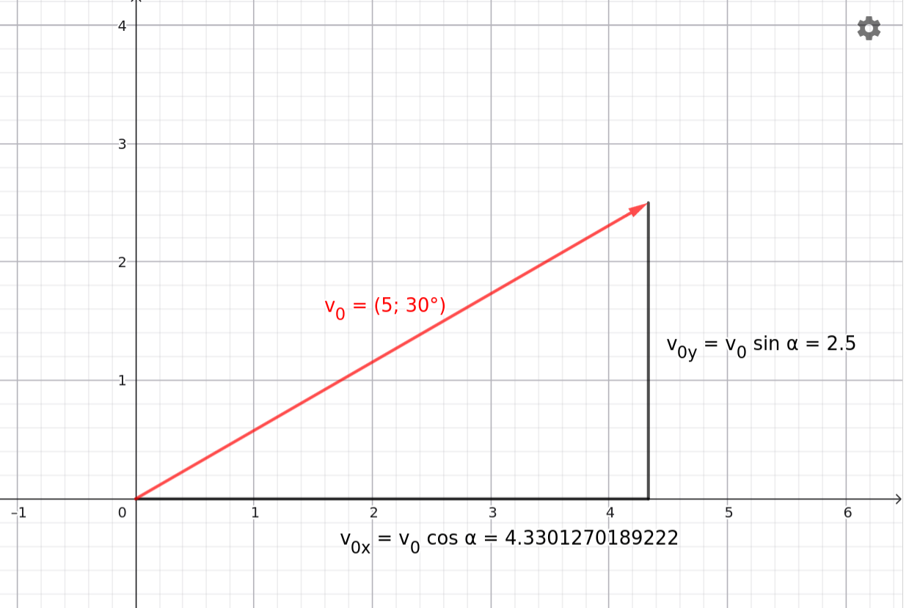

# Ferde Hajítás

## A derékszögű háromszög trigonometriája

Legyen ismert a derékszögű háromszög mindhárom oldala és legyen az egyik $90 \degree$-nél kisebb szöge $\alpha$, a vele szemközti befogó a, a mellette levő befogó b és a c pedig az átfogó. Ekkor az $\alpha$ szög trigonometrikus függvényeit három egyenlettel definiáljuk.

$$
sin \alpha = \frac {a} {c} 
$$

$$
cos \alpha = \frac {b} {c}
$$

$$
tan \alpha = \frac {a} {b}
$$

Ezen függvények megtalálhatók minden tudományos zsebszámológépen és így képesek vagyunk kiszámítani ezeket. A zsebszámológéppel kiszámítható még az ismert függvényérték ismeretében az ismeretlen szög is.

### Példák a szögfüggvényekre
1. Számítsuk ki a következő értékeket!
$sin 30\degree$, $sin 45\degree$, $sin 60\degree$, $sin 90\degree$,
$cos 30\degree$, $cos 45\degree$, $cos 60\degree$, $cos 90\degree$

>**Figyelem:** Nagyon fontos, hogy a zsebszámológép fok szög egységre legyen állítva! 

A zsebszámológéppel a következő értékek adódnak:
0.5, 0.7071, 0.8660, 1, 0.8660, 0.7071, 0.5, 0

2. A fenti értékekből számítsuk ki a szöget a zsebszámológéppel! Vissza kell kapjuk a szöget az 1. példában.

## A kezdősebesség koordinátai
Legyen adott a ferde hajítás kezdősebesség ének nagysága, amely $v_0$, és zárjon be a vektor $\alpha$ szöget az vízszintes x-tengellyel. A függőleges y-tengely felfelé mutat. A következő ábra mutatja a vektort:

[vektor komponensek](https://www.geogebra.org/m/hrhnmnmm)

A vektor koordinátái az ábran látható derékszögű háromszög alapján kiszámíthatók a szögfüggvények segítségével.

$$
cos \alpha = \frac {v_{0x}} {v_0} 
$$

$$
v_{0x} = v_0 cos \alpha
$$

Hasonlóan kapjuk, hogy

$$
v_{0y} = v_0 sin \alpha
$$

Összefoglalva:

$$
\overrightarrow{v_0} = (v_0 cos \alpha, v_0 sin \alpha)
$$

## A ferde hajítás

### Kísérlet

[Ferde hajítás](https://www.youtube.com/watch?v=KacTRPL1MtE)

### Szimuláció

[Ferde hajítás](https://alexerdei73.github.io/physics-engine/project/#b2325a19-cfb5-49fa-91e5-0d11b2955e2b)

Miután megtekintettük a szimulációt, készítsük el a $v_x$ és $v_y$ mennyiségek időfüggésé t mutató grafikonokat!

### A ferde hajítás képletei

A kísérlet és a szimuláció is igazolja, hogy a sebesség vízszintes komponense állandó, míg a függőleges komponens pontosan úgy változik, mint a függőleges hajítás esetében, tehát a nehézségi gyorsulás ütemében csökken, míg nem a test eléri maximális magasságát és ezután megfordul a mozgás iránya és gyorsulva zuhan.

Indítsuk a testet a koordináta rendszer kezdőpontjából $v_0$ nagyságú sebességgel, mely az x-tengely irányával $\alpha$ szöget zár be. A vízszintes x-tengely balról jobbra mutat, míg a függőleges y-tengely felfelé irányul. A gyorsulás vektor ekkor:

$$
\overrightarrow{a} = (a_x, a_y) = (0, -g)
$$

$$
\overrightarrow{v_0} = (v_{0x}, v_{0y}) = (v_0cos \alpha, v_0 sin \alpha)
$$

$$
(x_0, y_0) = (0, 0)
$$

$$
s = v_0 \times t + \frac {a} {2} \times t^2
$$

Ebbe a képletbe s helyére kell írjuk a megfelelő elmozdulás komponensét, míg a v_0 és a helyébe a kezdősebesség és a gyorsulás megfelelő komponensét. Így a következő képleteket kapjuk:

$$
x = v_0 cos (\alpha) t
$$

$$
y = v_0 sin (\alpha) t - \frac {g} {2} \times t^2
$$

### Példák
1. Egy testet vízszintes talajon ferdeán elhajítunk a talajszint magasságáról $5 \frac {m} {s}$ nagyságú és a vízszintessel $30°$ szöget bezáró irányban. Mennyi idő alatt ér talajt a test? Milyen messze kerül a kiindulási helyétől ezalatt az idő alatt? A légellenállás elhanyagolható és a nehézségi gyorsulás $9.81 \frac {m} {s^2}$.

$$
\overrightarrow{v_0} = (v_0cos \alpha, v_0sin \alpha) = (4.330 \frac {m} {s}, 2.500 \frac {m} {s})
$$

$$
y = v_0 sin(\alpha)t - \frac {g} {2} \times t^2
$$

$$
0 = 2.500t - 4.905t^2
$$

A $t=0$ megoldás a kilövés, minket a másik megoldás érdekel. 

$$
t = 0.5097 \text{ s}
$$

Tehát a keresett idő $0.510 \text{ s}$.

$$
x = v_0 cos(\alpha)t = 4.330 \times 0.5097 = 2.207 \text{ m}
$$

Tehát a keresett távolság $2.21 \text{ m}$.

2. Egy testet a talaj szintjéről kilövünk $v_0 = 20 \frac {m} {s}$ nagyságú kezdősebességgel vízszintes talajon, a vízszintessel $45°$-ot bezáró szögben. A test egy $10.0 \text{ m}$ mély gödör alján csapódik be. Mennyi idő telik el a kilövés és a becsapódás közt? Legfeljebb milyen messze lehet tőlünk a gödör közelebbi szele? Legalább milyen széles a gödör? A légellenállás elhanyagolható és a nehézségi gyorsulás $9.81 \frac {m} {s^2}$.

$$
\overrightarrow{v_0} = (v_0 cos \alpha, v_0 sin \alpha) = (14.14 \frac {m} {s}, 14.14 \frac {m} {s})
$$

$$
y = v_0 sin(\alpha)t - \frac {g} {2} \times t^2
$$

$$
-10 = 14.14t - 4.905t^2
$$

$$
4.905t^2 - 14.14t - 10.0 = 0
$$

$$
t_{12} = \frac {14.14 \pm \sqrt {14.14^2 - 4 \times 4.905 \times (-10.0)}} {2 \times 4.905} = \frac {14.14 \pm \sqrt {200 + 196.2}} {9.81} = 3.470 \text{ s}, -0.5876 \text{ s}
$$

A keresett idő $3.47 \text{ s}$. 

$$
x = v_0 cos (\alpha) t = 14.14 \times 3.470 = 49.07 \text{ m}
$$

A gödör szele nem lehet messzebb, mint:

$$
y = v_0 sin(\alpha) t - \frac {g} {2} \times t^2
$$

$$
0 = 14.14t - 4.905t^2
$$

A $t=0$ megoldás nem érdekes, így:

$$
t = 14.14 / 4.905 = 2.883 \text{ s}
$$

A test $2.88 \text{ s}$-kor ér vissza a vízszintes talajszintre, ekkor a távolsága:

$$
x = v_0 cos(\alpha) t = 14.14 \times 2.883 = 40.77 \text{ m}
$$

Így a gödör közelebbi szele legfeljebb $40.8 \text{ m}$-re lehet a kilövés helyétől. 

$$
49.07 - 40.77 = 8.30 \text{ m}
$$

A gödör legalább $8.30 \text{ m}$ széles.

## Feladatok

1. Egy testet 35° szögben kilövünk a talajtól $12.0 \frac {m} {s}$ kezdősebességgel. Maximálisan mekkora magasságra emelkedik a test? Milyen messze csapódik be a talajba? (A légellenállás elhanyagolható és $g = 9.81 \frac {m} {s^2}$.)

2. Egy kőgolyót egy domb tetejéről 40° szögben lövünk ki $18.0 \frac {m} {s}$ kezdősebességgel. A lövés helyétől vízszintesen 25.0 m távolságban és 15.0 m mélységben egy tó található. Beesik-e a kőgolyó a tóba? (A légellenállás elhanyagolható és $g = 9.81 \frac {m} {s^2}$.)

3. Egy labdát 60° szögben kilövünk a talajtól $18.0 \frac {m} {s}$ kezdősebességgel. Határozd meg, hogy milyen hosszú ideig volt a labda a levegőben! Mekkora volt a labda maximális magassága? (A légellenállás elhanyagolható és $g = 9.81 \frac {m} {s^2}$.)

4. Egy katapult 25° szögben lő ki egy kőgolyót $30.0 \frac {m} {s}$ sebességgel. Az ellenség vára $40.0 \text{ m}$ távolságban található. Eléri-e a kőgolyó a várat? Ha igen, milyen magasságban csapódik be a falba? (A légellenállás elhanyagolható és $g = 9.81 \frac {m} {s^2}$.)

5. Egy teniszezőnek egy mozgó célpontot kell eltalálnia. A célpont 50.0 m távolságban található és 3.50 m magasságban. Egy teniszlabdát 35° szögben kilövünk $22.0 \frac {m} {s}$ sebességgel a talajtól. Eltaláljuk-e a célpontot? (A légellenállás elhanyagolható és $g = 9.81 \frac {m} {s^2}$.)