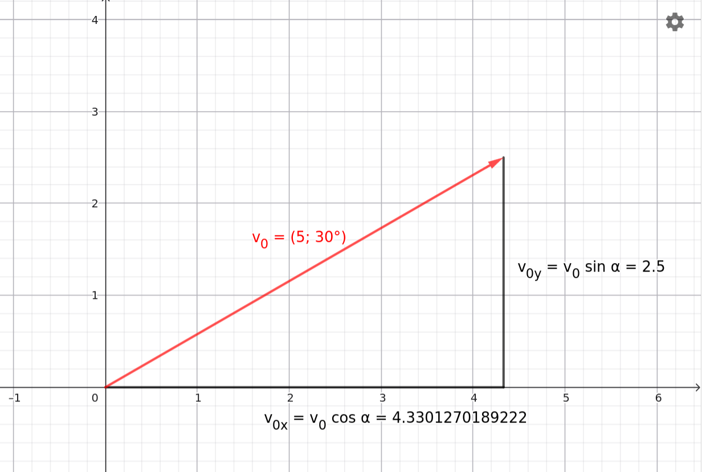

# Ferde hajítás

## A derékszögű háromszög trigonometriája

Legyen ismert egy derékszögű háromszög mindhárom oldala, és jelölje a háromszög egyik $90^\circ$-nál kisebb szögét $\alpha$. A szöggel szemközti befogó legyen $a$, a mellette fekvő befogó $b$, az átfogó pedig $c$. Ekkor az $\alpha$ szög trigonometrikus függvényeit a következő három egyenlettel definiáljuk:

$$
\sin \alpha = \frac {a} {c} 
$$

$$
\cos \alpha = \frac {b} {c}
$$

$$
\tan \alpha = \frac {a} {b}
$$

Ezek a szögfüggvények megtalálhatók minden tudományos zsebszámológépen, így könnyedén kiszámíthatjuk az értéküket. A számológéppel az ismert függvényérték birtokában az ismeretlen szög visszakeresése (arkusz függvények) is elvégezhető.

### Példák a szögfüggvényekre

1. Számítsuk ki a következő alapvető szögfüggvényértékeket zsebszámológéppel:
$\sin 30^\circ$, $\sin 45^\circ$, $\sin 60^\circ$, $\sin 90^\circ$,
$\cos 30^\circ$, $\cos 45^\circ$, $\cos 60^\circ$, $\cos 90^\circ$

> **Figyelem:** Rendkívül fontos, hogy a zsebszámológép szögmértéke fok (DEG) egységre legyen állítva!

A zsebszámológéppel végzett számítások a következő értékeket adják:
$\sin 30^\circ = 0{,}5$; $\sin 45^\circ \approx 0{,}7071$; $\sin 60^\circ \approx 0{,}8660$; $\sin 90^\circ = 1$
$\cos 30^\circ \approx 0{,}8660$; $\cos 45^\circ \approx 0{,}7071$; $\cos 60^\circ = 0{,}5$; $\cos 90^\circ = 0$

2. A kapott tizedes értékekből az inverz szögfüggvények ($\sin^{-1}$ / $\text{asin}$ vagy $\cos^{-1}$ / $\text{acos}$) segítségével keressük vissza a szögeket a számológéppel! Eredményül pontosan az 1. példában szereplő kiindulási fokértékeket kell visszakapnunk.

## A kezdősebesség koordinátái

Legyen adott a ferde hajítással elindított test kezdősebességének nagysága, amelyet $v_0$ jelöl, és zárjon be ez a sebességvektor egy $\alpha$ szöget a vízszintes $x$-tengellyel. A függőleges $y$-tengely mutasson egyenesen felfelé. A sebességvektor felbontását az alábbi ábra szemlélteti:

[Vektor-komponensek interaktív ábrázolása (GeoGebra)](https://www.geogebra.org/m/hrhnmnmm)

A sebességvektor tengelyirányú koordinátái az ábrán látható derékszögű háromszög alapján, a szögfüggvények segítségével határozhatók meg:

$$
\cos \alpha = \frac {v_{0x}} {v_0} \implies v_{0x} = v_0 \cdot \cos \alpha
$$

Hasonló módon a függőleges komponensre kapjuk, hogy:

$$
\sin \alpha = \frac {v_{0y}} {v_0} \implies v_{0y} = v_0 \cdot \sin \alpha
$$

Összefoglalva a kezdősebesség-vektor komponensei koordinátás alakban:

$$
\vec{v}_0 = (v_0 \cdot \cos \alpha,\ v_0 \cdot \sin \alpha)
$$

## A ferde hajítás fizikai modellje

### Kísérlet
[A vízszintes sebesség állandóságának demonstrációja (Walter Lewin / MIT)](https://www.youtube.com/watch?v=KacTRPL1MtE)

### Szimuláció
[Ferde hajítás interaktív szimulátor](https://alexerdei73.github.io/physics-engine/project/#b2325a19-cfb5-49fa-91e5-0d11b2955e2b)

Miután megtekintettük a szimulációt, készítsük el a test $v_x$ és $v_y$ sebességkomponenseinek időfüggését mutató grafikonokat!

### A ferde hajítás képletei

Mind a kísérleti videó (ahol a mozgó kocsiból függőlegesen kilőtt labda pontosan visszaesik a kocsiba), mind a szimuláció egyértelműen igazolja, hogy a **sebesség vízszintes komponense a mozgás során végig állandó**. Ezzel szemben a függőleges komponens pontosan úgy változik, mint a függőleges hajítás esetében: a nehézségi gyorsulás ütemében folyamatosan csökken, amíg a test el nem éri a pályája maximális magasságát (ahol $v_y = 0$), majd a mozgásirány megfordulása után egyre gyorsulva zuhan lefelé.

Indítsuk a testet a koordináta-rendszer origójából ($x_0 = 0$, $y_0 = 0$) $v_0$ nagyságú kezdősebességgel, amely a vízszintes tengellyel $\alpha$ szöget zár be. A vízszintes $x$-tengely mutasson balról jobbra, a függőleges $y$-tengely pedig felfelé. A gyorsulásvektor komponensei:

$$
\vec{a} = (a_x,\ a_y) = (0,\ -g)
$$

A kezdősebesség-vektor:

$$ 
\vec{v}_0 = (v_{0x},\ v_{0y}) = (v_0 \cdot \cos \alpha,\ v_0 \cdot \sin \alpha)
$$

A helykoordináták meghatározásához idézzük fel a négyzetes úttörvény elmozdulás-komponensekre felírt alakját:

$$
s = v_0 \cdot t + \frac {a} {2} \cdot t^2
$$

Ha ebbe a képletbe behelyettesítjük a megfelelő tengelyirányú kezdősebesség- és gyorsuláskoordinátákat, megkapjuk a ferde hajítás mozgásegyenleteit:

$$
x = v_0 \cdot \cos(\alpha) \cdot t
$$

$$
y = v_0 \cdot \sin(\alpha) \cdot t - \frac {g} {2} \cdot t^2
$$

### Példák

1. Egy testet vízszintes talajon elhajítunk a talajszintről $5\text{ }\frac{\text{m}}{\text{s}}$ nagyságú, a vízszintessel $30^\circ$-os szöget bezáró kezdősebességgel. Mennyi idő alatt ér újra talajt a test? Milyen messze kerül a kiindulási helyétől ezalatt az idő alatt? A légellenállás elhanyagolható, a nehézségi gyorsulás $9{,}81\text{ }\frac{\text{m}}{\text{s}^2}$.

Számítsuk ki a kezdősebesség-vektor két komponensét:

$$
\vec{v}_0 = (v_0 \cdot \cos \alpha,\ v_0 \cdot \sin \alpha) = (5 \cdot \cos 30^\circ,\ 5 \cdot \sin 30^\circ) \approx (4{,}330\text{ }\frac {\text{m}} {\text{s}},\ 2{,}500\text{ }\frac {\text{m}} {\text{s}})
$$

Amikor a test visszaérkezik a vízszintes talajra, a függőleges koordinátája nullává válik ($y = 0$). Írjuk fel a függőleges mozgásegyenletet:

$$
y = v_0 \cdot \sin(\alpha) \cdot t - \frac {g} {2} \cdot t^2
$$

$$
0 = 2{,}500 \cdot t - 4{,}905 \cdot t^2
$$

A $t = 0\text{ s}$ megoldás a hajítás kezdőpillanatára utal, minket a folyamat végét jelentő másik gyök érdekel:

$$
t = \frac{2{,}500}{4{,}905} \approx 0{,}5097\text{ s}
$$

A keresett repülési idő három értékes jegyre kerekítve $0{,}510\text{ s}$.

Ezt az időt a vízszintes elmozdulás egyenletébe behelyettesítve megkapjuk a hajítástávolságot:

$$
x = v_0 \cdot \cos(\alpha) \cdot t = 4{,}330 \cdot 0{,}5097 \approx 2{,}207\text{ m}
$$

A test a kiindulópontjától pontosan $2{,}21\text{ m}$ távolságban csapódik be.

2. Egy testet a talaj szintjéről kilövünk $v_0 = 20\text{ }\frac{\text{m}}{\text{s}}$ nagyságú kezdősebességgel, a vízszintessel $45^\circ$-os szögben. A test egy $10{,}0\text{ m}$ mély gödör alján csapódik be. Mennyi idő telik el a kilövés és a becsapódás között? Legfeljebb milyen messze lehet tőlünk a gödör közelebbi széle, és legalább milyen szélesnek kell lennie a gödörnek, hogy a test az aljára érkezzen? A légellenállás elhanyagolható, a nehézségi gyorsulás $9{,}81\text{ }\frac{\text{m}}{\text{s}^2}$.

Számítsuk ki a kezdősebesség-komponenseket (mivel $\sin 45^\circ = \cos 45^\circ \approx 0{,}7071$):

$$
\vec{v}_0 = (v_0 \cdot \cos \alpha,\ v_0 \cdot \sin \alpha) \approx (14{,}14\text{ }\frac {\text{m}} {\text{s}},\ 14{,}14\text{ }\frac {\text{m}} {\text{s}})
$$

Mivel a becsapódási pont a talajszint alatt van $10{,}0\text{ méterrel}$, a függőleges koordináta a végponton $y = -10\text{ m}$. Írjuk fel az $y$-egyenletet:

$$
-10 = 14{,}14 \cdot t - 4{,}905 \cdot t^2
$$

Rendezve a másodfokú egyenletet:

$$
4{,}905 \cdot t^2 - 14{,}14 \cdot t - 10{,}0 = 0
$$

Alkalmazzuk a megoldóképletet:

$$
t_{1,2} = \frac {14{,}14 \pm \sqrt {14{,}14^2 - 4 \cdot 4{,}905 \cdot (-10{,}0)}} {2 \cdot 4{,}905} = \frac {14{,}14 \pm \sqrt {200 + 196{,}2}} {9{,}81} \implies t_1 \approx 3{,}470\text{ s};\ \ t_2 \approx -0{,}5876\text{ s}
$$

A fizikailag helyes, pozitív időérték $t = 3{,}47\text{ s}$. Ennyi idő telik el a becsapódásig.

Számítsuk ki a becsapódási pont teljes vízszintes távolságát ($x$):

$$
x = v_0 \cdot \cos (\alpha) \cdot t = 14{,}14 \cdot 3{,}470 \approx 49{,}07\text{ m}
$$

Ahhoz, hogy meghatározzuk a gödör széleinek határait, számítsuk ki, hogy a test hol és mikor érne vissza a kiindulási talajszintre ($y = 0$), ha nem lenne ott a gödör:

$$
0 = 14{,}14 \cdot t - 4{,}905 \cdot t^2 \implies t = \frac{14{,}14}{4{,}905} \approx 2{,}883\text{ s}
$$

A test tehát $2{,}88\text{ s}$-kor érne vissza a talajszintre, ekkor a vízszintes pozíciója:

$$
x_{\text{talaj}} = v_0 \cdot \cos(\alpha) \cdot t = 14{,}14 \cdot 2{,}883 \approx 40{,}77\text{ m}
$$

Ez azt jelenti, hogy a gödör közelebbi széle legfeljebb $40{,}8\text{ m}$ távolságra lehet a kilövési ponttól, különben a test még a gödör előtt a talajnak csapódna.

A gödör minimális szélessége a becsapódási pont és a talajszinti visszatérési pont különbsége:

$$
\Delta x = 49{,}07 - 40{,}77 = 8{,}30\text{ m}
$$

A gödörnek legalább $8{,}30\text{ m}$ szélesnek kell lennie, hogy a test szabadon berepülhessen a belsejébe.

## Feladatok

1. Egy testet $35^\circ$-os szögben lövünk ki a talajról $12{,}0\text{ }\frac{\text{m}}{\text{s}}$ kezdősebességgel. Maximálisan mekkora magasságra emelkedik a test, és milyen messze csapódik be a talajba? (A légellenállás elhanyagolható és $g = 9{,}81\text{ }\frac{\text{m}}{\text{s}^2}$.)

2. Egy kőgolyót egy domb tetejéről $40^\circ$-os szögben lőnek ki $18{,}0\text{ }\frac{\text{m}}{\text{s}}$ kezdősebességgel. A lövés helyétől vízszintesen $25{,}0\text{ m}$ távolságban és $15{,}0\text{ m}$ mélységben egy tó kezdődik. Beesik-e a kőgolyó a tóba? (A légellenállás elhanyagolható és $g = 9{,}81\text{ }\frac{\text{m}}{\text{s}^2}$.)

3. Egy labdát $60^\circ$-os szögben kilövünk a talajról $18{,}0\text{ }\frac{\text{m}}{\text{s}}$ kezdősebességgel. Határozd meg, hogy milyen hosszú ideig volt a labda a levegőben, és mekkora volt a maximális magassága! (A légellenállás elhanyagolható és $g = 9{,}81\text{ }\frac{\text{m}}{\text{s}^2}$.)

4. Egy katapult $25^\circ$-os szögben lő ki egy sziklát $30{,}0\text{ }\frac{\text{m}}{\text{s}}$ sebességgel. Az ellenséges vár fala pontosan $40{,}0\text{ m}$ távolságban található. Eléri-e a kőgolyó a várat? Ha igen, milyen magasságban csapódik be a falba? (A légellenállás elhanyagolható és $g = 9{,}81\text{ }\frac{\text{m}}{\text{s}^2}$.)

5. Egy teniszezőnek egy rögzített célpontot kell eltalálnia, amely tőle vízszintesen $50{,}0\text{ m}$ távolságban és $3{,}50\text{ m}$ magasságban helyezkedik el. A teniszlabdát $35^\circ$-os szögben lövi ki $22{,}0\text{ }\frac{\text{m}}{\text{s}}$ sebességgel a talajról. Eltalálja-e a célpontot? (A légellenállás elhanyagolható és $g = 9{,}81\text{ }\frac{\text{m}}{\text{s}^2}$.)

