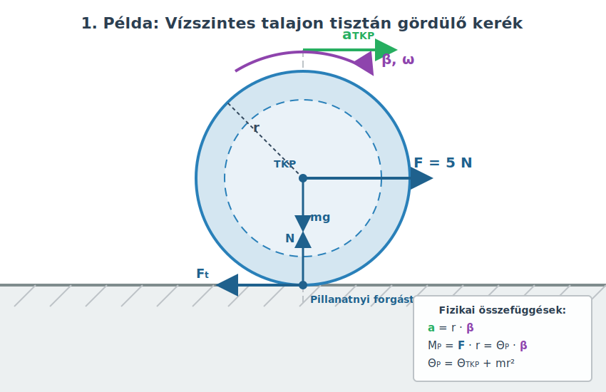

# A forgómozgás alapegyenlete

## A szöggyorsulás

A merev test forgását fogjuk leírni rögzített tengely körül, mely ismét a $z$ tengely lesz. A mozgás ilyenkor síkmozgás, ahogy megbeszéltük. Ha a merev testre ható külső erők forgatónyomatékainak eredője nem nulla, akkor a test forgása gyorsul vagy lassul. Ezt a szöggyorsulással jellemezzük, mely a szögsebesség időegységre eső változása. Ez is előjeles mennyiség, akárcsak a szögsebesség.

$$
\beta = \frac{\omega - \omega_0}{t}
$$

> **Az időegységre eső szögsebesség-változás neve szöggyorsulás. A szöggyorsulás előjeles mennyiség, jele $\beta$, egysége $\frac{1}{\mathrm{s}^2}$.**

## A forgómozgás alapegyenlete

Az impulzusnyomaték (perdület) tétele szerint írhatjuk az alábbi összefüggést:

$$
M_{z,\text{e}}^{\text{k}} = \frac{N_z - N_{z,0}}{t}
$$

$$
N_z = \Theta \omega
$$

Ezt beírva az előző egyenletben azt kapjuk, hogy:

$$
M_{z,\text{e}}^{\text{k}} = \frac{\Theta \omega - \Theta \omega_0}{t} = \Theta \frac{\omega - \omega_0}{t}
$$

Itt kiemeltük a $\Theta$ tehetetlenségi nyomatékot, mely a forgástengelyre vonatkozik és nem változik, hiszen a test merev. Megkapjuk a következő, végső összefüggésünket:

$$
M_{z,\text{e}}^{\text{k}} = \Theta \beta
$$

> **A forgómozgás alapegyenlete szerint a külső erők eredő forgatónyomatéka nem más, mint a tehetetlenségi nyomaték és a szöggyorsulás szorzata. Ez Newton második törvényének megfelelője forgómozgás esetére.**

Itt a forgatónyomatékokat és a tehetetlenségi nyomatékot a forgástengelyre vonatkoztatva kell megállapítani. Az egyenlet tehát függ a forgástengely helyétől és helyzetétől, akárcsak a tehetetlenségi nyomaték és a forgatónyomaték is. A tengelynek inerciarendszerben kell rögzítve lennie, hiszen a fizika törvényei erre vonatkoznak. 

### Kísérlet

[Körlap alakú test tehetetlenségi nyomatékának mérése](https://www.youtube.com/watch?v=O4PSeSuyKZU)

A videóban bemutatott kísérlet során egy merev körlap (korong) tehetetlenségi nyomatékát határozzák meg egy légcsapágyas asztal (air bearing table) segítségével. A légcsapágy állandó sűrített levegőt fúj a felületek közé, ami szinte teljesen kiküszöböli a tengely körüli súrlódást, így a külső fékezőnyomaték elhanyagolhatónak tekinthető ($M_{\text{súrlódás}} \approx 0$). A forgatónyomatékot egy fonálra függesztett, szabadon süllyedő nehézségi test biztosítja, amelyet egy rögzített kiegészítő csigán vetnek át. A kísérletből nyert mérési adatok alapján a forgómozgás alapegyenletével ($M = \Theta \beta$) pontosan meghatározható a korong tehetetlenségi nyomatéka.

### Példa

A fenti kísérlet mérési adatai alapján számítsuk ki a tehetetlenségi nyomatékot! A süllyedő test tömege $0,1\text{ kg}$ ($100\text{ g}$), amely álló helyzetből indulva $s = 0,86\text{ m}$ függőleges utat tesz meg a talajig. Öt mérés átlagából számított süllyedési idő $t = 5,04\text{ s}$. A meghajtó kis csiga (pulley) átmérője $5,5\text{ cm}$, azaz a sugara $r = 0,0275\text{ m}$.
- Mekkora a süllyedő test lineáris gyorsulása?
- Mekkora a fonalat feszítő kényszererő?
- Mekkora forgatónyomaték gyorsítja a körlapot?
- Mekkora a rendszer szöggyorsulása?
- Számítsuk ki a kísérleti tehetetlenségi nyomatékot!

A test nyugvó helyzetből indul (\(v_0 = 0\)), így a megtett út:

$$
s = \frac{a}{2}t^2
$$

$$
a = \frac{2s}{t^2} = \frac{2 \cdot 0,86}{5,04^2} \approx 0,0677\text{ m/s}^2
$$

Newton második törvénye a süllyedő nehézségi testre felírva:

$$
mg - K = ma
$$

Amikor a függőlegesen függő tömeg gyorsulva süllyed lefelé, a kötélben ébredő $K$ feszítőerő (kényszererő) a gyorsulás miatt kis mértékben kisebb lesz, mint a test statikus súlya (\(mg\)):

$$
K = mg - ma = m(g - a) = 0,1 \cdot (9,81 - 0,0677) \approx 0,9742\text{ N}
$$

A csiga peremén ható fonalerő által kifejtett külső forgatónyomaték:

$$
M_z = Kr = 0,9742 \cdot 0,0275 \approx 0,0268\text{ N}\cdot\text{m}
$$

A szöggyorsulás meghatározásához kihasználjuk, hogy a csiga kerületi sebessége megegyezik a kötél lineáris sebességével (\(v = r\omega\)):

$$
a = \frac{v - v_0}{t} = \frac{r\omega - r\omega_0}{t} = r\frac{\omega - \omega_0}{t} = r\beta
$$

A rendszer szöggyorsulása tehát:

$$
\beta = \frac{a}{r} = \frac{0,0677}{0,0275} \approx 2,462\text{ 1/s}^2
$$

A forgómozgás alapegyenletéből (\(M_z = \Theta \beta\)) kifejezve a tehetetlenségi nyomatékot:

$$
\Theta = \frac{M_z}{ \beta} = \frac{0,0268}{2,462} \approx 0,0109\text{ kg}\cdot\text{m}^2 \approx 0,011\text{ kg}\cdot\text{m}^2
$$

A kapott mérési eredmény hajszálpontosan megegyezik a korong aljára gyárilag rányomtatott $\Theta = 0,011\text{ kg}\cdot\text{m}^2$ névleges értékkel.

## A tiszta gördülés

Eddig rögzített tengely körüli forgással foglalkoztunk, most megnézzük, mi a helyzet, ha a tengely nem rögzített. Ilyen mozgás például egy kerék gördülése. A kerék talajjal érintkező pontjának sebessége nulla, amíg meg nem csúszik. Ezt a tapadási erő biztosítja, és onnan lehet biztosan tudni, hogy a nyom, amit a kerék hagy, nincs elmosódva. Ez azt jelenti, hogy a kerék talajjal érintkező pontján átmenő tengely, amely merőleges a gördülés síkjára, az ún. *pillanatnyi forgástengely*. Ennek sebessége nulla, és a mozgás leírható egy rövid ideig tiszta forgásként ezen tengely körül. A pont helyzete változik a gördülés során, de egy olyan inerciarendszerben dolgozunk, amely ezzel pillanatnyilag együtt mozog (az igen rövid időtartam alatt). Ilyenkor is alkalmazható a forgómozgás alapegyenlete.

Tiszta gördülés esetén a tömegközéppont is csupán forgómozgást végez a pillanatnyi forgástengely körül, tehát a következőt írhatjuk:

$$
v_{\text{TKP}} = r_{\text{TKP}}\omega
$$

Illetve a gyorsulásra írhatjuk a következő összefüggést:

$$
a_{\text{TKP}} = \frac{v_{\text{TKP}} - v_{\text{TKP},0}}{t} = r_{\text{TKP}}\frac{\omega - \omega_0}{t}
$$

Itt $r_{\text{TKP}}$ nem változik a forgás során, tehát kiemelhető. Így végül eredményünk ez lesz:

$$
a_{\text{TKP}} = r_{\text{TKP}}\beta
$$

### Példák

1. Egy kereket vízszintesen húzunk a középpontjában $5\ \text{N}$ erővel, aminek hatására tisztán gördül egyenes vonalban a vízszintes talajon, gyorsulva. A kerék tehetetlenségi nyomatéka $0,2\ \text{kg}\cdot\text{m}^2$ a középpontjára vonatkozólag, mely egyben a tömegközéppontja is, tömege pedig $1\ \text{kg}$. A kerék sugara $0,5\text{ m}$.
- Mekkora a kerék gyorsulása?
- Mekkora a tapadási erő, ha a kerék tisztán gördül?

Írjuk fel a forgómozgás alapegyenletét a pillanatnyi forgástengelyre vonatkozólag!

$$
M_{z,\text{e}}^{\text{k}} = \Theta \beta
$$

Tudjuk, hogy az egyetlen erő, amelynek van nyomatéka a pillanatnyi forgástengelyre nézve, az a húzóerő, mivel az összes többi erő hatásvonala átmegy a pillanatnyi forgástengelyen.

$$
M_{z,\text{e}}^{\text{k}} = Fr
$$

Itt $r$ a középpont távolsága a pillanatnyi forgástengelytől, tehát a kerék sugara.

$$
a = r\beta \implies \beta = \frac{a}{r}
$$

A tehetetlenségi nyomatékra alkalmazzuk a Steiner-tételt!

$$
\Theta = \Theta_{\text{TKP}} + mr^2
$$

Mindezeket behelyettesítve kapjuk az alábbi összefüggést:

$$
Fr = (\Theta_{\text{TKP}} + mr^2) \frac{a}{r}
$$

Innen $a$-t kifejezzük:

$$
a = \frac{Fr^2}{\Theta_{\text{TKP}} + mr^2} = \frac{\frac{F}{m}}{1 + \frac{\Theta_{\text{TKP}}}{mr^2}}
$$

Látjuk, hogy ha $\Theta_{\text{TKP}} \ll mr^2$, akkor visszakapjuk a haladó mozgás gyorsulását, mintha forgás nem is lenne. Ez várható is.

$$
a = \frac{\frac{5}{1}}{1 + \frac{0,2}{1 \cdot 0,5^2}} \approx 2,778\ \text{m/s}^2
$$

A dinamika alapegyenlete (Newton második törvénye) a haladó mozgásra pedig ez:

$$
F - F_{\text{t}} = ma
$$

$$
F_{\text{t}} = F - ma = F - \frac{F}{1 + \frac{\Theta_{\text{TKP}}}{mr^2}} = F \frac{\frac{\Theta_{\text{TKP}}}{mr^2}}{1 + \frac{\Theta_{\text{TKP}}}{mr^2}}
$$

$$
\frac{\Theta_{\text{TKP}}}{mr^2} = \frac{0,2}{0,25} = 0,8
$$

$$
F_{\text{t}} = 5 \cdot \frac{0,8}{1 + 0,8} \approx 2,222\ \text{N}
$$

2. Az előző kerék egy $\alpha = 30^\circ$-os hajlásszögű lejtőn tisztán gördül lefelé álló helyzetből. Mekkora a gyorsulása és a tapadási erő, ha a veszteségektől eltekinthetünk?

A lejtőn lefelé húzó erőre már láttuk a kiszámítást:

$$
F = mg \sin \alpha
$$

Ezt formuláinkba helyettesítve $F$ helyére, megkapjuk a válaszokat!

$$
a = \frac{g \sin \alpha}{1 + \frac{\Theta_{\text{TKP}}}{mr^2}}
$$

$$
F_{\text{t}} = mg \sin \alpha \frac{\frac{\Theta_{\text{TKP}}}{mr^2}}{1 + \frac{\Theta_{\text{TKP}}}{mr^2}}
$$

### Kísérlet

[Tömör henger versenyez ugyanakkora üreges hengerrel lejtőn](https://www.youtube.com/watch?v=CHQOctEvtTY)

A tehetetlenségi nyomaték és a tömegeloszlás kapcsolatát kiválóan demonstrálja a lejtőn legördülő testek versenye. Ha egy fémgyűrűt (üreges hengert) és egy azonos sugarú fadarabot (tömör hengert) egyszerre engedünk el a lejtő tetejéről, a tömör henger látványosan megnyeri a versenyt. Ennek oka, hogy a fémgyűrű esetében a teljes tömeg a forgástengelytől a lehető legtávolabb, a peremen helyezkedik el, ami sokkal nagyobb tehetetlenségi nyomatékot ($\Theta_{\text{gyűrű}} = mR^2$) eredményez. A nagyobb tehetetlenségi nyomaték miatt a gyűrű nagyobb ellenállást fejt ki a forgási állapotának megváltoztatásával szemben, így a szöggyorsulása, és ezáltal a lejtő irányú lineáris gyorsulása is kisebb lesz.

A forgási tehetetlenség ezen elvét – miszerint a nagy tehetetlenségi nyomatékkal rendelkező, tengely körüli súrlódásmentes forgó testek nagyon lassan veszítik el a sebességüket – hatalmas fémtárcsák, úgynevezett **lendkerekek** (flywheels) formájában mechanikai energiatárolásra is használják a mérnöki gyakorlatban.

### Szimuláció

[Lejtőn legördülő kerék](https://alexerdei73.github.io/physics-engine/project/#04fb3b7b-f9fe-41a0-9dbe-063628267662)

A szimuláció magáért beszél. Az adatokból határozd meg a tehetetlenségi nyomatékát a keréknek és az össztömeget! Határozd meg a lejtő szögét is! Számítsd ki a gyorsulást a formulánkkal, majd mérd is meg a megtett út és a megtételéhez szükséges idő kiolvasásával a szimulációs adatokból a kerék középső pontjára. A gyorsulás közvetlen kiolvasása pontatlan! Ezt a grafikonokból láthatod! A szimuláció némileg alacsonyabb gyorsuláshoz vezet, mint az elmélet. Miért van ez vajon? *(Tipp: Nézd meg, mit csinál az összenergia a gördülés során! A háttérben futu numerikus integrátor időlépései és a kényszeregyenletek kerekítési hibái enyhe numerikus disszipációt, azaz mesterséges súrlódási veszteséget okoznak az energiagrafikonon.)*

---

## Feladatok

**1. Feladat: Szöggyorsulás és kinematika**

Egy mosógép centrifugája nyugalmi helyzetből indulva, egyenletesen gyorsulva $15\text{ másodperc}$ alatt éri el az $1\ 200\text{ fordulat/perc}$ fordulatszámot. 
- Mekkora a mosógép dobjának szöggyorsulása? 
- Hány fordulatot tesz meg a dob a felgyorsulás $15\text{  másodperce}$ alatt?

**2. Feladat: Forgómozgás alapegyenlete (rögzített tengely)**

Egy $M = 5\text{ kg}$ tömegű, $R = 0,2\text{ m}$ sugarú homogén tömör henger súrlódásmentesen foroghat a geometriai tengelye körül. A henger palástjára vékony, súlytalan fonalat tekerünk, melynek végét állandó $F = 20\text{ N}$ nagyságú erővel húzzuk. 
- Mekkora a henger szöggyorsulása? 
- Mekkora lesz a henger szögsebessége a húzás megkezdésétől számított $4\text{ másodperc}$ múlva?
**Segítség:** A homogén tömör henger tehetetlenségi nyomatéka: $\Theta = \frac{1}{2}MR^2$.

**3. Feladat: Tiszta gördülés vízszintes talajon**

Egy $m = 3\text{ kg}$ tömegű tömör gömböt egyenes vonalban, vízszintes talajon húzunk a tömegközéppontjában támadó vízszintes $F = 15\text{ N}$ erővel. A gömb megcsúszás nélkül, tisztán gördül. 
- Mekkora a gömb tömegközéppontjának gyorsulása? 
- Mekkora a talaj és a gömb között fellépő tapadási súrlódási erő nagysága? 
**Segítség:** A tömör gömb tehetetlenségi nyomatéka: $\Theta_{\text{TKP}} = \frac{2}{5}mR^2$.

**4. Feladat: Lejtőn gördülő testek versenye**

Egy $\alpha = 25^\circ$-os hajlásszögű lejtő tetejéről, azonos magasságból, nyugalmi helyzetből egyszerre elengedünk egy tömör hengert és egy vékony falú csövet (üreges hengert). Mindkét test tisztán gördül lefelé a lejtőn. A közegellenállástól eltekintünk.
- Írja fel mindkét test tömegközéppontjának gyorsulását! 
- Melyik test ér le hamarabb a lejtő aljára? Válaszát a kiszámított gyorsulások alapján indokolja! Függ-e az eredmény a testek tömegétől vagy sugarától?
**Segítség:** A tömör henger tehetetlenségi nyomatéka $\frac{1}{2}mR^2$, az üreges hengeré $mR^2$.

**5. Feladat: Csiga tehetetlenségi nyomatékának figyelembevétele**

Két test, amelyek tömege $m_1 = 2\text{ kg}$ és $m_2 = 4\text{ kg}$, egy hajlékony, nyújthatatlan kötél két végére van erősítve. A kötél egy $M = 3\text{ kg}$ tömegű, $R = 0,15\text{ m}$ sugarú, homogén tömör henger alakú csigán van átvetve. A kötél nem csúszik meg a csigán, a tengelysúrlódás elhanyagolható.
- Határozza meg a rendszer gyorsulását!
- Mekkora erők ébrednek a kötélben a csiga bal, illetve jobb oldalán? Mutassa meg, hogy a kötélben ébredő erők nem egyenlők, és ennek oka a csiga forgásában keresendő!