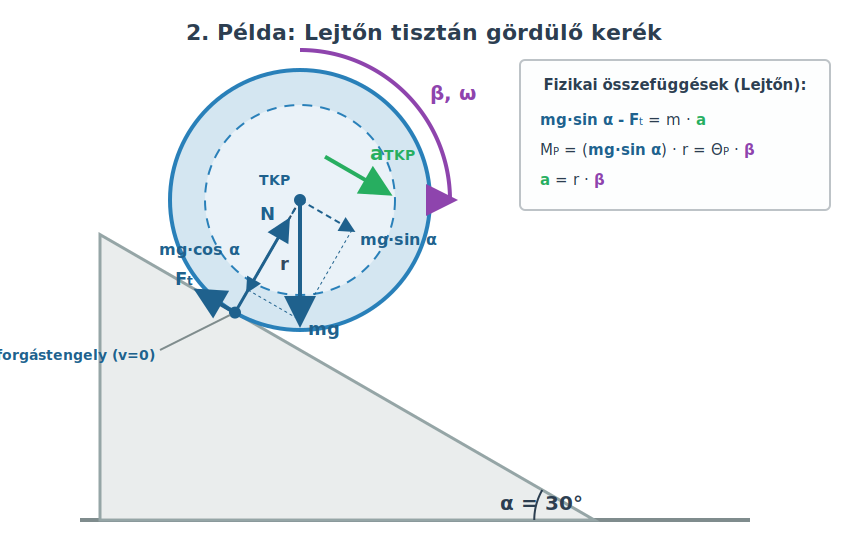

# Az energia megmaradasa forgomozgas eseten

## A tomegkozepponti tengely
Eddig lattuk, hogy a forgomozgas alapegyenlete alkalmazhato rogzitett tengely eseten, vagy a pillanatnyi forgastengely eseten is, amennyiben a tengely nem rogzitett.

Most azt fogjuk megmutatni, hogy a tomegkozepponton atmeno tengelyre is alkalmazhato. Bizonyitani ezt nem fogjuk, de nezzunk meg egy peldat!

### Pelda
Egy homogen gomb alaku golyo gordul le a $30\degree$ hajlasszogu lejton. A gomb tehetetlensegi nyomateka $\Theta_{TKP} = \frac {2} {5} mR^2$. Mekkora a gomb gyorsulasa?

Ezt a problemat mar megoldottuk a pillanatnyi forgastengely segitsegevel. Most oldjuk meg a tomegkozepponton atmeno tengely segitsegevel is!

A nyomatek most a tapadasi erobol fakad, hisz egyedul ennek a hatasvonala nem megy at a tomegkozepponti tengelyen.

$$
M_{z,e}^k = F_tr
$$

Az alapegyenlet tehat ekkor a kovetkezo.

$$
F_tr = \Theta_{TKP}\beta
$$

A tomegkozepponthoz kepest a lejtovel erintkezo pont sebessegenek nagysaga a kovetkezo.

$$
v = r\omega
$$

Igazandibol ennek a pontnak a sebessege az inerciarendszerben nulla, hiszen a tomegkozeppont halad ugyanekkora nagysagu, de ellentetes iranyu sebesseggel. Irhatjuk tehat, hogy 

$$
v_{TKP} = r \omega
$$

amibol a lejto iranyu gyorsulasra azt kapjuk, hogy

$$
a = a_{TKP} = r \beta
$$

Ez ismet csak igen fontos osszefugges.
A masodik torveny alakja most is ugyanaz.

$$
mgsin \alpha - F_t = ma
$$

Ebol kifejezve a tapadasi erot es beirva az alapegyenletbe, tovabba a szoggyorsulast az elozo osszefuggesbol kifejezve es beirva, megkapjuk a gyorsulasra vonatkozo egyenletet.

$$
F_t = mgsin \alpha - ma
$$

$$
r(mgsin \alpha - ma) = \Theta_{TKP} \frac {a} {r}
$$

$$
gsin \alpha - a = a \frac {\Theta_{TKP}} {mr^2}
$$

Innen fejezzuk ki $a$-t es meg is van az osszefugges, amit keresunk.

$$
gsin \alpha = a (1 + \frac {\Theta_{TKP}} {mr^2})
$$

$$
a = \frac {gsin \alpha} {1 + \frac {\Theta_{TKP}} {mr^2}}
$$

Ez pontosan az az osszefugges, melyet elozoleg a pillanatnyi forgastengely alkalmazasaval vezettunk le.
Ide beirhatjuk a gomb tehetetlensegi nyomatekat.

$$
\frac {\Theta_{TKP}} {mr^2} = \frac {2} {5}
$$

$$
a = \frac {gsin\alpha} {1 + 2/5} = \frac {5gsin\alpha} {7}
$$

Az adatokat behelyettesitve megkapjuk a gyorsulast.

$$
a = \frac {5 \cdot 9,81 \cdot sin(30\degree)} {7} = 3,504 \frac {m} {s^2}
$$

## A mechanikai energia megmaradasa
Forgomozgas eseten is igaz az, hogy a mechanikai energia megmaradhat. Ennek viszont fontos feltetele, hogy az osszes kulso es belso ero konzervativ legyen. A merev testekben hato belso erok konzervativak. Tehat ha nincs surlodas es csak egy merev test mozog, akkor a mechanikai energia megmarado mennyiseg. A mozgasi energia kiszamitasakor viszont figyelembe kell venni a forgast is! Itt is vagy a pillanatnyi forgastengely koruli forgassal dolgozunk, vagy a tomegkozeppont koruli forgas energiajahoz adjuk a halado mozgas energiajat, melyet ugy kepzelunk, mintha a test teljes tomege a tomegkozeppontba lenne egyesitve es ugy mozogna. 

### Pelda
A lejton legordulo gomb eseteben mutassuk meg, hogy a mechanikai energia allando!

$$
E = \frac {\Theta_{TKP}\omega^2} {2} + \frac {Mv_{TKP}^2} {2} + Mgh_{TKP} = allando
$$

Induljon a test mondjuk allo helyzetbol az egyszeruseg kedveert! Ekkor a gyorsulas:

$$
a_{TKP} = \frac {gsin \alpha} {1 + \frac {\Theta_{TKP}} {Mr^2}}
$$

A szoggyorsulas:

$$
\beta = \frac {a_{TKP}} {r}
$$

$$
v_{TKP} = a_{TKP}t
$$

$$
\omega = \beta t
$$

Tovabba:

$$
h_{TKP} = h_{TKP,0}- s sin \alpha
$$

ahol

$$
s = \frac {a_{TKP}} {2}t^2
$$

Helyettesitsuk ezeket be!

$$
E = \frac {1} {2} Mg^2sin^2 \alpha t^2 \frac {1} {(1 + \frac {\Theta_{TKP}} {Mr^2})^2} + \frac {1} {2} \Theta_{TKP} \frac {g^2sin^2\alpha t^2} {r^2(1 + \frac {\Theta_{TKP}} {Mr^2})^2} + Mgh_{TKP,0} - Mg\frac {gsin \alpha} {2(1 + \frac {\Theta_{TKP}} {Mr^2})}t^2sin \alpha
$$

Az elso ket tag osszevonhato.

$$
\frac {1} {2} Mg^2sin^2 \alpha t^2 \frac {1} {(1 + \frac {\Theta_{TKP}} {Mr^2})^2} + \frac {1} {2} \Theta_{TKP} \frac {g^2sin^2\alpha t^2} {r^2(1 + \frac {\Theta_{TKP}} {Mr^2})^2} = \frac {Mg^2sin^2 \alpha t^2} {2} \frac {1 + \frac {\Theta_{TKP}} {Mr^2}} {(1 + \frac {\Theta_{TKP}} {Mr^2})^2}
$$

Itt egyszerusites utan pont az utolso tag ellentettje all, tehat azt kapjuk, hogy

$$
E = Mgh_{TKP,0}
$$