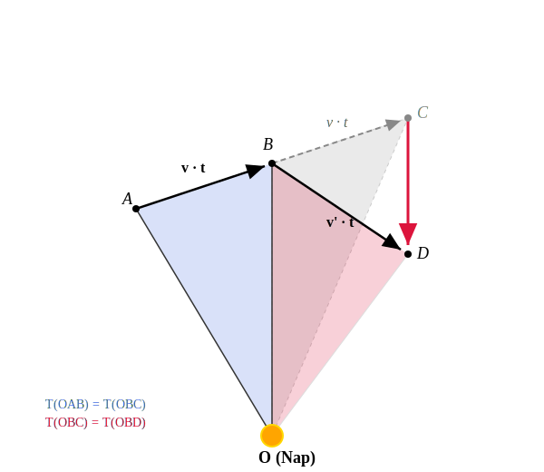

# A gravitáció törvénye

## Az első kozmikus sebesség

Gondoljuk el, hogy egy testet vízszintes irányban a földfelszín közelében kilövünk megfelelően nagy sebességgel. Gondolatban most hanyagoljuk el a légellenállást! Ekkor a test elegendően nagy sebesség esetén a Föld körüli körpályára állna.

Számítsuk ki ezt a sebességet:

$$
F_{\text{e}} = ma_{\text{cp}}
$$

$$
F_{\text{e}} = mg
$$

$$
mg = ma_{\text{cp}}
$$

$$
g = a_{\text{cp}}
$$

$$
g = \frac{v^2}{R}
$$

$$
v^2 = gR
$$

$$
v = \sqrt{gR} = \sqrt{9,81 \cdot 6,370 \cdot 10^6} \approx 7905\text{ m/s} = 7,905\text{ km/s}
$$

A számítás során felhasználtuk, hogy a Föld sugara $6370\text{ km}$. 

Ezt az elméletileg legkisebb sebességet, amellyel egy elhajított test a felszín közelében körpályára állítható, első kozmikus sebességnek nevezzük. A valóságban a légellenállás legyőzéséhez komoly meghajtás lenne szükséges a felszín közelében, de néhány száz kilométer magasságban már nem. Itt a levegő olyan ritka, hogy a testek körpályára állíthatók a Föld körül, ha megfelelő sebességre gyorsítjuk fel őket. Ha a test elérte ezt a sebességet, további meghajtás szinte nem is szükséges.

## A gravitáció távolságfüggése

A fenti számítást Newton is elvégezte. Arra volt kíváncsi, vajon hogyan csökken a testet körpályán tartó nehézségi erő a magassággal. Arra gondolt, hogy a Holdat is ugyanaz az erő tartja körpályán, ami a testeket a Föld középpontja felé vonzza. Milyen arányban csökken az erő a távolsággal?

Newton tudta, hogy a Hold a Földtől körülbelül 60 Föld-sugárnyi távolságra van ($384\ 400\text{ km}$). Ki tudjuk számítani a Hold gyorsulását, hiszen keringési ideje $T = 27,3\text{ nap}$.

$$
v = \frac{2\pi r}{T} = \frac{2 \cdot 3,1415 \cdot 384\ 400\ 000}{27,3 \cdot 86400} \approx 1024\text{ m/s}
$$

$$
a_{\text{cp}} = \frac{v^2}{r} = \frac{1024^2}{384\ 400\ 000} \approx 0,002728\text{ m/s}^2
$$

$$
\frac{g}{a_{\text{cp}}} = \frac{9,81}{0,002728} \approx 3596
$$

Látszik, hogy a számolási pontosságunkon belül jó közelítéssel 3600-at kapunk ($60^2 = 3600$). Newton tehát azt kapta, hogy:

$$
\frac{g}{a_{\text{cp}}} = \frac{r^2}{R^2}
$$

$$
a_{\text{cp}} = \frac{gR^2}{r^2}
$$

Tehát a testek nehézségi gyorsulása a Föld középpontjától vett $r$ távolság négyzetével fordított arányban csökken. Ez nyilván a testekre ható erőre is érvényes. Így született meg a gravitációs erő törvénye.

## A gravitáció törvénye

> **Bármely két test között gravitációs vonzóerő lép fel. Ez pontszerű testek között egyenesen arányos a testek tömegével, és fordítottan arányos a távolságuk négyzetével. Az erő a pontszerű testeket összekötő egyenes mentén hat, és mindig vonzóerő.**

$$
F_{\text{g}} = G \frac{m_1 m_2}{r^2}
$$

Newton a gravitáció törvényéből sikeresen le tudta vezetni mindhárom Kepler-törvényt a bolygók mozgására. Sajnos az ellipszispályák általános levezetése magasabb matematikai ismereteket igényel, úgyhogy ezt mi nem fogjuk megtenni. Tanulságos viszont a második és a harmadik törvény levezetése. A harmadik törvényet mi itt csak körpályák esetére fogjuk levezetni.

## Kepler második törvényének levezetése

A test mozgását figyeljük nagyon rövid $t$ időtartamokon keresztül, tehát $t \ll T$. Kezdetben a test az $A$ pontból a $B$ pontba jut egyenes vonalban az igen rövid $t$ idő alatt. Ha erő nem hatna rá, akkor újabb $t$ idő elteltével a $C$ pontba jutna az egyenes mentén tovább mozogva egyenletes sebességgel.

$$
\overline{AB} = \overline{BC}
$$

Legyen a Nap az $O$ pontban! Ekkor az $OAB$ háromszög és az $OBC$ háromszög területe egyenlő, hiszen a magasságaik és a rájuk merőleges alapjaik is egyenlők.

$$
T_{OAB} = T_{OBC}
$$

Mivel a testre a Nap felé mutató erő hat, ezért a valóságban nem a $C$, hanem a $D$ pontba jut. A $\overline{CD}$ szakasz párhuzamos az $\overline{OB}$ szakasszal, mivel a sebességváltozást okozó erő a Nap felé mutat. Ekkor viszont az $OBC$ és $OBD$ háromszögek területei is egyenlők, hiszen az alapjuk az $\overline{OB}$ közös szakasz, és a hozzá tartozó magasságaik is egyenlők (a párhuzamosság miatt). Ez azt jelenti, hogy:

$$
T_{OAB} = T_{OBD}
$$

Mivel $t$ tetszőleges, bár kicsiny időtartam, ez azt jelenti, hogy a területi sebesség állandó.

## Kepler harmadik törvénye körpályák esetére

Legyen $M$ a Nap tömege. Ekkor a gyorsulás egy körpályán mozgó bolygó esetén:

$$
a_{\text{cp}} = \frac{F_{\text{e}}}{m} = \frac{F_{\text{g}}}{m} = \frac{G \frac{mM}{r^2}}{m} = \frac{GM}{r^2}
$$

A centripetális gyorsulás körpálya esetén:

$$
a_{\text{cp}} = \frac{v^2}{r} = \frac{(\frac{2\pi r}{T})^2}{r} = \frac{4\pi^2 r^2}{T^2 r} = \frac{4\pi^2 r}{T^2}
$$

A két kifejezést egyenlővé téve:

$$
\frac{GM}{r^2} = \frac{4\pi^2 r}{T^2}
$$

$$
\frac{GM}{4\pi^2} = \frac{r^3}{T^2}
$$

Tehát a Naptól mért középtávolság köbének és a keringési idő négyzetének hányadosa csak a Nap $M$ tömegétől függő állandó. 

Bár levezetésünk csak körpályák esetére adja vissza a törvényt, a törvény igaz ellipszispályák esetére is. Ilyenkor az $r$ sugár helyére az $a$ kerül, amely a nagytengely hosszának fele. Ez körpályák esetére nem más, mint a sugár.
