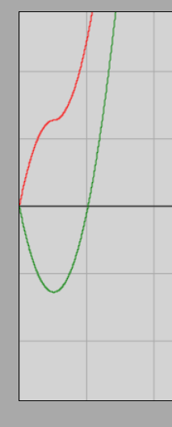

# Hajítások

## Vektor-komponensek

Láttuk, hogy az olyan fizikai mennyiségek, mint a sebesség vagy a gyorsulás, vektormennyiségek, amelyeknek a nagyságukon kívül jól meghatározott irányuk is van. A vektorok geometriai úton pontosan úgy adódnak össze, mint az egymást követő elmozdulások.

Ha a mozgást egy koordináta-rendszerben vizsgáljuk, akkor a pontok helyzete a síkban két koordinátával adható meg. A térben már három koordinátatengely szükséges, így ott a pontok pozícióját is három koordináta határozza meg.

Egy vektor a koordináta-rendszeren belül önmagával párhuzamosan bárhová eltolható, az ilyen párhuzamos eltolás nem változtatja meg magát a vektort. Ha a vektor kezdőpontját a koordináta-rendszer origójába (kezdőpontjába) toljuk, akkor a vektor végpontja – a dimenziószámtól függően – két vagy három koordinátával egyértelműen megadható. Az egyszerűség kedvéért egyelőre csak síkbeli vektorokkal fogunk foglalkozni.

[Vektor-koordináták interaktív szemléltetése (GeoGebra)](https://www.geogebra.org/calculator/unkrfvjp)

A vektorok koordinátás jelölése a következő alakú:

$$
\vec{a} = (a_x,\ a_y)
$$

Itt $a_x$ és $a_y$ az $\vec{a}$ vektor koordinátái. Ezek az értékek kizárólag a választott koordináta-rendszerrel együtt határozzák meg a vektort. Ha elforgatjuk a koordináta-rendszert, a vektor koordinátái is megváltoznak. A továbbiakban a rögzített koordináta-rendszert nem fogjuk elmozdítani.

Minden $\vec{a}$ vektor felbontható két olyan vektor összegére, amelyek a koordinátatengelyekkel párhuzamosak. Ezeket nevezzük **vektor-komponenseknek**. Az $x$-tengellyel párhuzamos komponens az $x$-komponens, melynek hossza $|a_x|$, az $y$-tengellyel párhuzamos pedig az $y$-komponens, melynek hossza $|a_y|$.

## A megtett út és az elmozdulásvektor

Vizsgáljunk egy tetszőleges mozgást, amelynek során egy pontszerűnek tekinthető test elmozdul a kezdőpontból a végpontba! A kezdőpontból közvetlenül a végpontba mutató vektort **elmozdulásvektornak** nevezzük, ez vektormennyiség. A kezdőpontot a végponttal összekötő valóságos pálya szakaszának hosszát pedig **megtett útnak** nevezzük. 

Mikor egyezik meg az elmozdulásvektor hossza a megtett úttal? Ez kizárólag olyan egyenes vonalú mozgásoknál fordulhat elő, amelyek során a mozgó test mindvégig egyetlen irányba halad, azaz nem vált mozgásirányt. Eddigi tanulmányaink során pontosan ilyen esetekkel foglalkoztunk.

A továbbiakban találkozunk olyan esetekkel is, amikor a mozgás pályája nem egyenes vonalú (görbe vonalú), vagy egyenes vonalú ugyan, de a test mozgásiránya megfordul a folyamat közben. Fontos megjegyezni, hogy a megtett út kiszámítására a sebesség-idő grafikon alatti terület szabálya ilyenkor is érvényes marad, amennyiben a sebesség *nagyságát* ábrázoljuk, ami soha nem lehet negatív.

Ábrázolhatjuk azonban a sebességvektor valamelyik koordinátáját is az idő függvényében. Ilyenkor ez a sebességkoordináta felvehet negatív értéket is, amennyiben a sebesség adott komponense a koordinátatengely pozitív irányával ellentétesen mutat. Ha a sebességkoordináta negatívvá válik, akkor a grafikon görbéje alatti (vagy feletti) területet is negatív előjellel kell számításba vennünk. A sebességkoordináta-idő függvény görbéje alatti teljes terület, amelyet így előjelesen (szummázva) számítunk ki, nem a megtett utat, hanem az **elmozdulás megfelelő koordinátáját** adja meg.

Látni fogjuk, hogy a korábban levezetett kinematikai összefüggéseink mind érvényben maradnak, csupán a megtett út ($s$) helyébe az elmozdulás-koordináták lépnek, és a többi vektormennyiség helyett is azok megfelelő előjeles koordinátáit kell behelyettesítenünk. Ezzel a módszerrel tetszőleges, összetett egyenletesen változó mozgás – például a különféle hajítások – is könnyen kiszámíthatóvá válik.

## Függőleges hajítás

Dobjunk fel egy labdát egy bizonyos $v_0$ kezdősebességgel! A labda induljon a koordináta-rendszer origójából. Az $x$-tengely legyen vízszintes és mutasson balról jobbra, az $y$-tengely pedig mutasson függőlegesen felfelé.

A feldobott labda függőlegesen emelkedik, majd egy pillanatra a sebessége nullává válik, de azonnal megindul lefelé, és egyre gyorsulva esik vissza ugyanazon a függőleges pályán. Mivel a labda végig az $y$-tengely mentén mozog, az $x$-koordinátája a mozgás során végig nulla marad ($x = 0$). Írjuk fel az $y$-koordináta időbeli változását úgy, hogy a megtett út helyére az elmozdulás $y$-koordinátáját helyettesítjük, és a gyorsulás, valamint a sebesség helyett is azok előjeles $y$-komponenseit szerepeltetjük!

A szabadon, elhanyagolható légellenállás mellett végbemenő mozgás során a gyorsulás mindvégig állandó, függőlegesen lefelé mutat, nagysága pedig a $g$ nehézségi gyorsulás. Mivel a tengelyünk felfelé mutat, a gyorsulásvektor komponensei:

$$
\vec{a} = (a_x,\ a_y) = (0,\ -g)
$$

A kezdősebesség-vektor függőlegesen felfelé mutat, így a komponensei:

$$
\vec{v}_0 = (v_{0x},\ v_{0y}) = (0,\ v_0)
$$

Az elmozdulás $y$-koordinátája az origóból indulva ($y_0 = 0$):

$$
\Delta y = y - y_0 = y - 0 = y
$$

Idézzük fel a négyzetes úttörvényt egyenletesen változó mozgásra:

$$
s = v_0 \cdot t + \frac {a} {2} \cdot t^2
$$

Helyettesítsük be a vektorok megfelelő $y$-komponenseit és az $y$-irányú elmozdulást a képletbe:

$$
\Delta y = v_{0y} \cdot t + \frac {a_y} {2} \cdot t^2
$$

$$
y = v_0 \cdot t - \frac {g} {2} \cdot t^2
$$

### Szimuláció

[Függőleges hajítás interaktív szimulátor](https://alexerdei73.github.io/physics-engine/project/#92e788c7-ec41-4a65-9505-a3fc8c1ad904)

Futtassuk a szimulációt, majd helyezzük a testet a koordináta-rendszer kezdőpontjába, és ábrázoljuk a megtett utat (**path length**) és az $y$-koordinátát az idő függvényében!

> **Módszertani tipp:** Amennyiben ki vagyunk jelentkezve, vagy nem rendelkezünk felhasználói fiókkal, a szimulátorban elvégzett módosítások csak ideiglenesen, a saját számítógépünkön rögzülnek. Amint bejelentkezünk a fiókunkba, ezek az ideiglenes beállítások alaphelyzetbe állnak, és visszakapjuk a projekt készítője által megadott eredeti értékeket.

A szimulációból kapott grafikon képe:

A piros görbe a megtett utat ($s$), a zöld görbe pedig az $y$-koordinátát mutatja. Vegyük figyelembe, hogy a szimuláció belsőleg fordított irányú $y$-tengelyt használ, mint a mi elméleti levezetésünk, így a zöld görbét gondolatban tükröznünk kell a vízszintes időtengelyre. Ha ezt megtesszük, látható, hogy az emelkedési szakaszban a zöld és a piros vonal tökéletesen fedi egymást, majd amint a mozgásirány a tetőponton megfordul, a két görbe látványosan szétválik – pontosan úgy, ahogy elméletben megjósoltuk.

### Példák

1. Egy labdát függőlegesen felfelé feldobunk $20{,}0\text{ }\frac{\text{m}}{\text{s}}$ kezdősebességgel. A légellenállás elhanyagolható, a nehézségi gyorsulás értéke $9{,}81\text{ }\frac{\text{m}}{\text{s}^2}$. Milyen magasra emelkedik a labda, és mennyi idő múlva érkezik vissza a kiindulási pontba (a kezünkbe)?

A pályaudvar legfelső pontján a test pillanatnyi sebessége nullára csökken ($v = 0$). Írjuk fel a gyorsuláskomponens összefüggését az emelkedési idő ($t$) meghatározására, az ismeretlent $x$-szel jelölve:

$$
-g = \frac {0 - v_0} {t}
$$

$$
-9{,}81 = \frac {-20{,}0} {x}
$$

$$
-9{,}81 \cdot x = -20{,}0
$$

$$
x = \frac {-20{,}0} {-9{,}81} \approx 2{,}039
$$

Az emelkedés időtartama három értékes jegyre kerekítve $2{,}04\text{ s}$. Sejtjük, hogy a teljes visszaérkezési idő ennek pontosan a duplája lesz, mivel a légellenállás hiányában az esés és az emelkedés szimmetrikus. Számítsuk ki ezt az elmozdulás képletéből is, hiszen visszaérkezéskor a test elmozdulása nullává válik ($y = 0$):

$$
y = v_0 \cdot t - \frac {g} {2} \cdot t^2
$$

$$
0 = 20{,}0 \cdot x - \frac {9{,}81} {2} \cdot x^2
$$

$$
0 = x \cdot (20{,}0 - 4{,}905 \cdot x)
$$

Kiemelve az $x$-et, a szorzat két esetben lehet nulla. Az $x = 0\text{ s}$ megoldás a feldobás kezdőpillanatára utal, ami most számunkra nem érdekes. A keresett időpontot a zárójeles kifejezés megadja:

$$
20{,}0 - 4{,}905 \cdot x = 0
$$

$$
20{,}0 = 4{,}905 \cdot x
$$

$$
x \approx 4{,}077
$$

A teljes visszaérkezési idő három értékes jegyre kerekítve valóban $4{,}08\text{ s}$, ami hajszálpontosan az emelkedési idő kétszerese. Ez igazolja, hogy az emelkedési és a lefelé zuhanási szakaszok időtartama megegyezik.

2. Egy függőleges falú gödör $10{,}0\text{ m}$ mély. A gödör szélén állva függőlegesen felfelé feldobunk egy labdát $10{,}0\text{ }\frac{\text{m}}{\text{s}}$ kezdősebességgel. Mennyi idő múlva csapódik be a labda a gödör aljára, és mekkora lesz a becsapódási sebessége? A légellenállás elhanyagolható, a nehézségi gyorsulás $9{,}81\text{ }\frac{\text{m}}{\text{s}^2}$.

Mivel a gödör alja a feldobási pont (origó) alatt helyezkedik el $10{,}0\text{ méterrel}$, a becsapódás helyén a test koordinátája $y = -10{,}0\text{ m}$ lesz. Írjuk fel a helykoordináta egyenletét, az ismeretlen időt $x$-szel jelölve:

$$
y = v_0 \cdot t - \frac {g} {2} \cdot t^2
$$

$$
-10{,}0 = 10{,}0 \cdot x - \frac {9{,}81} {2} \cdot x^2
$$

$$
-10{,}0 = 10{,}0 \cdot x - 4{,}905 \cdot x^2
$$

Rendezve a másodfokú egyenletet:

$$
4{,}905 \cdot x^2 - 10{,}0 \cdot x - 10{,}0 = 0
$$

Alkalmazzuk a másodfokú egyenlet megoldóképletét:

$$
x_{1,2} = \frac {-b \pm \sqrt {b^2 - 4ac}} {2a} = \frac {10{,}0 \pm \sqrt{(-10{,}0)^2 - 4 \cdot 4{,}905 \cdot (-10{,}0)}} {2 \cdot 4{,}905} = \frac {10{,}0 \pm \sqrt{100 + 196{,}2}} {9{,}81}
$$

$$
x_{1,2} = \frac {10{,}0 \pm 17{,}21} {9{,}81} \implies x_1 \approx 2{,}774;\ \ x_2 \approx -0{,}735
$$

Mivel az eltelt idő fizikailag csak pozitív lehet, a helyes érték $t = 2{,}77\text{ s}$. A labda ennyi idő múlva éri el a gödör alját. Számítsuk ki a becsapódás pillanatnyi sebességét ($v_y$), az ismeretlent $x$-szel jelölve:

$$
-g = \frac {v_y - v_0} {t}
$$

$$
-9{,}81 = \frac {x - 10{,}0} {2{,}774}
$$

$$
x - 10{,}0 = -27{,}21
$$

$$
x = -17{,}21
$$

A becsapódási sebesség nagysága három értékes jegyre kerekítve $17{,}2\text{ }\frac{\text{m}}{\text{s}}$. A kapott negatív előjel arra utal, hogy a $v_y$ sebességkomponens iránya a felfelé mutató $y$-tengellyel ellentétes, vagyis a test a becsapódás pillanatában éppen lefelé mozog, ahogyan az a valóságban is történik.

## Feladatok

1. Egy labdát függőlegesen felfelé dobunk $15{,}0\text{ }\frac{\text{m}}{\text{s}}$ kezdősebességgel. Milyen magasra emelkedik a labda? Mennyi idő alatt éri el a maximális magasságot? A légellenállás elhanyagolható, a nehézségi gyorsulás $9{,}81\text{ }\frac{\text{m}}{\text{s}^2}$.

2. Egy labdát függőlegesen felfelé dobunk, és $5{,}0\text{ másodperc}$ múlva visszaérkezik a kezünkbe. Mekkora volt a kezdősebesség? A nehézségi gyorsulás $9{,}81\text{ }\frac{\text{m}}{\text{s}^2}$.

3. Egy labdát függőlegesen felfelé dobunk $12{,}0\text{ }\frac{\text{m}}{\text{s}}$ sebességgel. Mennyi idő alatt éri el a $10{,}0\text{ m}$ magasságot az emelkedés során? A nehézségi gyorsulás $9{,}81\text{ }\frac{\text{m}}{\text{s}^2}$.

4. Egy labdát függőlegesen felfelé dobunk, és $3{,}0\text{ másodperc}$ után sebessége $5{,}0\text{ }\frac{\text{m}}{\text{s}}$ felfelé. Mekkora volt a kezdősebesség? A nehézségi gyorsulás $9{,}81\text{ }\frac{\text{m}}{\text{s}^2}$.

5. Egy labdát függőlegesen felfelé dobunk $18{,}0\text{ }\frac{\text{m}}{\text{s}}$ sebességgel. Mennyi idő alatt éri el a $15{,}0\text{ m}$ magasságot? A nehézségi gyorsulás $9{,}81\text{ }\frac{\text{m}}{\text{s}^2}$.
