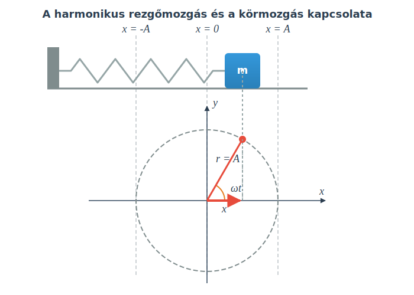

# A harmonikus rezgőmozgás

## Kísérlet

[Kapcsolat az egyenletes körmozgás és a harmonikus rezgőmozgás között](https://www.youtube.com/watch?v=ZlleypTKfGY)

## Szimuláció

[Kapcsolat az egyenletes körmozgás és a harmonikus rezgőmozgás között](https://alexerdei73.github.io/physics-engine/project/#7af99d9a-bc17-46b4-be37-20cbcb802374)

## A harmonikus rezgőmozgás fogalma

Egy rugóra akasztott test harmonikus rezgőmozgást végez, és amint a kísérletből és a szimulációból is láthatjuk, ez szoros kapcsolatban van az egyenletes körmozgással. A testeket megfelelően indítva a mozgásuk szinkronban marad, mégpedig úgy, hogy az egyenletes körmozgást végző test egyik koordinátája (pl. az x-koordináta) megegyezik az egyenes vonalban, az x-tengellyel párhuzamosan harmonikus rezgőmozgást végző test x-koordinátájával.

$$
x = A\cos(\omega t)
$$

A matematikából tudjuk, hogy a pont koordinátái derékszögű koordináta-rendszerben a következők:

$$
x = r\cos \phi
$$

$$
y = r\sin \phi
$$

Itt $r$ a távolság az origótól, $\phi$ pedig a forgásszög a pozitív x-tengelytől mérve. A forgásszög a körmozgás esetén $\omega t$, a kör $r$ sugarát pedig itt $A$-val jelöltük és amplitúdónak nevezzük. $x$ neve kitérés, az amplitúdó pedig a maximális kitérést jelenti, hisz a koszinuszfüggvény legnagyobb értéke 1. $\omega$ elnevezése szögsebesség helyett most körfrekvencia, és továbbra is érvényes az eddigi összefüggés:

$$
\omega = \frac {2\pi} {T} = 2\pi f
$$

Itt a $T$ periódusidő reciproka az $f$ frekvencia.

$$
f = \frac {1} {T}
$$

A frekvencia egysége $\frac {1} {s}$, ezt hertznek is nevezik, jele: Hz. A körmozgásnál a periódusidő reciprokát fordulatszámnak nevezik és $n$-nel jelölik.

## Fontos fogalmak

> **Kitérés ($x$):** A rezgő test előjeles távolsága az egyensúlyi helyzetétől.

> **Amplitúdó ($A$):** A maximális kitérés neve.

> **Frekvencia ($f$):** Az egységnyi idő ($1\text{ s}$) alatt megtett rezgések száma. Egysége a hertz (Hz). $1\text{ Hz} = \frac {1} {s}$

> **Periódusidő ($T$):** Egy teljes rezgés megtételéhez szükséges idő. A frekvencia reciproka.

> **Körfrekvencia ($\omega$):** A frekvencia $2\pi$-szerese.

> **Fázis ($\phi$):** A szögelfordulás a rezgőmozgással szinkronban mozgó, egyenletes körmozgást végző képzeletbeli test esetén. $\phi = \omega t$

> **Harmonikus rezgőmozgás:** Olyan mozgás, melynél az egyenes mentén mozgó test kitérése egy vele szinkronban egyenletes körmozgást végző valós vagy képzeletbeli test x-koordinátájával egyenlő minden pillanatban. A kitérés szinusz- vagy koszinuszfüggvénnyel írható le az idő függvényében.

## Példa
Egy rugóra akasztott test harmonikus rezgőmozgást végez. A mozgás amplitúdója $0,2\text{ m}$. A frekvencia $2\text{ Hz}$.
- Mekkora a periódusidő?
- Mekkora a körfrekvencia?
- Írjuk fel a kitérést az idő függvényében megadó egyenletet, ha $t=0$ esetén a kitérés maximális!
- Számítsuk ki a kitérést $t=0,150\text{ s}$-kor!

$$
T = \frac {1} {f} = \frac {1} {2} = 0,5\text{ s}
$$

$$
\omega = 2\pi f = 2 \cdot \pi \cdot 2 \approx 12,566 \frac {1} {s}
$$

$$
x = A \cos (\omega t) = 0,2 \cdot \cos (12,566 \cdot t)
$$

$$
x = 0,2 \cdot \cos (12,566 \cdot 0,15) = -0,0618\text{ m}
$$

> **Tipp:** A megoldásnál ügyelni kell, hogy a szöget radiánban mérjük, tehát a számológépünket radián (RAD) módba kell kapcsolni!

## Feladatok
1. Egy harmonikus rezgőmozgást végző pontszerű test amplitúdója $5\text{ cm}$, periódusideje pedig $0,4\text{ s}$. 
*   a) Határozd meg a test rezgésének frekvenciáját és körfrekvenciáját!
*   b) Írd fel a kitérés-idő függvényt, feltételezve, hogy a test a $t=0$ pillanatban maximális pozitív kitérésű helyzetben van!

2. Egy test kitérés-idő függvénye a következőképpen alakul: $x(t) = 0,15 \cdot \cos(10\pi \cdot t)$, ahol a kitérést méterben, az időt másodpercben mérjük. 
*   a) Olvasd le és számítsd ki a mozgás amplitúdóját, körfrekvenciáját, frekvenciáját és periódusidejét!
*   b) Milyen messze van a test az egyensúlyi helyzetétől a $t = 0,05\text{ s}$ pillanatban?

3. Egy rugón lógó test harmonikus rezgőmozgást végez $A = 8\text{ cm}$-es amplitúdóval. A mozgását az $x = A \cos(\omega t)$ összefüggés írja le. 
*   Mekkora a kitérése a testnek abban a pillanatban, amikor a mozgást leíró fázisszög ($\phi = \omega t$) értéke éppen $\frac{\pi}{3}$ radián? Válaszodat cm-ben add meg!