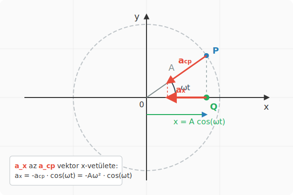

# Hooke törvénye

## A harmonikus rezgőmozgás gyorsulása

Most a harmonikus rezgőmozgást végző test gyorsulására vagyunk kíváncsiak. Ezt felsőbb matematikai ismeretek nélkül pontosan úgy határozhatjuk meg, mint ahogy a sebességnél tettük. A test kitérése legyen a szokásos:

$$
x = A\cos(\omega t)
$$

A test az x-tengellyel párhuzamos egyenes mentén mozog, és a gyorsulást nem könnyű meghatározni, mivel a sebesség folyamatosan változik, akárcsak maga a gyorsulás is. Szerencsére, mivel a test szinkronban mozog egy megfelelő egyenletes körmozgást végző testtel, amelynek gyorsulását minden pillanatban ismerjük, a test gyorsulása mégis meghatározható. Ez nyilván megegyezik a körmozgást végző test gyorsulásának x-komponensével. Ez pontosan úgy látható be, ahogy az előző leckében tettük a sebességgel:

$$
\overline{a}_x = \frac{v_x - v_{x,0}}{t}
$$

Ez az összefüggés az átlaggyorsulásra tetszőleges $t$ időtartamra fennáll. Bár az átlaggyorsulás nem egyezik meg szükségszerűen a pillanatnyi gyorsulással, ezek mérési pontosságon belül egyenlőkké válnak, ha a $t$ időtartamot elegendően rövidre választjuk. Tehát a $t \to 0$ esetben a pillanatnyi gyorsulást kapjuk, amely megegyezik a körmozgást végző test gyorsulásának x-komponensével, hisz ez az egyezés igaz a $v_x$ sebességkomponensre is.

Az egyenletes körmozgást végző test gyorsulásának nagysága $a = \frac{v^2}{r} = r\omega^2$. Itt alkalmazzuk az $r = A$ összefüggést, és így kapjuk az x-komponensre a következő összefüggést:

$$
a_x = -A\omega^2\cos(\omega t)
$$

### Példa
A harmonikus rezgőmozgást végző test kitérés-idő függvénye a következő:

$$
x = 0,2\cos(4\pi t)
$$

Itt $x$ m-ben értendő, $t$ pedig s-ban. Határozzuk meg a következő mennyiségeket!
* Amplitúdó
* Körfrekvencia
* Gyorsulás az idő függvényében
* Gyorsulás értéke $t = 0,1$ s-kor
* A gyorsulás maximális értéke

A kitérés-idő függvényből leolvashatók a következő adatok:

$$
A = 0,2\text{ m}
$$

$$
\omega = 4\pi \text{ rad/s}
$$

Ez alapján felírhatjuk az $a_x$ értékét a $t$ idő függvényében:

$$
a_x = -A\omega^2 \cos(\omega t) = -0,2 \cdot (4\pi)^2 \cos (4\pi t) = -31,58\cos(12,566 t)
$$

*(Megjegyzés: A gyorsulás előjele az egyenletben negatív, bár a nagyságát tekintve gyakran az abszolút értékkel számolunk. A maximális érték meghatározásához az amplitúdót vesszük.)*

Innen kiszámítható a gyorsulás a $t = 0,1$ s időpontban, illetve leolvasható a gyorsulás maximális értéke is:

$$
a_x = -31,58\cos(12,566 \cdot 0,1) = -9,760\text{ m/s}^2
$$

$$
a_{x,max} = 31,58\text{ m/s}^2
$$

## A harmonikus rezgőmozgás dinamikai feltétele

A kitérés behelyettesíthető a gyorsulás kiszámításának képletébe, és ekkor a következő egyenletre jutunk:

$$
a_x = -\omega^2A\cos(\omega t) = -\omega^2x
$$

A harmonikus rezgőmozgás gyorsulása a kitéréssel arányos, de ellentétes irányú. Az arányossági tényező a körfrekvencia négyzete.
Ez azt jelenti, hogy Newton második törvénye alapján az eredő erő is arányos a kitéréssel és ellentétes irányú:

$$
F_{x,e} = ma_x = -m\omega^2x
$$

>**A harmonikus rezgőmozgás dinamikai feltétele a kitéréssel egyenesen arányos, de azzal ellentétes irányú erő, amely az egyensúlyi helyzet felé húzza vissza a testet.**

## Hooke törvénye

>**A rugalmas erő a megnyúlással egyenesen arányos, de azzal ellentétes irányú. Az arányossági tényező a rugóállandó. Ennek jele $D$, egysége N/m.**

$$
F_x = -Dx
$$

### Kísérlet

[Hooke törvényének demonstrációja Walter Lewin által](https://www.youtube.com/shorts/PaIE7eTPzJA)

### Szimuláció

[A súly](https://alexerdei73.github.io/physics-engine/project/#38c6b933-5bd4-42f2-a59e-1390633a14a3)

A szimuláció is alkalmas Hooke törvényének demonstrálására. Lépjünk ki az appból, ha be vagyunk jelentkezve, majd a **Create** menüben módosíthatjuk a 3-as test tömegét a kétszeresére. Ne felejtsük el a **Save** gombot megnyomni! Ekkor a szimulációt a **Project** menüben a **Start** gombbal újraindítva a test a rugón harmonikus rezgésbe kezd, amelynek egyensúlyi helyzete az $y = 3$ m-nél lesz. Ha átállítjuk a 3-as test kezdeti y-pozícióját is 3 m-re, akkor rezgés nem alakul ki, a test egyensúlyban marad. Ha a tömeget nem kétszeresére, hanem háromszorosára növeljük, az egyensúlyi helyzet is $y = 4$ m lesz, és így tovább.

## A rezgőmozgás periódusideje

A rezgőmozgás dinamikai feltételébe beírjuk a rugalmas erő Hooke-törvényét:

$$
F_x = -m\omega^2x = -Dx
$$

$$
m\omega^2 = D
$$

$$
\omega^2 = \frac{D}{m}
$$

Most felhasználjuk az $\omega = \frac{2\pi}{T}$ összefüggést:

$$
\left(\frac{2\pi}{T}\right)^2 = \frac{D}{m}
$$

Vegyük mindkét oldal reciprokát!

$$
\left(\frac{T}{2\pi}\right)^2 = \frac{m}{D}
$$

Vonjunk gyököt!

$$
\frac{T}{2\pi} = \sqrt{\frac{m}{D}}
$$

Végül szorozzunk $2\pi$-vel:

$$
T = 2\pi \sqrt{\frac{m}{D}}
$$

### Példa
Egy elhanyagolható tömegű rugóra $100$ g tömegű testet akasztottak. A rugó másik vége rögzített úgy, hogy a test függőlegesen rezeghet. A testet felemelik az egyensúlyi helyzettől akkora magasságba, hogy a rugó épp nyújtatlan legyen, majd elengedik. A rugóállandó $100$ N/m.
* Mekkora a kialakuló rezgés amplitúdója?
* Mekkora a körfrekvencia?
* Mekkora a periódusidő?
* Írjuk fel a kitérés-idő függvényt, ha az x-tengely függőlegesen felfelé mutat és az origó az egyensúlyi helyzetben van!
* Mikor halad át először a test az egyensúlyi helyzeten az elengedés után?
* Mekkora a sebessége áthaladáskor? 

Egyensúlyban a nehézségi erő kiegyenlíti a rugóerőt:

$$
-mg + (-Dx) = 0
$$

$$
-0,1 \cdot 9,81 - 100x = 0
$$

$$
-0,981 = 100x
$$

$$
x = -0,00981\text{ m}
$$

A rugó megnyúlása tehát kb. $1$ cm egyensúlyban. A továbbiakban az origót az egyensúlyi helyzetbe helyezzük, tehát $x = 0$ lesz egyensúlyban, és $0,00981$ m az a pont, ahonnan a rezgést indítjuk.

$$
A = 0,00981\text{ m}
$$

$$
\omega = \sqrt{\frac{D}{m}} = \sqrt{\frac{100}{0,1}} = 31,62\text{ rad/s}
$$

$$
\omega = \frac{2\pi}{T}
$$

$$
T = \frac{2\pi}{\omega} = \frac{6,283}{31,62} = 0,1987\text{ s}
$$

A kitérés-idő függvény könnyen felírható, hisz a test az $x = +A$ pozícióból indul:

$$
x = A\cos(\omega t) = 0,00981\cos(31,62t)
$$

A test az egyensúlyi helyzeten akkor halad át, amikor $x = 0$, tehát:

$$
0 = 0,00981\cos(31,62t)
$$

Innen azt kapjuk, hogy (amikor a koszinusz argumentuma $\pi/2 \approx 1,571$):

$$
1,571 = 31,62t
$$

$$
t = \frac{1,571}{31,62} = 0,04968\text{ s} = \frac{T}{4}
$$

Tehát a test az első negyed periódus megtételekor halad át először az origón, vagyis az egyensúlyi helyzeten. Ekkor sebessége:

$$
v_x = -A\omega \sin(\omega t) = -0,00981 \cdot 31,62 \sin(31,62 \cdot 0,04968) = -0,3102\text{ m/s}
$$

Az egyensúlyi helyzeten való áthaladáskor a sebesség maximális, hisz a szinuszfüggvény értéke $1$ vagy $-1$. Az első áthaladáskor a szinuszfüggvény értéke $+1$, így a sebesség negatív irányú.

---

## Feladatok

1. Egy függőlegesen rögzített, elhanyagolható tömegű rugóra egy $400\text{ g}$ tömegű súlyt akasztunk. Ennek hatására a rugó $8\text{ cm}$-t nyúlik meg, mielőtt eléri az új egyensúlyi helyzetét. Határozd meg a rugóállandót! ($g = 9,81\text{ m/s}^2$)

2. Egy $D = 150\text{ N/m}$ rugóállandójú vízszintes rugóra egy $0,6\text{ kg}$ tömegű kiskocsit rögzítünk. A súrlódás elhanyagolható. A rendszert kitérítjük egyensúlyi helyzetéből, majd elengedjük. Számítsd ki a kialakuló rezgőmozgás körfrekvenciáját és periódusidejét!

3. Egy harmonikus rezgőmozgást végző test kitérés-idő függvénye: $x(t) = 0,05\cos(10\pi t)$ (ahol az $x$-et méterben, a $t$-t másodpercben mérjük). Határozd meg a test maximális sebességét és maximális gyorsulását!

4. Egy rugón függő test periódusideje $1,2\text{ s}$. Mekkora lesz a rezgés periódusideje, ha az eredeti testet levesszük, és egy négyszer akkora tömegű testet akasztunk a rugóra?

5. Egy harmonikus rezgőmozgást végző $0,5\text{ kg}$ tömegű test amplitúdója $12\text{ cm}$, a rezgés frekvenciája pedig $2\text{ Hz}$. Mekkora a testre ható maximális visszatérítő erő (eredő erő), és a pálya melyik pontján lép fel ez az erő?