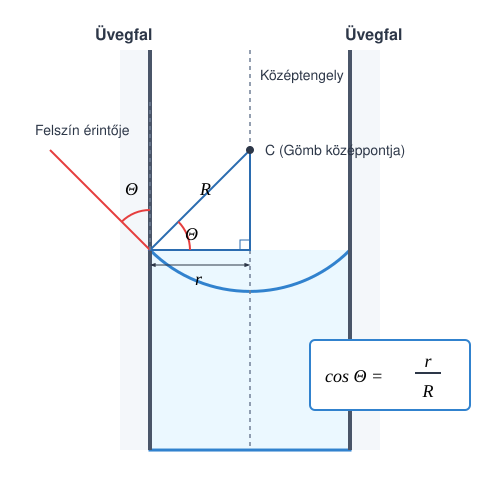

# A kapilláris nyomás

## Kísérletek

[Sas Elemér kísérletei a felületi feszültségre](https://www.youtube.com/watch?v=Yg0TPid2Yt4&t=14m06s)

A kísérletekben látjuk, hogy a folyadékfelületek meggörbülnek az edényfalak közelében. A nedvesítő folyadék mintegy felkúszik az edény falára, míg a nem nedvesítő folyadék éppenhogy alacsonyabban áll a falnál, mint a folyadék szintje a faltól messze. 

Hajszálcsövekben a folyadék határfelületének alakja jó közelítéssel gömbfelületnek tekinthető. A görbült folyadékfelület nyomást fejt ki a folyadékra vagy a gázra a határfelületen. Ez a nyomás mindig a homorú felület középpontja felé irányul. Ez okozza, hogy a hajszálcsőben a nedvesítő folyadék magasabban áll, mint a csövön kívül, és pont fordítva történik nem nedvesítő folyadék esetén. Szintén ez a nyomás próbálja a buborékban lévő levegőt összenyomni, ezért kell a buborékot fújni, hogy nőjön – azaz túlnyomást kell kifejteni a belső levegőre a külső légnyomáshoz képest.

## A kapilláris nyomás

> **A görbült folyadékfelületek által kifejtett plusz nyomás a kapilláris vagy görbületi nyomás (Laplace-nyomás), mely mindig a folyadék homorú oldala felé mutató eredő erőt eredményez.**

### A térfogati munka
Vizsgáljuk meg, mekkora munkát végzünk a gázon, ha a térfogatát állandó $p$ nyomáson $\Delta V$-vel megváltoztatjuk! A gáz legyen egy $A$ alapterületű hengerben, melyet dugattyú zár el. Mozgassuk el a dugattyút a henger belseje felé egy kicsiny $s$ távolsággal. Ekkor a munka, amit végzünk (amennyiben a dugattyú nem gyorsul):

$$W = F \cdot s = p \cdot A \cdot s = -p \cdot \Delta V$$

Ez tehát a mi általunk a gázon végzett munka, mely a gáz térfogatát lecsökkenti, így itt a $\Delta V < 0$ esetet vizsgáltuk (a gáz által végzett munka ennek az ellentettje lenne).

### A kapilláris nyomás kiszámítása
A térfogati munkára vonatkozó formulánkat az egyszerűség kedvéért henger alakú edényre vezettük le, de tetszőleges alakú testre is érvényes, ha a folyamat közben a nyomás állandónak tekinthető. Ezt fogjuk most alkalmazni egy gömb alakú szappanbuborékra. 

Képzeljük el, hogy egy kevés levegőt fújunk a buborékba úgy, hogy a belső nyomás jó közelítéssel állandónak tekinthető. Ekkor munkát végzünk, de ez a munka elhanyagolható mértékben növeli a levegő belső energiáját, szinte teljes egészében a buborék felületi energiájának növelésére fordítódik. Mivel a buborékot határoló szappanhártyának külső és belső felszíne is van, a hártya két határfelülettel rendelkezik.

Az általunk végzett térfogati munka a buborék tágításakor:

$$W = 2p_g \cdot \Delta V$$

Itt $p_g$ a buborékban uralkodó görbületi túlnyomás fele, $\Delta V$ pedig a buborék térfogatának növekedése. Ha a sugár megváltozása ($\Delta R$) igen kicsiny az eredeti $R$ sugárhoz képest, a térfogatváltozás felírható a gömb felszínének és a sugárváltozásnak a szorzataként:

$$\Delta V = 4\pi R^2 \cdot \Delta R$$

Nézzük meg, hogyan változik meg a buborék felülete! Ehhez szükségünk lesz a sugár négyzetének változására ($\Delta R^2$):

$$\Delta R^2 = R^2 - R_0^2 = (R + R_0)(R - R_0) = (2R - \Delta R)\Delta R \approx 2R \cdot \Delta R$$

Az utolsó lépésben a kis $\Delta R$-et elhanyagoltuk a lényegesen nagyobb $2R$ mellett.

Vizsgáljuk meg a felületi energia növekedését a két felszín (külső és belső) figyelembevételével:

$$E_f = \alpha \cdot 2A = \alpha \cdot 2 \cdot (4\pi R^2) = \alpha \cdot 8\pi R^2$$

$$\Delta E_f = \alpha \cdot 8\pi R^2 - \alpha \cdot 8\pi R_0^2 = \alpha \cdot 8\pi (R^2 - R_0^2) = \alpha \cdot 8\pi \Delta R^2$$

Behelyettesítve a korábbi közelítést ($\Delta R^2 \approx 2R \cdot \Delta R$):

$$\Delta E_f = \alpha \cdot 8\pi \cdot (2R \cdot \Delta R) = \alpha \cdot 16\pi R \cdot \Delta R$$

A végzett térfogati munka teljes egészében a felületi energia növelésére fordítódik:

$$W = \Delta E_f$$

$$2p_g \cdot 4\pi R^2 \cdot \Delta R = \alpha \cdot 16\pi R \cdot \Delta R$$

Egyszerűsítés után kifejezhető a görbületi nyomás:

$$p_g = \frac{2\alpha}{R}$$

### 1. Példa
Egy szappanbuborék sugara $3\text{ cm} = 0,03\text{ m}$, az oldat felületi feszültsége $\alpha = 0,03\text{ N/m}$. Mennyivel nagyobb a levegő nyomása a buborékban, mint a külső légköri nyomás?

$$p = 2p_g = \frac{4\alpha}{R} = \frac{4 \cdot 0,03\text{ N/m}}{0,03\text{ m}} = 4\text{ Pa}$$

A buborékban lévő túlnyomás mindössze $4\text{ Pa}$.

---

## Folyadék emelkedése hajszálcsőben

A következőkben kiszámítjuk, hogy milyen magasra emelkedik a folyadék a hajszálcsőben. Igen vékony csövekben a folyadékfelszín alakja jó közelítéssel gömbsüvegnek tekinthető, míg a vastag csövekben a felszín nagy része vízszintes sík, kivéve a cső falának közvetlen környezetét. Az alábbi gondolatmenetünk kifejezetten a vékony kapillárisokra vonatkozik.

A közlekedőedények törvénye alapján a csövön kívüli szabad felszín szintjében a nyomásnak meg kell egyeznie a cső belsejében uralkodó nyomással ugyanebben a magasságban.

$$p_0 = p_0 + \rho g h - p_g$$

A $p_g$ görbületi nyomást itt levonjuk, mivel feltételezzük, hogy a felszín homorú (nedvesítő folyadék), így a meniszkusz közvetlen közelében a folyadékban nyomáscsökkenés lép fel, ami „felszívja” az oszlopot.

Legyen a folyadékfelszín érintője és a cső fala által bezárt illeszkedési (nedvesítési) szög $\theta$. Ez a szög nedvesítő folyadékokra $90^\circ$-nál kisebb, míg nem nedvesítő folyadékokra $90^\circ$-nál nagyobb. Nagyon tiszta üveg és tiszta víz esetén ez a szög jó közelítéssel $0^\circ$.

A geometriai elrendezés alapján a cső $r$ sugara és a meniszkusz gömbfelületének $R$ sugara közötti összefüggés:

$$\cos\theta = \frac{r}{R} \implies R = \frac{r}{\cos\theta}$$

Így az egyetlen határfelülettel rendelkező meniszkusz által kifejtett görbületi nyomás:

$$p_g = \frac{2\alpha}{R} = \frac{2\alpha\cos\theta}{r}$$

Ezt beírva a hidrosztatikai egyensúlyi egyenletünkbe:

$$p_0 = p_0 + \rho g h - \frac{2\alpha\cos\theta}{r}$$

Átrendezve a folyadékoszlop $h$ magassága kifejezhető:

$$h = \frac{2\alpha\cos\theta}{\rho g r}$$

### 2. Példa
Hány millimétert süllyed a higany a $r = 0,1\text{ mm} = 0,0001\text{ m}$ sugarú kapilláris csőben? A higany felületi feszültsége $\alpha = 0,4865\text{ N/m}$, sűrűsége $\rho = 13\ 600\text{ kg/m}^3$, az illeszkedési szöge pedig $\theta = 140^\circ$. ($g \approx 9,81\text{ m/s}^2$)

$$h = \frac{2\alpha\cos\theta}{\rho g r} = \frac{2 \cdot 0,4865\text{ N/m} \cdot \cos(140^\circ)}{13\ 600\text{ kg/m}^3 \cdot 9,81\text{ m/s}^2 \cdot 0,0001\text{ m}}$$

$$h \approx \frac{0,973 \cdot (-0,7660)}{13,3416} = \frac{-0,7453}{13,3416} \approx -0,05587\text{ m} \approx -55,9\text{ mm}$$

A csőben a higany szintje körülbelül $5,6\text{ cm}$-t ($55,9\text{ mm}$-t) süllyed le.

---

## Feladatok

1. Egy tiszta vízzel teli edénybe függőlegesen egy $d = 0,6\text{ mm}$ belső átmérőjű üveg hajszálcsövet mártunk. Milyen magasra kúszik fel a víz a kapillárisban, ha a víz az üveget tökéletesen nedvesíti ($\theta = 0^\circ$)? A víz felületi feszültsége $\alpha = 0,072\text{ N/m}$, sűrűsége $\rho = 1000\text{ kg/m}^3$, a nehézségi gyorsulás $g \approx 9,81\text{ m/s}^2$.

2. Két különböző méretű szappanbuborékot fújunk ugyanabból a szappanoldatból ($\alpha = 0,028\text{ N/m}$). Az első buborék átmérője $4\text{ cm}$, a második buborékban uralkodó belső túlnyomás pedig pontosan a fele az elsőben mérhető értéknek. Mekkora a második szappanbuborék sugara?

3. Egy folyadékba mártott kapilláris csőben a kapilláris emelkedés magassága pontosan $h = 3\text{ cm}$. Egy másik, ugyanebből az anyagból készült, de feleakkora belső sugarú csőben a felemelkedés magassága $h = 6\text{ cm}$-nek adódik. Ha a folyadék sűrűsége $\rho = 800\text{ kg/m}^3$, a cső sugara $r = 0,4\text{ mm}$, és az illeszkedési szög a tiszta felületek miatt $\theta = 0^\circ$, mekkora a vizsgált folyadék felületi feszültsége?
