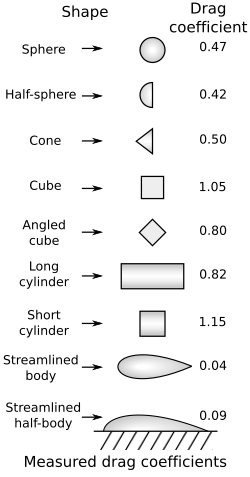
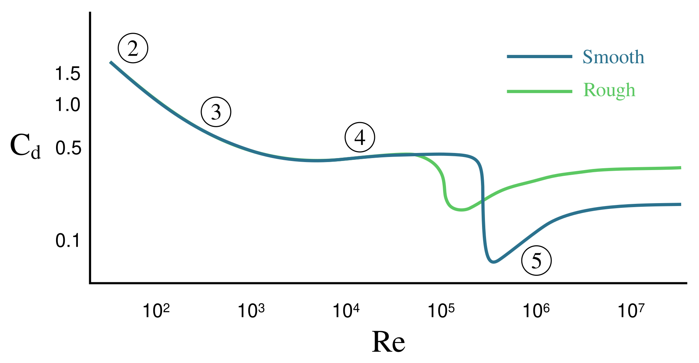

# A közegellenállás és az aerodinamikai emelőerő

Eddig láttuk a Stokes-törvényt a kis Reynolds-számú lamináris áramlási rezsim esetére. Ilyenkor a mozgó gömbre a relatív sebességével ellentétes irányú erő hat, mely egyenesen arányos a sebesség nagyságával. 

Most vizsgáljuk meg a nagy Reynolds-számok általános esetét, amelyek a mindennapi életben szinte mindig előfordulnak! Megnézzük, hogyan függ a közegellenállási erő a relatív sebességtől, illetve milyen más tényezők befolyásolják ezen kívül a mozgást. Ez rendkívül fontos gyakorlati probléma, hiszen a járművek mechanikai energiaveszteségei jelentős részben a közegellenállás következményei.

Mivel az áramlási alapegyenletek (Navier–Stokes-egyenletek) közvetlen megoldása ilyenkor matematikailag reménytelen, két fő eszközünk marad, hogy pontos információhoz jussunk:
*   Szélcsatornás kísérletek a közegellenállás fizikai mérésére.
*   Számítógépes áramlástani szimulációk (**CFD** - Computational Fluid Dynamics).

## Kísérletek és szimulációk

A következő videók bemutatják a jelenség kísérleti és numerikus hátterét. Nézzük meg őket figyelmesen, mielőtt rátérnénk a matematikai levezetésre!

[A közegellenállás mérése sima gömbön és golflabdán (YouTube videó)](https://www.youtube.com/watch?v=2L8TjobaFac&t=24s)

[Közegellenállás és aerodinamikai emelőerő mérése szárnyformán (YouTube videó)](https://www.youtube.com/watch?v=EbOpgUrwK7M)

[Gömb körüli áramlás numerikus szimulációja Re=100 000 esetén (YouTube videó)](https://www.youtube.com/watch?v=skzddW_kEq0)

[Áramlás repülőgép-szárnyprofil körül (YouTube Shorts)](https://www.youtube.com/shorts/UKHjTZwSH_w)

A kísérletek szemléltetik, hogyan mérhető a közegellenállási erő gömbön, illetve a közegellenállási erő és az aerodinamikai emelőerő szárnyprofilon, különböző állásszögek esetén. Foglalkozzunk először a közegellenállás kiszámításával, majd vizsgáljuk meg, hogyan jön létre a repülést biztosító emelőerő!

---

## A közegellenállási erő kiszámítása

Képzeljünk el egy hasábot, például egy kockát, amely $u$ sebességgel halad előre! Legyen a kocka elülső lapja a haladási irányra merőleges, a lap területe pedig $A$. A levegő a kocka mozgását fékezni fogja. Ennek oka, hogy a test folyamatosan ütközik a közeg molekuláival: egyre több levegőt tol maga előtt, és felgyorsítja azt a saját $u$ sebességére. 

Tegyük fel egyszerűsítésként, hogy a levegő noha megpróbál kitérni a kocka elől, de a test által kisöpört teljes térfogatban fel kell gyorsulnia a test $u$ sebességére. Egy $\Delta t$ időintervallum alatt a kocka $\Delta x = u \cdot \Delta t$ utat tesz meg. Az ezalatt érintett levegő térfogata:

$$
\Delta V = A \cdot \Delta x = A \cdot u \cdot \Delta t
$$

A felgyorsított levegő $\Delta m$ tömege a $\rho$ sűrűség segítségével kifejezve:

$$
\Delta m = \rho \cdot \Delta V = \rho \cdot A \cdot u \cdot \Delta t
$$

A közegellenállási erőt a lendülettétel alapján számíthatjuk ki, amely Newton harmadik törvénye (akció-reakció) értelmében nagyságrendileg megegyezik a levegőnek átadott erővel:

$$
F_k = \frac{\Delta I}{\Delta t} = \frac{u \cdot \Delta m}{\Delta t} = \frac{u \cdot (\rho \cdot A \cdot u \cdot \Delta t)}{\Delta t} = \rho \cdot u^2 \cdot A
$$

Ez a számítás nyilvánvalóan csak egy elméleti becslés, hiszen a valóságos levegő egy része kitér a haladó test elől, így nem gyorsul fel teljesen a test $u$ sebességére. Az, hogy ez a becslés mennyire pontos, elsősorban a test geometriai alakja szabja meg. 

A mérések szerint a fenti gondolatmenet kiváló közelítést ad, ha az eredményt megszorozzuk egy a test alakjára jellemző, mértékegység nélküli állandóval, amelyet a fizikában $\frac{1}{2} C_w$ formában szoktunk felírni. Itt a $C_w$ a test formájára jellemző **közegellenállási tényező** (vagy *alaktényező*, a nemzetközi szakirodalomban gyakran $C_D$). 

A közegellenállás végleges, négyzetes erőtörvénye tehát a következő:

$$
F_k = C_w \cdot \frac{1}{2} \rho \cdot u^2 \cdot A
$$

Vegyük észre a fizikai lényeget: a sebesség a négyzeten szerepel ($u^2$)! Ennek oka, hogy ha kétszer olyan gyorsan megyünk, akkor másodpercenként **kétszer annyi** levegőmolekulát gázolunk el, és ezeket a molekulákat **kétszer akkora** sebességre is kell felgyorsítanunk.

### Különböző alakú testek közegellenállási tényezője

---

### Az alaktényező Reynolds-szám függése

A tompa és az áramvonalas testek áramlástani viselkedése drasztikusan eltér egymástól, amit a Reynolds-szám ($Re$) befolyásol. Vizsgáljuk meg a klasszikus gömb esetét!

Láttuk korábban, hogy igen kis Reynolds-számok esetén ($Re \ll 1$) a mozgás a Stokes-törvényt követi. Ilyenkor az áramlás stacionárius és lamináris, a folyadék teljesen rásimul a gömbre, és a tiszta viszkózus súrlódás dominál. Erre a tartományra az alaktényező elméleti úton is levezethető:

$$
C_w = \frac{24}{Re}
$$

Ha ezt visszahelyettesítjük a négyzetes közegellenállási egyenletbe (figyelembe véve, hogy a gömb keresztmetszete $A = r^2\pi$, a Reynolds-szám pedig $Re = \frac{\rho \cdot 2r \cdot u}{\eta_{\text{din}}}$):

$$
F_k = \frac{1}{2} C_w \cdot \rho \cdot u^2 \cdot A = \frac{1}{2} \cdot \left(\frac{24\eta_{\text{din}}}{\rho \cdot 2r \cdot u}\right) \cdot \rho \cdot u^2 \cdot (r^2\pi) = 6\pi \cdot \eta_{\text{din}} \cdot r \cdot u
$$

Pontosan visszakaptuk a Stokes-féle lineáris erőtörvényt! Igen kis Reynolds-számoknál tehát a fékezés mechanizmusa a testre tapadó folyadék belső, ragacsos súrlódása.

Nagy Reynolds-számok esetén ($1000 < Re < 300\ 000$) a gömb alaktényezője szinte állandóvá válik, értéke kb. $0{,}47$. Itt már a folyadék tehetetlensége és a test mögött kialakuló örvénycsóva miatti nyomáskülönbség (alaki ellenállás) uralkodynamikája uralkodik, így az erő tiszta $u^2$ függést mutat.

#### A közegellenállási válság (Drag crisis)

Sima felületű gömbnél $Re \approx 300\ 000$ környékén egy egészen megdöbbentő fizikai tünemény játszódik le: a gömb alaktényezője hirtelen és drasztikusan leesik $0{,}47$-ről kb. $0{,}2$-re! 

Ennek oka, hogy a gömb elején kialakuló vékony, lamináris határréteg hirtelen összeomlik és turbulenssé válik. Bár a turbulencia helyileg növeli a súrlódást, a turbulens határréteg sokkal nagyobb mozgási energiával rendelkezik. Emiatt sokkal hosszabban képes követni a gömb görbületét, és a leválási pont hátratolódik (lamináris esetben kb. $80^\circ$-nál, turbulens esetben $120^\circ$ körül válik le az áramlás). Emiatt a gömb mögötti kis nyomású örvénycsóva drasztikusan összeszűkül, és a test alaki ellenállása bezuhan.

A **golflabda** rücskös felületének pontosan ez a célja: a rücskök szándékosan felkorbácsolják és turbulenssé teszik a határréteget, így ez a közegellenállási válság már egy jóval kisebb Reynolds-számnál bekövetkezik, és a labda sokkal messzebbre képes repülni.

*   **Szögletes testeknél** (pl. kocka, sík lap) az áramlás leválását a geometria kényszeríti ki az éles sarkoknál. Emiatt náluk a leválási pont fix, az alaktényező ($C_w \approx 1{,}05 - 1{,}2$) szinte egyáltalán nem függ a Reynolds-számtól, és nincs közegellenállási válságuk.
*   **Áramvonalas testeknél** (pl. csepp alak, szárnyprofil) a test alakját úgy tervezték, hogy a leválás még óriási Reynolds-számoknál se következzen be. Náluk a közegellenállás elképesztően alacsony ($C_w \approx 0{,}04$), ami a modern járműtervezés legfőbb célja.

---

## A végsebesség

Amikor egy testet elengedünk egy közegben, a nehézségi erő hatására gyorsulni kezd. Ahogy nő a sebessége, a négyzetes erőtörvény értelmében a közegellenállási erő is rohamosan növekszik. Egy bizonyos ponton a közegellenállás hajszálpontosan egyenlővé válik a nehézségi erővel ($F_k = F_G$). Ekkor a testre ható eredő erő nulla lesz, a gyorsulás megszűnik, és a tárgy eléri a maximális, állandó **végsebességét**.

### Szimulációs ellenőrzés

[Gömb alakú test esése légellenállás hatása alatt (Interaktív szimuláció)](https://alexerdei73.github.io/physics-engine/project/#621f3903-6d19-4d8a-867b-45fdd4a016ad)

Ebben a szimulációban a végsebesség értékét és a $v_y(t)$ grafikont érdemes megnézni!
 
---

### Kidolgozott példák

**1. feladat:** Számítsuk ki a fenti interaktív szimulációban szereplő test elméleti végsebességét! A test tömege $m = 0{,}1\text{ kg}$, a levegő sűrűsége $\rho = 1{,}225\text{ kg/m}^3$, a gömb alakú test sugara $r = 0{,}1\text{ m}$, a gömb alaktényezője pedig $C_w = 0{,}47$.

Az egyensúlyi állapotból kiindulva ($g = 9{,}81\text{ m/s}^2$):

$$
F_G = F_k \implies m \cdot g = \frac{1}{2} C_w \cdot \rho \cdot u^2 \cdot (r^2\pi)
$$

Fejezzük ki a sebességet, és helyettesítsünk be:

$$
u = \sqrt{\frac{2 \cdot m \cdot g}{C_w \cdot \rho \cdot r^2\pi}} = \sqrt{\frac{2 \cdot 0{,}1 \cdot 9{,}81}{0{,}47 \cdot 1{,}225 \cdot 0{,}1^2 \cdot 3{,}1415}} \approx 10{,}415\text{ m/s}
$$

Eredményünk hajszálpontosan megegyezik a szimuláció által mutatott értékkel!

**2. feladat:** Mekkora egy $95\text{ kg}$ össztömegű ejtőernyős süllyedési sebessége érkezéskor, ha a felgömb alakú ejtőernyő sugara nyitott állapotban $r = 4\text{ m}$, az alaktényezője pedig $C_w = 1{,}4$? Mekkora lenne ugyanez a sebesség, ha az ejtőernyő nem nyílna ki, és a szerencsétlenül járt ember kiterített testtel, hassal lefelé zuhanna ($A = 0{,}7\text{ m}^2$ vetületi homlokfelülettel és $C_w = 1{,}0$ alaktényezővel)?

*Nyitott ejtőernyővel:*

$$
u_1 = \sqrt{\frac{2 \cdot m \cdot g}{C_w \cdot \rho \cdot r^2\pi}} = \sqrt{\frac{2 \cdot 95 \cdot 9{,}81}{1{,}4 \cdot 1{,}225 \cdot 4^2 \cdot 3,1415}} \approx 4{,}65\text{ m/s} \approx 16{,}74\text{ km/h}
$$

*Ejtőernyő nélkül (szabadesésben):*

$$
u_2 = \sqrt{\frac{2 \cdot m \cdot g}{C_w \cdot \rho \cdot A}} = \sqrt{\frac{2 \cdot 95 \cdot 9{,}81}{1{,}0 \cdot 1{,}225 \cdot 0{,}7}} \approx 46{,}62\text{ m/s} \approx 167{,}8\text{ km/h}
$$

**Konklúzió:** Vegyük észre a drámai különbséget! Ejtőernyő nélkül az emberi test kiterítve is közel $168\text{ km/h}$-s sebességgel csapódna a földbe, ami a fellépő óriási (több mint $800\text{ g}$-s) lassulás miatt azonnali halálos sérülést okoz. Az ejtőernyő hatalmas vetületi felülete és magas alaktényezője a becsapódást egy teljesen biztonságos, kb. $17\text{ km/h}$-s zökkenéssé szelídíti.

---

## Az aerodinamikai emelőerő megszületése

A repülőgép-szárnyprofil körüli áramlás szimulációjakor kis szögeknél szép lamináris áramlás alakul ki, melynél a szárny stabil emeloerőt biztosít. Ha jól megnézzük a szimulációt a videón, láthatunk egy kis örvényt leválni a mozgás kezdetén a szárny hátsó csücskénél (ez az úgynevezett indulási örvény). 

Ez a megfigyelés rendkívül lényeges! A perdületmegmaradás értelmében ugyanis a levegő a szárny körül ezáltal forgásba jön, és egy úgynevezett cirkuláció alakul ki. A folyamat lényege, hogy a leváló indulási örvény és a szárny körül kialakuló, vele ellentétes irányú forgás teljes eredő perdülete hajszálpontosan nulla marad. 

A szárny körüli kötött forgás az óramutató járásával megegyező értelmű. Emiatt a szárny felett ez a forgás hozzáadódik a szembejövő áramlás sebességéhez, a szárny alatt pedig levonódik belőle. Ezáltal lesz a szárny felett lényegesen nagyobb a levegő áramlási sebessége, mint a szárny alatt. Ez a Bernoulli-törvény értelmében nyomáskülönbséghez vezet (fent lecsökken, lent megnő a nyomás), amely végül biztosítja a repüléshez szükséges aerodinamikai emelőerőt.

### Az átesés (Stall) veszélye
Ha a szárnyat túl nagy szögben (kb. $15^\circ - 18^\circ$ felett) döntjük meg az áramláshoz kélpest, a levegőmolekuláknak a felületi súrlódás miatt elfogy a mozgási energiájuk, és a tehetetlenségük miatt már nem képesek követni a szárny felső ívét. 

A határréteg hirtelen leválik, és a szárny felett a sima, gyors áramlás helyét egy kaotikus, lassú, örvénylő légtömeg veszi át. Ekkor a cirkuláció összeomlik: a szívóhatás eltűnik, az emelőerő bezuhan, a repülőgép pedig hirtelen **átesik (stall)** és zuhanni kezd. 

Hogy ezt elkerüljék, a modern repülőgépek szárnyaira apró fémlemezeket, úgynevezett *vortex generátorokat* szerelnek. Ezek szándékosan pici turbulenciát keltenek a felületen. Ahogy a golflabdánál is láttuk, ez a turbulens réteg jobban tapad a szárnyhoz, így a veszélyes áramlásleválás és az átesés csak sokkal nagyobb dőlésszögeknél következhet be, biztonságossá téve a repülést.

---

## Feladatok

1. **Meteorológiai szonda süllyedése:** Egy hengeres test alakú meteorológiai mérőszondát ejtünk el a légkör alsó rétegében, ahol a levegő sűrűsége $\rho = 1{,}2\text{ kg/m}^3$. A műszer össztömege $m = 2\text{ kg}$, a haladási irányra merőleges vetületi homlokfelülete $A = 0{,}15\text{ m}^2$, a test áramvonalas kialakításának köszönhető alaktényezője pedig $C_w = 0{,}32$. Határozd meg a szonda elméleti végsebességét a nehézségi és a négyzetes közegellenállási erő egyensúlyából! ($g = 9{,}81\text{ m/s}^2$)

2. **Vízi mentőeszköz fékezése:** Egy árvízi mentőakció során egy helikopterről egy $m = 12\text{ kg}$ tömegű, felülről nyitott, üreges felgömb alakú mentőeszközt dobnak a folyóba. A víz sűrűsége $\rho = 1000\text{ kg/m}^3$, az üreges felgömb alaktényezője a vízben $C_w = 1{,}42$, a gömb sugara pedig $r = 0{,}25\text{ m}$. Mekkora lesz a mentőeszköz állandósult süllyedési végsebessége a vízben, ha feltételezzük, hogy a mozgás a nagy Reynolds-számú négyzetes tartományba esik? ($g = 9{,}81\text{ m/s}^2$)

3. **Légellenállás-jóslás nagysebességű vonatnál:** Egy vasúti kutatócsoport egy új prototípus szélcsatornatesztje során azt méri, hogy $u_1 = 30\text{ m/s}$ (kb. $108\text{ km/h}$) sebesség mellett a szerelvényre ható teljes légellenállási erő $F_{k1} = 4500\text{ N}$. Mivel a vonat éles törések nélküli, áramvonalas geometriájú, a vizsgált tartományban az alaktényezője ($C_w$) állandónak tekinthető. A négyzetes közegellenállási törvény alapján jósold meg, mekkora fékezőerővel kell szembenéznie a vonatnak a tervezett utazósebességén, ami $u_2 = 90\text{ m/s}$ (mely hajszálpontosan a háromszorosa az elsőnek)!
