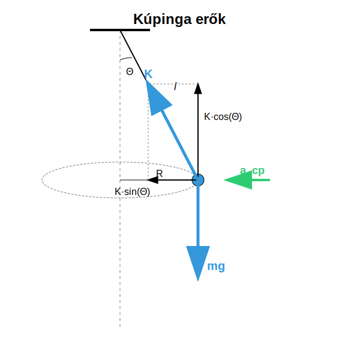
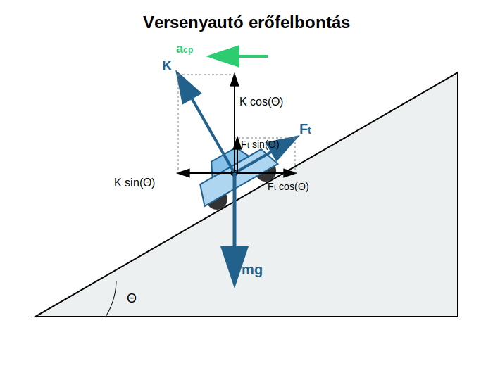

# További példák körmozgásra

## A kúpinga

### Kísérlet

[Kúpinga bemutatása](https://www.youtube.com/watch?v=1R5jpNTSxDg)

### A periódusidő

A kúpinga olyan inga, mely egyenletes körmozgást végez a vízszintes síkban, miközben a fonal egy kúpfelületen mozog. A testre a függőlegesen lefelé húzó nehézségi erő és a kötél irányú kötélerő hat. A kötélerő felbontható egy függőleges és vízszintes komponensre. A kötélerő függőleges komponense kiegyenlíti a nehézségi erőt, hisz az inga nem gyorsul függőlegesen. A körmozgás a vízszintes síkban történik, tehát a centripetális gyorsulás vízszintes, melyet a kötélerő vízszintes komponense okoz.

$$
Kcos \Theta = mg
$$

$$
Ksin \Theta = ma_{cp}
$$

$$
a_{cp} = \frac {v^2} {R}
$$

Az első egyenletből kifejezzük $K$-t és beírjuk a második egyenletbe a centripetális gyorsulással együtt.

$$
K = \frac {mg} {cos \Theta}
$$

$$
mg \frac {sin \Theta} {cos \Theta} = m \frac {v^2} {R}
$$

$$
v^2 = gR tan \Theta
$$

Most felhasználhatjuk, hogy:

$$
v = R \omega
$$

$$
(R \omega)^2 = gR tan\Theta
$$

$$
R^2 \omega^2 = gR tan\Theta
$$

$$
\omega^2 = \frac {g sin \Theta} {R cos \Theta}
$$

Most felhasználjuk, hogy:

$$
R = l sin \Theta
$$

Így azt kapjuk, hogy:

$$
\omega^2 = \frac {g sin \Theta} {l sin \Theta cos \Theta}
$$

$$
\frac {2 \pi} {T} = \sqrt { \frac {g} {l cos \Theta} }
$$

$$
\frac {T} {2 \pi} = \sqrt {\frac {l cos \Theta} {g}}
$$

$$
T = 2 \pi \sqrt {\frac {l cos \Theta} {g}}
$$

Ez a formula a kúpinga periódusideje. Ha a $\Theta$ szög igen kicsiny $1rad$-hoz képest, akkor a $cos \Theta$ 1-nek tekinthető és megkapjuk a képletet, mely a függőleges síkban lengő inga periódusideje kis kitérésekre. Ezt később fogjuk tárgyalni. Látjuk tehát, hogy a kúpinga periódusideje kis kúpszög esetén megegyezik az inga lengésidejével, kis kitérések esetére. Ezt demonstrálta a videó is.

### Példa

Egy $0,1kg$ tömegű test $1m$ hosszú fonalon vízszintes síkban egyenletes körmozgást végez, miközben a fonal függőlegessel bezárt szöge $30\degree$. Mekkora a körpálya sugara? Mekkora a fonalat feszítő erő? Mekkora a centripetális erő? Mekkora a test sebessége? Mekkora a keringési idő? Ellenőrizzük a periódusidőre kapott képlettel is a választ!

$$
R = l sin \Theta = 1m \times sin(30\degree) = 0,5m
$$

$$
Kcos \Theta = mg
$$

$$
K = \frac {mg} {cos \Theta} = \frac {0,1 \times 9,81} {cos(30\degree)} = 1,133N
$$

$$
F_e = Ksin \Theta = 1,133 sin(30\degree) = 0,5663N
$$

$$
F_e = ma
$$

$$
a = \frac {F_e} {m} = \frac {0,5663} {0,1} = 5,663 \frac {m} {s^2}
$$

$$
a = \frac {v^2} {R}
$$

$$
5,663 = \frac {v^2} {0,5}
$$

$$
2,832 = v^2
$$

$$
v = \sqrt {2,832} = 1,683 \frac {m} {s}
$$

$$
v = \frac {2 \pi R} {T}
$$

$$
T = \frac {2 \pi R} {v} = \frac {2 \pi \times 0,5} {1,683} = 1,867s
$$

Számítsuk ki a formulával is, amit kaptunk!

$$
T = 2 \pi \sqrt {\frac {l cos \Theta} {g}} = 2 \pi \sqrt {1 \times cos(30\degree) / 9,81} = 1,867s
$$

Látszik, hogy a formula pontosan ugyanazt adja, mint a számításunk, ahogy annak lennie is kell.

## Versenyautó döntött pályán

### Példa

$1200kg$ tömegű versenyautó halad $108 \frac {km} {h}$ sebességgel a $150m$ sugarú kanyarban. A pálya dőlésszöge a vízszintessel $30\degree$. Mekkora a pálya által kifejtett kényszererő és a tapadási erő? Ha $\mu_t = 0,7$ kicsúszik-e a kocsi?

A kocsi sebessége kicsi, tehát lefelé csúszna a döntött pályán. Ezt a pálya síkjában felfelé mutató tapadási erő akadályozza meg. 

A tapadási erőt és a kényszererőt felbontjuk a függőleges és a vízszintes, gyorsulással párhuzamos összetevőkre. Ekkor:

$$
K cos \Theta + F_t sin \Theta - mg = 0
$$

$$
K sin \Theta - F_t cos \Theta = ma_{cp}
$$

$$
a_{cp} = \frac {v^2} {R}
$$

$$
108 \frac {km} {h} = 108 \frac {1000m} {3600s} = 30 \frac {m} {s}
$$

$$
a_{cp} = \frac {v^2} {R} = \frac {30^2} {150} = 6 \frac {m} {s^2}
$$

Az adatokat behelyettesítve:

$$
0,8660K + 0,5F_t = 11770
$$

$$
0,5K - 0,8660F_t = 7200
$$

Az első egyenletből kifejezzük $F_t$-t és behelyettesítjük a második egyenletbe:

$$
F_t = 23540 - 1,732K
$$

$$
0,5K - 0,8660(23540 - 1,732K) = 7200
$$

$$
0,5K - 20390 + 1,500K = 7200
$$

$$
2K = 27590
$$

$$
K = 13800N
$$

$$
F_t = 23540 - 1,732 \times 13800 = -430,9N
$$

Tehát $F_t$ ellentétes irányú, mint feltételeztük, tehát lefelé mutat a pálya síkjában. A kocsi súrlódás nélkül felfelé csúszna a pályán.

---

## Feladatok

1. Egy 80 cm hosszú fonálon függő testtel kísérletezünk. A testet vízszintes körpályára kényszerítjük úgy, hogy a fonál 45°-os szöget zárjon be a függőlegessel. Számítsd ki, mekkora a test fordulatszáma (n = 1/T) és a fonálban ébredő erő, ha a test tömege 0,5 kg! (Használd a $g=9,81 m/s^2$ értéket).

2. Egy versenypálya mérnökei olyan döntött kanyart szeretnének tervezni, ahol a járműveknek semmilyen súrlódásra (tapadásra) nincs szükségük ahhoz, hogy a pályán maradjanak $90 km/h$ sebesség mellett. A kanyar sugara 200 méter. Hány fokos dőlésszögben ($\Theta$) kell megépíteni a kanyart ehhez az "ideális" sebességhez?

3. Ugyanebben a 30°-os dőlésszögű, 150 m sugarú kanyarban (a fenti példából) egy másik autó próbál minél gyorsabban áthaladni. A tapadási súrlódási együttható $\mu_t = 0,8$. Mekkora az a maximális sebesség ($v_{max}$), amellyel az autó még éppen nem csúszik ki felfelé a pályáról? (Tipp: Ekkor a súrlódási erő a pálya síkjával párhuzamosan lefelé mutat).