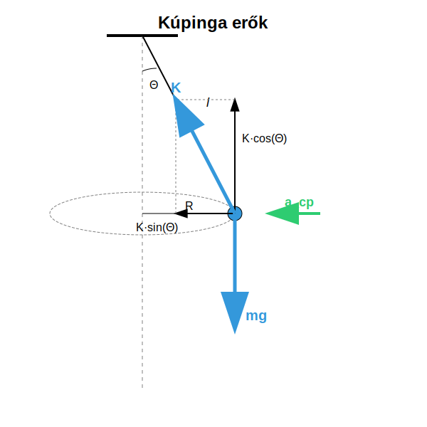
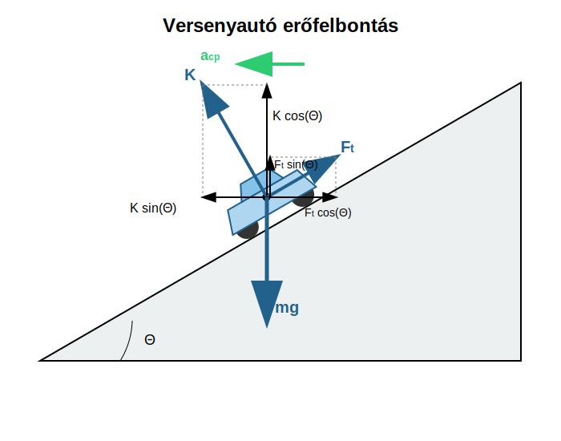

# További példák körmozgásra

## A kúpinga

### Kísérlet

[Kúpinga bemutatása](https://www.youtube.com/watch?v=1R5jpNTSxDg)

### A periódusidő

A kúpinga olyan inga, mely egyenletes körmozgást végez a vízszintes síkban, miközben a fonal egy kúpfelületen mozog. A testre a függőlegesen lefelé húzó nehézségi erő és a kötél irányú kötélerő hat. A kötélerő felbontható egy függőleges és vízszintes komponensre. A kötélerő függőleges komponense kiegyenlíti a nehézségi erőt, hiszen az inga nem gyorsul függőlegesen. A körmozgás a vízszintes síkban történik, tehát a centripetális gyorsulás vízszintes, melyet a kötélerő vízszintes komponense okoz.

$$
K \cos \Theta = mg
$$

$$
K \sin \Theta = ma_{\text{cp}}
$$

$$
a_{\text{cp}} = \frac{v^2}{R}
$$

Az első egyenletből kifejezzük $K$-t és beírjuk a második egyenletbe a centripetális gyorsulással együtt:

$$
K = \frac{mg}{\cos \Theta}
$$

$$
mg \frac{\sin \Theta}{\cos \Theta} = m \frac{v^2}{R}
$$

$$
v^2 = gR \tan \Theta
$$

Most felhasználhatjuk, hogy:

$$
v = R\omega
$$

$$
(R\omega)^2 = gR \tan \Theta
$$

$$
R^2 \omega^2 = gR \tan \Theta
$$

$$
\omega^2 = \frac{g \sin \Theta}{R \cos \Theta}
$$

Most felhasználjuk, hogy:

$$
R = l \sin \Theta
$$

Így azt kapjuk, hogy:

$$
\omega^2 = \frac{g \sin \Theta}{l \sin \Theta \cos \Theta}
$$

$$
\frac{2\pi}{T} = \sqrt{\frac{g}{l \cos \Theta}}
$$

$$
\frac{T}{2\pi} = \sqrt{\frac{l \cos \Theta}{g}}
$$

$$
T = 2\pi \sqrt{\frac{l \cos \Theta}{g}}
$$

Ez a formula a kúpinga periódusideje. Ha a $\Theta$ szög igen kicsiny $1\text{ rad}$-hoz képest, akkor a $\cos \Theta$ értékét $1$-nek tekinthetjük, és megkapjuk a képletet, mely a függőleges síkban lengő egyszerű inga periódusideje kis kitérésekre. Ezt később fogjuk tárgyalni. Látjuk tehát, hogy a kúpinga periódusideje kis kúpszög esetén megegyezik az egyszerű inga lengésidejével kis kitérések esetén. Ezt demonstrálta a videó is.

### Példa

Egy $0,1\text{ kg}$ tömegű test $1\text{ m}$ hosszú fonalon vízszintes síkban egyenletes körmozgást végez, miközben a fonal függőlegessel bezárt szöge $30^\circ$. Mekkora a körpálya sugara? Mekkora a fonalat feszítő erő? Mekkora a centripetális erő? Mekkora a test sebessége? Mekkora a keringési idő? Ellenőrizzük a periódusidőre kapott képlettel is a választ!

$$
R = l \sin \Theta = 1\text{ m} \cdot \sin 30^\circ = 0,5\text{ m}
$$

$$
K \cos \Theta = mg
$$

$$
K = \frac{mg}{\cos \Theta} = \frac{0,1 \cdot 9,81}{\cos 30^\circ} \approx 1,133\text{ N}
$$

$$
F_{\text{e}} = K \sin \Theta = 1,133 \cdot \sin 30^\circ \approx 0,5663\text{ N}
$$

$$
F_{\text{e}} = ma
$$

$$
a = \frac{F_{\text{e}}}{m} = \frac{0,5663}{0,1} = 5,663\text{ m/s}^2
$$

$$
a = \frac{v^2}{R}
$$

$$
5,663 = \frac{v^2}{0,5}
$$

$$
2,8315 = v^2
$$

$$
v = \sqrt{2,8315} \approx 1,683\text{ m/s}
$$

$$
v = \frac{2\pi R}{T}
$$

$$
T = \frac{2\pi R}{v} = \frac{2\pi \cdot 0,5}{1,683} \approx 1,867\text{ s}
$$

Számsítsuk ki a formulával is, amit kaptunk:

$$
T = 2\pi \sqrt{\frac{l \cos \Theta}{g}} = 2\pi \sqrt{\frac{1 \cdot \cos 30^\circ}{9,81}} \approx 1,867\text{ s}
$$

Látszik, hogy a formula pontosan ugyanazt adja, mint a lépésenkénti számításunk, ahogy annak lennie is kell.

## Versenyautó döntött pályán

### Példa

Egy $1200\text{ kg}$ tömegű versenyautó halad $108\text{ km/h}$ sebességgel egy $150\text{ m}$ sugarú kanyarban. A pálya dőlésszöge a vízszintessel $30^\circ$. Mekkora a pálya által kifejtett kényszererő és a tapadási erő? Ha $\mu_{\text{t}} = 0,7$, kicsúszik-e a kocsi?

A kocsi sebessége kicsi, tehát lefelé csúszna a döntött pályán. Ezt a pálya síkjában felfelé mutató tapadási erő akadályozza meg. 

A tapadási erőt és a kényszererőt felbontjuk a függőleges és a vízszintes, gyorsulással párhuzamos összetevőkre. Ekkor:

$$
K \cos \Theta + F_{\text{t}} \sin \Theta - mg = 0
$$

$$
K \sin \Theta - F_{\text{t}} \cos \Theta = ma_{\text{cp}}
$$

$$
a_{\text{cp}} = \frac{v^2}{R}
$$

$$
108\text{ km/h} = 108 \cdot \frac{1000\text{ m}}{3600\text{ s}} = 30\text{ m/s}
$$

$$
a_{\text{cp}} = \frac{v^2}{R} = \frac{30^2}{150} = 6\text{ m/s}^2
$$

Az adatokat behelyettesítve:

$$
0,8660K + 0,5F_{\text{t}} = 11772
$$

$$
0,5K - 0,8660F_{\text{t}} = 7200
$$

Az első egyenletből kifejezzük $F_{\text{t}}$-t és behelyettesítjük a második egyenletbe:

$$
F_{\text{t}} = 23544 - 1,732K
$$

$$
0,5K - 0,8660(23544 - 1,732K) = 7200
$$

$$
0,5K - 20389,1 + 1,500K = 7200
$$

$$
2K = 27589,1
$$

$$
K \approx 13794,6\text{ N}
$$

$$
F_{\text{t}} = 23544 - 1,732 \cdot 13794,6 \approx -410,3\text{ N}
$$

Tehát $F_{\text{t}}$ előjele ellentétes, mint amit eredetileg feltételeztük, ami azt jelenti, hogy a valóságban lefelé mutat a pálya síkjában. A kocsi súrlódás nélkül valójában felfelé csúszna ki a pályán az adott sebesség mellett.

---

## Feladatok

1. Egy $80\text{ cm}$ hosszú fonálon függő testtel kísérletezünk. A testet vízszintes körpályára kényszerítjük úgy, hogy a fonál $45^\circ$-os szöget zárjon be a függőlegessel. Számítsd ki, mekkora a test fordulatszáma ($n = 1/T$) és a fonálban ébredő erő, ha a test tömege $0,5\text{ kg}$! (A számítás során használd a $g = 9,81\text{ m/s}^2$ értéket!)

2. Egy versenypálya mérnökei olyan döntött kanyart szeretnének tervezni, ahol a járműveknek semmilyen súrlódásra (tapadásra) nincs szükségük ahhoz, hogy a pályán maradjanak $90\text{ km/h}$ sebesség mellett. A kanyar sugara $200\text{ méter}$. Hány fokos dőlésszögben ($\Theta$) kell megépíteni a kanyart ehhez az „ideális” sebességhez?

3. Ugyanebben a $30^\circ$-os dőlésszögű, $150\text{ m}$ sugarú kanyarban (a fenti példából) egy másik autó próbál minél gyorsabban áthaladni. A tapadási súrlódási együttható $\mu_{\text{t}} = 0,8$. Mekkora az a maximális sebesség ($v_{\text{max}}$), amellyel az autó még éppen nem csúszik ki felfelé a pályáról? (Tipp: Ekkor a súrlódási erő a pálya síkjával párhuzamosan lefelé mutat).
