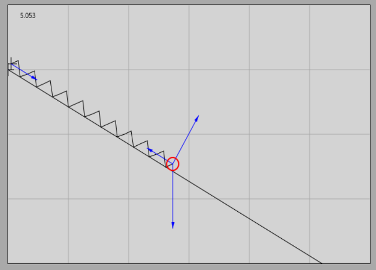
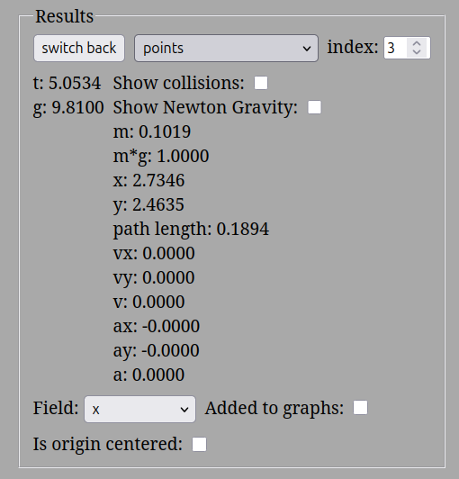
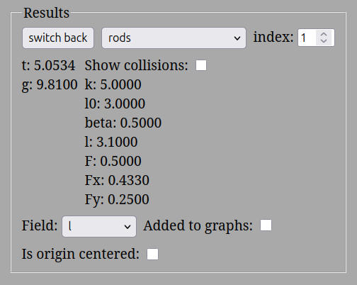
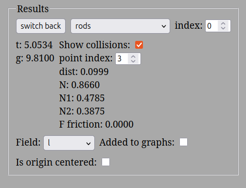
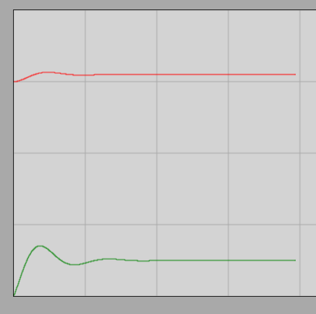

# A lejtő

## Az egyensúly feltétele

Egyensúlyban a testek sebessége és gyorsulása is nulla. Ez az állapot így is marad, ha a testet érő külső erők meg nem változnak.

Newton második törvénye alapján az eredő erő nulla, tehát az eredő erő nullvektor.

$$
a = 0
$$

$$
F_e = ma = 0
$$

$$
\overrightarrow{F_e} = \overrightarrow{F_1} + \overrightarrow{F_2} + ... + \overrightarrow{F_n} = \overrightarrow{0}
$$

A vektorösszeadás a koordináta-rendszerben a koordináták előjeles összeadását jelenti. Tehát:

$$
F_{e,x} = F_{1,x} + F_{2,x} + ... + F_{n, x} = 0
$$

és

$$
F_{e,y} = F_{1,y} + F_{2,y} + ... + F_{n, y} = 0
$$

## Egyensúly a lejtőn

### Kísérlet

[10N súlyú test egyensúlya 30 fokos lejtőn](https://www.youtube.com/watch?v=6w6yRr7y9n8)

A kísérlet két dolgot demonstrál:
1. A lejtőn a 10N súlyú test a lejtővel párhuzamos, 5N nagyságú, felfelé mutató erővel tartható egyensúlyban.
2. A lejtő a testre a lejtőre merőleges irányú erőt fejt ki, hogy megakadályozza a test behatolását a lejtő anyagába.

Ha a kényszererőt ugyanakkora és ugyanolyan irányú erővel pótoljuk, mint a kísérletben, akkor a lejtő nem is szükséges. 

### Szimuláció

[1N súlyú test 30 fokos lejtőn](https://alexerdei73.github.io/physics-engine/project/#e22ed2ae-1e97-40f2-858d-f7a8feafd961)

Itt a szimuláció során egy lejtővel párhuzamos rugó egyensúlyban tartja a 30 fokos lejtőre helyezett 1N súlyú testet. A lejtő súrlódásmentes. A szimuláció indításakor a rugó kismértékben megnyúlik, majd néhány másodperc alatt beáll az egyensúly. A rugó által kifejtett erő 0,5N, és a lejtő 0,8660N erőt fejt ki a lejtőre merőlegesen. Ezek az értékek pont tizedei a kísérletben tapasztaltnak, hisz a súly is pont a tizede.

### A formula levezetése
Jelöljük a nehézségi erőt $G$-vel, a lejtő által kifejtett kényszererőt $K$-val és a rugó által kifejtett erőt, mely megakadályozza, hogy a test lecsússzon, $F$-fel. Legyen továbbá adott egy koordináta-rendszer, melynek x-tengelye a lejtővel párhuzamosan lefelé, az y-tengelye pedig a lejtőre merőlegesen, a $K$ erő irányába mutat! Ekkor:

$$
\overrightarrow{F} + \overrightarrow{K} + \overrightarrow{G} = \overrightarrow{0}
$$

$$
F_x + K_x + G_x = 0
$$

$$
F_y + K_y + G_y = 0
$$

$$
F_x = -F, F_y = 0
$$

$$
K_x = 0, K_y = K
$$

A $G$ erő felbontható a lejtő irányú x és a lejtőre merőleges y komponensekre. Ha berajzoljuk a derékszögű háromszöget, mely a felbontáshoz vezet, akkor ebben 30 fokos szög van a lejtővel párhuzamos komponenssel szemben. Ennek oka, hogy a szög szárai merőlegesek a lejtő 30 fokos szögének megfelelő száraira, és ez esetben a merőleges szárú szögek egyenlők (más esetekben 180°-ra egészítik ki egymást).

$$
\frac {G_x} {G} = \sin \alpha
$$

Tehát:

$$
G_x = G \times \sin \alpha
$$

Hasonlóan:

$$
G_y = -G \times \cos \alpha
$$

$G$ y komponense negatív, mivel az y tengellyel ellentétes irányba, tehát $K$-val ellentétes irányba mutat. Ezeket beírva:

$$
-F + 0 + G \times \sin \alpha = 0
$$

$$
0 + K + (-G \times \cos \alpha) = 0
$$

Eredményeink:

$$
F = G \times \sin \alpha = mg \times \sin \alpha
$$

$$
K = G \times \cos \alpha = mg \times \cos \alpha
$$

### Példa
Ha a test súlya 1N és a lejtő szöge 30 fok, akkor:

$$
F = G \times \sin \alpha = 1N \times \sin(30^\circ) = 1N \times 0,5 = 0,5N
$$

$$
K = G \times \cos \alpha = 1N \times \cos(30^\circ) = 1N \times 0,8660 = 0,8660N
$$

$K$ és $F$ egymásra merőleges erők, vektori összegük:

$$
\sqrt{F^2 + K^2} = \sqrt {0,5^2 + 0,8660^2} = 1,0000N = G
$$

Tehát $F$ és $K$ vektori eredője egyenlő nagyságú $G$-vel, de felfelé mutat. Így ezek az erők együttesen kiegyensúlyozzák a nehézségi erőt, ahogy annak lennie is kell.

### Feladatok

1. Egy 5,00 kg tömegű kiskocsi pihen egy 20,0∘-os hajlásszögű, súrlódásmentes lejtőn. Mekkora a lejtővel párhuzamos tartóerő (F), amely megakadályozza, hogy a kocsi leguruljon?
2. Egy 12,0 N súlyú testet helyezünk egy 40,0∘-os hajlásszögű lejtőre. Mekkora erővel (K) nyomja a test a lejtőt merőlegesen?
3. Egy 35,0∘-os lejtővel párhuzamosan egy rugós erőmérővel tartunk egyensúlyban egy testet. Az erőmérő 15,0 N erőt mutat. Mekkora a test tömege (m)?
4. Ugyanazt a 8,00 kg tömegű testet először egy 15,0∘-os, majd egy 45,0∘-os lejtőre tesszük. Hányszorosára nő a lejtővel párhuzamos tartóerő (F) a meredekebb lejtőn az első esethez képest?
5. Egy 30,0∘-os lejtőn egy 2,50 kg tömegű testet egy rugó tart meg. A rugó 12,3 N erőt fejt ki a testre a lejtővel párhuzamosan felfelé. Egyensúlyban van-e a test, vagy elindul valamelyik irányba? (Válaszodat a lejtő irányú nehézségi erőkomponens kiszámításával indokold!)