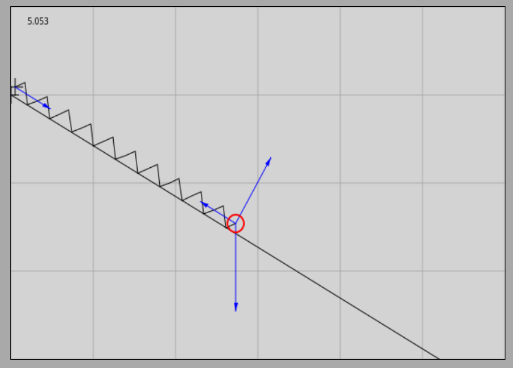
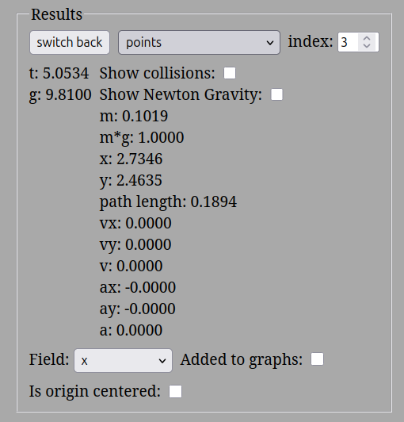
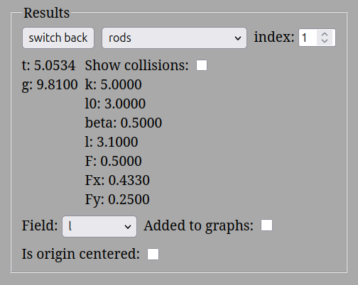
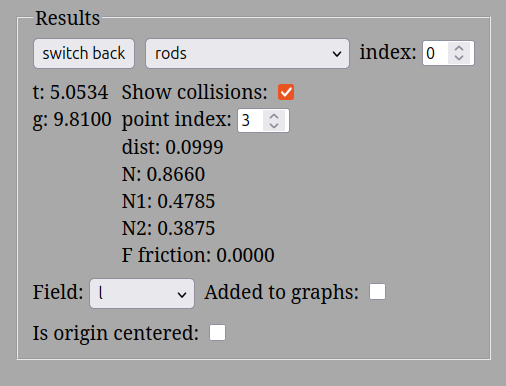
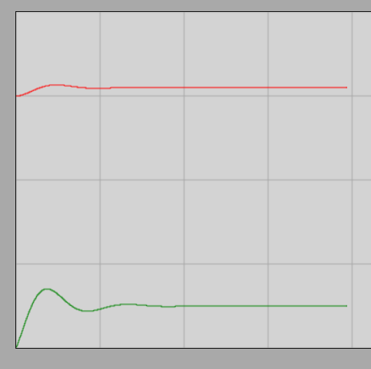

# A lejtő

## Az egyensúly feltétele

Egyensúlyi állapotban a vizsgált testek sebessége és gyorsulása is nulla. Ez az állapot mindaddig változatlan marad, amíg a testet érő külső hatások meg nem változnak.

Newton második törvénye alapján az egyensúlyban lévő testre ható erők eredője nulla, azaz az eredő erő egy nullvektor:

$$
a = 0
$$

$$
F_e = m \cdot a = 0
$$

$$
\vec{F}_e = \vec{F}_1 + \vec{F}_2 + \dots + \vec{F}_n = \vec{0}
$$

A vektorok összeadása egy rögzített koordináta-rendszerben az egyes tengelyirányú koordináták előjeles összeadását jelenti. Ezért az egyensúly feltétele komponensenként a következőképpen írható fel:

$$
F_{ex} = F_{1x} + F_{2x} + \dots + F_{nx} = 0
$$

és

$$
F_{ey} = F_{1y} + F_{2y} + \dots + F_{ny} = 0
$$

## Egyensúly a lejtőn

### Kísérlet
[10 N súlyú test egyensúlya 30 fokos lejtőn (Kísérleti videó)](https://www.youtube.com/watch?v=6w6yRr7y9n8)

A videóban bemutatott kísérlet két alapvető fizikai tényt demonstrál:
1. A $30^\circ$-os lejtőre helyezett $10\text{ N}$ súlyú test megtartásához a lejtővel párhuzamos, pontosan $5\text{ N}$ nagyságú, felfelé mutató tartóerő szükséges.
2. A lejtő felülete a testre egy arra merőleges, úgynevezett normális vagy kényszererőt fejt ki, amely megakadályozza, hogy a test behatoljon a lejtő anyagába. Ez a merőleges erő jelen esetben kisebb, mint a test teljes súlya.

Ha ezt a két kényszererőt pontosan ugyanekkora és ugyanolyan irányú külső erőkkel (például két rugós erőmérővel) helyettesítjük, maga a lejtő el os távolítható: a test továbbra is tökéletesen egyensúlyban lebeg a térben. Ez bizonyítja, hogy a két komponens pontosan kiegyenlíti a test függőlegesen lefelé mutató súlyát.

### Szimuláció
[1 N súlyú test 30 fokos lejtőn interaktív szimulátor](https://alexerdei73.github.io/physics-engine/project/#e22ed2ae-1e97-40f2-858d-f7a8feafd961)

A szimuláció során egy lejtővel párhuzamosan beállított rugó tartja egyensúlyban a $30^\circ$-os, tökéletesen súrlódásmentes lejtőre helyezett $1\text{ N}$ súlyú testet. Az indítást követően a rugó kismértékben megnyúlik, majd néhány másodperces lecsengő oszcilláció után beáll a statikus egyensúly. A szoftver mérései alapján a rugó által kifejtett párhuzamos erő $0{,}5\text{ N}$, a lejtő által biztosított merőleges kényszererő pedig $0{,}8660\text{ N}$. Ezek az értékek pontosan a tizedei a kísérletben látottaknak, hiszen a vizsgált test súlya is hajszálpontosan a tizede a korábbinak.

A rugó jellemzőinek időbeli stabilizálódását az alábbi grafikon szemlélteti:

A piros görbe a rugó aktuális hosszát, míg a zöld görbe a rugalmas erő időbeli alakulását mutatja.

## A formula levezetése

Jelöljük a testre ható nehézségi erőt $\vec{G}$-vel, a lejtő felülete által kifejtett merőleges kényszererőt $\vec{K}$-val, a lejtővel párhuzamos megtartó erőt (amely megakadályozza a lecsúszást) pedig $\vec{F}$-fel. Vegyünk fel egy olyan koordináta-rendszert, amelynek $x$-tengelye a lejtő síkjával párhuzamosan lefelé, az $y$-tengelye pedig a lejtőre merőlegesen, a $\vec{K}$ kényszererő irányába mutat!

Mivel a test egyensúlyban van, a három erő vektori összege nullvektor:

$$
\vec{F} + \vec{K} + \vec{G} = \vec{0}
$$

Írjuk fel a vektoregyenletet tengelyirányú komponensekre bontva:

$$
F_x + K_x + G_x = 0
$$

$$
F_y + K_y + G_y = 0
$$

A felvett tengelyirányok alapján az $\vec{F}$ és $\vec{K}$ erők koordinátái a következők:

$$
F_x = -F,\ \ F_y = 0
$$

$$
K_x = 0,\ \ K_y = K
$$

A függőlegesen lefelé mutató $\vec{G}$ nehézségi erőt fel kell bontanunk a lejtő síkjával párhuzamos $x$, valamint a lejtőre merőleges $y$ komponensekre. Ha berajzoljuk a felbontáshoz szükséges derékszögű háromszöget, geometriailag belátható, hogy a lejtő $\alpha$ hajlásszöge pontosan a lejtővel párhuzamos $G_x$ komponenssel szemközti szögként jelenik meg. Ennek oka, hogy a szög szárai merőlegesek a lejtő alapszögének száraira, és a merőleges szárú hegyesszögek egymással egyenlők.

A szögfüggvények definíciója alapján felírható:

$$
\frac {G_x} {G} = \sin \alpha \implies G_x = G \cdot \sin \alpha
$$

Hasonlóan a merőleges komponensre:

$$
\frac {|G_y|} {G} = \cos \alpha \implies G_y = -G \cdot \cos \alpha
$$

A $G_y$ koordináta azért kapott negatív előjelet, mert iránya a választott $y$-tengellyel (és így a $\vec{K}$ kényszererővel) ellentétes. Helyettesítsük be ezeket a komponenseket a kiindulási egyensúlyi egyenletekbe:

$$
-F + 0 + G \cdot \sin \alpha = 0
$$

$$
0 + K + (-G \cdot \cos \alpha) = 0
$$

Az egyenletek átrendezésével megkapjuk a lejtőn ható erők alapvető képleteit:

$$
F = G \cdot \sin \alpha = m \cdot g \cdot \sin \alpha
$$

$$
K = G \cdot \cos \alpha = m \cdot g \cdot \cos \alpha
$$

### Példa
Ha a test súlya $1\text{ N}$ és a lejtő hajlásszöge $30^\circ$, akkor a képletek alapján:

$$
F = G \cdot \sin \alpha = 1\text{ N} \cdot \sin(30^\circ) = 1\text{ N} \cdot 0{,}5 = 0{,}5\text{ N}
$$

$$
K = G \cdot \cos \alpha = 1\text{ N} \cdot \cos(30^\circ) = 1\text{ N} \cdot 0{,}8660 = 0{,}8660\text{ N}
$$

Mivel a $\vec{K}$ kényszererő és a párhuzamos $\vec{F}$ tartóerő egymásra merőlegesek, ellenőrzésképpen határozzuk meg a vektori összegük nagyságát a Pitagorasz-tétel segítségével:

$$
\sqrt{F^2 + K^2} = \sqrt {0{,}5^2 + 0{,}8660^2} = \sqrt{0{,}25 + 0{,}75} = \sqrt{1} = 1{,}0000\text{ N} = G
$$

A levezetett $\vec{F}$ és $\vec{K}$ erők vektoriális eredője számszerűen pontosan egyenlő a testre ható $\vec{G}$ nehézségi erővel, az iránya pedig függőlegesen felfelé mutat. Így ezek a külső erők együttesen tökéletesen kiegyenlíthetik a gravitációt, ahogyan azt a fizikai valóságban is tapasztaljuk.

## Feladatok

1. Egy $5{,}00\text{ kg}$ tömegű kiskocsi nyugalomban áll egy $20{,}0^\circ$-os hajlásszögű, súrlódásmentes lejtőn. Mekkora a lejtővel párhuzamos $F$ tartóerő, amely megakadályozza, hogy a kocsi leguruljon?
2. Egy $12{,}0\text{ N}$ súlyú testet helyezünk egy $40{,}0^\circ$-os hajlásszögű lejtőre. Mekkora $K$ kényszererővel nyomja a test a lejtő felületét merőlegesen?
3. Egy $35{,}0^\circ$-os lejtővel párhuzamosan rögzített rugós erőmérővel tartunk egyensúlyban egy testet. Az erőmérő kijelzője pontosan $15{,}0\text{ N}$ erőt mutat. Mekkora a vizsgált test tömege?
4. Ugyanazt a $8{,}00\text{ kg}$ tömegű testet először egy $15{,}0^\circ$-os, majd egy $45{,}0^\circ$-os lejtőre helyezzük. Hányszorosára növekszik a lejtővel párhuzamos $F$ tartóerő a meredekebb lejtőn az első állapothoz képest?
5. Egy $30{,}0^\circ$-os lejtőn egy $2{,}50\text{ kg}$ tömegű testet egy rugó tart meg. A rugó pontosan $12{,}3\text{ N}$ erőt fejt ki a testre a lejtő síkjával párhuzamosan, felfelé mutató irányban. Statikus egyensúlyban van-e a test, vagy elindul valamelyik irányba? (Válaszodat a lejtőirányú nehézségi erőkomponens számszerű kiszámításával indokold!)

*A feladatok során a felületek közötti súrlódás mindenütt elhanyagolható, a nehézségi gyorsulás értéke pedig* $g = 9{,}81\text{ }\frac{\text{m}}{\text{s}^2}$*.*
