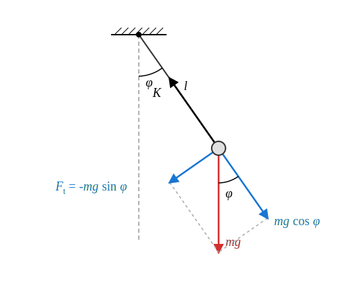
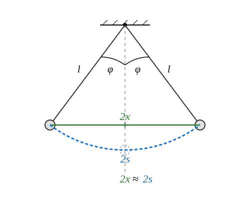

# A matematikai inga

## A matematikai inga fogalma

> **Matematikai inga:** Pontszerű test, mely rögzített hosszúságú, nyújthatatlan, elhanyagolható tömegű fonalon a nehézségi erő hatása alatt végezhet lengéseket. A fonal másik vége a Földhöz rögzített rendszerben rögzítve van. A lengések során a fonal feszes marad.

### Kísérlet

[Kúpinga bemutatása](https://www.youtube.com/watch?v=1R5jpNTSxDg)

A kísérlet szépen mutatja, hogy kis nyílásszögek esetére a kúpinga periódusideje közelítőleg megegyezik a matematikai inga periódusidejével. A kúpinga egyenletes körmozgása szinkronban történik az inga lengéseivel, feltéve, hogy a kúp nyílásszöge megegyezik az inga lengésének szögével és ezeket egyszerre indítják. Ezek szerint az inga jó közelítéssel harmonikus rezgőmozgást végez kis kitérések esetén.

A periódusidőre is azt a képletet kaptuk, amelyet az inga lengéseire fogunk levezetni. Az egyezés azonban csak a kis kúpszögek határesetére igaz!

$$
T = 2\pi \sqrt{ \frac {l \cos \Theta} {g} }
$$

Ha $r$ a keringés sugara és $l$ a fonal hossza, akkor érvényes, hogy:

$$
\cos \Theta = \frac {\sqrt {l^2 - r^2}} {l} = \sqrt {1 - \left(\frac r l\right)^2}
$$

Amennyiben $r \ll l$,

$$
\cos \Theta \approx 1
$$

tehát a következő képletet kapjuk a kis kitérésű inga lengésidejére:

$$
T = 2\pi \sqrt{ \frac l g }
$$

## A mozgásegyenlet

A testre csak a nehézségi erő és a $K$ kötélerő hat. A kötélerő a kötél irányába mutat, míg a nehézségi erő függőlegesen lefelé. Bontsuk fel a nehézségi erőt kötél irányú és rá merőleges, tehát érintő irányú komponenseire! Az inga körmozgást végez, de ez nem egyenletes körmozgás. A kötél irányú komponensekre a következő összefüggés érvényes:

$$
K - mg\cos\phi = ma_{cp} = m\frac {v^2} {l} = ml\omega^2
$$

Ez az egyenlet alkalmas a kötélben ébredő erő meghatározására. Erre most mi nem vagyunk kíváncsiak. A számunkra érdekes egyenlet az érintő irányú komponensekre vonatkozik. Legyen a komponensek pozitív iránya a $\phi$ kitérési szög növekedése által meghatározott irány! Ekkor az érintő irányú erő a következő:

$$
F_t = -mg\sin\phi
$$

Az erő negatív, hiszen a $\phi$ kitérést csökkenteni igyekszik, amennyiben $\phi$ pozitív. Newton második törvénye szerint:

$$
F_t = ma_t
$$

Tehát

$$
ma_t = -mg\sin\phi
$$

Vagyis

$$
a_t = -g\sin\phi
$$

Az érintő irányú gyorsulás előjeles értéke a $\beta$ szöggyorsulásból kapható meg a következőképpen:

$$
a_t = l\beta
$$

Ez igaz, hiszen a körmozgás sugara esetünkben $l$, a fonal hossza.

$$
l\beta = -g\sin\phi
$$

Tehát a mozgásegyenlet végleges alakja a következő:

$$
\beta = - \frac g l \sin\phi
$$

A $\phi$ szögre hasonló egyenletet kaptunk, mint a harmonikus rezgőmozgással analóg mozgásegyenlet. A gyorsulás helyett itt a szöggyorsulás szerepel, de az egyenlet jobb oldalán a $\phi$ szög helyett annak szinusza szerepel. Mi a $\phi$ szög megjelenését várnánk, hisz akkor lehetne az egyenletet koszinusz függvénnyel megoldani az ismeretlen $\phi$ szög időbeli változására, tehát a mozgás ekkor lenne harmonikus rezgőmozgás a $\phi$ szögre! Ez az egyenlet bár megoldható, a megoldása csak felsőbb matematikával lehetséges és ott is nehéz, mivel speciális függvények alkalmazására vezet. Mi más utat választunk.

## Kis szögek határesete

Legyen most a $\phi$ szög igen kicsiny a lengés teljes tartama alatt! Ekkor a szinusz függvény a következő lesz:

$$
\sin\phi = \frac {x} {l} \approx \frac {s} {l} = \phi
$$

Itt a közelítésünk lényege, hogy az $2s$ ívhosszat a hozzá tartozó szelővel pótoltuk, amely egyenes szakasz. Ez nyilván annál pontosabb, minél kisebb a $\phi$ kitérés. Ez azt jelenti, hogy ebben a speciális esetben jogosak az alábbi közelítések:

$$
x \approx s
$$

$$
\sin \phi \approx \phi
$$

Tehát az inga mozgásegyenlete kis kitérések esetén a következő alakot ölti:

$$
\beta = -\frac g l \phi
$$

Vezessük be a következő jelölést!

$$
\omega^2 = \frac g l
$$

Ekkor az egyenlet megoldása periodikus rezgés a $\phi$ szögre. Ha az ingát a szélső helyzetéből sebesség nélkül engedjük el, akkor ez a függvény a következő:

$$
\phi = \phi_{max} \cos(\omega t)
$$

Ezt az egyenletet a fonal $l$ hosszával megszorozva kapjuk, hogy:

$$
s = A\cos(\omega t)
$$

Közelítésünk alapján az $s$ ívhossz a függőleges szimmetriatengelytől mért $x$ távolsággal pótolható, így:

$$
x = A\cos(\omega t)
$$

Ez persze csak akkor igaz, ha az inga $\phi_{max}$ maximális kitérési szöge is igen kicsiny radiánban.

## A periódusidő

$$
\omega^2 = \frac g l
$$

$$
\omega = \frac {2\pi} {T}
$$

$$
\frac {4\pi^2} {T^2} = \frac g l
$$

Vegyük mindkét oldal reciprokát!

$$
\frac {T^2} {4\pi^2} = \frac l g
$$

$$
T^2 = 4\pi^2 \frac l g
$$

Végül mindkét oldalból gyököt vonva kapjuk a következő képletet:

$$
T = 2\pi \sqrt {\frac l g}
$$

Látjuk, hogy a periódusidő nem függ sem az amplitúdótól, sem pedig a lengő test tömegétől. Az amplitúdótól való függetlenség azonban csak a kis kitérések határesetére igaz.

### Példa
Számítsuk ki az $1\text{ m}$ hosszú inga periódusidejét! Ezt szokták másodpercingának is nevezni. Mi ennek az oka?

$$
T = 2\pi \sqrt{\frac l g} = 2 \cdot 3,1415 \cdot \sqrt {\frac{1}{9,81}} = 2,0060\text{ s}
$$

Ennek az ingának a fél periódusa (tehát amíg egyik szélső helyzetből a vele szemben lévő szélső helyzetbe lendül) kb. 1 másodperc. A hiba csak kb. 3 ezrelék, de $g$ és így a hiba is függ kissé a földrajzi helytől.

### Szimuláció

[A matematikai inga](https://alexerdei73.github.io/physics-engine/project/#be74d75b-d4ef-49e0-ac4e-98ff80ff6a54)

A szimulációban a test az alsó, egyensúlyi helyzetből indul egy lökéssel. Az inga hossza $3\text{ m}$, a nehézségi gyorsulás $9,80\ \text{m/s}^2$.
* Mérjük meg az első 10 lengés időtartamát! Mivel az inga nem a szélső helyzetből indul, de nekünk a szélső helyzetben célszerű megállítani a szimulátort, a periódusidő kiszámításához az időt, amit a szimulátor mutat 10,25-tel kell elosszuk, hisz 10 és egy negyed lengést mérünk.
* Számítsuk is ki a lengésidőt az adatokból. Mekkora hibára számíthatunk? Melyik a legfontosabb hibaforrás és mekkora a tényleges hiba?

## Feladatok

1. Egy diák egy olyan matematikai ingát szeretne készíteni az iskolai laboratóriumban, amelynek periódusideje pontosan $2,5\text{ s}$. Milyen hosszú fonalat kell ehhez használnia, ha a nehézségi gyorsulást $g = 9,81\ \text{m/s}^2$-nek tekintjük?

2. Egy űrhajós egy idegen bolygón landol, és egy $0,8\text{ m}$ hosszú matematikai ingával kísérletezik. Azt méri, hogy az inga $15$ teljes lengést pontosan $30\text{ s}$ alatt tesz meg. Mekkora a nehézségi gyorsulás ezen az ismeretlen bolygón?

3. Két matematikai inga lengésidejét hasonlítjuk össze. Az egyik inga fonala pontosan kilencszer olyan hosszú, mint a másik ingáé. Milyen arányban áll egymással a két inga periódusideje? Válaszodat indokold a tanult képlet alapján!