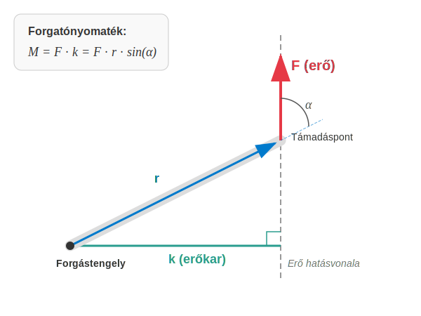

# Merev testek

## A merev test fogalma

Eddig főként olyan testek mozgásával foglalkoztunk, melyek pontszerűeknek voltak tekinthetők mozgásuk során, mivel az elmozdulások méretei jóval nagyobbak voltak, mint a test méretei. Az ilyen tömegpontok forgásával sem foglalkoztunk, a belső szerkezetüket teljesen figyelmen kívül hagytuk. 

Foglalkoztunk még tömegpontok rendszerével is, amikor két vagy több tömegpont együttes mozgását figyeltük meg. Ilyen volt például a kéttest-probléma, vagy a pontrendszerekre vonatkozó tömegközéppont fogalma és a rá vonatkozó tétel. 

> **A merev testek tulajdonképpen speciális pontrendszerek, melyeknél bármely két kiválasztott tömegpont távolsága állandó.**

Ideális merev testek a valóságban nincsenek, hisz bármely szilárd test elegendően nagy erőhatás hatására alakját szemmel láthatóan megváltoztatja. Ilyen változás például autóbaleset esetén a kocsi deformációja, vagy egy rugó elszakadása, ha túlterhelik stb. Sokszor a deformációk kicsik, és a test képes visszanyerni az alakját az erőhatás megszűntével. Ilyen esetre példa a nem túl nagy erővel megfeszített rugó, mely alakját visszanyeri, ha az erőhatás megszűnik. Az ilyen deformációkat rugalmasnak nevezzük, és ezekkel a rugalmasságtan foglalkozik. A merev testeket úgy tekintjük, hogy a fellépő erőhatások olyan kicsinyek, hogy a test deformációi teljesen elhanyagolhatók. 

## A merev test mozgása

A merev test alakját tehát a mozgás során nem változtatja meg, így elmozdulása minden esetben összetevődik egy eltolás és egy elforgatás egymásutánjaként. Tehát a merev test haladó mozgáson kívül forgómozgást is képes végezni. 

## A merev test síkmozgása

Minket leginkább a merev test egy speciális mozgása fog érdekelni. Ilyenkor a merev test pontjai egy síkkal párhuzamosan mozdulnak el, tehát minden pont sebessége párhuzamos ugyanazon megadott síkkal. Az ilyen mozgást a merev test síkmozgásának nevezzük. 

>**Merev test síkmozgásakor a test pontjai egy adott síkkal párhuzamos sebességvektorokkal mozognak.**

Gondoljunk például egy kerék gördülésére, amikor a kerék egyenes vonalon gurul. Ilyenkor a kerék pontjai általában függőleges síkban mozognak, mely párhuzamos a gördülés egyenes irányával. Az ilyen mozgás esetén mi csak a mozgás síkbeli vetületével fogunk foglalkozni, tehát a test térbeli kiterjedése a síkra merőlegesen nem lesz túl fontos. 

Síkmozgás esetén a test helyzetét két pontjának koordinátái meghatározzák. Itt a két pont távolsága nem változik, tehát csak 3 független adat kell. Lehet ez mondjuk a tömegközéppont 2 koordinátája a síkban és a test elfordulási szöge a síkban. Kerék esetében például a középpont általában a tömegközéppont is egyben, és a kerék még az ezen a ponton áthaladó, a mozgás síkjára merőleges képzeletbeli tengely körül el is fordul gördülése során. Az elfordulási szög, mint látni fogjuk, előjeles szám. Ha a test az óramutató járásával ellenkező irányban fordult el a síkban, akkor az elfordulási szög pozitív, ellenkező esetben negatív.

## A forgatónyomaték
Mi az erő megfelelője forgómozgás esetén, ami felelős a forgás gyorsításáért vagy épp lassításáért? Ez a mennyiség a forgatónyomaték.

Itt néhány fogalmat kell megbeszélnünk: 

>**Az erő támadáspontja az a pont, ahol az erő a testre hatását kifejti.**

>**Az erő hatásvonala az az egyenes, mely a támadásponton halad át és az erővektor irányával párhuzamos.**

>**Az erőkar az erő hatásvonalának a forgástengelytől mért távolsága.**

Ezek után könnyen megfogalmazhatjuk a forgatónyomaték definícióját is.

>**Az erő forgatónyomatéka az erő és az erőkar szorzata.**

$$
M = Fk = Fr \sin \alpha
$$

Itt $\alpha$ az a $180\degree$-nál nem nagyobb szög, melyet az erővektor bezár a támadáspont helyvektorával, ha az origó a forgástengely. A szög előjeles forgásszög. Amennyiben az erő pozitív irányba forgat, tehát az óramutató járásával ellentetes értelemben, akkor a szöget pozitívnak, ellenkező esetben negatívnak tekintjük. Így a forgatónyomaték is előjeles szám, hiszen az ilyen szögekre a szinuszfüggvény ugyanolyan előjelű, mint a szög.

### Kísérlet

[Sas Elemér bemutatja a cérnaorsó paradoxont](https://www.youtube.com/watch?v=Fodof4gSIA0&t=8m50s)

### Példák
1. Egy csavarkulcs hossza $30,0 \text{ cm}$. A kulcs végénél $60 \text{ N}$ erőt fejtünk ki. Mikor nagyobb a forgatónyomaték? Az első esetben az erő merőleges a csavarkulcsra. A második esetben az erő a csavarkulccsal $60\degree$ szöget zár be.

$$
M_1 = Fr \sin \alpha = 60 \times 0,3 \times \sin (90\degree) = 18 \text{ Nm}
$$

$$
M_2 = Fr \sin \alpha = 60 \times 0,3 \times \sin (60\degree) = 15,58 \text{ Nm}
$$

Tehát a második esetben kisebb a forgatónyomaték, vagyis az erő forgató hatása.

2. Egy emelő rúdja vízszintesen áll. A forgástengelytől $2,00 \text{ m}$-re van ráhelyezve $20 \text{ kg}$ súly. A forgástengely másik oldalán a rudat függőlegesen lefelé nyomjuk $3,00 \text{ m}$ távolságra a tengelytől $130 \text{ N}$ erővel. A nehézségi gyorsulás $9,81 \frac{\text{m}}{\text{s}^2}$.
Mekkorák a rúdra ható forgatónyomatékok és merre billen a rúd?

$$
|M_1| = F_1 k_1 = m g r_1 = 20 \times 9,81 \times 2 = 392,4 \text{ Nm}
$$

$$
|M_2| = F_2 k_2 = F_2 r_2 = 130 \times 3 = 390,0 \text{ Nm}
$$

Mivel $|M_2|$ kisebb, mint $|M_1|$, ezért a teher felé billen a rúd.

## A nehézségi erő forgatónyomatéka

Nagyon fontos kérdés, hogy hogyan vehető figyelembe a nehézségi erő forgatónyomatéka? Legyen most is a forgástengely az origóban, a z-tengely. A nehézségi erő hasson az y-tengellyel ellentétesen, lefelé. Ekkor az erőkar az x-koordináta lesz.

$$
M_z = \sum_{i = 1}^{N} -m_i g x_i = -Mg \frac{\sum_{i = 1}^{N} m_i x_i}{M} = -Mg x_{TKP}
$$

A nehézségi erő támadáspontja természetesen a függőleges hatásvonal mentén tetszőlegesen eltolható a forgatónyomaték megváltoztatása nélkül. 

>**A nehézségi erő hatása egyesíthető egyetlen erő hatásával, melynek nagysága Mg és támadáspontja a test tömegközéppontja, iránya pedig függőlegesen lefelé mutat.**

Így példák megoldása során a nehézségi erő forgatónyomatéka könnyen kiszámítható.

### Példa
Egy gerenda hossza $6,00 \text{ m}$, tömege $60,0 \text{ kg}$. A vízszintes gerenda alá van támasztva egyik végpontjánál, illetve a másik végponttól $2,00 \text{ m}$ távolságra, mely pont körül elfordulhat. Milyen messze sétálhat a gerendán a $80 \text{ kg}$ tömegű munkás az elfordulási ponttól a szabad vég felé, hogy a gerenda épp ne billenjen le? 

Legyen a szabad vég a jobb oldalon. Ekkor a gerenda tömegközéppontja a forgástengelytől balra, $1,00 \text{ m}$ távolságra van. Mivel ez az oldal "lefelé", azaz az óramutató járásával ellentétes irányba forgatna, a nyomaték pozitív:

$$
M_{z,1} = -Mg x_{TKP} = -60 \times 9,81 \times (-1) = 588,6 \text{ Nm}
$$

A munkás legyen $x$ távolságra a forgásponttól a jobb oldalon. Mivel ő az óramutató járásával megegyező irányba forgatna, a nyomaték negatív:

$$
M_{z,2} = -mgx = -80 \times 9,81 \times x = -784,8x \text{ Nm}
$$

A két külső nyomaték összege épp nulla, amikor a gerenda még nem billen át.

$$
M_{z,e}^k = M_{z,1} + M_{z,2} = 0
$$

$$
588,6 - 784,8x = 0
$$

A megoldás:

$$
x = \frac{588,6}{784,8} = 0,75 \text{ m}
$$

Tehát a munkás nem mehet az alátámasztási ponttól távolabb, mint $0,75 \text{ m}$ a szabad vég felé, anélkül, hogy a gerenda le ne billenjen.

### Kísérlet

[Táncoló baba](https://www.youtube.com/shorts/wuvrJnYLCV8)

## Merev test egyensúlyának feltételei

Korábbról tudjuk, hogy tetszőleges pontrendszer egyensúlyához szükséges, hogy a külső erők eredője nulla legyen. Ez, mint a példákból is láthatjuk, nem elég. Az is kell, hogy a külső erők eredő forgatónyomatéka is nulla legyen.

$$
\sum_{i = 1}^{N} \vec{F_i^k} = \vec{0}
$$

$$
\sum _{i = 1}^{N} M_{z,i}^k = 0
$$

Az utóbbi feltétel síkmozgásra vonatkozik, amely az x-y síkban történne, ha nem volna egyensúly. A teljes egyensúlyhoz mindhárom tengelyre vonatkozó forgatónyomaték 0 kell legyen a háromdimenziós térben. Az egyensúlyhoz a tengely pozíciója nem lényeges, de iránya igen. Mondhatjuk, hogy háromdimenziós térben a pontrendszer egyensúlyának feltétele, hogy tetszőleges tengelyre vonatkozó forgatónyomaték nulla legyen. Merev testekre ez a két feltétel elegendő is, hisz ezek deformációkat nem szenvedhetnek, csak forgó és haladó mozgás lehetséges.

## Gyakorló feladatok

1.  **A létra problémája:** Egy $4,0 \text{ m}$ hosszú, $10 \text{ kg}$ tömegű létra a sima (súrlódásmentes) függőleges falnak támaszkodik. A létra alja $1,5 \text{ m}$ távolságra van a faltól a vízszintes talajon. A talaj nem sima, ott van súrlódás. Mekkora erővel nyomja a létra a falat, és mekkora a függőleges nyomóerő, illetve a vízszintes súrlódási erő a létra aljánál, ha a létra egyensúlyban van? (Tipp: írjuk fel a nyomatéki egyenletet a létra alsó pontjára, majd az erőegyensúlyokat x és y irányban!)
2.  **Híd alátámasztása:** Egy $20,0 \text{ m}$ hosszú, egyenletes tömegeloszlású híd tömege $10 \text{ t}$. A hidat a két végpontjánál (A és B pont) támasztják alá. A hídon megáll egy $5,0 \text{ t}$ tömegű teherautó úgy, hogy a tömegközéppontja az "A" alátámasztástól $5,0 \text{ m}$ távolságra van. Számítsuk ki, mekkora $F_A$ és $F_B$ tartóerő (reakcióerő) ébred a két alátámasztásnál!
3.  **Cégtábla:** Egy üzlet bejárata felett egy $2,0 \text{ m}$ hosszú, $8,0 \text{ kg}$ tömegű, vízszintes rúdra van rögzítve a cégtábla. A rúd egyik vége a falhoz van csuklósan rögzítve, a másik végét egy kötél tartja, amely a fallal $30^\circ$-os szöget zár be (felfelé). A cégtábla tömege $12 \text{ kg}$ és a rúd szabad végén lóg. Mekkora erő feszíti a kötelet?
4.  **Toronydaru:** Egy toronydaru vízszintes gémje aszimmetrikus. A forgástengelytől az egyik irányba $15 \text{ m}$ hosszú a kar (ellensúly oldala), a másik irányba $45 \text{ m}$ (teher oldala). A gém teljes tömege $3 \text{ t}$, súlypontja a tengelyben van (így nem forgat). Az ellensúly tömege $5 \text{ t}$ és a tengelytől $12 \text{ m}$-re helyezték el. Mekkora tömegű terhet emelhetünk fel a gém végén ($45 \text{ m}$-re), hogy a daru még éppen ne billenjen ki az egyensúlyából?
5.  **Talicska:** Egy talicska teljes hossza a kerék tengelyétől a fogantyú végéig $1,5 \text{ m}$. A megrakott talicska súlypontja a kerék tengelyétől $0,5 \text{ m}$ távolságra van. A teher és a talicska együttes tömege $60 \text{ kg}$. 
    *   a) Mekkora függőleges erővel kell emelnünk a fogantyút az egyensúly fenntartásához? 
    *   b) Mekkora erő terheli eközben a talicska kerekének tengelyét?