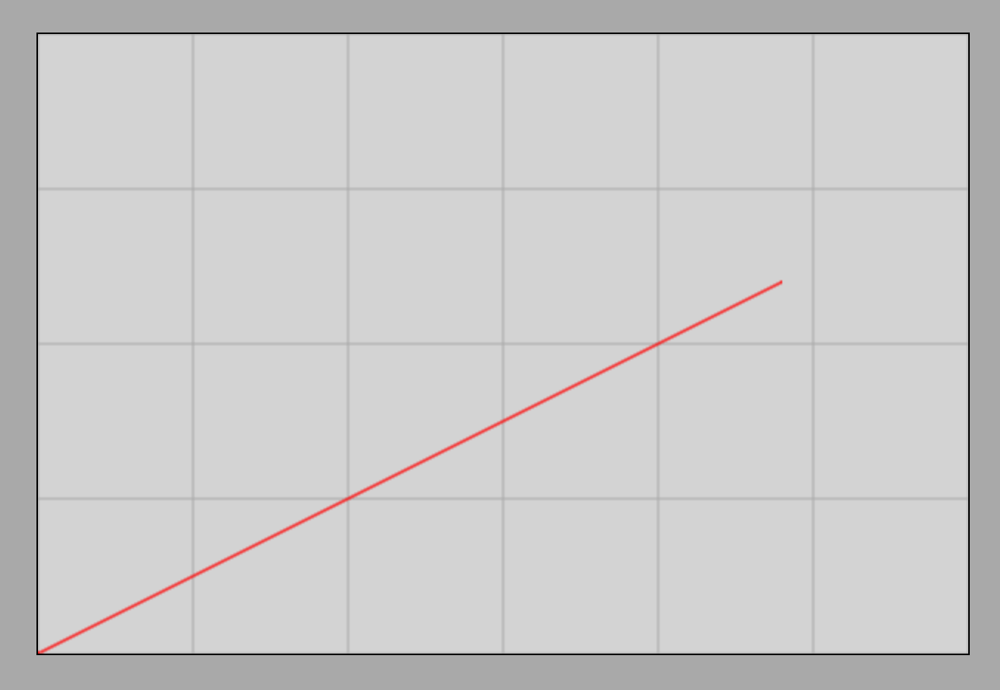
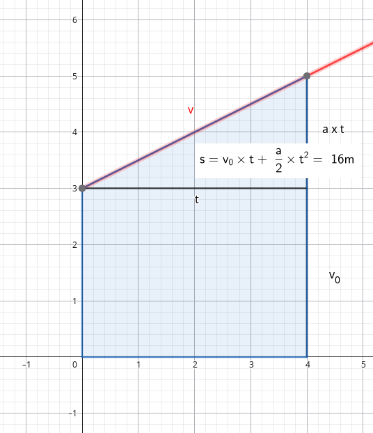

# A négyzetes úttörvény

## Az út kiszámítása
Idézzük fel a sebesség-idő grafikont a lejtőn lefele mozgó test esetére, amikor a gyorsulás $0.5 \frac {m} {s^2}$.

Arra is emlékezunk, hogy a pillanatnyi sebesség görbéje (egyenese) alatti terület általános esetben is a megtett út.

Ez alapján könnyen kiszámíthatjuk a megtett utat abban az esetben, ha a $v_0$ kezdősebesség 0. Ekkor a t időpillanatban elért sebesség:

$$
a = \frac {v - v_0} {t} = \frac {v} {t}
$$

Mindkét oldalt t-vel megszorozva kapjuk, hogy

$$
v = a \times t
$$

Most egy derékszögü háromszög területét kell meghatároznunk, melynek derékszögü csúcsa az idő tengelyen (vízszintes tengely) van a t időpontnal. Az egyik befogó tehát $t$, a másik pedig $a \times t$. A derékszögü háromszög területe az pont fele a téglalap területének, tehát:

$$
s = \frac {(a \times t) \times t} {2}
$$

A keresett formula melyet négyzetes úttörvénynek nevezunk:

$$
s = \frac {a} {2} \times t^2
$$

> **Az nulla kezdősebességű egyenletesen gyorsuló mozgás által megtett út az idő négyzetével egyenesen arányos, az arányossági tényező a gyorsulás fele.**

### Példa
Mekkora utat tesz meg az álló helyzetből lejtőn lecsúszó test 4s alatt, ha gyorsulása $0.5 \frac {m} {s^2}$?

$$
s = \frac {a} {2} \times t^2 = \frac {0.5 \frac {m} {s^2}} {2} \times 16s^2 = 4m
$$

Ez a példa pont a grafikonon ábrázolt mozgás. Látszik azonban a grafikonról, hogy a sebesség egyenese alatti terület 4s-ig az pont 4 egység négyzet (2 egész négyzet és 2 ketté vágott egész négyzet).

## Az út-idő grafikon
Vizsgáljuk most meg az út-idő grafikont, amit megkaphatunk a szimuláció alapján is. Erről is nyilvánvalóan 4m-t kell leolvassunk 4s idő elteltékor.

[Súrlódás mentes mozgás lejtőn](https://alexerdei73.github.io/physics-engine/project/#94f47c36-ead0-4d85-a1ff-ac1827797ce9)

Gyakorlásképp nézzük meg az út-idő grafikon képét a szimuláció alapján! A következő grafikont kell kapnunk:

Látszik is, hogy valóban a megtett út 4m, 4s idő elteltével. A görbe neve parabola.

## Négyzetes úttörvény kezdősebességgel

Ha van kezdősebesség is, akkor a sebesség-idő grafikon a következő:

Nézzük meg az elért sebességet!

$$
a = \frac {v - v_0} {t}
$$

$$
v - v_0 = a \times t
$$

$$
v = v_0 + a \times t
$$

A megtett út most a trapéz területe. Ez a terület látjuk, hogy a korábbi derékszögű háromszög területe és egy téglalap területének az összege. A téglalap oldalai $t$ és $v_0$, tehát a területe $v_0 \times t$.
Így a formula, amit keresünk:

$$
s = v_0 \times t + \frac {a} {2} \times t^2
$$

Másképp is eljuthatunk ehhez a formulához. Tudjuk, hogy a trapéz területe a párhuzamos oldalak átlaga szorozva a párhuzamos oldalak távolságával. A párhuzamos oldalak $v_0$ és $v$, a távolságuk pedig $t$. Eszerint:

$$
s = \frac {v_0 + v} {2} \times t
$$

Ezt az összefüggést osztva $t$-vel az átlagsebességre kapjuk:

$$
\overline{v} = \frac{s}{t} = \frac{v_0 + v}{2}
$$

>**Az egyenletesen gyorsuló mozgás átlagsebessége a kezdő és végsebesség átlaga**

Más mozgásokra ez a megállapítás nem érvényes.

Nézzük megkapjuk-e némi algebrai átalakítással a megtett út kiszámítására szolgáló összefüggést!

$$
s = \frac {v_0 + v} {2} \times t = \frac {v_0 + v_0 + a \times t} {2} \times t = \frac{1} {2} \times (2v_0 + a \times t) \times t = \frac {1} {2} \times (2v_0 \times t + a \times t^2) = v_0 \times t + \frac {a} {2} \times t^2
$$

Így megkaptuk az összefüggést ezen a másik úton is.

### Példa
A lejtőn lefelé csúszó test súrlódás nélkül mozog $0.5 \frac {m} {s^2}$ gyorsulással és kezdősebessége $3 \frac {m} {s}$. Mekkora lesz a test sebessége az indítás után $4s$-kor? Mekkora utat tesz meg ezalatt?

$$
a = \frac {v - v_0} {t}
$$

Behelyettesítve az adatokat, az ismeretlen sebességet x-el jelölve:

$$
0.5 = \frac {x - 3} {4}
$$

Megoldjuk az egyenletet.

$$
2 = x - 3
$$

$$
5 = x
$$

Tehát a test sebessége $4s$-kor $5 \frac {m} {s}$.

Az utat egyszerű behelyettesítéssel számítjuk ki.

$$
s = v_0 \times t + \frac {a} {2} \times t^2 = 3 \times 4 + \frac {0.5} {2} \times 4^2 = 12 + 0.25 \times 16 = 16m
$$
