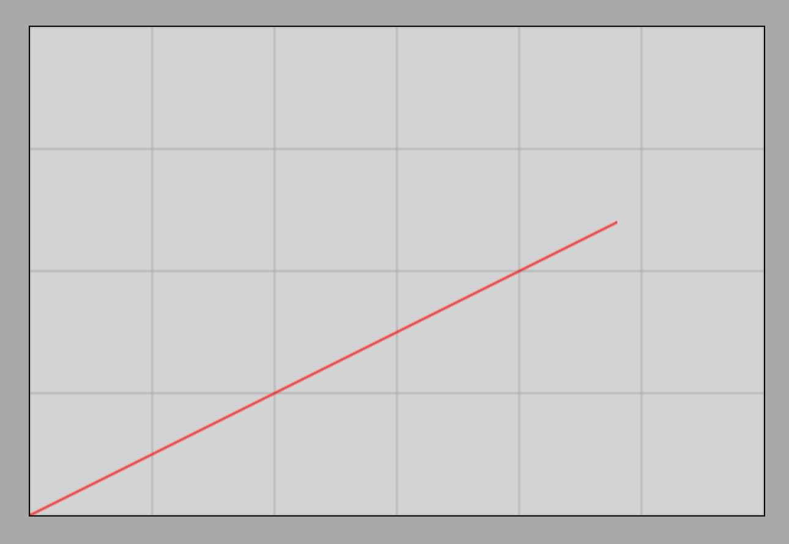
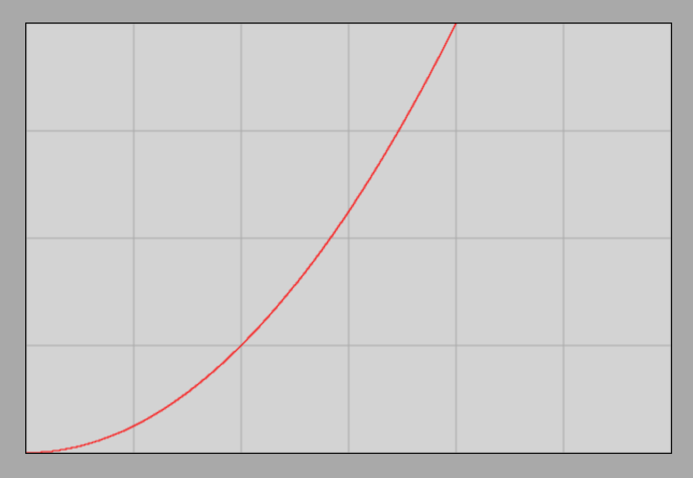
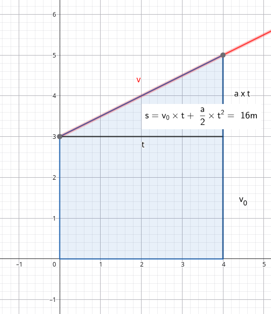

# A négyzetes úttörvény

## Az út kiszámítása
Idézzük fel a sebesség-idő grafikont a lejtőn lefelé mozgó test esetére, amikor a gyorsulás $0{,}5\text{ }\frac{\text{m}}{\text{s}^2}$.

Arra is emlékezünk, hogy a pillanatnyi sebesség görbéje (egyenese) alatti terület általános esetben is a megtett út.

Ez alapján könnyen kiszámíthatjuk a megtett utat abban az esetben, ha a $v_0$ kezdősebesség $0$. Ekkor a $t$ időpillanatban elért sebesség:

$$
a = \frac {v - v_0} {t} = \frac {v} {t}
$$

Mindkét oldalt $t$-vel megszorozva kapjuk, hogy:

$$
v = a \cdot t
$$

Most egy derékszögű háromszög területét kell meghatároznunk, melynek derékszögű csúcsa az időtengelyen (vízszintes tengely) van a $t$ időpontnál. Az egyik befogó tehát $t$, a másik pedig $a \cdot t$. A derékszögű háromszög területe éppen fele a téglalap területének, tehát:

$$
s = \frac {(a \cdot t) \cdot t} {2}
$$

A keresett formula, melyet négyzetes úttörvénynek nevezünk:

$$
s = \frac {a} {2} \cdot t^2
$$

> **A nulla kezdősebességű egyenletesen gyorsuló mozgás által megtett út az idő négyzetével egyenesen arányos, az arányossági tényező a gyorsulás fele.**

### Példa
Mekkora utat tesz meg az álló helyzetből lejtőn lecsúszó test $4\text{ s}$ alatt, ha gyorsulása $0{,}5\text{ }\frac{\text{m}}{\text{s}^2}$?

$$
s = \frac {a} {2} \cdot t^2 = \frac {0{,}5\text{ }\frac{\text{m}}{\text{s}^2}} {2} \cdot 16\text{ s}^2 = 4\text{ m}
$$

Ez a példa pont a grafikonon ábrázolt mozgás. Látszik azonban a grafikonról, hogy a sebesség egyenese alatti terület $4\text{ s}$-ig az pont $4\text{ egységnégyzet}$ (2 egész nagy négyzet és 2 kettévágott egész négyzet).

## Az út-idő grafikon
Vizsgáljuk most meg az út-idő grafikont, amit megkaphatunk a szimuláció alapján is. Erről is nyilvánvalóan $4\text{ m}$-t kell leolvassunk $4\text{ s}$ idő elteltével.

[Súrlódásmentes mozgás lejtőn simulátor](https://github.io)

Gyakorlásképp nézzük meg az út-idő grafikon képét a szimuláció alapján! A következő grafikont kell kapnunk:

Látszik is, hogy valóban a megtett út $4\text{ m}$, $4\text{ s}$ idő elteltével. A görbe neve parabola.

## Négyzetes úttörvény kezdősebességgel

Ha van kezdősebesség is, akkor a sebesség-idő grafikon a következő:

Nézzük meg az elért sebességet!

$$
a = \frac {v - v_0} {t}
$$

$$
v - v_0 = a \cdot t
$$

$$
v = v_0 + a \cdot t
$$

A megtett út most a trapéz területe. Ez a terület láthatóan a korábbi derékszögű háromszög területe és egy téglalap területének az összege. A téglalap oldalai $t$ és $v_0$, tehát a területe $v_0 \cdot t$.
Így a formula, amit keresünk:

$$
s = v_0 \cdot t + \frac {a} {2} \cdot t^2
$$

Másképp is eljuthatunk ehhez a formulához. Tudjuk, hogy a trapéz területe a párhuzamos oldalak átlaga szorozva a párhuzamos oldalak távolságával. A párhuzamos oldalak $v_0$ és $v$, a távolságuk pedig $t$. Eszerint:

$$
s = \frac {v_0 + v} {2} \cdot t
$$

Ezt az összefüggést osztva $t$-vel az átlagsebességre kapjuk:

$$
\overline{v} = \frac{s}{t} = \frac{v_0 + v}{2}
$$

> **Az egyenletesen gyorsuló mozgás átlagsebessége a kezdő- és végsebesség számtani átlaga.**

Más mozgásokra ez a megállapítás nem érvényes.

Nézzük meg, megkapjuk-e némi algebrai átalakítással a megtett út kiszámítására szolgáló összefüggést!

$$
s = \frac {v_0 + v} {2} \cdot t = \frac {v_0 + v_0 + a \cdot t} {2} \cdot t = \frac{1} {2} \cdot (2v_0 + a \cdot t) \cdot t = \frac {1} {2} \cdot (2v_0 \cdot t + a \cdot t^2) = v_0 \cdot t + \frac {a} {2} \cdot t^2
$$

Így megkaptuk az összefüggést ezen a másik úton is.

### Példa
A lejtőn lefelé csúszó test súrlódás nélkül mozog $0{,}5\text{ }\frac{\text{m}}{\text{s}^2}$ gyorsulással és kezdősebessége $3\text{ }\frac{\text{m}}{\text{s}}$. Mekkora lesz a test sebessége az indítás után $4\text{ s}$-kor? Mekkora utat tesz meg ezalatt?

$$
a = \frac {v - v_0} {t}
$$

Behelyettesítve az adatokat, az ismeretlen sebességet $x$-szel jelölve:

$$
0{,}5 = \frac {x - 3} {4}
$$

Megoldjuk az egyenletet:

$$
2 = x - 3
$$

$$
5 = x
$$

Tehát a test sebessége $4\text{ s}$-kor $5\text{ }\frac{\text{m}}{\text{s}}$.

Az utat egyszerű behelyettesítéssel számítjuk ki:

$$
s = v_0 \cdot t + \frac {a} {2} \cdot t^2 = 3 \cdot 4 + \frac {0{,}5} {2} \cdot 4^2 = 12 + 0{,}25 \cdot 16 = 16\text{ m}
$$
