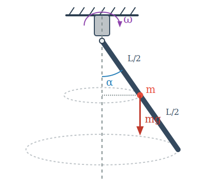

# Egy nehéz feladat a forgómozgásra

## Példa
Egy $m$ tömegű, $L$ hosszúságú rúd a tetején csapágyazva van, és függőleges síkban lengéseket képes végezni. A rúd a csapágyazással együtt képes forogni a csapágyon átmenő függőleges tengely körül. Egy motor megforgatja a csapágyazást, és $\omega$ szögsebességű forgásban tartja. Mekkora $\alpha$ szöget zár be a rúd a függőlegessel forgása közben, ha ez a szög állandó?

A rúd pontjai körmozgást végeznek vízszintes síkban, tehát gyorsulásuk a centripetális gyorsulás. Az $\alpha$ szög nem változik, tehát a rúdnak nincs szöggyorsulása a vele együtt forgó koordináta-rendszerben. Van-e szöggyorsulás az inerciarendszerben? Ha felbontjuk a pontok gyorsulását rúdirányú és rúdra merőleges komponensre, akkor nem nulla $\alpha$ szög esetén lesz a rúdra merőleges gyorsulás, amely szöggyorsulást jelent a vízszintes forgástengelyre vonatkozóan. 

$$
a_{i,t} = r_i \sin \alpha \cdot \omega^2 \cos \alpha
$$

$$
\beta = \frac {a_{i,t}} {r_i} = \omega^2 \sin\alpha \cos \alpha
$$

Írjuk fel a forgómozgás alapegyenletét a vízszintes tengelyre, mely körül a rúd elfordulhat!

$$
M_{y,e}^k = \Theta_{\text{rúd}} \beta
$$

Egyedül a nehézségi erőnek van nyomatéka.

$$
M_{y,e}^k = mg\frac {L} {2} \sin \alpha
$$

Beírva ezeket és $\Theta_{\text{rúd}}$ értékét, a következő egyenletet kapjuk:

$$
mg \frac {L} {2} \sin \alpha = \frac {1} {3} mL^2 \omega^2 \sin\alpha \cos\alpha
$$

$$
\left( \frac {g} {2} - \frac {L\omega^2} {3}\cos\alpha \right)\sin\alpha = 0
$$

Ennek az egyenletnek általában két megoldása van.

1. 

$$
\sin \alpha = 0
$$

$$
\alpha = 0
$$

Ez stabil megoldás kis $\omega$ szögsebesség esetén. Egészen pontosan addig, amíg nem létezik a második megoldás.

2. 

$$
\frac {g} {2} = \frac {L\omega^2} {3} \cos\alpha
$$

Innen kifejezhetjük $\cos \alpha$-t:

$$
\cos \alpha = \frac {3g} {2L\omega^2}
$$

$$
\cos \alpha \leq 1
$$

Így $\omega$-nak nagyobbnak kell lennie egy minimális értéknél, hogy ez a megoldás létezhessen:

$$
\frac {3g} {2L\omega^2} \leq 1
$$

$$
\sqrt {\frac {3g} {2L}} \leq \omega
$$

Megmutatható, hogy amikor ez a megoldás létezik, akkor ez a stabil megoldás.

## Analógia a haladó és forgó mozgás közt

| Haladó mozgás | Forgó mozgás |
| :--- | :--- |
| Út ($s = r\phi$) | Szög ($\phi$) |
| Sebesség ($v = r\omega$) | Szögsebesség ($\omega$) |
| Gyorsulás ($a = r\beta$) | Szöggyorsulás ($\beta$) |
| Erő ($F$) | Forgatónyomaték ($M = Fr\sin\alpha$) |
| Tömeg ($m$) | Tehetetlenségi nyomaték ($\Theta = \sum_{i = 1}^{N}m_ir_i^2$) |
| Lendület / Impulzus ($I = mv$) | Perdület / Impulzusmomentum ($N = Ir\sin\alpha = \Theta \omega$) |
| $F_e = ma$ | $M_e = \Theta \beta$ |
| $\vec{F}_e = \frac {\Delta \vec{I}} {t}, t \to 0$ | $\vec{M}_e = \frac {\Delta \vec{N}} {t}, t \to 0$ |
| $E_{mozg} = \frac {mv^2} {2}$ | $E_{forg} = \frac {\Theta \omega^2} {2}$ |
 
## Feladatok

**1. Feladat (Támaszerők)**  
Határozd meg a csapágyra ható támaszerő vízszintes és függőleges komponensét a fenti példában abban az esetben, amikor a motor $\omega > \sqrt {\frac {3g} {2L}}$ szögsebességgel forog, és a rúd beállt a stabil $\alpha > 0$ egyensúlyi helyzetébe!

**2. Feladat (Forgó gyűrű)**  
Egy $R$ sugarú, vékony drótból készült körgyűrű a függőleges átmérője körül állandó $\omega$ szögsebességgel forog. Egy $m$ tömegű kis gyöngyszem súrlódásmentesen csúszhat a gyűrűn. 
* a) Milyen $\omega$ szögsebesség esetén lesz a gyöngyszem stabil egyensúlyi helyzete a gyűrű legalsó pontján kívül?
* b) Határozd meg ezt az egyensúlyi helyzetet (a függőlegessel bezárt $\varphi$ szöget) a szögsebesség függvényében!