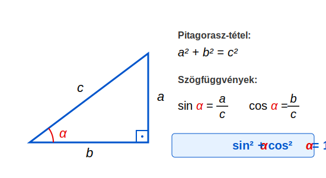
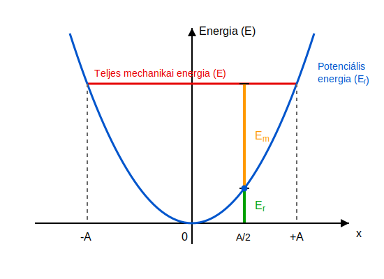

# A harmonikus rezgőmozgás energiája

## Példa 
Egy $200 \text{ N/m}$ rugóállandójú rugó egyik vége rögzített egy vízszintes, súrlódásmentes asztalon. A rugó másik végén egy $10 \text{ g}$ tömegű test rezgőmozgást végez $0,2 \text{ m}$ amplitúdóval.
* Mekkora a körfrekvencia?
* Mekkora a rugó rugalmas energiája a maximális kitérés esetében?
* Mekkora a test maximális sebességének nagysága?
* Mekkora a test legnagyobb mozgási energiája?
* Számítsuk ki a kitérést és a sebesség előjeles értékét $t = 0,01 \text{ s}$-kor! A test a $+A$ helyzetből indul.
* Számítsuk ki a mozgási és a helyzeti energia összegét ugyanebben az időpillanatban!

$$
\omega = \sqrt{\frac{D}{m}} = \sqrt{\frac{200}{0,01}} \approx 141,42 \text{ s}^{-1}
$$

A rugalmas energia a szélső helyzetben maximális, amikor a kitérés egyenlő az amplitúdóval, tehát a maximális kitéréssel.

$$
E_{r,\text{max}} = \frac{D A^2}{2} = \frac{200 \cdot 0,2^2}{2} = 4 \text{ J}
$$

A sebesség maximális értéke a körmozgás analógiája alapján – ahol a sugár az amplitúdó – a következő:

$$
v_{x,\text{max}} = A\omega = 0,2 \cdot 141,42 \approx 28,284 \text{ m/s}
$$

A maximális mozgási energia tehát:

$$
E_{m,\text{max}} = \frac{m v_{x,\text{max}}^2}{2} = \frac{0,01 \cdot 28,284^2}{2} \approx 4,000 \text{ J}
$$

Számítsuk ki a kitérést és a sebességet $t = 0,01 \text{ s}$-kor!

$$
x = A\cos(\omega t) = 0,2\cos(141,42 \cdot 0,01) \approx 0,031191 \text{ m}
$$

$$
v_x = -A\omega\sin(\omega t) = -0,2 \cdot 141,42 \cdot \sin(141,42 \cdot 0,01) \approx -27,938 \text{ m/s}
$$

Számítsuk ki a teljes mechanikai energiát is!

$$
E = \frac{m v_x^2}{2} + \frac{D x^2}{2} = \frac{0,01 \cdot (-27,938)^2}{2} + \frac{200 \cdot 0,031191^2}{2} \approx 4,000 \text{ J}
$$

Láthatjuk, hogy a teljes energia mindig $4 \text{ J}$, függetlenül a test kitérésétől vagy az időtől.

## Pitagorasz-tétel a trigonometriában

Legyen egy derékszögű háromszög két befogója $a$ és $b$, az átfogója pedig $c$! Ekkor a Pitagorasz-tétel a következő:

$$
a^2 + b^2 = c^2
$$

$$
\left(\frac{a}{c}\right)^2 + \left(\frac{b}{c}\right)^2 = 1
$$

Tudjuk, hogy a trigonometrikus függvények definíciója a derékszögű háromszögben a következő:

$$
\sin \alpha = \frac{a}{c}
$$

$$
\cos \alpha = \frac{b}{c}
$$

Ezeket behelyettesítve az előző összefüggésbe, megkapjuk a Pitagorasz-tétel szögfüggvényekkel kifejezett alakját:

$$
\sin^2\alpha + \cos^2 \alpha = 1
$$

## A harmonikus rezgőmozgás mechanikai energiája

Határozzuk meg most az eddig vizsgált veszteségmentes esetben a harmonikus rezgőmozgást végző test mechanikai energiáját, tehát a mozgási energia és a rugalmas helyzeti energia összegét! Ehhez már minden összefüggést ismerünk.

$$
E = E_m + E_r = \frac{m v_x^2}{2} + \frac{D x^2}{2}
$$

Ismerjük a harmonikus rezgőmozgás kitérésének és sebességének kiszámítását is:

$$
x = A\cos(\omega t)
$$

$$
v_x = -A\omega\sin(\omega t)
$$

Ezeket az összefüggéseket behelyettesítjük, és elvégezzük az algebrai műveleteket:

$$
E = \frac{m A^2 \omega^2 \sin^2(\omega t)}{2} + \frac{D A^2 \cos^2(\omega t)}{2}
$$

Most tekintetbe vesszük az $\omega$ kiszámítására szolgáló összefüggést:

$$
\omega^2 = \frac{D}{m}
$$

Ezt is helyettesítsük be!

$$
E = \frac{D A^2 \sin^2(\omega t)}{2} + \frac{D A^2 \cos^2(\omega t)}{2} = \frac{D A^2}{2} \left( \sin^2(\omega t) + \cos^2(\omega t) \right)
$$

A Pitagorasz-tétel trigonometrikus alakját felhasználva láthatjuk, hogy az energia állandó a harmonikus rezgőmozgás során!

$$
E = \frac{D A^2}{2} = \frac{m \omega^2 A^2}{2} = \frac{m v_{x,\text{max}}^2}{2}
$$

Itt felhasználtuk újra a $D = m\omega^2$ és a $v_{x,\text{max}} = A\omega$ összefüggéseket.

> **A harmonikus rezgőmozgás energiája időben állandó, feltéve, hogy nincsenek veszteségek, mint például súrlódás vagy közegellenállás. Az összenergia az amplitúdó négyzetével arányos.**

## A harmonikus rezgőmozgás potenciálisenergia-függvénye

Ábrázoljuk grafikonon a rugóra kötött test potenciális energiáját a kitérés függvényében! Egy parabola alakú görbét kapunk. Ha behúzzuk az állandó energiának megfelelő vízszintes egyenest, ez metszi a parabolát, méghozzá az $x = \pm A$ pontokban. Mivel a mozgási energia nem válhat negatívvá, ezért a test csak e két pont között helyezkedhet el. A nem negatív mozgási energia és a potenciális energia összege minden pontban az összenergiát adja.

### Példa
Határozzuk meg az előző példában rezgő test potenciális energiáját és mozgási energiáját az $x = \pm \frac{A}{2}$ pontokban, tehát $x = \pm 0,1 \text{ m}$ esetén!

Láttuk, hogy a teljes energia $4 \text{ J}$. Ha a kitérés nagysága a fél amplitúdó, akkor a potenciális energia a teljes energia negyede, tehát $1 \text{ J}$, a mozgási energia pedig $3 \text{ J}$.

## Feladatok

1. Egy harmonikus rezgőmozgást végző test teljes mechanikai energiája $12 \text{ J}$. A rugóállandó $600 \text{ N/m}$. Határozd meg a rezgés amplitúdóját!
2. Egy $0,5 \text{ kg}$ tömegű test harmonikus rezgőmozgást végez. Amikor a test kitérése $0,05 \text{ m}$, a sebessége $2 \text{ m/s}$. A rezgés körfrekvenciája $10 \text{ rad/s}$. Határozd meg a test teljes mechanikai energiáját és az amplitúdót!
3. Melyik kitérési pontban (az amplitúdó függvényében kifejezve) lesz a harmonikus rezgőmozgást végző test mozgási energiája pontosan egyenlő a rugalmas potenciális energiájával?