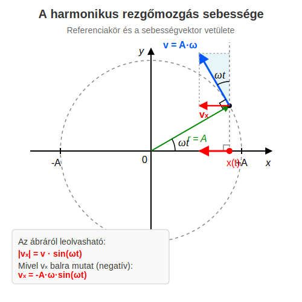

# A harmonikus rezgőmozgás sebessége

## A sebesség meghatározása
A harmonikus rezgőmozgás esetén a sebesség nyilván a mozgás egyenesébe esik, de vajon hogyan változik, hiszen a kitérés látszólag bonyolultan, folyamatosan változik. Szerencsére az egyenletes körmozgással való kapcsolat itt is segít. Ennek ismerjük a sebességét. Mivel a körmozgást végző test $x$-koordinátája pontosan egyenlő a rezgőmozgást végző test $x$-koordinátájával minden pillanatban, így világos, hogy a testek sebességeinek $x$-komponensei is minden pillanatban megegyeznek! Az átlagsebesség ugyanis:

$$
\overline {v_x} = \frac {x - x_0} {t}
$$

Ez természetesen nem egyezik a pillanatnyi sebességgel, de ha a $t$ időtartamot oly kicsinyre választjuk, hogy a sebesség változása ezen idő alatt már elhanyagolhatóan kicsiny, akkor az átlagsebesség már számítási pontosságunkon belül megegyezik a pillanatnyi sebességgel. Így látható, hogy a pillanatnyi sebesség csakugyan minden pillanatban meg kell egyezzen a körmozgást végző test sebességének $x$-komponensével.

A körmozgást végző test sebessége $r\omega$ nagyságú és minden pillanatban érintő irányú, vagyis a függőleges, $y$-tengely irányába mutató egyenessel $\omega t$ szöget zár be. Így azt kapjuk, hogy:

$$
v_x = -A\omega \sin (\omega t)
$$

Itt felhasználtuk, hogy az eddigiek alapján $r = A$ a rezgőmozgás esetén. A test $t = 0$-kor az $x = +A$ helyzetben van, ahogy azt az előző leckében is feltételeztük.

### Példa
Harmonikus rezgőmozgást végző, rugóra akasztott test kitérését leíró függvény:

$$
x = 0{,}2 \cos (4\pi \cdot t)
$$

Itt $x$ méterben (m), $t$ pedig másodpercben (s) értendő! Keresésük meg a mozgás legfontosabb paramétereit!
* Mennyi az amplitúdó?  
* Mennyi a körfrekvencia? 
* Írjuk fel a $v_x$ sebességet leíró összefüggést! 
* Mekkora a kitérés és a sebesség előjeles értéke $t = 0{,}1\text{ s}$-kor?
* Mekkora a sebesség maximális értéke?

A kitérés-idő függvény általános alakjából, amely $x = A \cos(\omega t)$ leolvasható:
  
$$
A = 0{,}2\text{ m}
$$

Szintén a függvényből leolvasható a $t$ szorzója:
  
$$
\omega = 4 \pi \text{ rad/s}
$$

A $v_x = -A\omega \sin(\omega t)$ összefüggésbe behelyettesítve az ismert adatokat ($-0{,}2 \cdot 4\pi = -0{,}8\pi$):
  
$$
v_x(t) = -0{,}8\pi \sin (4\pi \cdot t)
$$
  
A kitérés értéke az eredeti függvénybe behelyettesítve:
  
$$
x = 0{,}2 \cos (4 \pi \cdot 0{,}1) = 0{,}06180\text{ m}
$$

A sebesség értéke az általunk felírt sebességfüggvénybe behelyettesítve:
  
$$
v_x = -0{,}2 \cdot 4 \pi \cdot \sin (4 \pi \cdot 0{,}1) = -2{,}390\text{ m/s}
$$

A sebesség akkor maximális, ha a szinuszos tag értéke 1 (vagy -1). Így a maximális sebesség nagysága:
  
$$
v_{\max} = A\omega = 0{,}2 \cdot 4\pi \approx 2{,}513\text{ m/s}
$$

## Feladatok

1. Egy harmonikus rezgőmozgást végző test kitérés-idő függvénye: $x(t) = 0{,}5 \sin(2\pi \cdot t)$ (ahol a mértékegységek az SI-rendszernek megfelelőek). Határozd meg a rezgés amplitúdóját, periódusidejét, valamint a test maximális sebességét!

2. Egy vízszintes felületen, rugóhoz rögzített test harmonikus rezgőmozgást végez. A mozgás amplitúdója $A = 4\text{ cm}$, rezgésideje (periódusideje) pedig $T = 2\text{ s}$. Írd fel a test $v_x(t)$ sebesség-idő függvényét, feltételezve, hogy a test a $t = 0\text{ s}$ pillanatban a pozitív maximális kitérés ($+A$) helyén volt!

3. Egy harmonikus rezgőmozgást végző pontszerű test maximális sebessége $v_{\max} = 3\text{ m/s}$, körfrekvenciája pedig $\omega = 10\text{ s}^{-1}$. Mekkora a test sebességének nagysága abban a pillanatban, amikor a kitérése pontosan az amplitúdó fele ($x = A/2$)?