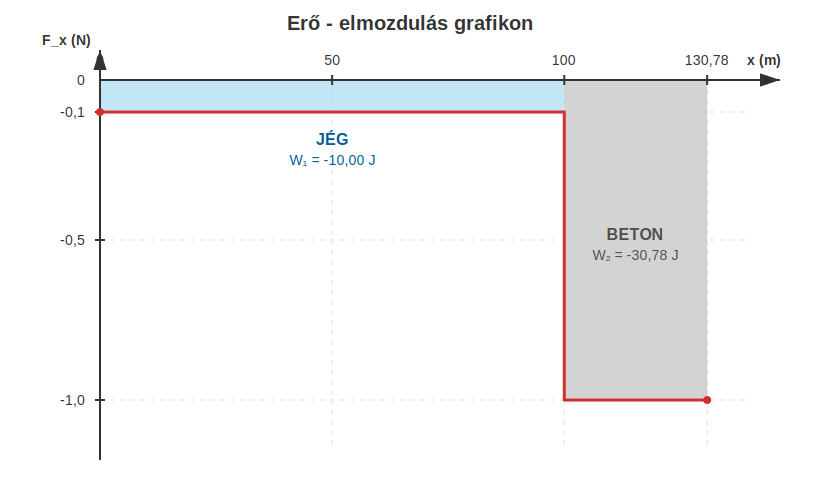
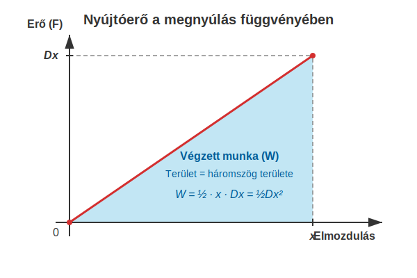

# A rugalmas energia

## Változó erő munkája

### Példa
Egy $203,9\text{ g}$ tömegű jégkorong csúszik a jégen. A korong kezdősebessége $20\text{ m/s}$. A csúszási súrlódási együttható a jég és a korong között $0,05$. A korong az első $100\text{ m}$ megtétele után lecsúszik a pályáról és a betonon csúszik, ahol a súrlódási együttható $0,5$.
* Mekkora erő lassítja a korongot a jégen?
* Mekkora sebességre lassul le a korong, mikor a betonra ér?
* Mekkora erő lassítja a korongot a betonon?
* Mekkora utat tesz meg a korong a betonon a megállásig?
* Mekkora a súrlódási erő munkája a jégen?
* Mekkora a súrlódási erő munkája a betonon?
* Rajzoljuk fel a súrlódási erő grafikonját a megtett út függvényében! Mekkora a grafikon görbéje alatti terület?

Mozogjon a korong az x-tengely irányában. Ekkor az x-komponensekkel dolgozhatunk.

$$
F_{x,1} = -\mu_1 mg = -0,05 \cdot 0,2039 \cdot 9,81 = -0,1000\text{ N}
$$

$$
a_{x,1} = \frac {F_{x,1}} {m} = \frac {-0,1000} {0,2039} = -0,4905\text{ m/s}^2
$$

$$
s_1 = v_{x,0}t + \frac {a_{x,1}} {2}t^2
$$

$$
100 = 20t + \frac {-0,4905} {2}t^2
$$

$$
0,4905t^2 - 40t + 200 = 0
$$

$$
t = \frac {-b \pm \sqrt{b^2 - 4ac}} {2a} = \frac {40 \pm \sqrt{40^2 - 4 \cdot 0,4905 \cdot 200}} {2 \cdot 0,4905} = \frac {40 \pm 34,75} {0,981} = 5,351\text{ s}, \quad 76,19\text{ s}
$$

A másodfokú egyenlet két megoldása közül a rövidebb idő a fizikailag helyes (a hosszabb idő azt jelentené, hogy a test a megállás után visszafelé indulna, de a súrlódás miatt ez nem történik meg). Tehát az idő $5,351\text{ s}$.

$$
v_x = v_{x,0} + a_{x,1}t = 20 + (-0,4905) \cdot 5,351 = 17,38\text{ m/s} \quad \text{(pontosabban: } 17,375\text{ m/s)}
$$

A további számolási hibák elkerülése végett a pontos $17,375\text{ m/s}$ értékkel számolunk tovább.

$$
F_{x,2} = -\mu_2 mg = -0,5 \cdot 0,2039 \cdot 9,81 = -1,0001\text{ N}
$$

$$
a_{x,2} = \frac {F_{x,2}} {m} = \frac {-1,0001} {0,2039} = -4,905\text{ m/s}^2
$$

A gyorsulás kiszámítása:

$$
a_{x,2} = \frac {\Delta v_x} {t_2}
$$

Ez átrendezhető, hogy az ismeretlen időt kiszámítsuk.

$$
t_2 = \frac {\Delta v_x} {a_{x,2}} = \frac {0 - 17,375} {-4,905} = 3,542\text{ s}
$$

Mivel a korong kezdősebességét $v_x$ jelöli a betonon való fékeződéskor, ezért a következő képlet adja az utat:

$$
s_2 = v_x t_2 + \frac {a_{x,2}} {2}t_2^2 = 17,375 \cdot 3,542 + \frac{-4,905}{2} \cdot 3,542^2 = 30,77\text{ m}
$$

Most már könnyű kiszámolni a munkákat!

$$
W_1 = F_{x,1} s_1 = -0,1000 \cdot 100 = -10,00\text{ J}
$$

$$
W_2 = F_{x,2} s_2 = -1,0001 \cdot 30,77 = -30,78\text{ J}
$$

A teljes munka, mely meg kell egyezzen a mozgási energia csökkenésével, a következő:

$$
W = W_1 + W_2 = -10,00 - 30,78 = -40,78\text{ J}
$$

Valóban, a mozgási energia megváltozása a következő:

$$
\Delta E_m = E_{m,vég} - E_{m,kezdet} = 0 - \frac {m v_0^2} {2} = -\frac {0,2039 \cdot 20^2} {2} = -40,78\text{ J}
$$

A két eredmény tökéletesen megegyezik.

Az ábráról látszik, hogy változó erő esetén, amikor az erő szakaszosan állandó, a munka az erő-elmozdulás grafikon alatti terület. A súrlódási erő példánkban negatív, hisz a mozgást fékezi, tehát az elmozdulással ellentétes irányú. Ilyenkor a terület negatív előjelű és az erő az elmozdulás tengelye alatt halad.

Ez a kijelentés általánosan igaz tetszőleges, változó erő esetén.

> **A végzett munka nem más, mint az erő-elmozdulás grafikon alatti (előjeles) terület.**

## Rugó megnyújtásakor végzett munka

Legyen a rugó kezdetben nyújtatlan, majd nyújtsuk meg lassan, gyorsulásmentesen úgy, hogy megnyúlása a folyamat végére $x$ legyen! Mekkora munkát kell ehhez végeznünk? Az erő a megnyújtás kezdetén szinte nulla, hisz a rugó itt még nem fejt ki erőt, majd a folyamat végén $Dx$ erőt kell kifejteni, hogy a rugó nyújtva maradjon. Az erő az elmozdulással egyenes arányban nő. Ábrázoljuk a megnyújtáshoz szükséges erőt az elmozdulás függvényében! A következő grafikont kapjuk:

A grafikonról látszik, hogy a rugó megnyújtásához szükséges munka egy derékszögű háromszög területe:

$$
W = \frac {F(x)x} {2} = \frac{(Dx)x} {2} = \frac {Dx^2} {2}
$$

## A rugalmas energia

A rugó megnyújtásához szükséges munka a rugalmas energiát növeli meg. A rugalmas erő is konzervatív erő, és így az általa végzett munka a rugó rugalmas energiáját csökkenti. A rugalmas energia kiszámítása tehát:

$$
E_r = \frac {Dx^2} {2}
$$

A rugalmas energia is a helyzeti energia egy formája, akárcsak a gravitációs helyzeti energia.

### Példa
Egy $200\text{ N/m}$ rugóállandójú rugót $0,2\text{ m}$-rel megnyújtunk.
* Mekkora erő kell a rugó nyújtva tartásához?
* Mekkora munkát végeztünk, és mennyi a rugalmas energia? 
* Egy veszteségmentes katapultban ez a rugó mekkora sebességre tud gyorsítani egy $10\text{ g}$ tömegű golyót, ha a veszteségektől eltekinthetünk?
* A golyót a katapult függőlegesen felfelé lövi ki. Milyen magasra emelkedik? A légellenállástól eltekintünk.

$$
F = -F_r = Dx = 200 \cdot 0,2 = 40\text{ N}
$$

$$
W = E_r = \frac {Dx^2} {2} = \frac {200 \cdot 0,2^2} {2} = 4\text{ J}
$$

$$
E_r = E_m = \frac {mv^2} {2}
$$

$$
v = \sqrt {\frac {2E_r} {m}} = \sqrt {\frac{8}{0,01}} = 28,28\text{ m/s}
$$

$$
E_h = E_m = mgh
$$

$$
h = \frac {E_m} {mg} = \frac {4} {0,01 \cdot 9,81} = 40,77\text{ m}
$$

### Szimulació

[A katapultos példa](https://alexerdei73.github.io/physics-engine/project/#804a06d3-a20a-401b-94c2-b5989a56c61c)

Ellenőrizzük a golyó által elért magasságot a szimulátorban!

## Feladatok

1. Egy $500\text{ g}$ tömegű dobozt meglökünk a padlón $5\text{ m/s}$ kezdősebességgel. A csúszási súrlódási együttható a doboz és a padló között $\mu = 0,2$.  
*Mekkora utat tesz meg a doboz a megállásig, és mennyi a súrlódási erő által végzett munka? Ellenőrizd az eredményedet a munkatétel segítségével!*

2. Egy vízszintes felületen fekvő, $D = 120\text{ N/m}$ direkciós erejű (rugóállandójú) rugónak nekiütköztetünk egy játékkocsit ($m = 150\text{ g}$). A kocsi sebessége az ütközés pillanatában $2\text{ m/s}$.  
*Legfeljebb mekkora lesz a rugó maximális összenyomódása, ha a súrlódástól teljes mértékben eltekintünk?*

3. Egy rugós kilövő ($D = 500\text{ N/m}$) rugóját $10\text{ cm}$-rel összenyomjuk, majd egy $50\text{ g}$-os golyót lövünk ki vele egy vízszintes asztalon. Az asztalon a súrlódási együttható $0,15$.  
*Milyen messzire jut a golyó a kilövés pontjától (a rugó nyugalmi helyzetétől mérve), mire a súrlódás miatt teljesen megáll?*