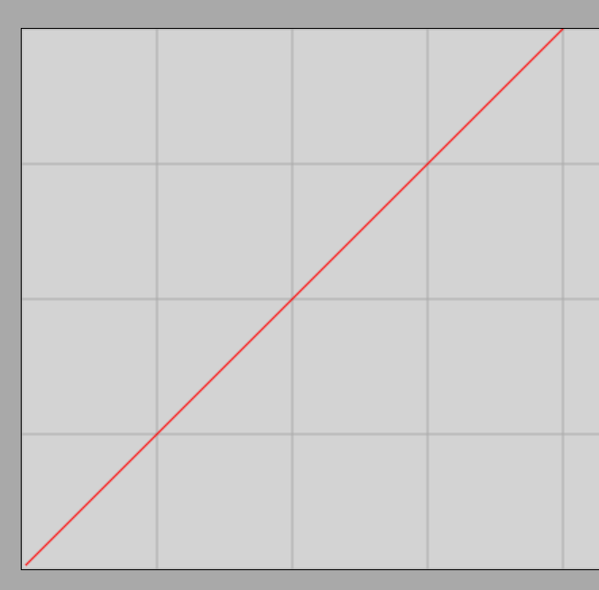

# A sebesség

## Az egyenesvonalú, egyenletes mozgás fogalma

Amikor egy test egyenes vonalon, állandó sebességgel mozog, akkor egyenesvonalú, egyenletes mozgásról beszélünk.

Példa: Egy autó egyenletesen halad 60 km/h sebességgel. Mit jelent ez?

A 60 km/h sebesség azt jelenti, hogy az autó óránként 60 km-t tesz meg. Mivel egy óra 60 perc, az autó percenként 1 km-t tesz meg.

A test egyenlő időközök alatt egyenlő utakat fut be. Úgy is mondhatjuk, hogy a megtett út és az eltelt idő egyenesen arányosak.

> **Egyenesvonalú, egyenletes mozgás esetén a test egyenes vonalon mozog úgy, hogy egyenlő időközök alatt egyenlő utakat fut be.**

### Kísérlet
[Egyenletes és egyenletesen változó mozgás](https://www.youtube.com/watch?v=PCLjIjAUBnw&t)

### Szimuláció
[Egyenesvonalú, egyenletes mozgás](https://alexerdei73.github.io/physics-engine/project/#c1c7278a-8c14-4386-ad82-477930ee81d2)

A szimuláció alapján megkapható a test által megtett út grafikonja az eltelt idő függvényében. Jelölje be a **Graphs** jelölőnégyzetet, majd a **Results**-et. Ezután válassza ki a **Path Length** mezőt (a megtett utat), majd a **Switch** gombbal térjen vissza és indítsa el a szimulációt. Eredményül a következő grafikon jelenik meg:

A grafikon függőleges tengelye az út, a vízszintes tengely az idő. A négyzetháló az egységet jelenti mindkét tengelyen. A grafikon szerint a test útja 0 az origóban, vagyis 0 idő elteltével. 1 s elteltével az út 1 m, 2 s elteltével 2 m, stb. Eszerint a test sebessége $1 \frac{m}{s}$.

## A sebesség

A sebesség az időegység alatt megtett utat méri; egyenletes mozgás esetén állandó. A sebesség vektormennyiség: iránya megegyezik a mozgás irányával. Egyenletes mozgás esetén a sebesség nagysága nem változik. Egyenesvonalú mozgás esetén a sebesség iránya sem változik.

> **A sebesség a megtett út és a hozzá szükséges idő hányadosa egyenletes mozgás esetén. Jele: v, egysége: m/s.**

$$
v = \frac{s}{t}
$$

Ebben a formulában s a megtett út, t pedig a megtételéhez szükséges idő jele.

### Példák:

1. Egy autó egyenletesen halad, sebessége 60 km/h. Mekkora ez a sebesség m/s egységben? Mekkora utat tesz meg az autó 20 s alatt? Mennyi idő alatt tesz meg 100 m-t az autó?

A sebesség kiszámítása:

$$
v = \frac {s} {t} = \frac {60 \text{ km}} {1 \text{ h}} = \frac {60\,000 \text{ m}} {3600 \text{ s}} = 16.7 \frac {m} {s}
$$

Itt kerekítettünk, hisz a sebességet két értékes jegyre adtuk meg, tehát a válasz is maximum 3 értékes jegyet tartalmazhat, ahol az utolsó jegy már nem pontos.

$$
16.7 \frac {m} {s} = \frac {x} {20 \text{ s}}
$$

Itt x-szel jelöltük az ismeretlen utat. Mindkét oldalt megszorozzuk 20 s-al, hogy megkapjuk x-et, ahogyan az egyenleteket megoldjuk a matematikában.

$$
x = 16.7 \frac {m} {s} \times 20 \text{ s} = 334 \text{ m}
$$

Itt az utolsó jegy már nem pontos, tehát durván 330 m-t tesz meg az autó 20 s alatt.

Most az időt fogjuk x-szel jelölni.
$$
16.7 \frac {m} {s} = \frac {100 \text{ m}} {x}
$$

Az egység értelemszerűen s lesz, tehát elhagyjuk az egységeket a számítás során, csak a végén írjuk ki, hisz az eredmény csak így érvényes.

$$
16.7 \times x = 100
$$

$$
x = \frac {100} {16.7} = 6.0 \text{ s}
$$

Itt 2 értékes jegyre kerekítettünk, hisz percenként 1 km-t tesz meg az autó, ami 60 s, tehát 6 s alatt pontosan 100 m-t tesz meg.

2. Egy autó egyenletesen halad $30 \frac {m} {s}$ sebességgel. Mekkora utat tesz meg 3600 s tehát egy óra alatt? Mekkora a sebessége $\frac {km} {h}$-ban? Mennyi idő alatt ér egyenletesen haladva a 150 km távolságra lévő másik városba?

$$
30 = \frac {x} {3600}
$$

$$
x = 30 \times 3600 = 108\,000 \text{ m} = 108 \text{ km}
$$

Az autó óránként 108 km-t tesz meg, tehát sebessége $108 \frac {km} {h}$.

Most az időt, x-et számítjuk:

$$
108 = \frac {150} {x}
$$

$$
108 \times x = 150
$$

$$
x = \frac {150} {108} = 1.39h = 1h 23min
$$