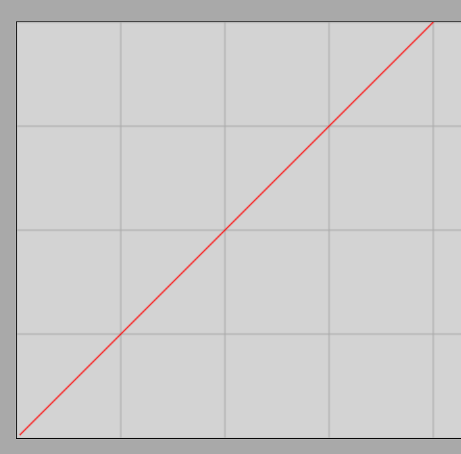

# A sebesség

## Az egyenes vonalú, egyenletes mozgás fogalma

Amikor egy test egyenes vonalú pálya mentén, állandó nagyságú és irányú sebességgel mozog, akkor **egyenes vonalú, egyenletes mozgásról** beszélünk.

*Példa:* Egy autó egyenletesen halad $60\text{ km/h}$ sebességgel. Mit jelent ez a gyakorlatban?
A $60\text{ km/h}$-s sebesség azt jelenti, hogy az autó óránként $60\text{ km}$ utat tesz meg. Mivel egy óra $60$ percből áll, az autó percenként pontosan $1\text{ km}$-t halad előre.

Egyenletes mozgás során a test egyenlő időközök alatt egyenlő utakat fut be. Úgy is fogalmazhatunk, hogy a megtett út és az eltelt idő között egyenes arányosság áll fenn.

> **Egyenes vonalú, egyenletes mozgás esetén a test egyenes vonalú pályán mozog úgy, hogy tetszőlegesen választott, egyenlő időközök alatt mindig egyenlő utakat tesz meg.**

### Kísérlet
[Egyenletes és egyenletesen változó mozgás demonstrációja air track segítségével](https://www.youtube.com/watch?v=PCLjIjAUBnw&t)

### Szimuláció
[Egyenes vonalú, egyenletes mozgás szimulátor](https://alexerdei73.github.io/physics-engine/project/#2bb04c3c-0905-425f-bbba-301a5a455867)

A szimuláció segítségével grafikusan is ábrázolhatjuk a test által megtett utat az idő függvényében. Ehhez jelölje be a **Graphs** jelölőnégyzetet, majd nyissa meg a **Results** panelt. Válassza ki a **Path Length** (megtett út) mezőt, majd a **Switch back** gombbal térjen vissza a főképernyőre, és indítsa el az animációt. Ekkor az alábbihoz hasonló grafikon rajzolódik ki:

A grafikon függőleges tengelye a megtett utat, a vízszintes tengelye pedig az eltelt időt mutatja. A négyzetháló az egységnyi felbontást jelöli mindkét tengelyen. A grafikon alapján látható, hogy a mozgás kezdetén ($t = 0\text{ s}$) a megtett út is nulla, vagyis a vonal az origóból indul. $1\text{ s}$ elteltével az út $1\text{ m}$, $2\text{ s}$ múlva $2\text{ m}$, és így tovább. Ebből következik, hogy a vizsgált test sebessége pontosan $1\text{ }\frac{\text{m}}{\text{s}}$.

## A sebesség fogalma és képlete

A sebesség az időegység alatt megtett utat adja meg; értéke egyenletes mozgás esetén állandó. A sebesség valójában **vektormennyiség**: iránya megegyezik a mozgás pillanatnyi irányával. Egyenletes mozgásnál a sebesség nagysága, egyenes vonalú mozgásnál pedig a sebesség iránya ($\vec{v}$) is szigorúan állandó marad.

> **A sebesség megmutatja a megtett út és a megtételéhez szükséges idő hányadosát egyenletes mozgás esetén. Jele: $v$, alapvető SI-mértékegysége: $\text{m/s}$.**

$$
v = \frac{s}{t}
$$

Ebben a képletben $s$ a megtett utat, $t$ pedig a hozzá tartozó időtartamot jelöli.

### Példák

1. Egy autó egyenletesen halad, a sebességmérője $60\text{ km/h}$-t mutat. Mekkora ez a sebesség $\text{m/s}$ egységben? Mekkora utat tesz meg az autó $20\text{ s}$ alatt? Mennyi idő alatt tesz meg $100\text{ m}$-t?

A sebesség átváltása:

$$
v = \frac{s}{t} = \frac{60\text{ km}}{1\text{ h}} = \frac{60\ 000\text{ m}}{3600\text{ s}} \approx 16{,}7\text{ }\frac{\text{m}}{\text{s}}
$$

*(Mivel a kiinduló adatot két értékes jegyre adtuk meg, a köztes számításban megtarthatunk három értékes jegyet, de a végső gyakorlati válaszoknál ügyelnünk kell a pontosságra.)*

Keressük meg a $20\text{ s}$ alatt megtett utat (legyen ez az ismeretlen $x$):

$$
16{,}7\text{ }\frac{\text{m}}{\text{s}} = \frac{x}{20\text{ s}}
$$

Az egyenlet mindkét oldalát $20\text{ s}$-sel megszorozva kapjuk:

$$
x = 16{,}7\text{ }\frac{\text{m}}{\text{s}} \cdot 20\text{ s} = 334\text{ m}
$$

A kiindulási adatok pontossága alapján az utolsó jegy már bizonytalan, így a valóságban az autó kerekítve **körülbelül $330\text{ m}$-t** tesz meg.

Keressük meg a $100\text{ m}$ megtételéhez szükséges időt, ahol az ismeretlent szintén $x$ jelöli:

$$
16{,}7\text{ }\frac{\text{m}}{\text{s}} = \frac{100\text{ m}}{x}
$$

A számítás egyszerűsítése érdekében a rendezés során elhagyhatjuk a mértékegységeket, hiszen az időt automatikusan másodpercben kapjuk meg:

$$
16{,}7 \cdot x = 100
$$

$$
x = \frac{100}{16{,}7} \approx 6{,}0\text{ s}
$$

Az autó tehát pontosan **$6\text{ s}$ alatt** teszi meg a $100\text{ m}$-es távolságot.

2. Egy autó egyenletesen halad $30\text{ }\frac{\text{m}}{\text{s}}$ sebességgel. Mekkora utat tesz meg $3600\text{ s}$ (azaz egy óra) alatt? Mekkora a sebessége $\text{km/h}$-ban? Mennyi idő alatt ér el egy $150\text{ km}$ távolságra lévő városba?

Számítsuk ki az egy óra alatt megtett utat ($x$):

$$
30 = \frac{x}{3600}
$$

$$
x = 30 \cdot 3600 = 108\ 000\text{ m} = 108\text{ km}
$$

Mivel az autó egyetlen óra alatt $108\text{ km}$-t tesz meg, a sebessége közvetlenül felírható **$108\text{ km/h}$** alakban is.

Most határozzuk meg a $150\text{ km}$-es távolsághoz szükséges időt ($x$), már a kiszámított $\text{km/h}$ egységet használva:

$$
108 = \frac{150}{x}
$$

$$
108 \cdot x = 150
$$

$$
x = \frac{150}{108} \approx 1{,}39\text{ h}
$$

Mivel $0{,}39\text{ óra} = 0{,}39 \cdot 60\text{ perc} \approx 23\text{ perc}$, az utazási idő **$1\text{ óra } 23\text{ perc}$**.

## Feladatok

1. Egy vonat egyenletesen halad $80\text{ km/h}$ sebességgel. Mekkora ez a sebesség $\text{m/s}$ egységben? Mekkora utat tesz meg a vonat $45\text{ s}$ alatt?
2. Egy kerékpáros $5\text{ m/s}$ sebességgel halad. Mekkora utat tesz meg $2\text{ perc}$ alatt? Mennyi idő alatt tesz meg $15\text{ km}$ távolságot?
3. Egy futó $6\text{ m/s}$ sebességgel fut. Mekkora ez a sebesség $\text{km/h}$ egységben? Mennyi idő alatt fut le egy $100\text{ m}$-es szakaszt?
4. Egy autó $25\text{ m/s}$ sebességgel halad. Mekkora utat tesz meg $1\text{ óra}$ alatt? Mekkora a sebessége $\text{km/h}$-ban?
5. Egy önjáró jármű $72\text{ km/h}$ sebességgel mozog. Mekkora ez a sebesség $\text{m/s}$ egységben? Mennyi idő alatt tesz meg $500\text{ m}$-t?
6. Egy éti csiga $0{,}01\text{ m/s}$ sebességgel halad. Mekkora utat tesz meg $10\text{ perc}$ alatt? Mennyi idő alatt tesz meg pontosan $1\text{ métert}$?
7. Egy repülőgép $900\text{ km/h}$ sebességgel repül. Mekkora ez a sebesség $\text{m/s}$ egységben? Mekkora a távolság két város között, ha a gép $2\text{ óra}$ alatt ér át az egyikből a másikba?
8. Egy bolygóközi űrszonda $50\ 000\text{ km/h}$ sebességgel halad. Mekkora ez a sebesség $\text{m/s}$ egységben? Mekkora távolságot tesz meg egy teljes nap ($24\text{ óra}$) alatt?
9. Egy motoros $15\text{ m/s}$ sebességgel halad. Mekkora ez a sebesség $\text{km/h}$ egységben? Mekkora utat tesz meg $30\text{ perc}$ alatt?
10. Két város között $240\text{ km}$ a távolság. Egy autó $80\text{ km/h}$, egy másik pedig $100\text{ km/h}$ állandó sebességgel halad. Mekkora az eltérés az utazási időkben? Hány perccel érkezik később az első autó, mint a második?
