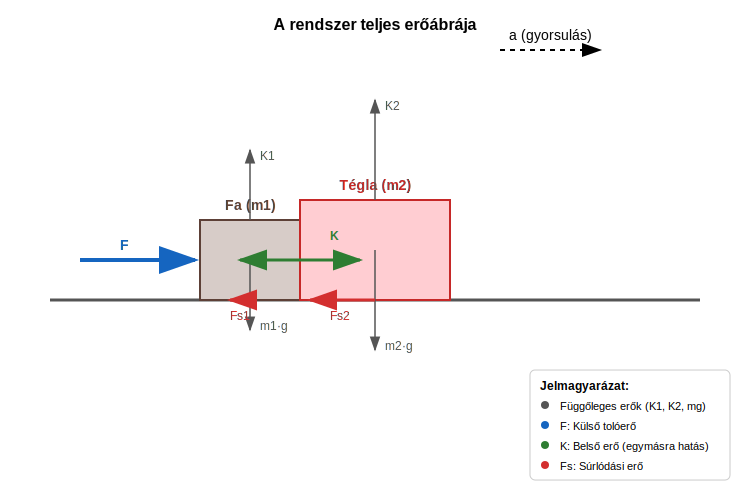

# A tömegközéppont tétele

## Az impulzustétel általános levezetése

Most megvizsgáljuk az impulzustétel általános levezetését, hisz ezt a tételt eddig csak 2 test esetére láttuk be. Legyen most $N$ testünk a pontrendszerben! Az $i$-edik testre Newton második törvénye a következő:

$$
\vec F_{e,i} = \frac {\Delta \vec I_i} {t}
$$

Kicsit ezt átírjuk, hogy könnyebb legyen a dolgunk:

$$
\vec F_{e,i}^k + \sum_{j = 1, j \neq i}^{N} {\vec F_{i,j}} = \frac {m_i\vec v_i - m_i \vec v_{i,0}} {t}
$$

Most összeadjuk az egyenleteket az összes tömegpontra:

$$
\sum_{i = 1}^{N} \vec F_{e,i}^k + \sum_{i = 1}^{N} \sum_{j = 1, j \neq i}^{N} {\vec F_{i,j}} = \sum_{i = 1}^{N}\frac {m_i\vec v_i - m_i \vec v_{i,0}} {t}
$$

Most ki fogjuk mutatni, hogy a belső erők összege nulla.

$$
\sum_{i = 1}^{N} \sum_{j = 1, j \neq i}^{N} {\vec F_{i,j}} = \sum_{i = 1}^{N} \sum_{j = 1}^{i - 1} {\vec F_{i,j}} + \sum_{i = 1}^{N} \sum_{j = i + 1}^{N} {\vec F_{i,j}}
$$

Az eredeti összeget két összegre bontjuk. Az első összegben $j < i$, míg a második összegben $j > i$. Mindkét összeg az összes lehetséges párosítást tartalmazza ezekkel a kitételekkel. Ha most a második összegben felcseréljük $\vec F_{i,j}$-ben $i$-t és $j$-t, ugyanakkor áttérünk az első összeg határaira, tehát most $j < i$ lesz $j > i$ helyett, akkor az összeg értéke nem változik. Például ha eredetileg $i = 2$ és $j = 3$, akkor a párosítás szerepel a második összegben, mert $j > i$. Ez ugye $\vec F_{2,3}$. Ha inkább most $i = 3$ és $j = 2$ értékek írják le ugyanezt a tagot, tehát $j < i$, akkor ez $\vec F_{j,i}$. A második összegben az összes tagra megcsináljuk ezt a cserét, de ettől az összeg nem változik meg.

$$
\sum_{i = 1}^{N} \sum_{j = i + 1}^{N} {\vec F_{i,j}} = \sum_{i = 1}^{N} \sum_{j = 1}^{i-1} {\vec F_{j,i}}
$$

Így tehát a belső erők összege:

$$
\sum_{i = 1}^{N} \sum_{j = 1, j \neq i}^{N} {\vec F_{i,j}} = \sum_{i = 1}^{N} \sum_{j = 1}^{i - 1} {\vec F_{i,j}} + \sum_{i = 1}^{N} \sum_{j = 1}^{i-1} {\vec F_{j,i}} = \sum_{i = 1}^{N} \sum_{j = 1}^{i-1} (\vec F_{i,j} + \vec F_{j,i}) = \vec 0
$$

Itt felhasználtuk Newton harmadik törvényét:

$$
\vec F_{i,j} = -\vec F_{j,i}
$$

Eszerint az összeg tagjai mind nullák. Most alakítsunk kicsit a másik oldalon is!

$$
\sum_{i = 1}^{N}\frac {m_i\vec v_i - m_i \vec v_{i,0}} {t} = \frac {\sum_{i = 1}^{N}m_i\vec v_i - \sum_{i = 1}^{N}m_i\vec v_{i,0}} {t} = \frac {\vec I - \vec I_0} {t}
$$

Eredményünk az impulzustétel:

$$
\sum_{i = 1}^{N} \vec F_{e,i}^k = \frac {\vec I - \vec I_0} {t}
$$

>**A pontrendszerre ható külső erők vektori összege egyenlő a pontrendszer összimpulzusának időegységre eső megváltozásával.**

## A tömegközéppont tétele

Most felhasználjuk, amit a pontrendszer impulzusáról tudunk. Ez kifejezhető a tömegközéppont sebességével, hiszen:

$$
\vec v_{TKP} = \frac {\sum_{i = 1}^{N} m_i \vec v_i} {M}
$$

$$
M \vec v_{TKP} = \sum_{i = 1}^{N} m_i \vec v_i = \sum_{i = 1}^{N} \vec I_i = \vec I
$$

$$
\sum_{i = 1}^{N} \vec F_{e,i}^k = \frac {M \vec v_{TKP} - M \vec v_{TKP,0}} {t}
$$

A jobb oldalból az $M$ össztömeget kiemeljük.

$$
\frac {M \vec v_{TKP} - M \vec v_{TKP,0}} {t} = M \frac {\vec v_{TKP} - \vec v_{TKP,0}} {t} = M \vec a_{TKP}
$$

Itt bevezettük a tömegközéppont gyorsulását:

$$
\vec a_{TKP} = \frac {\vec v_{TKP} - \vec v_{TKP,0}} {t}
$$

Ez egyezik a gyorsulás eddigi definíciójával, egy fontos különbséggel. Mi eddig leginkább csak egyenes vonalú mozgásokra alkalmaztuk ezt az összefüggést, ahol a gyorsulásvektor a sebességgel párhuzamos vektor. Ha a sebesség iránya is változik, akkor az összefüggést csak a vektorokra vagy azok komponenseire alkalmazhatjuk. 

Eredményünk a tömegközéppont tétele:

$$
\sum_{i = 1}^{N} \vec F_{e,i}^k = M \vec a_{TKP}
$$

Ez a tétel nagyon hasonlít a második törvényre, de van két fontos különbség:
1. Csak a külső erők számítanak, melyeket a rendszerhez nem tartozó testek fejtenek ki.
2. A pontrendszer össztömege számít, és a tömegközéppont gyorsulásáról van szó benne, melynek helyén sok esetben nincs is tömegpont egyáltalán, tehát csak egy matematikai pont.

>**A pontrendszer tömegközéppontja úgy mozog, mint egy tömegpont, melybe a pontrendszer teljes tömege van egyesítve, miközben a rá ható eredő erő a pontrendszerre ható külső erők vektori összege. Ez a tömegközéppont tétele.**

Ez a tétel teszi lehetővé, hogy amennyiben a newtoni mechanika törvényei érvényesek kicsiny, pontszerűnek tekinthető részecskékre, akkor az ezekből felépülő nagy méretű testekre is alkalmazható a mechanika.

Az viszont nem következik ebből, hogy amennyiben a newtoni mechanika alkalmazható nagy méretű testekre, akkor éppígy alkalmazható a testek kicsiny, pontszerűnek tekinthető részecskéire is. Valóban, a XX. században kiderült, hogy a newtoni mechanika törvényei nem alkalmazhatók atomi vagy szubatomi részecskékre. Ilyen kis méretekben az úgynevezett kvantummechanikát kell alkalmazni, amely nagy méretű testek esetére visszaadja Newton törvényeit, de a kicsiny részecskékre a kvantummechanika törvényei különböznek Newton törvényeitől.

A tételt eddig is számtalanszor használtuk már. A tömegpontok ugyanis a valóságban a legtöbb esetben rengeteg kicsiny részecskét tartalmaznak, csupán a mozgás leírása szempontjából a belső szerkezetük nem fontos. A mozgás ilyenkor a tömegközéppont tétele miatt írható le Newton második törvénye alapján.

### Példa
Egy fa  blokk és egy tégla együtt mozog egy vízszintes asztallapon. Mi a fából készült blokkot toljuk $20,0 N$ vízszintes irányú erővel. Ennek tömege $500 g$. Ez a blokk tolja maga előtt a téglát, melynek tömege $1,50 kg$. A súrlódási együttható a fa blokk és az asztal közt 0,3. A tégla és az asztal közti súrlódási együttható 0,7. Mekkora a rendszerre ható külső erők eredője? Mekkora a gyorsulás? Mekkora a fa blokk és a tégla közti belső erő most? Ha elengedjük a fa blokkot, a rendszer lassulni kezd. Mekkora most a külső erők eredője? Mekkora a lassulás? Mekkora most a belső erő? 

 

Számítsuk ki először a súrlódási erőket a csúszás folyamán!

$$
F_{s,1} = \mu_1K_1 = \mu_1m_1g = 0,3 \times 0,5 \times 9,81 = 1,472 N
$$

$$
F_{s,2} = \mu_2K_2 = \mu_2m_2g = 0,7 \times 1,50 \times 9,81 = 10,30 N
$$

Mi ugye toljuk a blokkokat, a súrlódás meg fékezi ezeket, tehát az eredő erő nagysága:

$$
F_e = F - F_{s,1} - F_{s,2} = 20,0 - 1,472 - 10,3 = 8,228 N
$$

A gyorsulás, mely ugyanaz mindkét testre és nem más, mint a tömegközéppont gyorsulása:

$$
a = \frac {8,228} {2,00} = 4,114 \frac {m} {s^2}
$$

A téglát a fa blokk és a tégla közti kényszererő gyorsítja, mely vízszintes irányú. A súrlódás fékezi a téglát.

$$
F_{e,2} = K - F_{s,2} = m_2a
$$

$$
K = m_2a + F_{s,2} = 1,50 \times 4,114 + 10,30 = 16,47 N
$$

Elengedés után az eredő erő megváltozik. 

$$
F_e^{uj} = -F_{s,1} - F_{s,2} = -11,77 N
$$

A lassulás:

$$
a^{uj} = \frac {F_e^{uj}} {M} = \frac {-11,77} {2,00} = -5,886 \frac {m} {s^2}
$$

Most a fa blokk más erővel nyomja a téglát:

$$
K^{uj} - F_{s,2} = m_2a^{uj}
$$

$$
K^{uj} = m_2a^{uj} + F_{s,2} = 1,50 \times (-5,886) + 10,3 = 1,471 N
$$

A kényszererő csak pozitív lehet, hisz nincsen a tégla a fablokkhoz ragasztva. Ha a számítás negatív eredményt adna, akkor a tégla és a fablokk különböző lassulással mozogna az elengedés után, tehát már nem mondhatnánk, hogy együtt mozognak. A példánkban nem ez a helyzet.

## Feladatok

1. Egy tüzijáték-rakétát ferdén fellövünk. A pálya legmagasabb pontján a rakéta felrobban, és több darabra esik szét. Mi mondható el a darabok közös tömegközéppontjának mozgásáról a robbanás után, amíg egyik darab sem ér földet, ha a légellenállást elhanyagoljuk?

2. Egy 60 kg tömegű ember és egy 40 kg tömegű gyerek áll egymással szemben a jégen (súrlódásmentes felület). Összekapaszkodnak és ellökik egymást. Mekkora lesz a rendszer tömegközéppontjának gyorsulása az ellökés közben és után?

3. Két testet ($m_1 = 2 kg$, $m_2 = 3 kg$) egy elhanyagolható tömegű, nyújthatatlan kötél köt össze. A testeket vízszintes, súrlódásmentes asztallapon húzzuk $F = 10 N$ erővel, amely az $m_1$ tömegű testre hat. Számítsd ki a rendszer tömegközéppontjának gyorsulását! Számít-e a kötélerő (belső erő) a tömegközéppont gyorsulásának meghatározásánál?