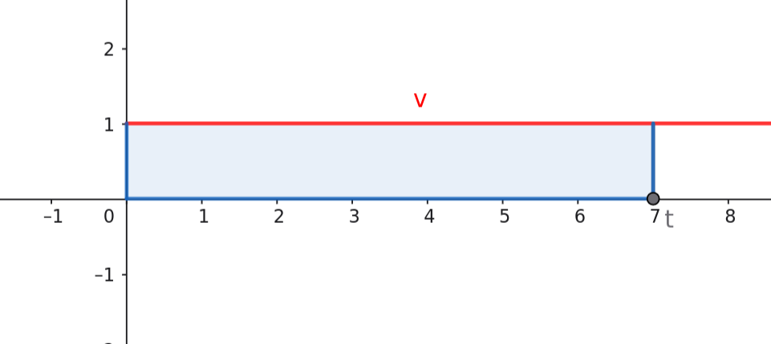
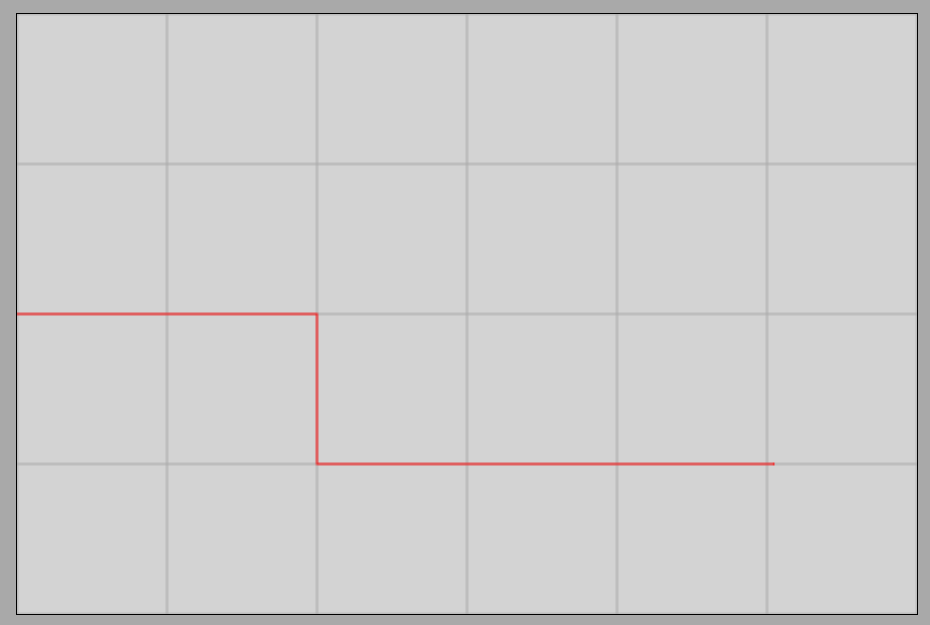

# Average and Instantaneous Velocity

## Instantaneous Velocity

### Velocity-Time Graph of Uniform Motion

[Rectilinear Uniform Motion Simulator](https://alexerdei73.github.io/physics-engine/project/#c1c7278a-8c14-4386-ad82-477930ee81d2)

Let us examine rectilinear uniform motion again, but this time, let us construct the **velocity-time graph** instead of the distance traveled! (We leave the independent generation of the graph to the reader for practice.) Since the motion is uniform, the magnitude of the velocity is constant (in our example, $1\text{ }\frac{\text{m}}{\text{s}}$), meaning that the object travels with this exact value at every instant in time. The image of the velocity-time graph is therefore a straight line parallel to the time axis (horizontal axis).

A highly critical geometric observation is that the **area under the graph curve numerically represents the distance traveled by the object**. This area is the geometric shape (in our example, the blue rectangle) bounded by the vertical axis, the horizontal time axis, the vertical line corresponding to the chosen instant $t$, and the line of the graph itself.

### Piecewise Uniform Motion

An object travels uniformly at a speed of $2\text{ }\frac{\text{m}}{\text{s}}$ in the time interval between $0\text{ s}$ and $2\text{ s}$, and then suddenly collides with another object. Due to this, its velocity changes, and it continues to travel at a constant speed of $1\text{ }\frac{\text{m}}{\text{s}}$ over the segment between $2\text{ s}$ and $5\text{ s}$.

What is the distance traveled during the first $2\text{ s}$? What is the distance traveled between $2\text{ s}$ and $5\text{ s}$? What is the total distance traveled? What is the average velocity of the motion over the total time duration of $5\text{ s}$?

The distance traveled in the first segment is calculated from the fundamental formula for uniform motion:

$$
v_1 = \frac {s_1} {t_1}
$$

$$
2 = \frac {s_1} {2}
$$

$$
s_1 = 2 \cdot 2 = 4\text{ m}
$$

Thus, the object covers $4\text{ m}$ of distance during the first $2\text{ s}$. At that moment, it suddenly collides with another object, and its velocity drops to half almost instantly. It continues to travel at this new velocity until the time instant of $5\text{ s}$, meaning the duration of the second segment is:

$$
t_2 = 5\text{ s} - 2\text{ s} = 3\text{ s}
$$

The distance traveled in the second segment is:

$$
v_2 = \frac {s_2} {t_2}
$$

$$
1 = \frac {s_2} {3}
$$

$$
s_2 = 1 \cdot 3 = 3\text{ m}
$$

After the collision, the object therefore covers an additional $3\text{ m}$ of distance. The total distance traveled during the entire motion is the sum of the partial distances:

$$
s = s_1 + s_2 = 4\text{ m} + 3\text{ m} = 7\text{ m}
$$

The total distance traveled is $7\text{ m}$. If we examine the velocity-time graph, this value corresponds exactly to the sum of the areas of the two rectangles under the graph ($4\text{ units} + 3\text{ units} = 7\text{ units}$), as shown in the figure.

### Instantaneous Velocity

This geometric rule applies universally not only to piecewise uniform motions but also to arbitrarily changing motions: the area under the velocity-time graph always gives the distance traveled by the object. The speedometers of vehicles (odometers) show a value corresponding to a specific single instant in time; this is called **instantaneous velocity**.

> **Instantaneous velocity is the velocity of a moving object corresponding to a given instant in time. If instantaneous velocity is plotted on a graph as a function of time, the area under the curve in an arbitrary time interval is numerically equal to the distance traveled by the object.**

The above statement holds true for all motions, though in reality, velocity rarely changes as abruptly and instantaneously as in the piecewise uniform model presented here. The great advantage of such idealized cases is that the individual segments can be simply calculated using the formula for uniform motion.

## Average Velocity

In the case of changing motion, the quotient of the total distance traveled and the total elapsed time generally does not equal the instantaneous velocity of the object. This quotient is called **average velocity**. Average velocity is equal to instantaneous velocity if and only if the motion is uniform.

> **The quotient of the total distance traveled and the total time duration required to cover it is called average velocity. Symbol: $\overline{v}$ (v-bar).**

$$
\overline{v} = \frac {s} {t}
$$

In our piecewise uniform example, the total distance traveled was $7\text{ m}$, and the total time was $5\text{ s}$. The average velocity for this process is:

$$
\overline{v} = \frac {s} {t} = \frac {7\text{ m}} {5\text{ s}} = 1.4\text{ }\frac {\text{m}} {\text{s}}
$$

It can be seen that the average velocity ($1.4\text{ }\frac{\text{m}}{\text{s}}$) equals the instantaneous velocity of the object at only one brief moment during the motion—during the collision, when the velocity drops. It is not equal to either the initial velocity of $2\text{ }\frac{\text{m}}{\text{s}}$ or the post-collision velocity of $1\text{ }\frac{\text{m}}{\text{s}}$.

## Exercises

### Exercise 1
An object travels uniformly at a speed of $3\text{ }\frac{\text{m}}{\text{s}}$ in the time interval between $0\text{ s}$ and $3\text{ s}$, and then suddenly collides with an obstacle. The duration of the collision is negligibly short; from then on, the object continues to travel at a speed of $2\text{ }\frac{\text{m}}{\text{s}}$ until the time instant of $8\text{ s}$.

* What is the distance traveled during the first $3\text{ s}$?
* What is the distance traveled between $3\text{ s}$ and $8\text{ s}$?
* What is the total distance traveled?
* What is the average velocity over the total time duration of $8\text{ s}$?

### Exercise 2
A car travels uniformly at a speed of $20\text{ }\frac{\text{m}}{\text{s}}$ during the time duration between $0\text{ s}$ and $50\text{ s}$, and then suddenly begins to brake intensely. The duration of the velocity reduction is only $0.5\text{ s}$, which is negligible compared to the entire process. From then on, the car continues to travel at a speed of $10\text{ }\frac{\text{m}}{\text{s}}$ until the time instant of $150\text{ s}$.

* What is the distance traveled during the first $50\text{ s}$?
* What is the distance traveled between $50\text{ s}$ and $150\text{ s}$?
* What is the average velocity over the total time duration of $150\text{ s}$?

### Exercise 3
A cyclist travels uniformly at a speed of $5\text{ }\frac{\text{m}}{\text{s}}$ in the interval between $0\text{ s}$ and $20\text{ s}$, and then suddenly accelerates. The duration of the velocity increase is only $0.2\text{ s}$, which is negligible compared to the total motion. From then on, the cyclist continues to travel at a speed of $8\text{ }\frac{\text{m}}{\text{s}}$ until the time instant of $60\text{ s}$.

* What is the distance traveled during the first $20\text{ s}$?
* What is the distance traveled between $20\text{ s}$ and $60\text{ s}$?
* What is the total distance traveled?
* What is the average velocity over the total time duration of $60\text{ s}$?

### Exercise 4
A train travels uniformly at a speed of $15\text{ }\frac{\text{m}}{\text{s}}$ during the time duration between $0\text{ s}$ and $100\text{ s}$, and then suddenly slows down when approaching a station. The duration of the slowing down is only $1\text{ s}$, which is negligible next to the total process. From then on, the train continues to travel at a speed of $5\text{ }\frac{\text{m}}{\text{s}}$ until the time instant of $300\text{ s}$.

* What is the distance traveled during the first $100\text{ s}$?
* What is the distance traveled between $100\text{ s}$ and $300\text{ s}$?
* What is the average velocity over the total time duration of $300\text{ s}$?

### Exercise 5 (Simulation Exercise)
As a practice, change the physical parameters in the interactive simulation project below so that you obtain exactly the velocity-time graph of the example model featured in this lesson!

[Inelastic Collision Interactive Simulation](https://alexerdei73.github.io/physics-engine/project/#8fb6472a-0612-4261-a3c6-468de892e9b9)

*Help for setting up:* The initial velocity (`vx`) of the first body must be increased to $2\text{ }\frac{\text{m}}{\text{s}}$, and the initial x-position of the second body must be set to $4.2\text{ m}$. The `anim time` parameter must be reduced to one-tenth of the original, while the value of the `point-point coll. beta` parameter must be increased tenfold. This way, the course of the collision will be sufficiently fast to be displayed on the velocity-time graph as shown in the example.
