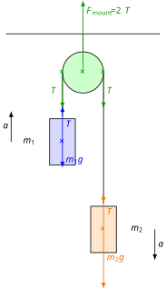

# Atwood's Machine

## Inextensible String of Negligible Mass

This is an idealisation frequently encountered in physics problems. In experiments, the mass of the string is usually negligible, as is its elongation. What exact simplifications does this introduce?

1. Negligible mass means that no force is required to accelerate the string itself; therefore, it exerts exactly the same force at both of its ends. If the string is straight and taut (or can be divided into such sections), its acceleration based on Newton's second law is:

$$
F_{\text{net}} = ma
$$

$$
T_1 - T_2 = ma
$$

Here, $T_1$ and $T_2$ are the forces exerted at the two ends, acting in opposite directions. If $m = 0$, then:

$$
T_1 - T_2 = 0
$$

$$
T_1 = T_2
$$

> **A straight, taut string of negligible mass exerts equal forces at its two ends. The force exerted by the string points along the direction of the string; it has no component perpendicular to the string.**

2. When taut, the two ends of an inextensible string displace by equal amounts along the direction of the string. Consequently, the length of the string does not change during displacement. Let the distances travelled by the endpoints along the direction of the string be $s_1$ and $s_2$. Then:

$$
\Delta l = |s_2 - s_1|
$$

Here, $\Delta l$ is the elongation of the string. Since this is zero, we have:

$$
0 = |s_2 - s_1|
$$

$$
s_1 = s_2
$$

$$
\frac{s_1}{t} = \frac{s_2}{t}
$$

$$
v_{1,\text{s}} = v_{2,\text{s}}
$$

Here, the velocities represent the components of the endpoints' velocities along the direction of the string. If the ends of the string move purely along the direction of the string—meaning there is no velocity component of the string's endpoints perpendicular to the string itself—then the accelerations of the endpoints are also equal:

$$
\frac{\Delta v_{1,\text{s}}}{t} = \frac{\Delta v_{2,\text{s}}}{t}
$$

$$
a_1 = a_2
$$

Thus, the accelerations are identical here, but this is only true if the displacement of the endpoints is purely a consequence of translational motion along the direction of the string. This does not hold true, for instance, for a pendulum, where the velocity of the pendulum is perpendicular to the string. For a pendulum, the length of the string does not change if the string is inextensible, but the velocity has no component along the direction of the string at the swinging endpoint. The circular motion of an object tied to a string, such as a swinging pendulum, will be discussed in greater detail later.

> **The accelerations of the two endpoints of an inextensible string are equal in magnitude, provided that the velocities of the endpoints are purely directed along the string.**

## Pulley of Negligible Mass

Later, during the study of rotational motion, we will see that no rotational effect (torque) is required to rotate a pulley of negligible mass. Therefore, such a pulley merely alters the direction of the rope passed over it—and consequently, the direction of the force exerted by the rope—but it does not change the magnitude of the force exerted by the rope. The net force acting on the pulley is also always zero, since the mass of the pulley can be treated as zero.

> **The role of a pulley of negligible mass is simply to change the direction of the tension force, without altering the magnitude of the force. The net force acting on a pulley of negligible mass is also zero.**

## Atwood's Machine

Let us fix a pulley to the ceiling and pass a string over it. We hang a body at each end of the string, with the strands of the string hanging vertically at the bodies. The string is inextensible and has negligible mass. The pulley also has negligible mass. Friction and air resistance are neglected as well. What is the acceleration of the bodies tied to the string? What is the force generated in the string? With what force does the pulley pull the suspension mount on the ceiling?

The figure below shows an ideal Atwood machine:

We write Newton's second law for both bodies:

$$
T - m_1 g = m_1 a
$$

$$
m_2 g - T = m_2 a
$$

We express the tension from the first equation and substitute it into the second equation, then solve the equation for $a$:

$$
T = m_1 g + m_1 a
$$

$$
m_2 g - (m_1 g + m_1 a) = m_2 a
$$

$$
m_2 g - m_1 g - m_1 a = m_2 a
$$

$$
m_2 g - m_1 g = m_1 a + m_2 a
$$

$$
(m_2 - m_1)g = (m_1 + m_2)a
$$

$$
a = \frac{m_2 - m_1}{m_1 + m_2}g
$$

Now we calculate the value of $T$:

$$
T = m_1 g + m_1 a = m_1 g + m_1 \frac{m_2 - m_1}{m_1 + m_2}g
$$

$$
T = \frac{m_1(m_1 + m_2) + m_1(m_2 - m_1)}{m_1 + m_2}g = \frac{2m_1 m_2}{m_1 + m_2}g
$$

The weight of the system (the force pulling on the suspension):

$$
F_{\text{w}} = 2T = \frac{4m_1 m_2}{m_1 + m_2}g
$$

### Experiment

[Experiment with a low-friction Atwood machine](https://www.youtube.com/watch?v=4ovhEkSIqV0)

### Exercises

1. Calculate the acceleration of the Atwood machine shown in the video based on the masses! Calculate the same based on the displacement and time! Compare the results as well!
2. For the Atwood machine shown in the video, demonstrate that mechanical energy is conserved, meaning that the sum of potential energy and kinetic energy at the moment of release is equal to the sum of potential energy and kinetic energy at arrival, at the instant immediately preceding the collision with the floor!
3. By how much did the center of mass of the system sink? How much time did this change take? Use these values to calculate the acceleration of the center of mass! Show that this matches the acceleration calculated from the center of mass theorem!