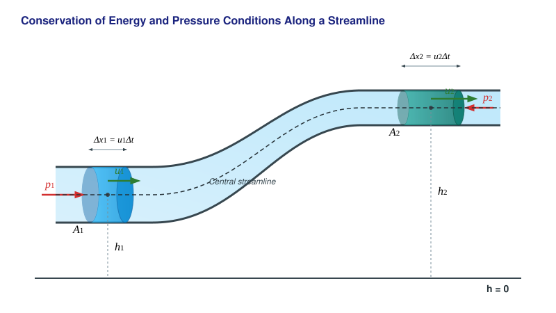

# The Bernoulli Equation

## Experiments

[Elemér Sas's experiments on the Bernoulli equation](https://www.youtube.com/watch?v=Fodof4gSIA0&t=36m18s)

[Inflating a giant bag with a single breath](https://www.youtube.com/shorts/rAAelB7nN14)

[Levitating a large rubber ball with a leaf blower](https://www.youtube.com/watch?v=Ye3QPgDdJNg)

[Levitating a ping pong ball with a hair dryer](https://www.youtube.com/watch?v=KFE98nje_L0)

[The Venturi tube](https://www.youtube.com/watch?v=hLZkPFrQCDk)

We have seen that due to the continuity equation, the fluid flows faster in a narrowing than in wider sections of a pipe. Let us now observe how the pressure changes across these pipe sections! According to the experiments, pressure drops in locations where the flow velocity is higher compared to locations where the velocity is lower.

## Conservation of Energy in Steady, Vortex-Free Flow of an Ideal Fluid

Imagine a pipe with a variable cross-section whose ends are at different heights. The flow of the fluid in the pipe is constant over time (steady), and no vortices form. The fluid is ideal, meaning it is incompressible and frictionless.

Then, for a small time interval $\Delta t$, the following relationships based on the work-energy theorem apply to this pipe section:

$$
W = \Delta E_m + \Delta E_h
$$

$$
p_1A_1u_1\Delta t - p_2A_2u_2\Delta t = \left(\frac{1}{2}\rho A_2u_2\Delta t \cdot u_2^2 - \frac{1}{2}\rho A_1u_1\Delta t \cdot u_1^2\right) + (\rho A_2u_2\Delta t \cdot gh_2 - \rho A_1u_1\Delta t \cdot gh_1)
$$

$$
A_1u_1\Delta t = A_2u_2\Delta t
$$

Simplifying by the common factors ($\Delta V = A_1u_1\Delta t = A_2u_2\Delta t$) and then rearranging the equation yields the Bernoulli equation for the pipe:

$$
p_1 - p_2 = \frac{1}{2}\rho u_2^2 - \frac{1}{2}\rho u_1^2 + \rho gh_2 - \rho gh_1
$$

$$
p_1 + \frac{1}{2}\rho u_1^2 + \rho gh_1 = p_2 + \frac{1}{2}\rho u_2^2 + \rho gh_2
$$

This means that the following quantity is constant along the pipe:

$$
p + \frac{1}{2}\rho u^2 + \rho gh = \text{constant}
$$

This relationship is also valid along a single streamline (an infinitely thin streamtube). What guarantees that the constant value is the same across all streamlines? This can be demonstrated by imagining that the flow inside the pipe is driven by a difference in fluid levels between two large containers connected by the pipe. In such a scenario, the streamlines originate from the fluid surface. Let us take two very close streamlines and select two points at the same height in one container. Due to the vortex-free nature of the fluid, the velocities at these two points (which point vertically downward here) are equal in magnitude. Indeed, if there were a vortex in the flow, the two vertical velocities would be at slightly different distances from the center of the vortex, so the velocities would also have to differ. The pressures are also identical, since the velocity here is extremely low (as the containers are very large compared to the pipe), so the pressure is simply the sum of the external and hydrostatic pressures. Thus, the constant is identical for two different streamlines. For more distant streamlines, we can take a series of points at the same height across a series of different streamlines, thereby advancing from one streamline to another in very small increments in any case.

## Limits of Validity

* The derivation applies only to ideal, frictionless, and incompressible fluids (or gases).
* The flow must be steady, meaning the flow pattern does not change with time.
* The flow must be completely vortex-free everywhere; otherwise, the theorem holds only along a specific streamline, and the values of the constants may differ between different streamlines.

## Superfluidity

In nature, internal friction (viscosity) almost always occurs within fluids, exerting a resistance against the flow. As observed earlier, the reduction in mechanical energy increases the internal energy of the fluid in the form of heat. There is, however, a very special exception that was discovered after the liquefaction of helium. Helium is exceptionally difficult to liquefy and does not become solid at atmospheric pressure even near absolute zero. Its boiling point is $-268.93\text{ }^{\circ}\text{C}$ ($4.22\text{ K}$). If liquid helium is cooled further, it transforms into superfluid helium (helium-II) at $-270.97\text{ }^{\circ}\text{C}$ ($2.17\text{ K}$, the so-called lambda point).

This phase of matter possesses an extraordinarily high thermal conductivity, and its internal friction is practically zero when flowing at low velocities even through the thinnest capillary tubes. Based on the two-fluid theory of László Tisza and Lev Landau, helium-II behaves as a mixture of a normal (viscous) and a superfluid component. If it is rotated, tiny, so-called *quantized vortices* form within the fluid without internal friction, capable of spinning indefinitely.

We can say that this highly rare and unique quantum fluid is what comes closest in the macroscopic world to realizing the ideal, frictionless state discussed in the Bernoulli equation. For those interested in a deeper look into this fascinating phenomenon, we recommend the following archival documentary:

[Superfluid Helium Experiments video](https://www.youtube.com/watch?v=ixsYmygNfs4&t=2247s)

Although a loss of mechanical energy always occurs during the flow of real fluids (with the exception of superfluid helium), the flow can in many cases be regarded as approximately steady. Thus, the Bernoulli equation remains highly applicable in practice, while engineering calculations requiring greater precision account for pressure losses due to friction using correction factors.

## Example

In a horizontal Venturi tube, the velocity of air in the wider section is $u_1 = 2\text{ m/s}$, and its diameter here is $d_1 = 1\text{ cm}$. The diameter of the narrowing is $d_2 = 4\text{ mm}$. What are the velocity and the static pressure in the narrowing? The flow is steady, vortex-free, and air is treated as an ideal gas (neglecting friction and compressibility). The density of air is $\rho = 1.20\text{ kg/m}^3$, and its initial pressure is $p_1 = 101,300\text{ Pa}$.

The velocity in the narrowing can be calculated using the continuity equation:

$$
u_2 = \frac{A_1 u_1}{A_2} = \frac{d_1^2 u_1}{d_2^2} = \frac{10^2 \cdot 2}{4^2} = \frac{200}{16} = 12.5\text{ m/s}
$$

Since the tube is horizontal ($h_1 = h_2$), the Bernoulli equation simplifies to the following form:

$$
p_1 + \frac{1}{2}\rho u_1^2 = p_2 + \frac{1}{2}\rho u_2^2
$$

From this, the static pressure $p_2$ measurable in the narrowing is:

$$
p_2 = p_1 - \frac{1}{2}\rho(u_2^2 - u_1^2)
$$

$$
p_2 = 101,300 - \frac{1}{2} \cdot 1.20 \cdot (12.5^2 - 2^2) = 101,208.65\text{ Pa}
$$

---

## Problems

**Problem 1**
The internal diameter of a horizontal garden watering hose in its wider section is $d_1 = 2\text{ cm}$, and the water velocity here is $u_1 = 1.5\text{ m/s}$. A narrowing nozzle head is attached to the end of the hose, which has an output diameter of just $d_2 = 5\text{ mm}$.
What is the exit velocity of the water at the narrowing? (Treat water as an ideal, incompressible fluid).

**Problem 2**
At a certain point above an airplane wing, the air velocity is $u_2 = 60\text{ m/s}$, while below the wing in the undisturbed flow it is $u_1 = 50\text{ m/s}$. In the flow below the wing, the static air pressure is $p_1 = 100,000\text{ Pa}$. The density of air is $\rho = 1.2\text{ kg/m}^3$.
What is the pressure at the point above the wing? (Neglect the height difference resulting from the thickness of the wing).

**Problem 3**
Water flows inside a pipe that narrows vertically upward. At the lower, wider cross-section of the pipe, the diameter is $d_1 = 10\text{ cm}$, the water velocity is $u_1 = 2\text{ m/s}$, and the pressure is $p_1 = 200,000\text{ Pa}$. At the upper end of the pipe, located $h = 3\text{ metres}$ higher, the diameter narrows to $d_2 = 5\text{ cm}$. 
$\rho_{\text{water}} = 1000\text{ kg/m}^3$, $g = 10\text{ m/s}^2$
What are the velocity and the static pressure in the upper, narrower cross-section of the pipe?