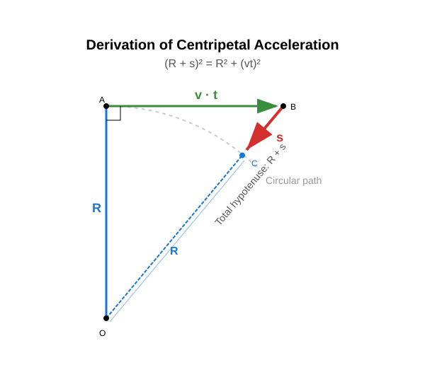

# Centripetal Acceleration

In the previous lesson, both the experiment and the simulation demonstrated that maintaining uniform circular motion requires a force directed toward the center of the circle. This force is the centripetal force.

According to Newton's second law, the centripetal force is accompanied by an acceleration directed toward the center of the circle. This is the centripetal acceleration. It arises because the direction of the object's velocity is continuously changing. At any instant, the displacement of the object can be decomposed into a linear, uniform velocity displacement and a uniformly accelerating displacement directed toward the center of the circle.

> **To maintain the circular motion of an object undergoing uniform circular motion, a centripetal force directed toward the center of the circle is required. The centripetal force is accompanied by a centripetal acceleration.**

## Calculating Centripetal Acceleration

Let us derive the formula for centripetal acceleration! Let the object be at the topmost point of its circular path, and let us analyze its motion over a time interval $t$. The time interval $t$ is much smaller than the period $T$ ($t \ll T$) so that we can apply a few approximations.

The displacement of the object can be decomposed into a horizontal, linear, uniform motion displacement and a uniformly accelerating motion displacement directed toward the center. The vertical radius, the displacements, and the radius pointing to the final point of the displacement form a right-angled triangle.

$$
(R + s)^2 = R^2 + (vt)^2
$$

$$
R^2 + 2Rs + s^2 = R^2 + v^2 t^2
$$

$$
2Rs + s^2 = v^2 t^2
$$

Since the time interval is extremely short, any term containing $t^4$ is negligible compared to terms proportional to $t^2$.

$$
s = \frac{a}{2}t^2
$$

Here, $s^2$ is negligible because it is a term proportional to $t^4$.

$$
2Rs = v^2 t^2
$$

$$
s = \frac{\frac{v^2}{R}}{2}t^2
$$

Comparing this formula to our standard equation for uniformly accelerating motion, we get:

$$
a = \frac{v^2}{R}
$$

> **Centripetal acceleration is the quotient of the square of the velocity and the radius.**

This can easily be verified with the simulation.

### Examples

1. A stone of mass $0.100\text{ kg}$ is whirled in a sling with a period of $0.4\text{ s}$ along a circular path of radius $0.200\text{ m}$. The stone undergoes uniform circular motion. What is the velocity of the stone? What is the kinetic energy of the stone? What is the centripetal acceleration of the stone? What force keeps the stone in its path?

$$
v = \frac{2\pi R}{T} = \frac{2 \cdot 3.1415 \cdot 0.2}{0.4} \approx 3.142\text{ m/s}
$$

$$
E_{\text{m}} = \frac{mv^2}{2} = \frac{0.1 \cdot 3.142^2}{2} \approx 0.4933\text{ J}
$$

$$
a = \frac{v^2}{R} = \frac{3.142^2}{0.2} \approx 49.36\text{ m/s}^2
$$

$$
F_{\text{net}} = ma = 0.1 \cdot 49.36 = 4.936\text{ N}
$$

2. A bucket contains water and is whirled on a rope in a vertical plane so that it undergoes circular motion. At the highest point of the path, the velocity of the bucket is $5\text{ m/s}$ and the radius of the circle is $0.77\text{ m}$. With what force does the water press against the bottom of the bucket if its mass is $1.50\text{ kg}$? Does the water spill out of the bucket? What is the minimum angular velocity at which the water does not spill out of the bucket?

### Experiment

[Water undergoing circular motion in a bucket in a vertical plane](https://www.youtube.com/watch?v=TIBcntHCxjQ)

We write Newton's second law at the highest point of the path:

$$
mg + T = ma_{\text{cp}}
$$

$$
a_{\text{cp}} = \frac{v^2}{R} = \frac{5^2}{0.77} \approx 32.47\text{ m/s}^2
$$

$$
T = ma_{\text{cp}} - mg = 1.50 \cdot 32.47 - 1.50 \cdot 9.81 = 33.99\text{ N}
$$

Therefore, the water does not spill out; instead, it presses against the bottom of the bucket with a substantial force. Now let us look at the case where the water just barely stays in the bucket but no longer presses against the bottom!

$$
T = 0
$$

$$
mg = ma_{\text{cp,min}}
$$

$$
g = a_{\text{cp,min}}
$$

$$
g = \frac{v_{\text{min}}^2}{R}
$$

$$
gR = v_{\text{min}}^2
$$

$$
v_{\text{min}} = \sqrt{gR} = \sqrt{9.81 \cdot 0.77} \approx 2.748\text{ m/s}
$$

$$
v_{\text{min}} = R\omega_{\text{min}}
$$

$$
\omega_{\text{min}} = \frac{v_{\text{min}}}{R} = \frac{2.748}{0.77} \approx 3.569\text{ rad/s}
$$

---

## Exercises

1. A Formula 1 car travels at a speed of $180\text{ km/h}$ ($50\text{ m/s}$) through a curve with a radius of $100\text{ m}$. What is the centripetal acceleration of the vehicle?
2. A satellite orbits above the surface of the Earth. Its orbital velocity is $7800\text{ m/s}$, and its orbital radius (measured from the center of the Earth) is approximately $6600\text{ km}$. Calculate the centripetal acceleration acting on the satellite! Compare this value with the gravitational acceleration on Earth ($g \approx 9.81\text{ m/s}^2$)!
3. An athlete whirls a hammer of mass $7.26\text{ kg}$ along a circular path of radius $2\text{ m}$. The velocity of the hammer at the moment of release is $28\text{ m/s}$. With what force does the hammer pull the athlete's arm (what is the centripetal force)?
4. The ring-shaped habitat of a space station rotates to create artificial gravity. The radius of the ring is $20\text{ m}$. At what linear velocity must the ring rotate so that the centripetal acceleration at its rim matches the gravitational acceleration on Earth ($g = 9.81\text{ m/s}^2$)?
5. On a chair-o-plane carousel, children revolve at a distance of $5\text{ m}$ from the center. The angular velocity of the carousel is $\omega = 0.8\text{ rad/s}$. Use the relationship $a_{\text{cp}} = \omega^2 R$ (or convert it to linear velocity) to determine the centripetal acceleration of the children!