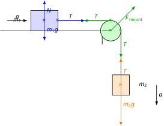

# Atwood-Machine Style Exercises

## Measuring the Second Law

### Experiment

[Measuring Newton's second law](https://www.youtube.com/watch?v=9WdTzubd89M)

In this experiment, a small weight accelerates the total mass, as we will shortly explain using theory. The accelerating force is directly proportional to the acceleration, which we measure using an accelerometer connected via Bluetooth to a telephone. The accelerating force is directly proportional to the acceleration, as we know from Newton's second law. The proportionality factor is the total mass. We will focus on demonstrating that here, indeed, only the small weight acts as the accelerating force, driving the total mass of the system.

Let the mass of the trolley moving along the horizontal tabletop be $m_1$, while the mass accelerating vertically downwards is $m_2$. The two masses are connected by a string passed over a pulley. The string is inextensible and has negligible mass, just like the pulley. Friction and air resistance are also neglected. Let us calculate the acceleration of the system and the force generated in the string!

$$
T = m_1 a
$$

$$
m_2 g - T = m_2 a
$$

These equations express Newton's second law for the first and second bodies. By substituting the value of $T$ from the first equation into the second equation, we can express the acceleration $a$.

$$
m_2 g - m_1 a = m_2 a
$$

$$
m_2 g = (m_1 + m_2)a
$$

$$
a = \frac{m_2 g}{m_1 + m_2}
$$

The acceleration is the quotient of the weight $m_2 g$ and the total mass $m_1 + m_2$; therefore, the small downwards-moving weight indeed accelerates the entire total mass of the system.

$$
T = \frac{m_1 m_2}{m_1 + m_2}g
$$

### Example

The video shows that a vertically accelerating mass of $200\text{ g}$ moves with an acceleration of $2.0\text{ m/s}^2$. What is the total mass of the system? What is the mass of the trolley? What is the tension force in the string? (During the calculation, use the value $g = 9.81\text{ m/s}^2$ instead of the rounded value $g \approx 10\text{ m/s}^2$ shown in the video.)

$$
m_2 g = (m_1 + m_2)a
$$

$$
m_1 + m_2 = \frac{m_2 g}{a} = \frac{0.2 \cdot 9.81}{2} = 0.981\text{ kg} = 981\text{ g}
$$

$$
m_1 = 781\text{ g}
$$

$$
T = m_1 a = 0.781 \cdot 2 = 1.562\text{ N}
$$

---

## Exercises

1. What is the mechanical energy of the system in the example if the accelerating mass is $200\text{ g}$ and the system accelerates for $0.5\text{ s}$? On what parameters does this mechanical energy depend? Choose the zero level of potential energy at the height of the first body, and let the initial height of the second body be $-0.1\text{ m}$!

2. Calculate the displacements of the bodies over $0.5\text{ s}$! Calculate the coordinates of the center of mass at both the initial and final moments! What are the $x$ and $y$ components of the center of mass acceleration? Show that the same result is obtained when calculating via the center of mass theorem!

3. Let the plane of the tabletop be at an angle of $30^\circ$ to the horizontal, such that the $500\text{ g}$ body on it rises when the other body sinks. How large is the acceleration of the system if the mass of the vertically moving body is $50\text{ g}$ greater than the equilibrium mass? What is the force generated in the rope? The system is ideal and lossless.

4. A body with a mass of $300\text{ g}$ can move horizontally across a tabletop. At each of the two ends of the table is a pulley of negligible mass, over which strings are passed, connecting the body to a $150\text{ g}$ body and a $250\text{ g}$ body. These bodies move vertically, and the strings are inextensible with negligible mass. Friction is negligible. What is the acceleration of the system? What forces are generated in the strings?

5. What are the acceleration components of the center of mass for the system in Exercise 4 if the bodies accelerate from rest for $0.2\text{ s}$? Calculate the components of the displacement of the center of mass, and determine the acceleration components based on them! Demonstrate that the center of mass theorem holds true, because the acceleration components calculated via the theorem match the acceleration components of the center of mass calculated by the previous method!