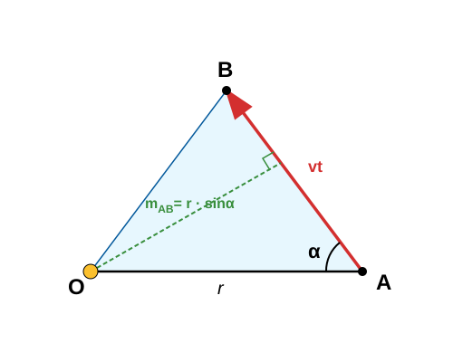
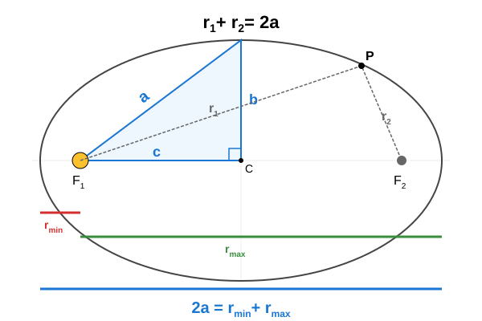

# Exercises on Planetary Motion

## Examples for Kepler's Third Law

1. The mean Earth–Sun distance is called the Astronomical Unit (AU). We know that the Earth is one astronomical unit away from the Sun, and its orbital period is 1 year. What is the orbital period of the planet Mars if its mean distance from the Sun is $1.524\text{ AU}$? The orbital period of the planet Venus is $0.6152\text{ years}$. How far is it on average from the Sun?

$$
\frac{a^3}{T^2} = 1
$$

Here, $a$ is given in astronomical units and $T$ in years.

$$
T_{\text{Mars}} = \sqrt{a_{\text{Mars}}^3} = \sqrt{1.524^3} \approx 1.881\text{ years} = 687.0\text{ days}
$$

$$
a_{\text{Venus}} = \sqrt[3]{T_{\text{Venus}}^2} = \sqrt[3]{0.6152^2} \approx 0.7233\text{ AU}
$$

2. Satellites in a geostationary orbit rotate together with the Earth, meaning their orbital period is 1 day. Based on the first cosmic velocity, calculate at what altitude above the surface these telecommunication satellites are located!

$$
\frac{a^3}{T^2} = \frac{R^3}{\left(\frac{2\pi R}{\sqrt{gR}}\right)^2}
$$

$$
\frac{a^3}{T^2} = \frac{gR^2}{4\pi^2}
$$

$$
a^3 = \frac{gR^2 T^2}{4\pi^2} = \frac{9.81 \cdot 6\,370\,000^2 \cdot 86\,400^2}{4 \cdot 3.1415^2} \approx 7.527 \cdot 10^{22}\text{ m}^3
$$

$$
a = \sqrt[3]{7.527 \cdot 10^{22}} \approx 42\,220\,000\text{ m} = 42\,220\text{ km}
$$

The altitude above the surface:

$$
h = a - R = 42\,220 - 6\,370 = 35\,850\text{ km}
$$

In reality, an altitude of $35\,786\text{ km}$ is used, which matches the value obtained from our calculation to 3 significant figures.

3. The International Space Station (ISS) orbits at an altitude of $420\text{ km}$ above the Earth's surface. Calculate its orbital period! What is its velocity at this altitude? What percentage of the first cosmic velocity is this?

$$
\frac{a^3}{T^2} = \frac{gR^2}{4\pi^2}
$$

$$
T^2 = \frac{4\pi^2 a^3}{gR^2} = \frac{4\pi^2 \cdot (6\,370\,000 + 420\,000)^3}{9.81 \cdot 6\,370\,000^2}
$$

$$
T \approx 5\,572\text{ s} \approx 93\text{ min}
$$

$$
v = \frac{2\pi a}{T} = \frac{2 \cdot 3.1415 \cdot (6\,370\,000 + 420\,000)}{5\,572} \approx 7\,656\text{ m/s}
$$

$$
\frac{7\,656}{7\,905} \cdot 100 \approx 96.85\%
$$

This is therefore $96.9\%$ of the first cosmic velocity. It is so close because the altitude is relatively small compared to the Earth's radius, making the orbit very similar to what was assumed when calculating the first cosmic velocity. At this altitude, air resistance is not yet completely zero, which is why a small amount of propulsion is occasionally applied so that the space station does not lose altitude.

## Calculating Areal Velocity Based on Orbital Data

In the following, we will need the relationship between areal velocity and orbital (linear) velocity. Let the planet initially be at point $A$, and within a very short time interval $t \ll T$, it reaches point $B$. The Sun is at point $O$. Let $r$ denote the length of the line segment from the Sun to the planet. Let $\alpha$ be the angle enclosed by $r$ and $\overline{AB}$, which is no greater than $90^\circ$.

Then:

$$
\overline{AB} = vt
$$

The areal velocity:

$$
\frac{\text{Area}_{OAB}}{t} = \frac{\frac{\overline{AB} \cdot h_{AB}}{2}}{t} = \frac{vt \cdot r \sin \alpha}{2t} = \frac{1}{2}vr \sin \alpha
$$

If $\alpha = 90^\circ$, then $\sin \alpha = 1$, meaning that the areal velocity is half the product of the radius and the velocity.

## Examples for Kepler's Second Law

1. The closest distance of Mars to the Sun along its elliptical orbit (perihelion) is $206.6\text{ million km}$, and its farthest point (aphelion) is $249.2\text{ million km}$. What is the mean distance of Mars from the Sun, meaning half the length of the major axis? How many astronomical units (AU) is this distance? If the orbital period of Mars is $687.0\text{ days}$, what is the areal velocity? Use the area formula for an ellipse: $\text{Area}_{\text{ellipse}} = ab\pi$! What is the planet's velocity at the points closest to and farthest from the Sun?

$$
2a = r_{\text{min}} + r_{\text{max}} = 206.6 \cdot 10^6 + 249.2 \cdot 10^6 = 455.8 \cdot 10^6\text{ km}
$$

$$
a = 227.9 \cdot 10^6\text{ km}
$$

$$
a = \frac{227.9 \cdot 10^6\text{ km}}{149.6 \cdot 10^6\text{ km}} \approx 1.523\text{ AU}
$$

For the areal velocity, we must calculate the semi-minor axis of the ellipse!

$$
c = a - r_{\text{min}} = 227.9 \cdot 10^6 - 206.6 \cdot 10^6 = 21.3 \cdot 10^6\text{ km}
$$

$$
b = \sqrt{a^2 - c^2} = \sqrt{(227.9 \cdot 10^6)^2 - (21.3 \cdot 10^6)^2} \approx 226.9 \cdot 10^6\text{ km}
$$

Now it is easy to calculate the area of the ellipse:

$$
\text{Area}_{\text{ellipse}} = ab\pi = 227.9 \cdot 10^6 \cdot 226.9 \cdot 10^6 \cdot 3.1415 \approx 162\,400 \cdot 10^{12}\text{ km}^2
$$

Dividing this by the orbital period gives the areal velocity:

$$
\frac{\text{Area}_{\text{ellipse}}}{T} = \frac{162\,400 \cdot 10^{12}}{687 \cdot 86\,400} \approx 2\,736 \cdot 10^6\text{ km}^2\text{/s}
$$

At the perihelion and aphelion points, the areal velocity is half the product of the radius and the velocity. At these points, the radius is perpendicular to the velocity vector.

$$
\frac{1}{2}r_{\text{min}} v_{\text{max}} = \frac{1}{2}r_{\text{max}} v_{\text{min}} = 2.736 \cdot 10^9\text{ km}^2\text{/s}
$$

Thus:

$$
v_{\text{max}} = \frac{2 \cdot 2.736 \cdot 10^9}{206.6 \cdot 10^6} \approx 26.48\text{ km/s}
$$

$$
v_{\text{min}} = \frac{2 \cdot 2.736 \cdot 10^9}{249.2 \cdot 10^6} \approx 21.96\text{ km/s}
$$

2. Calculate the same parameters as in the first example, but this time for the Moon. The closest Moon–Earth distance (perigee) is $363\,300\text{ km}$, and the farthest (apogee) is $405\,500\text{ km}$. What is the mean Moon–Earth distance (half of the major axis)? What is the areal velocity if the orbital period is $27.32\text{ days}$? What are the minimum and maximum velocities? (Use the formula $\text{Area}_{\text{ellipse}} = ab\pi$ for the area of the ellipse!)

Let $M$ be the mass of the Earth and $m$ be the mass of the Moon.

$$
2a = r_{\text{min}} + r_{\text{max}} = 363\,300 + 405\,500 = 768\,800\text{ km}
$$

$$
a = 384\,400\text{ km}
$$

Calculating the parameters of the ellipse:

$$
c = a - r_{\text{min}} = 384\,400 - 363\,300 = 21\,100\text{ km}
$$

$$
b = \sqrt{a^2 - c^2} = \sqrt{384\,400^2 - 21\,100^2} \approx 383\,820\text{ km}
$$

The areal velocity:

$$
\frac{ab\pi}{T} = \frac{384\,400 \cdot 383\,820 \cdot 3.14159}{27.32 \cdot 86\,400} \approx 196\,400\text{ km}^2\text{/s}
$$

We know that:

$$
\frac{1}{2}r_{\text{min}} v_{\text{max}} = \frac{1}{2}r_{\text{max}} v_{\text{min}} = 196\,400\text{ km}^2\text{/s}
$$

$$
v_{\text{max}} = \frac{2 \cdot 196\,400}{363\,300} \approx 1.081\text{ km/s}
$$

$$
v_{\text{min}} = \frac{2 \cdot 196\,400}{405\,500} \approx 0.9687\text{ km/s}
$$

---

## Exercises

1. The mean distance of the planet Jupiter from the Sun is $a_{\text{Jupiter}} = 5.203\text{ AU}$. Based on Earth's data ($a_{\text{Earth}} = 1\text{ AU}$, $T_{\text{Earth}} = 1\text{ year}$), calculate how many Earth years it takes for Jupiter to orbit the Sun using the simplified form of Kepler's Third Law ($\frac{a^3}{T^2} = 1$)!

2. The orbital period of the dwarf planet Eris is extremely long, $T_{\text{Eris}} = 558\text{ Earth years}$. Calculate the mean distance of Eris from the Sun in Astronomical Units (AU)!

3. Motion of a low-orbit satellite:
A reconnaissance satellite orbits at an altitude of $250\text{ km}$ above the Earth's surface. 
    * What is the radius of the orbit ($a$) if the Earth's radius is $R = 6\,370\text{ km}$?
    * Calculate the satellite's orbital period ($T$) in seconds!

4. A comet on its path around the Sun is at a distance of $r_{\text{min}} = 0.6\text{ AU}$ from the Sun at its closest point (perihelion), where its velocity is $v_{\text{max}} = 55\text{ km/s}$. What will be its velocity at its farthest point (aphelion) if its distance there is $r_{\text{max}} = 35\text{ AU}$?

5. An imaginary planet has an orbital period of $T = 8\text{ years}$. The semi-minor axis of its orbit is $b = 3.8\text{ AU}$, and its semi-major axis is $a = 4\text{ AU}$.
    * Calculate the area of the orbit using the formula $\text{Area}_{\text{ellipse}} = ab\pi$!
    * What is the planet's areal velocity in units of $\frac{\text{AU}^2}{\text{year}}$?