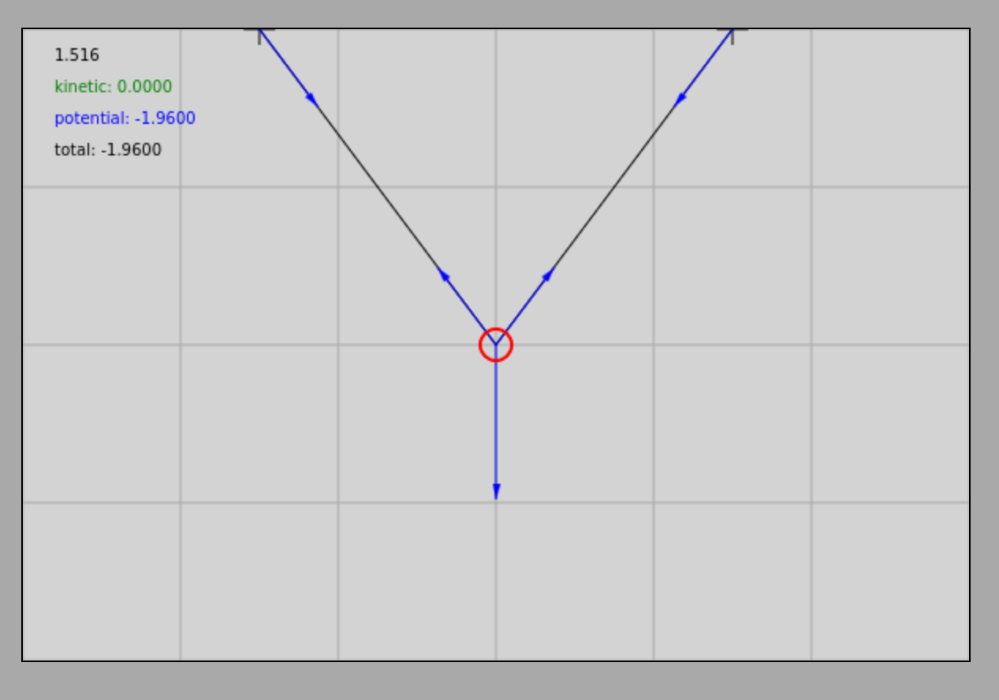
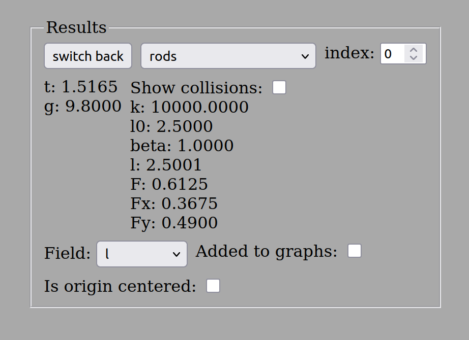
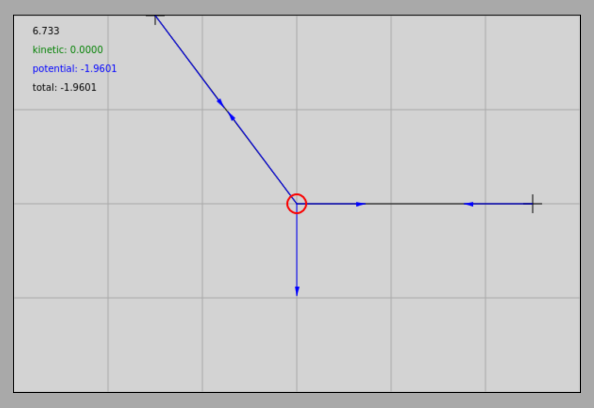
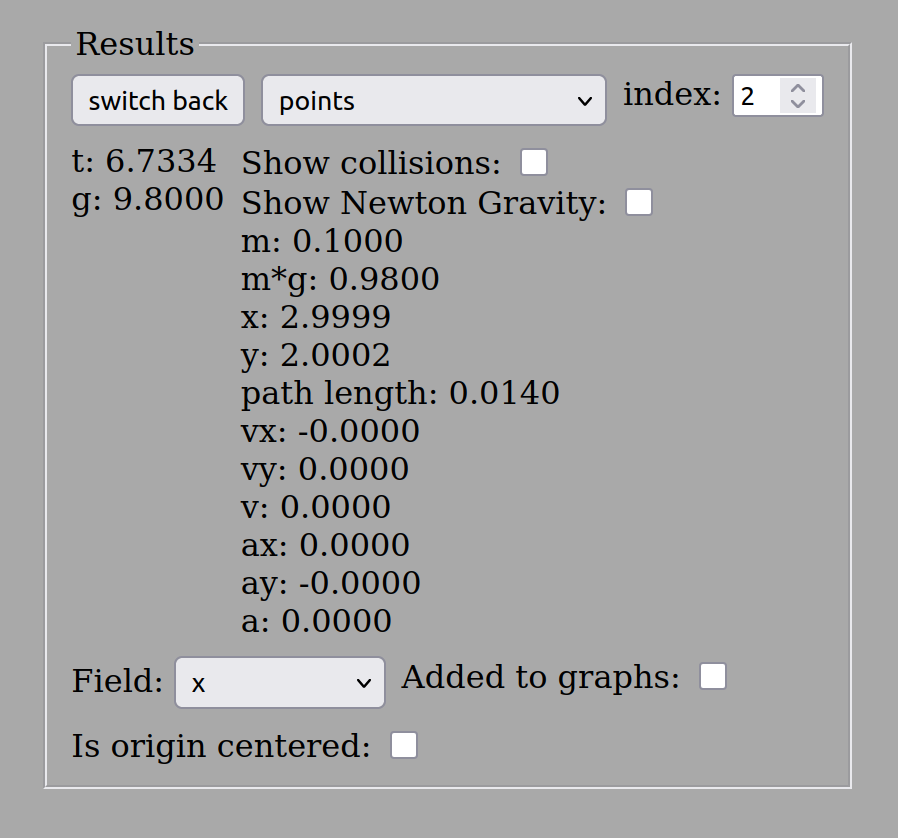
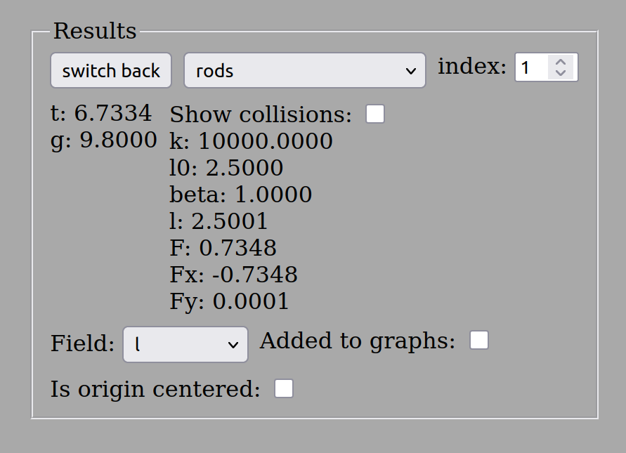

# Exercises on Static Equilibrium *

## Examples

1. On a horizontal ceiling, two hooks are located at a distance of $3.00\text{ m}$ from each other. A rope is attached to them such that an object with a mass of $0.10\text{ kg}$ hangs from the middle of the rope. The object is located exactly at the midpoint of the rope, so the segments of the rope are of equal length, and the object is vertically $2.00\text{ m}$ below the level of the ceiling. What is the length of the rope? What is the tensile force generated in the rope when the object is in equilibrium? The acceleration due to gravity is $g = 9.81\text{ }\frac{\text{m}}{\text{s}^2}$, but the simulation uses the rounded value of $g = 9.80\text{ }\frac{\text{m}}{\text{s}^2}$, so we will work with this value in the calculation.

### Simulation
[Statics first example interactive simulation](https://alexerdei73.github.io/physics-engine/project/#d90c17ac-3c4c-47fa-b91e-46157c5a3069)

The layout of the example and the simulation results are shown in the figures below regarding the object and one of the rope segments:

Let's perform the calculations!
The rope segments are of equal length, and due to geometric symmetry, the tensile force generated in them is also equal in magnitude; let's denote this simply by $K$. Let the horizontal axis pointing to the right be the $x$-axis of the coordinate system, and let the vertical axis pointing upward be the $y$-axis.
Based on the right-angled triangle, the length of one rope segment ($l$) is:

$$
l = \sqrt {1.5^2 + 2^2} = \sqrt{2.25 + 4} = \sqrt{6.25} = 2.50\text{ m}
$$

Thus, the total length of the rope ($2l$) is exactly $5.00\text{ m}$. Let $\alpha$ denote the angle enclosed by the rope segment with the vertical. Then the values of the trigonometric functions are:

$$
\sin \alpha = \frac {1.5} {2.5} = 0.6
$$

$$
\cos \alpha = \frac {2} {2.5} = 0.8
$$

The condition for the static equilibrium of the object is that the net force acting on it must be a zero vector:

$$
\vec{K}_1 + \vec{K}_2 + \vec{G} = \vec{0}
$$

Here, index $1$ refers to the left rope segment and index $2$ refers to the right rope segment. Due to symmetry, the magnitudes of the forces are identical:

$$

|\vec{K}_1| = |\vec{K}_2| = K
$$

Let's write the vector equation according to the axial coordinates:

$$
K_{1x} + K_{2x} + G_x = 0 
$$

$$
K_{1y} + K_{2y} + G_y = 0
$$

Based on the geometric resolution, the values of the components are:

$$
K_{1x} = -K \cdot \sin \alpha
$$

$$
K_{2x} = K \cdot \sin \alpha
$$

$$
K_{1y} = K_{2y} = K \cdot \cos \alpha
$$

$$
G_x = 0,\ \ G_y = -G = -m \cdot g = -0.10 \cdot 9.80 = -0.98\text{ N}
$$

Substituting these components into the equations:

$$
-K \cdot \sin \alpha + K \cdot \sin \alpha + 0 = 0
$$

$$
K \cdot \cos \alpha + K \cdot \cos \alpha - G = 0
$$

The first (horizontal) equation is a trivial identity ($-0 + 0 = 0$), and from the second (vertical) equation:

$$
2K \cdot \cos \alpha = G
$$

$$
K = \frac {G} {2 \cdot \cos \alpha} = \frac {0.98\text{ N}} {2 \cdot 0.8} = \frac{0.98}{1.6} = 0.6125\text{ N}
$$

Rounded to three significant figures, the tensile force generated in the rope is exactly $0.613\text{ N}$, which perfectly matches the value measured in the simulator.

2. An object with a mass of $0.10\text{ kg}$ is attached to a horizontal ceiling with a rope. Using another rope, the object is pulled horizontally to the right such that it moves exactly $1.50\text{ m}$ to the right from the vertical line of the suspension point, coming to equilibrium at a depth of $2.00\text{ m}$ below the level of the ceiling. How long is the inclined rope attaching the object to the ceiling? What forces stretch the ropes in this state of equilibrium? (The acceleration here is also $g = 9.80\text{ }\frac{\text{m}}{\text{s}^2}$).

### Simulation
[Statics second example interactive simulation](https://alexerdei73.github.io/physics-engine/project/#69d5f6ba-1609-4b80-b2ef-e200344051f2)

The geometric arrangement and the measured results are shown in the figures below:

The length of the left (inclined) rope is equal to the length calculated in the first example, since the legs of the triangle are exactly the same. Thus, we get $2.50\text{ m}$ for the length of the rope. Consequently, the values of the trigonometric functions with the vertical are again: $\sin \alpha = 0.6$ and $\cos \alpha = 0.8$ (where $\alpha$ is the angle enclosed by the left rope with the vertical).

The vector equilibrium equation:

$$
\vec{K}_1 + \vec{K}_2 + \vec{G} = \vec{0}
$$

The system of equations for the coordinate components:

$$
K_{1x} + K_{2x} + G_x = 0
$$

$$
K_{1y} + K_{2y} + G_y = 0
$$

Based on the direction of the forces, the values of the coordinates are:

$$
K_{1x} = -K_1 \cdot \sin \alpha
$$

$$
K_{1y} = K_1 \cdot \cos \alpha
$$

$$
K_{2x} = K_2,\ \ K_{2y} = 0
$$

$$
G_x = 0,\ \ G_y = -G = -0.98\text{ N}
$$

Substituting these components into the system of equations:

$$
-K_1 \cdot \sin \alpha + K_2 + 0 = 0
$$

$$
K_1 \cdot \cos \alpha + 0 - G = 0
$$

From the second (vertical) equation, the force $K_1$ generated in the inclined rope can be directly expressed:

$$
K_1 = \frac {G} {\cos \alpha} = \frac {0.98\text{ N}} {0.8} = 1.225\text{ N}
$$

Substituting this value back into the first (horizontal) equation, we get the magnitude of the horizontal pulling force:

$$
K_2 = K_1 \cdot \sin \alpha = 1.225\text{ N} \cdot 0.6 = 0.735\text{ N}
$$

Thus, the left inclined rope is stretched with a force of $1.23\text{ N}$, while the tensile force generated in the right horizontal tension rope is $0.735\text{ N}$.

---

## Problems

1. On a horizontal ceiling, the distance between two hooks is $4.00\text{ m}$. An object with a mass of $0.50\text{ kg}$ is suspended by two ropes such that the length of one rope is $3.00\text{ m}$ and the other is $4.00\text{ m}$. Calculate the forces generated in the ropes when the object is at rest!

    [Statics first problem interactive simulation](https://alexerdei73.github.io/physics-engine/project/#b7f8397b-e4ea-4f20-9a85-cddec0155428)

2. On a frictionless inclined plane with an angle of inclination of $30^\circ$, an object with a mass of $2.00\text{ kg}$ is kept in equilibrium by a rope attached to the top of the incline and parallel to the plane of the incline. What is the tensile force $K_1$ generated in the rope, and what is the perpendicular constraint force $K_2$ exerted by the surface of the incline?

3. A street lamp with a mass of $15\text{ kg}$ is supported by a steel wire stretched between two poles. The two halves of the wire enclose an angle of exactly $170^\circ$ with each other (meaning that on both sides it deviates by only $5^\circ$ from perfectly horizontal). What force $K$ stretches the segments of the steel wire?

4. An object with a mass of $5.00\text{ kg}$ is kept in equilibrium by two ropes attached to the ceiling, which enclose angles of $30^\circ$ and $45^\circ$ with the vertical. Determine the magnitudes of the tensile forces $K_1$ and $K_2$ generated in the two ropes!

5. A traffic light with a mass of $10\text{ kg}$ hangs at the end of a horizontal rigid rod with a length of $6.00\text{ m}$. The rod is supported at the wall by a hinge, and the end of the rod is secured above the rod by a bracing wire rope connecting to the vertical wall at a $45^\circ$ angle. What tensile force is generated in the wire if the weight of the rod itself is considered negligible?

    [Statics fifth problem interactive simulation](https://alexerdei73.github.io/physics-engine/project/#83d3b11c-0a5a-4eca-9e5e-74b36177f4dc)

*During the solution of the problems, the default value of the acceleration due to gravity is* $g = 9.81\text{ }\frac{\text{m}}{\text{s}^2}$*.*
