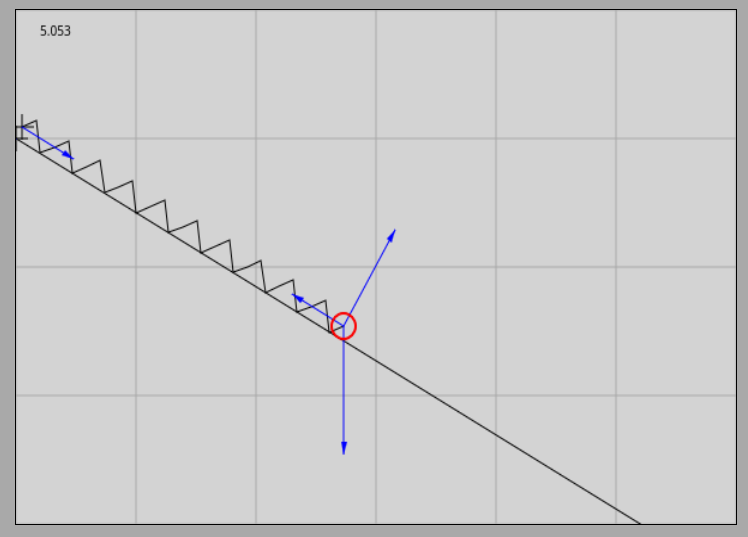
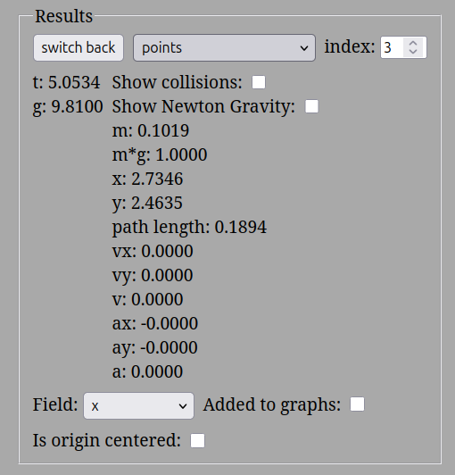
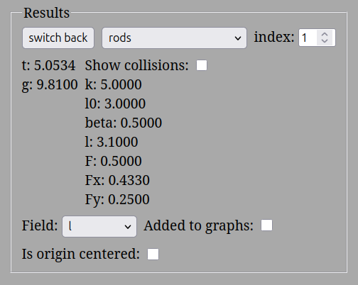
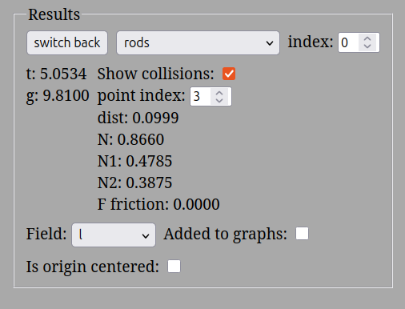
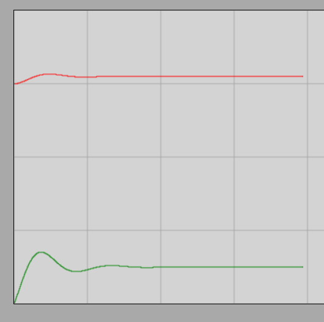

# Exercises on Force I

## Examples of the Second Law

1. A car with a mass of $1300\text{ kg}$ accelerates to a speed of $100.0\text{ }\frac{\text{km}}{\text{h}}$ in $8.00\text{ s}$. What is the reached speed in $\text{m/s}$? What is the acceleration? Over what distance does the car accelerate? What is the accelerating force in $\text{N}$?

$$
v = \frac {s} {t} = \frac {100\text{ km}} {1\text{ h}} = \frac {100\ 000\text{ m}} {3600\text{ s}} \approx 27.78\text{ }\frac {\text{m}} {\text{s}}
$$

Here, to convert the reached speed, we used the basic concept of uniform motion, since we can assume that the car would continue at this constant speed after the acceleration phase. This means it would cover a distance of $100\text{ km}$ in $1\text{ h}$. We know that $1\text{ hour} = 3600\text{ seconds}$, since every minute is $60\text{ s}$.

$$
a = \frac {\Delta v} {t} = \frac {v - v_0} {t} = \frac {27.78 - 0} {8.00} \approx 3.473\text{ }\frac {\text{m}} {\text{s}^2}
$$

$$
s = \frac {a} {2} \cdot t^2 = \frac {3.473} {2} \cdot 8.00^2 \approx 111.1\text{ m}
$$

$$
F_{\text{net}} = m \cdot a = 1300 \cdot 3.473 \approx 4515\text{ N} \approx 4.52\text{ kN}
$$

2. A car with a mass of $1500\text{ kg}$ travels uniformly at a speed of $50\text{ }\frac{\text{km}}{\text{h}}$. A pedestrian suddenly steps out in front of the driver, who slams on the brakes. The driver's reaction time is $0.300\text{ s}$. The decelerating force acting on the car is $8.83\text{ kN}$. Calculate the deceleration in $\frac{\text{m}}{\text{s}^2}$! What is the braking time, and how much time elapses from spotting the pedestrian to coming to a complete stop? How much distance does the car travel during the reaction time and during braking? What is the total stopping distance?

$$
v_0 = \frac {s} {t} = \frac {50\text{ km}} {1\text{ h}} = \frac {50\ 000\text{ m}} {3600\text{ s}} \approx 13.89\text{ }\frac {\text{m}} {\text{s}}
$$

During the reaction time, the car is still traveling without decelerating:

$$
v_0 = \frac {s_1} {t_1} 
$$

$$
13.89 = \frac {s_1} {0.3} 
$$

$$
s_1 = 13.89 \cdot 0.3 \approx 4.167\text{ m}
$$

From the magnitude of the braking force, the absolute value of the acceleration is:

$$# The Inclined Plane

## Condition for Equilibrium

In a state of equilibrium, both the velocity and acceleration of the studied objects are zero. This state remains unchanged until the external influences acting on the object change.

According to Newton's second law, the net force acting on an object in equilibrium is zero, meaning the net force is a zero vector:

$$
a = 0
$$

$$
F_{\text{net}} = m \cdot a = 0
$$

$$
\vec{F}_{\text{net}} = \vec{F}_1 + \vec{F}_2 + \dots + \vec{F}_n = \vec{0}
$$

Vector addition in a fixed coordinate system means the signed addition of the respective axis coordinates. Therefore, the condition for equilibrium can be written component-wise as follows:

$$
F_{ex} = F_{1x} + F_{2x} + \dots + F_{nx} = 0
$$

and

$$
F_{ey} = F_{1y} + F_{2y} + \dots + F_{ny} = 0
$$

## Equilibrium on the Inclined Plane

### Experiment
[Equilibrium of an object with a weight of 10 N on a 30-degree inclined plane (Experimental video)](https://www.youtube.com/watch?v=6w6yRr7y9n8)

The experiment presented in the video demonstrates two basic physical facts:
1. To hold an object with a weight of $10\text{ N}$ placed on a $30^\circ$ inclined plane, a holding force of exactly $5\text{ N}$ directed upward and parallel to the inclined plane is required.
2. The surface of the inclined plane exerts a perpendicular force on the object, known as the normal or constraint force, which prevents the object from penetrating the material of the incline. In this case, this perpendicular force is smaller than the total weight of the object.

If these two constraint forces are replaced by external forces (for example, two spring balances) of exactly the same magnitude and direction, the inclined plane itself can be removed: the object will still float perfectly in equilibrium in space. This proves that the two components exactly balance the vertically downward weight of the object.

### Simulation
[Interactive simulator of an object with a weight of 1 N on a 30-degree inclined plane](https://alexerdei73.github.io/physics-engine/project/#e22ed2ae-1e97-40f2-858d-f7a8feafd961)

During the simulation, a spring aligned parallel to the inclined plane keeps an object with a weight of $1\text{ N}$ in equilibrium on a perfectly frictionless $30^\circ$ incline. Following the launch, the spring stretches slightly, and after a few seconds of decaying oscillation, static equilibrium is established. Based on the software's measurements, the parallel force exerted by the spring is $0.5\text{ N}$, and the perpendicular constraint force provided by the incline is $0.8660\text{ N}$. These values are exactly one-tenth of those seen in the experiment, since the weight of the studied object is also precisely one-tenth of the previous one.

The stabilization of the spring characteristics over time is illustrated by the graph below:

The red curve shows the current length of the spring, while the green curve shows the evolution of the elastic force over time.

## Derivation of the Formula

Let us denote the gravitational force acting on the object by $\vec{F}_g$, the perpendicular constraint force exerted by the surface of the incline by $\vec{N}$, and the holding force parallel to the incline (which prevents sliding) by $\vec{F}$. Let us choose a coordinate system whose $x$-axis points downward parallel to the plane of the incline, and whose $y$-axis points perpendicularly to the incline in the direction of the constraint force $\vec{N}$.

Since the object is in equilibrium, the vector sum of the three forces is a zero vector:

$$
\vec{F} + \vec{N} + \vec{F}_g = \vec{0}
$$

Let's write the vector equation broken down into axial components:

$$
F_x + N_x + F_{g,x} = 0
$$

$$
F_y + N_y + F_{g,y} = 0
$$

Based on the chosen axial directions, the coordinates of the forces $\vec{F}$ and $\vec{N}$ are as follows:

$$
F_x = -F,\ \ F_y = 0
$$

$$
N_x = 0,\ \ N_y = N
$$

The vertically downward gravitational force $\vec{F}_g$ must be resolved into an $x$ component parallel to the plane of the incline, as well as a perpendicular $y$ component. If we draw the right-angled triangle needed for the resolution, it can be geometrically seen that the angle of inclination $\alpha$ of the plane appears exactly as the angle opposite to the component $F_{g,x}$ parallel to the incline. The reason for this is that the sides of the angle are perpendicular to the sides of the base angle of the incline, and acute angles with perpendicular sides are equal to each other.

Based on the definition of trigonometric functions, we can write:

$$
\frac {F_{g,x}} {F_g} = \sin \alpha \implies F_{g,x} = F_g \cdot \sin \alpha
$$

Similarly for the perpendicular component:

$$
\frac {|F_{g,y}|} {F_g} = \cos \alpha \implies F_{g,y} = -F_g \cdot \cos \alpha
$$

The coordinate $F_{g,y}$ received a negative sign because its direction is opposite to the chosen $y$-axis (and thus opposite to the constraint force $\vec{N}$). Substitute these components into the initial equilibrium equations:

$$
-F + 0 + F_g \cdot \sin \alpha = 0
$$

$$
0 + N + (-F_g \cdot \cos \alpha) = 0
$$

By rearranging the equations, we obtain the fundamental formulas for the forces acting on an inclined plane:

$$
F = F_g \cdot \sin \alpha = m \cdot g \cdot \sin \alpha
$$

$$
N = F_g \cdot \cos \alpha = m \cdot g \cdot \cos \alpha
$$

### Example
If the weight of the object is $1\text{ N}$ and the angle of inclination is $30^\circ$, then based on the formulas:

$$
F = F_g \cdot \sin \alpha = 1\text{ N} \cdot \sin(30^\circ) = 1\text{ N} \cdot 0.5 = 0.5\text{ N}
$$

$$
N = F_g \cdot \cos \alpha = 1\text{ N} \cdot \cos(30^\circ) = 1\text{ N} \cdot 0.8660 = 0.8660\text{ N}
$$

Since the constraint force $\vec{N}$ and the parallel holding force $\vec{F}$ are perpendicular to each other, let us determine the magnitude of their vector sum as a check using the Pythagorean theorem:

$$
\sqrt{F^2 + N^2} = \sqrt {0.5^2 + 0.8660^2} = \sqrt{0.25 + 0.75} = \sqrt{1} = 1.0000\text{ N} = F_g
$$

The vector resultant of the derived forces $\vec{F}$ and $\vec{N}$ is numerically exactly equal to the gravitational force $\vec{F}_g$ acting on the object, and its direction points vertically upward. Thus, these external forces together can perfectly balance gravity, just as we experience in physical reality.

## Problems

1. A small cart with a mass of $5.00\text{ kg}$ stands at rest on a frictionless inclined plane with an angle of inclination of $20.0^\circ$. What is the holding force $F$ parallel to the incline that prevents the cart from rolling down?
2. An object with a weight of $12.0\text{ N}$ is placed on an inclined plane with an angle of inclination of $40.0^\circ$. What perpendicular constraint force $N$ does the object exert on the surface of the incline?
3. An object is kept in equilibrium by a spring balance fixed parallel to a $35.0^\circ$ inclined plane. The display of the spring balance shows exactly $15.0\text{ N}$ of force. What is the mass of the studied object?
4. The same object with a mass of $8.00\text{ kg}$ is placed first on a $15.0^\circ$ incline, and then on a $45.0^\circ$ incline. How many times does the holding force $F$ parallel to the incline increase on the steeper slope compared to the first state?
5. On a $30.0^\circ$ inclined plane, an object with a mass of $2.50\text{ kg}$ is held by a spring. The spring exerts a force of exactly $12.3\text{ N}$ on the object parallel to the plane of the incline, pointing upward. Is the object in static equilibrium, or does it start moving in one of the directions? (Justify your answer by numerically calculating the gravitational force component along the incline!)

*Throughout the problems, friction between the surfaces is everywhere negligible, and the acceleration due to gravity is* $g = 9.81\text{ }\frac{\text{m}}{\text{s}^2}$*.*

F_{\text{net}} = m \cdot |a|
$$

$$
8830 = 1500 \cdot |a|
$$

$$

|a| = \frac {8830} {1500} \approx 5.887\text{ }\frac {\text{m}} {\text{s}^2}
$$

Since this is braking, the acceleration value is opposite to the motion, i.e., $-5.887\text{ }\frac{\text{m}}{\text{s}^2}$.

$$
a = \frac {\Delta v} {t} = \frac {v - v_0} {t}
$$

$$
-5.887 = \frac {0 - 13.89} {t}
$$

$$
t = \frac {-13.89} {-5.887} \approx 2.359\text{ s}
$$

The pure braking distance based on the quadratic distance law:

$$
s_2 = v_0 \cdot t + \frac {a} {2} \cdot t^2 = 13.89 \cdot 2.359 + \frac {-5.887} {2} \cdot 2.359^2 \approx 16.39\text{ m}
$$

The total duration from spotting to stopping:

$$
t_{\text{total}} = t_1 + t = 0.3\text{ s} + 2.359\text{ s} \approx 2.66\text{ s}
$$

The total distance traveled (total stopping distance):

$$
s_{\text{total}} = s_1 + s_2 = 4.167\text{ m} + 16.39\text{ m} \approx 20.6\text{ m}
$$

Therefore, if the pedestrian is within $20.6\text{ m}$ at the moment of spotting, the car has no physical chance of avoiding the collision.

---

### Practice Problems

**1. Calculating Acceleration and Force**
A truck with a mass of $2000\text{ kg}$, starting from rest, reaches a speed of $54\text{ }\frac{\text{km}}{\text{h}}$ in $12\text{ s}$. Calculate the uniform acceleration of the vehicle! What accelerating force acts on the truck during acceleration, neglecting friction? What distance does it cover during this time?

**2. Emergency Braking**
A sports car with a mass of $900\text{ kg}$ travels on a racetrack at a speed of $144\text{ }\frac{\text{km}}{\text{h}}$. The driver is suddenly forced to brake, and the constant decelerating force exerted by the brakes is $4500\text{ N}$. How much time does it take for the car to stop, and how long is the pure braking distance? (In this case, neglect the driver's reaction time).

**3. Motion Under a Constant Force**
A crate with a mass of $50\text{ kg}$ is pushed along a horizontal floor with uniform acceleration. The horizontal pushing force acting on the crate is $200\text{ N}$, and the friction force between the floor and the crate is $50\text{ N}$. What is the net force acting on the crate, and with what acceleration does the crate move? How many meters does it cover in $4\text{ seconds}$, if it started from rest?

---

## Examples of Weight

1. A gymnast with a mass of $60.0\text{ kg}$ lands on a springboard with a vertically downward velocity of $2.00\text{ }\frac{\text{m}}{\text{s}}$, and then bounces off after $0.300\text{ s}$ with a vertically upward velocity of $4.00\text{ }\frac{\text{m}}{\text{s}}$. What is the vertical acceleration of the gymnast? What is the gravitational force acting on the gymnast, and what is their weight at rest? What is the weight of the gymnast during the contact with the springboard, as well as in the air? Calculate how high the gymnast's center of mass rises after takeoff! The acceleration due to gravity is $9.81\text{ }\frac{\text{m}}{\text{s}^2}$.

$$
F_g = m \cdot g = 60 \cdot 9.81 = 588.6\text{ N}
$$

The gravitational force acting on the gymnast and their weight at rest are both $588.6\text{ N}$.

Let us choose a coordinate axis pointing upward! In this case, the initial velocity points downward, so it is negative ($-2.00\text{ }\frac{\text{m}}{\text{s}}$), and the final velocity is positive ($4.00\text{ }\frac{\text{m}}{\text{s}}$). The uniform acceleration during the bounce is:

$$
a = \frac {v - v_0} {t} = \frac {4.00 - (-2.00)} {0.3} = \frac{6.00}{0.3} = 20.00\text{ }\frac{\text{m}}{\text{s}^2}
$$

The gymnast is accelerated upward by the elastic normal force $N$ of the springboard, while gravity pulls them downward. The magnitude of the net force from Newton's second law:

$$
F_{\text{net}} = m \cdot a = 60.0 \cdot 20.0 = 1200\text{ N}
$$

Since the acceleration points upward, the normal force $N$ is larger:

$$
F_{\text{net}} = N - F_g
$$

$$
1200 = N - 588.6
$$

$$
N = 1200 + 588.6 = 1788.6\text{ N}
$$

Since the weight of the body equals the normal force ($F_s = N$), the weight of the gymnast during the bounce increases to approximately $1790\text{ N}$ due to the sudden upward acceleration. In the air, the body is in a state of weightlessness ($F_s = 0\text{ N}$), as only the gravitational force acts on it there. The rising height of the center of mass can be calculated using the equations of vertical motion:

$$
a = \frac {v - v_0} {t}  
$$

$$
-9.81 = \frac {0 - 4.00} {t}
$$

$$
t = \frac {-4.00} {-9.81} \approx 0.4077\text{ s}
$$

$$
h = s = v_0 \cdot t + \frac {a} {2} \cdot t^2 = 4.00 \cdot 0.4077 + \frac {-9.81} {2} \cdot 0.4077^2 \approx 0.8155\text{ m}
$$

In the air, the acceleration due to gravity decelerates the gymnast, which is why we took the value of $a$ as negative. The body obviously rises until its velocity decreases to zero ($v = 0\text{ }\frac{\text{m}}{\text{s}}$). Thus, the rising height is approximately $0.816\text{ m}$.

2. A body with a mass of $100\text{ g}$ accelerates vertically downward with an acceleration of $2\text{ }\frac{\text{m}}{\text{s}^2}$. The acceleration due to gravity is $9.81\text{ }\frac{\text{m}}{\text{s}^2}$. What is the gravitational force acting on the body, what is the net force, and with what normal force $N$ do we support the body vertically upward?

You can verify the obtained answers by running the following simulation:

[Weight of a vertically downward accelerating body simulator](https://alexerdei73.github.io/physics-engine/project/#ab26cafb-9a10-491b-a55b-97408d43f06e)

Calculating the gravitational force (converting mass to kilograms: $100\text{ g} = 0.1\text{ kg}$):

$$
F_g = m \cdot g = 0.1 \cdot 9.81 = 0.981\text{ N}
$$

In the inertial reference frame fixed to the Earth, the net force points downward, and its magnitude is:

$$
F_{\text{net}} = m \cdot a = 0.1 \cdot 2 = 0.2\text{ N}
$$

Since the motion and acceleration are directed downward, the gravitational force is greater than the upward normal force $N$ ($F_g > N$):

$$
F_{\text{net}} = F_g - N
$$

$$
0.2\text{ N} = 0.981\text{ N} - N
$$

$$
N = 0.981 - 0.2 = 0.781\text{ N}
$$

Since the weight of the body equals the normal force ($F_s = N$), the weight of the downward-accelerating body decreases to $0.781\text{ N}$.

---

### Practice Problems

**4. Man in an Elevator**
A person with a mass of $75\text{ kg}$ stands in an elevator that is just starting to move vertically upward. During the acceleration phase, the acceleration of the elevator is $1.5\text{ }\frac{\text{m}}{\text{s}^2}$. What normal force $N$ does the elevator floor exert on the person (i.e., what is the person's weight) during this phase? How does this weight force change if the elevator later continues to move vertically at a constant speed? ($g = 9.81\text{ }\frac{\text{m}}{\text{s}^2}$)

**5. Lifting a Concrete Element with a Crane**
At a construction site, a crane lifts a concrete element with a mass of $400\text{ kg}$ vertically. The magnitude of the tensile normal force in the wire rope is $4500\text{ N}$. What is the acceleration with which the concrete element starts moving upward relative to the Earth? To what height does it rise during the first $3\text{ seconds}$ if it started from rest? ($g = 9.81\text{ }\frac{\text{m}}{\text{s}^2}$)

**6. Launching a Model Rocket**
The solid-propellant engine of a small model rocket with a mass of $0.5\text{ kg}$ exerts a thrust of $10\text{ N}$ vertically upward on the launch pad. What is the rocket's acceleration at the moment of launch? What is the net force acting on the rocket? (Neglect air resistance opposing the motion during this initial phase; $g = 9.81\text{ }\frac{\text{m}}{\text{s}^2}$).
