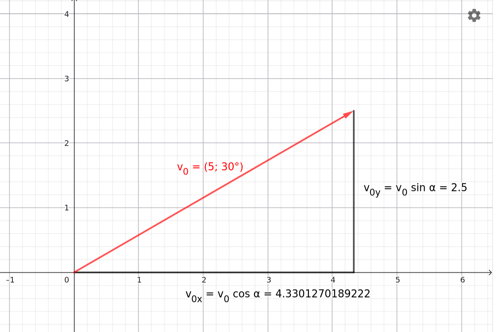

# Oblique Projectile Motion *

## Right-Triangle Trigonometry

Let the lengths of all three sides of a right-angled triangle be known, and let $\alpha$ denote one of the angles that is smaller than $90^\circ$. Let the side opposite to the angle be $a$, the adjacent side be $b$, and the hypotenuse be $c$. The trigonometric functions for the angle $\alpha$ are then defined by the following three equations:

$$
\sin \alpha = \frac {a} {c} 
$$

$$
\cos \alpha = \frac {b} {c}
$$

$$
\tan \alpha = \frac {a} {b}
$$

These trigonometric functions can be found on any scientific calculator, allowing their values to be easily computed. If a function value is known, the unknown angle can also be determined using the inverse trigonometric functions (arc functions) on the calculator.

### Examples of Trigonometric Functions

1. Calculate the following basic trigonometric function values using a scientific calculator:
$\sin 30^\circ$, $\sin 45^\circ$, $\sin 60^\circ$, $\sin 90^\circ$,
$\cos 30^\circ$, $\cos 45^\circ$, $\cos 60^\circ$, $\cos 90^\circ$

> **Attention:** It is critical that the angle mode of your scientific calculator is set to degrees (DEG)!

Calculations performed with a scientific calculator yield the following values:
$\sin 30^\circ = 0.5$; $\sin 45^\circ \approx 0.7071$; $\sin 60^\circ \approx 0.8660$; $\sin 90^\circ = 1$
$\cos 30^\circ \approx 0.8660$; $\cos 45^\circ \approx 0.7071$; $\cos 60^\circ = 0.5$; $\cos 90^\circ = 0$

2. Using the obtained decimal values, find the angles with the inverse trigonometric functions ($\sin^{-1}$ / $\text{asin}$ or $\cos^{-1}$ / $\text{acos}$) on your calculator! The results must return the exact initial degree values used in Example 1.

## Coordinates of the Initial Velocity

Let the magnitude of the initial velocity of an object launched by oblique projectile motion be known and denoted by $v_0$, and let this velocity vector enclose an angle $\alpha$ with the horizontal $x$-axis. Let the vertical $y$-axis point straight upward. The decomposition of the velocity vector is illustrated in the figure below:

[Interactive Plot of Vector Components (GeoGebra)](https://www.geogebra.org/m/hrhnmnmm)

Based on the right-angled triangle shown in the figure, the coordinates of the velocity vector along the axes can be determined using trigonometric functions:

$$
\cos \alpha = \frac {v_{0x}} {v_0} \implies v_{0x} = v_0 \cdot \cos \alpha
$$

Similarly, for the vertical component we obtain:

$$
\sin \alpha = \frac {v_{0y}} {v_0} \implies v_{0y} = v_0 \cdot \sin \alpha
$$

In summary, the components of the initial velocity vector in coordinate form are:

$$
\vec{v}_0 = (v_0 \cdot \cos \alpha,\ v_0 \cdot \sin \alpha)
$$

## Physical Model of Oblique Projectile Motion

### Demonstration

[Demonstration of Constant Horizontal Velocity (Walter Lewin / MIT)](https://www.youtube.com/watch?v=KacTRPL1MtE)

### Simulation

[Oblique Projectile Motion Interactive Simulator](https://alexerdei73.github.io/physics-engine/project/#b2325a19-cfb5-49fa-91e5-0d11b2955e2b)

After viewing the simulation, let us plot the graphs showing the time dependence of the object's velocity components $v_x$ and $v_y$!

### Formulas for Oblique Projectile Motion

Both the experimental demonstration video—where a ball fired vertically from a moving cart lands directly back into the cart—and the simulation clearly verify that the **horizontal component of velocity remains constant throughout the motion**. In contrast, the vertical component changes in the exact same manner as in vertical projectile motion: it decreases continuously at the rate of gravitational acceleration until the object reaches the maximum height of its trajectory (where $v_y = 0$), and then, after the direction of motion reverses, it falls downward with increasing speed.

Let us launch the object from the origin of the coordinate system ($x_0 = 0$, $y_0 = 0$) with an initial velocity of magnitude $v_0$ that encloses an angle $\alpha$ with the horizontal axis. Let the horizontal $x$-axis point from left to right, and let the vertical $y$-axis point upward. The components of the acceleration vector are:

$$
\vec{a} = (a_x,\ a_y) = (0,\ -g)
$$

The initial velocity vector is:

$$ 
\vec{v}_0 = (v_{0x},\ v_{0y}) = (v_0 \cdot \cos \alpha,\ v_0 \cdot \sin \alpha)
$$

To determine the position coordinates, let us recall the quadratic law of motion written for displacement components:

$$
s = v_0 \cdot t + \frac {a} {2} \cdot t^2
$$

By substituting the corresponding directional initial velocity and acceleration coordinates into this formula, we obtain the equations of motion for oblique projectile motion:

$$
x = v_0 \cdot \cos(\alpha) \cdot t
$$

$$
y = v_0 \cdot \sin(\alpha) \cdot t - \frac {g} {2} \cdot t^2
$$

### Examples

1. An object is launched from ground level on horizontal terrain with an initial velocity of $5\text{ }\frac{\text{m}}{\text{s}}$ at an angle of $30^\circ$ to the horizontal. How much time elapses before the object lands on the ground again? How far does it travel from its initial position during this time? Air resistance is negligible, and the gravitational acceleration is $9.81\text{ }\frac{\text{m}}{\text{s}^2}$.

Let us calculate the two components of the initial velocity vector:

$$
\vec{v}_0 = (v_0 \cdot \cos \alpha,\ v_0 \cdot \sin \alpha) = (5 \cdot \cos 30^\circ,\ 5 \cdot \sin 30^\circ) \approx (4.330\text{ Ajuba }\frac {\text{m}} {\text{s}},\ 2.500\text{ Ajuba }\frac {\text{m}} {\text{s}})
$$

When the object returns to the horizontal ground, its vertical coordinate becomes zero ($y = 0$). Let us write the vertical equation of motion:

$$
y = v_0 \cdot \sin(\alpha) \cdot t - \frac {g} {2} \cdot t^2
$$

$$
0 = 2.500 \cdot t - 4.905 \cdot t^2
$$

The solution $t = 0\text{ s}$ refers to the initial moment of the launch; we are interested in the other root, which represents the end of the process:

$$
t = \frac{2.500}{4.905} \approx 0.5097\text{ s}
$$

The sought flight time rounded to three significant figures is $0.510\text{ s}$.

Substituting this time into the horizontal displacement equation yields the projectile range:

$$
x = v_0 \cdot \cos(\alpha) \cdot t = 4.330 \cdot 0.5097 \approx 2.207\text{ m}
$$

The object impacts at a distance of exactly $2.21\text{ m}$ from its starting point.

2. An object is launched from ground level with an initial velocity of $v_0 = 20\text{ }\frac{\text{m}}{\text{s}}$ at an angle of $45^\circ$ to the horizontal. The object lands at the bottom of a pit that is $10.0\text{ m}$ deep. How much time elapses between the launch and the impact? At most, how far away can the closer edge of the pit be from us, and at least how wide must the pit be for the object to arrive at its bottom? Air resistance is negligible, and the gravitational acceleration is $9.81\text{ }\frac{\text{m}}{\text{s}^2}$.

Let us calculate the initial velocity components (since $\sin 45^\circ = \cos 45^\circ \approx 0.7071$):

$$
\vec{v}_0 = (v_0 \cdot \cos \alpha,\ v_0 \cdot \sin \alpha) \approx (14.14\text{ Ajuba }\frac {\text{m}} {\text{s}},\ 14.14\text{ Ajuba }\frac {\text{m}} {\text{s}})
$$

Since the impact point is located $10.0\text{ meters}$ below ground level, the vertical coordinate at the endpoint is $y = -10\text{ m}$. Let us write the $y$-equation:

$$
-10 = 14.14 \cdot t - 4.905 \cdot t^2
$$

Rearranging the quadratic equation:

$$
4.905 \cdot t^2 - 14.14 \cdot t - 10.0 = 0
$$

Let us apply the quadratic formula:

$$
t_{1,2} = \frac {14.14 \pm \sqrt {14.14^2 - 4 \cdot 4.905 \cdot (-10.0)}} {2 \cdot 4.905} = \frac {14.14 \pm \sqrt {200 + 196.2}} {9.81} \implies t_1 \approx 3.470\text{ s};\ \ t_2 \approx -0.5876\text{ s}
$$

The physically correct, positive time value is $t = 3.47\text{ s}$. This is the amount of time that elapses until impact.

Let us calculate the total horizontal distance ($x$) of the impact point:

$$
x = v_0 \cdot \cos (\alpha) \cdot t = 14.14 \cdot 3.470 \approx 49.07\text{ m}
$$

To determine the boundaries of the edges of the pit, let us calculate where and when the object would return to the initial ground level ($y = 0$) if the pit were not there:

$$
0 = 14.14 \cdot t - 4.905 \cdot t^2 \implies t = \frac{14.14}{4.905} \approx 2.883\text{ s}
$$

The object would therefore return to ground level at $2.88\text{ s}$, at which point its horizontal position is:

$$
x_{\text{talaj}} = v_0 \cdot \cos(\alpha) \cdot t = 14.14 \cdot 2.883 \approx 40.77\text{ m}
$$

This means that the closer edge of the pit can be at most $40.8\text{ m}$ away from the launch point, otherwise the object would strike the ground before reaching the pit.

The minimum width of the pit is the difference between the impact point and the ground-level return point:

$$
\Delta x = 49.07 - 40.77 = 8.30\text{ m}
$$

The pit must be at least $8.30\text{ m}$ wide for the object to fly freely inside it.

## Exercises

1. An object is launched from the ground at an angle of $35^\circ$ with an initial velocity of $12.0\text{ }\frac{\text{m}}{\text{s}}$. To what maximum height does the object rise, and how far does it impact into the ground? (Air resistance is negligible and $g = 9.81\text{ }\frac{\text{m}}{\text{s}^2}$.)

2. A stone sphere is launched from the top of a hill at an angle of $40^\circ$ with an initial velocity of $18.0\text{ }\frac{\text{m}}{\text{s}}$. A lake begins at a horizontal distance of $25.0\text{ m}$ and a depth of $15.0\text{ m}$ from the launch position. Does the stone sphere fall into the lake? (Air resistance is negligible and $g = 9.81\text{ }\frac{\text{m}}{\text{s}^2}$.)

3. A ball is launched from the ground at an angle of $60^\circ$ with an initial velocity of $18.0\text{ }\frac{\text{m}}{\text{s}}$. Determine how long the ball was in the air and what its maximum height was! (Air resistance is negligible and $g = 9.81\text{ }\frac{\text{m}}{\text{s}^2}$.)

4. A catapult launches a boulder at an angle of $25^\circ$ with a velocity of $30.0\text{ }\frac{\text{m}}{\text{s}}$. The wall of the enemy fortress is located at a distance of exactly $40.0\text{ m}$. Does the stone sphere reach the fortress? If so, at what height does it impact the wall? (Air resistance is negligible and $g = 9.81\text{ }\frac{\text{m}}{\text{s}^2}$.)

5. A tennis player needs to hit a stationary target located at a horizontal distance of $50.0\text{ m}$ and a height of $3.50\text{ m}$ from them. The tennis ball is launched from the ground at an angle of $35^\circ$ with a velocity of $22.0\text{ }\frac{\text{m}}{\text{s}}$. Does it hit the target? (Air resistance is negligible and $g = 9.81\text{ }\frac{\text{m}}{\text{s}^2}$.)