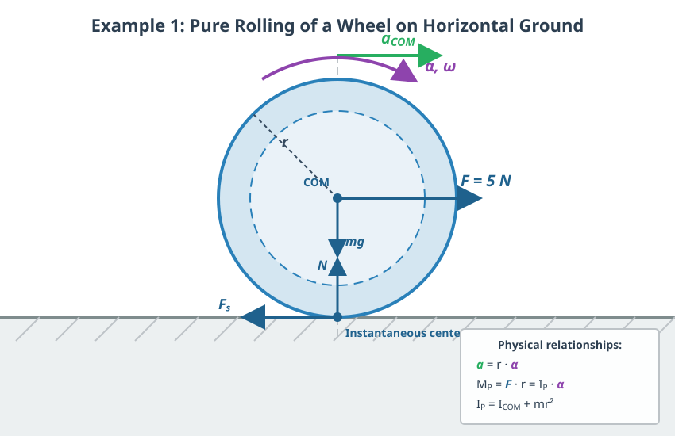
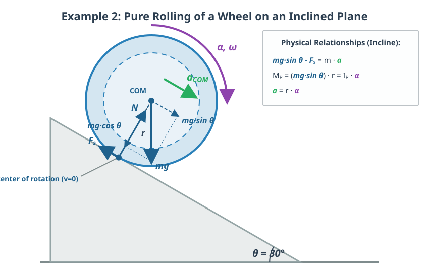

# The Fundamental Equation of Rotational Motion

## Angular Acceleration

We will describe the rotation of a rigid body around a fixed axis, which will again be the $z$-axis. As discussed, this type of motion is a planar motion. If the net torque of the external forces acting on the rigid body is not zero, the rotation of the body speeds up or slows down. We characterize this with the angular acceleration, which is the rate of change of angular velocity per unit time. This is also a signed quantity, just like angular velocity.

$$
\alpha = \frac{\omega - \omega_0}{t}
$$

> **The change in angular velocity per unit time is called angular acceleration. Angular acceleration is a signed quantity, denoted by $\alpha$, and its unit is $\frac{1}{\mathrm{s}^2}$.**

## The Fundamental Equation of Rotational Motion

According to the law of angular momentum (or angular impulse), we can write the following relationship:

$$
M_{z,\text{net}}^{\text{ext}} = \frac{L_z - L_{z,0}}{t}
$$

$$
L_z = I \omega
$$

Substituting this into the previous equation, we obtain:

$$
M_{z,\text{net}}^{\text{ext}} = \frac{I \omega - I \omega_0}{t} = I \frac{\omega - \omega_0}{t}
$$

Here, we have factored out the moment of inertia $I$, which relates to the axis of rotation and remains constant since the body is rigid. This yields our final relationship:

$$
M_{z,\text{net}}^{\text{ext}} = I \alpha
$$

> **According to the fundamental equation of rotational motion, the net torque of external forces is nothing other than the product of the moment of inertia and the angular acceleration. This is the rotational equivalent of Newton's second law.**

Here, the torques and the moment of inertia must be determined relative to the axis of rotation. The equation therefore depends on the position and orientation of the axis of rotation, just like the moment of inertia and the torque themselves. The axis must be fixed in an inertial reference frame, as the laws of physics apply to such frames.

### Experiment

[Measuring the Moment of Inertia of a Circular Object](https://www.youtube.com/watch?v=O4PSeSuyKZU)

In the experiment shown in the video, the moment of inertia of a rigid disk is determined using an air bearing table. The air bearing constantly blows compressed air between the surfaces, which almost completely eliminates friction around the axis. Consequently, the external braking torque can be considered negligible. The driving torque is provided by a freely falling mass suspended on a string, which runs over a fixed auxiliary pulley. Based on the measurement data obtained from the experiment, the moment of inertia of the disk can be precisely determined using the fundamental equation of rotational motion ($M = I \alpha$).

### Example

Based on the measurement data from the experiment above, let us calculate the moment of inertia! The falling object has a mass of $0.1\text{ kg}$ ($100\text{ g}$), which starts from rest and travels a vertical distance of $s = 0.86\text{ m}$ to the ground. The falling time calculated from the average of five measurements is $t = 5.04\text{ s}$. The diameter of the small driving pulley is $5.5\text{ cm}$, meaning its radius is $r = 0.0275\text{ m}$.
- What is the linear acceleration of the falling body?
- What is the tension force in the string?
- What torque accelerates the disk?
- What is the angular acceleration of the system?
- Calculate the experimental moment of inertia!

The body starts from rest ($v_0 = 0$), so the distance traveled is:

$$
s = \frac{a}{2}t^2
$$

$$
a = \frac{2s}{t^2} = \frac{2 \cdot 0.86}{5.04^2} \approx 0.0677\text{ m/s}^2
$$

Writing Newton's second law for the falling mass:

$$
mg - T = ma
$$

When the vertically suspended mass accelerates downward, the tension force $T$ (constraint force) in the rope becomes slightly smaller than the static weight ($mg$) due to the acceleration:

$$
T = mg - ma = m(g - a) = 0.1 \cdot (9.81 - 0.0677) \approx 0.9742\text{ N}
$$

The external torque exerted by the rope force acting at the rim of the pulley is:

$$
M_z = Tr = 0.9742 \cdot 0.0275 \approx 0.0268\text{ N}\cdot\text{m}
$$

To determine the angular acceleration, we utilize the fact that the tangential velocity of the pulley matches the linear velocity of the rope ($v = r\omega$):

$$
a = \frac{v - v_0}{t} = \frac{r\omega - r\omega_0}{t} = r\frac{\omega - \omega_0}{t} = r\alpha
$$

Thus, the angular acceleration of the system is:

$$
\alpha = \frac{a}{r} = \frac{0.0677}{0.0275} \approx 2.462\text{ 1/s}^2
$$

Expressing the moment of inertia from the fundamental equation of rotational motion ($M_z = I \alpha$):

$$
I = \frac{M_z}{ \alpha} = \frac{0.0268}{2.462} \approx 0.0109\text{ kg}\cdot\text{m}^2 \approx 0.011\text{ kg}\cdot\text{m}^2
$$

The obtained measurement result matches perfectly with the nominal value of $I = 0.011\text{ kg}\cdot\text{m}^2$ printed on the manufacturer's sticker underneath the disk.

## Pure Rolling

Up until now, we have dealt with rotation around a fixed axis; now let us look at what happens when the axis is not fixed. An example of such motion is the rolling of a wheel. The point of the wheel in contact with the ground has a velocity of zero as long as it does not slip. This is ensured by the static friction force, and we can be sure of this because the track left by the wheel is not blurred. This means that the axis passing through the point of contact with the ground, which is perpendicular to the plane of rolling, is the so-called *instantaneous axis of rotation*. Its velocity is zero, and the motion can be described for a short period as pure rotation around this axis. The position of this point changes during rolling, but we work in an inertial frame that momentarily moves along with it (during that very short time interval). The fundamental equation of rotational motion can be applied here as well.

In the case of pure rolling, the center of mass also undergoes purely rotational motion around the instantaneous axis of rotation, so we can write:

$$
v_{\text{COM}} = r_{\text{COM}}\omega
$$

Furthermore, we can write the following relationship for acceleration:

$$
a_{\text{COM}} = \frac{v_{\text{COM}} - v_{\text{COM},0}}{t} = r_{\text{COM}}\frac{\omega - \omega_0}{t}
$$

Here, $r_{\text{COM}}$ does not change during the rotation, so it can be factored out. This gives our final result:

$$
a_{\text{COM}} = r_{\text{COM}}\alpha
$$

### Examples

1. A wheel is pulled horizontally at its center with a force of $5\ \text{N}$, causing it to undergo pure rolling in a straight line on horizontal ground, accelerating. The wheel has a moment of inertia of $0.2\ \text{kg}\cdot\text{m}^2$ relative to its center, which is also its center of mass, and its mass is $1\ \text{kg}$. The radius of the wheel is $0.5\text{ m}$.
- What is the acceleration of the wheel?
- What is the static friction force if the wheel rolls without slipping?

Let us write the fundamental equation of rotational motion relative to the instantaneous axis of rotation!

$$
M_{z,\text{net}}^{\text{ext}} = I \alpha
$$

We know that the only force that has a torque relative to the instantaneous axis of rotation is the pulling force, because the lines of action of all other forces pass through the instantaneous axis of rotation.

$$
M_{z,\text{net}}^{\text{ext}} = Fr
$$

Here, $r$ is the distance from the center to the instantaneous axis of rotation, which is the radius of the wheel.

$$
a = r\alpha \implies \alpha = \frac{a}{r}
$$

We apply the parallel axis theorem (Steiner's theorem) to the moment of inertia!

$$
I = I_{\text{COM}} + mr^2
$$

Substituting all of these, we get the following relationship:

$$
Fr = (I_{\text{COM}} + mr^2) \frac{a}{r}
$$

From here, we express $a$:

$$
a = \frac{Fr^2}{I_{\text{COM}} + mr^2} = \frac{\frac{F}{m}}{1 + \frac{I_{\text{COM}}}{mr^2}}
$$

We see that if $I_{\text{COM}} \ll mr^2$, we get back the acceleration of translational motion, as if there were no rotation. This is to be expected.

$$
a = \frac{\frac{5}{1}}{1 + \frac{0.2}{1 \cdot 0.5^2}} \approx 2.778\ \text{m/s}^2
$$

The fundamental equation of dynamics (Newton's second law) for translational motion is:

$$
F - F_{\text{s}} = ma
$$

$$
F_{\text{s}} = F - ma = F - \frac{F}{1 + \frac{I_{\text{COM}}}{mr^2}} = F \frac{\frac{I_{\text{COM}}}{mr^2}}{1 + \frac{I_{\text{COM}}}{mr^2}}
$$

$$
\frac{I_{\text{COM}}}{mr^2} = \frac{0.2}{0.25} = 0.8
$$

$$
F_{\text{s}} = 5 \cdot \frac{0.8}{1 + 0.8} \approx 2.222\ \text{N}
$$

2. The previous wheel rolls down an inclined plane with an angle of inclination of $\Theta = 30^\circ$, starting from rest. What are its acceleration and the static friction force if losses can be neglected?

We have already seen how to calculate the force pulling down the incline:

$$
F = mg \sin \Theta
$$

Substituting this into our formulas in place of $F$ gives the answers!

$$
a = \frac{g \sin \Theta}{1 + \frac{I_{\text{COM}}}{mr^2}}
$$

$$
F_{\text{s}} = mg \sin \Theta \frac{\frac{I_{\text{COM}}}{mr^2}}{1 + \frac{I_{\text{COM}}}{mr^2}}
$$

### Experiment

[Solid Cylinder Racing an Identical Hollow Cylinder Down an Incline](https://www.youtube.com/watch?v=CHQOctEvtTY)

The relationship between the moment of inertia and mass distribution is excellently demonstrated by a race of objects rolling down an incline. If a metal ring (hollow cylinder) and a piece of wood of the same radius (solid cylinder) are released simultaneously from the top of the incline, the solid cylinder visibly wins the race. The reason for this is that in the case of the metal ring, the entire mass is located as far as possible from the axis of rotation, on the rim, which results in a much larger moment of inertia. Due to the larger moment of inertia, the ring exerts greater resistance against changing its state of rotation, so its angular acceleration, and thus its linear acceleration down the incline, will be smaller.

This principle of rotational inertia—according to which rotating objects with a large moment of inertia and friction-free rotation around their axis lose their speed very slowly—is also used for mechanical energy storage in engineering practice in the form of huge metal disks called **flywheels**.

### Simulation

[Wheel Rolling Down an Incline](https://alexerdei73.github.io/physics-engine/project/#04fb3b7b-f9fe-41a0-9dbe-063628267662)

The simulation speaks for itself. Determine the moment of inertia of the wheel and the total mass from the data! Also determine the angle of the incline! Calculate the acceleration using our formula, then measure it by reading the distance traveled and the time required to complete it from the simulation data for the center point of the wheel. Direct reading of acceleration is inaccurate! You can see this from the graphs! The simulation leads to a slightly lower acceleration than the theory. Why is this? *(Hint: Look at what the total energy does during rolling! The time steps of the numerical integrator running in the background and the rounding errors of the constraint equations cause slight numerical dissipation, i.e., artificial frictional loss on the energy graph.)*

---

## Problems

**Problem 1: Angular Acceleration and Kinematics**

The spin cycle of a washing machine starts from rest and accelerates uniformly to a speed of $1,200\text{ rpm}$ in $15\text{ seconds}$. 
- What is the angular acceleration of the washing machine drum? 
- How many revolutions does the drum make during the $15\text{ seconds}$ of acceleration?

**Problem 2: Fundamental Equation of Rotational Motion (Fixed Axis)**

A homogeneous solid cylinder of mass $M = 5\text{ kg}$ and radius $R = 0.2\text{ m}$ can rotate without friction around its geometric axis. A thin, massless string is wrapped around the cylinder's surface, and its end is pulled with a constant force of $F = 20\text{ N}$. 
- What is the angular acceleration of the cylinder? 
- What will the angular velocity of the cylinder be $4\text{ seconds}$ after the pulling begins?
**Hint:** The moment of inertia of a homogeneous solid cylinder is: $I = \frac{1}{2}MR^2$.

**Problem 3: Pure Rolling on Horizontal Ground**

A solid sphere of mass $m = 3\text{ kg}$ is pulled in a straight line on horizontal ground by a horizontal force $F = 15\text{ N}$ acting at its center of mass. The sphere rolls purely without slipping. 
- What is the acceleration of the sphere's center of mass? 
- What is the magnitude of the static friction force acting between the ground and the sphere? 
**Hint:** The moment of inertia of a solid sphere is: $I_{\text{COM}} = \frac{2}{5}mR^2$.

**Problem 4: Race of Objects Rolling Down an Incline**

A solid cylinder and a thin-walled pipe (hollow cylinder) are released simultaneously from rest from the same height at the top of an incline with an inclination angle of $\Theta = 25^\circ$. Both objects roll down the incline purely. Air resistance is neglected.
- Write down the acceleration of the center of mass for both objects! 
- Which object reaches the bottom of the incline first? Justify your answer based on the calculated accelerations! Does the result depend on the mass or radius of the objects?
**Hint:** The moment of inertia of a solid cylinder is $\frac{1}{2}mR^2$, and that of a hollow cylinder is $mR^2$.

**Problem 5: Accounting for the Moment of Inertia of a Pulley**

Two blocks with masses $m_1 = 2\text{ kg}$ and $m_2 = 4\text{ kg}$ are attached to the two ends of a flexible, inextensible rope. The rope passes over a pulley shaped like a homogeneous solid cylinder of mass $M = 3\text{ kg}$ and radius $R = 0.15\text{ m}$. The rope does not slip on the pulley, and axle friction is negligible.
- Determine the acceleration of the system!
- What forces develop in the rope on the left and right sides of the pulley? Show that the forces in the rope are not equal, and that the reason for this lies in the rotation of the pulley!
