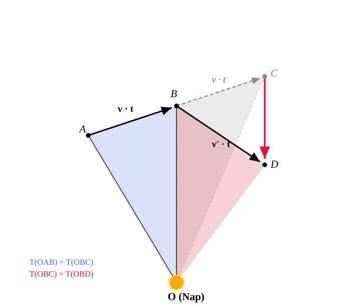

# The Law of Gravitation

## First Cosmic Velocity

Imagine launching an object horizontally near the Earth's surface at a sufficiently high speed. For this thought experiment, let us neglect air resistance. At a high enough velocity, the object would enter a circular orbit around the Earth.

Let us calculate this velocity:

$$
F_{\text{net}} = ma_{\text{cp}}
$$

$$
F_{\text{net}} = mg
$$

$$
mg = ma_{\text{cp}}
$$

$$
g = a_{\text{cp}}
$$

$$
g = \frac{v^2}{R}
$$

$$
v^2 = gR
$$

$$
v = \sqrt{gR} = \sqrt{9.81 \cdot 6.370 \cdot 10^6} \approx 7905\text{ m/s} = 7.905\text{ km/s}
$$

During this calculation, we used the value of the Earth's radius, which is $6370\text{ km}$.

This theoretically lowest speed required to put a projected object into a circular orbit near the surface is called the first cosmic velocity. In reality, overcoming air resistance near the surface would require immense propulsion, but at an altitude of a few hundred kilometers, it does not. At these heights, the air is so thin that objects can be put into orbit around the Earth if accelerated to the correct speed. Once the object reaches this velocity, virtually no further propulsion is needed.

## The Distance Dependence of Gravity

Newton performed the same calculation as above. He wanted to know how the gravitational force holding an object in a circular orbit decreases with altitude. He reasoned that the Moon is held in orbit by the same force that attracts objects toward the center of the Earth. In what proportion does this force decrease with distance?

Newton knew that the Moon is approximately 60 Earth radii away from the Earth ($384\,400\text{ km}$). We can calculate the Moon's acceleration since its orbital period is $T = 27.3\text{ days}$.

$$
v = \frac{2\pi r}{T} = \frac{2 \cdot 3.1415 \cdot 384\,400\,000}{27.3 \cdot 86400} \approx 1024\text{ m/s}
$$

$$
a_{\text{cp}} = \frac{v^2}{r} = \frac{1024^2}{384\,400\,000} \approx 0.002728\text{ m/s}^2
$$

$$
\frac{g}{a_{\text{cp}}} = \frac{9.81}{0.002728} \approx 3596
$$

Evidently, within our calculation's precision, we obtain approximately 3600 to a good approximation ($60^2 = 3600$). Thus, Newton found that:

$$
\frac{g}{a_{\text{cp}}} = \frac{r^2}{R^2}
$$

$$
a_{\text{cp}} = \frac{gR^2}{r^2}
$$

Therefore, the gravitational acceleration of objects decreases inversely as the square of the distance $r$ from the center of the Earth. This obviously applies to the force acting on the objects as well. This is how the law of gravitational force was born.

## The Law of Gravitation

> **An attractive gravitational force acts between any two bodies. For point masses, this force is directly proportional to the product of their masses and inversely proportional to the square of the distance between them. The force acts along the straight line connecting the point masses and is always attractive.**

$$
F_{\text{g}} = G \frac{m_1 m_2}{r^2}
$$

From the law of gravitation, Newton successfully derived all three of Kepler's laws for planetary motion. Unfortunately, the general derivation for elliptical orbits requires advanced mathematical knowledge, so we will not do it here. However, deriving the second and third laws is highly instructive. We will derive the third law here only for the case of circular orbits.

## Derivation of Kepler's Second Law

Let us observe the motion of the body over an extremely short time interval $t$, such that $t \ll T$. Initially, the body moves in a straight line from point $A$ to point $B$ during this very short time $t$. If no force acted on it, it would reach point $C$ after another time interval $t$, continuing along the same straight line at a uniform speed.

$$
\overline{AB} = \overline{BC}
$$

Let the Sun be at point $O$. In this case, the area of triangle $OAB$ and triangle $OBC$ are equal, because their heights and their perpendicular bases are equal.

$$
\text{Area}_{OAB} = \text{Area}_{OBC}
$$

Since a force directed toward the Sun acts on the body, it actually reaches point $D$ instead of $C$. The line segment $\overline{CD}$ is parallel to the segment $\overline{OB}$, because the force causing the change in velocity points directly toward the Sun. In this case, however, the areas of triangles $OBC$ and $OBD$ are also equal, because they share the common base segment $\overline{OB}$ and their corresponding heights are equal (due to parallelism). This means that:

$$
\text{Area}_{OAB} = \text{Area}_{OBD}
$$

Since $t$ is an arbitrary, albeit small, time interval, this implies that the areal velocity is constant.

## Kepler's Third Law for Circular Orbits

Let $M$ be the mass of the Sun. In this case, the acceleration for a planet moving in a circular orbit is:

$$
a_{\text{cp}} = \frac{F_{\text{net}}}{m} = \frac{F_{\text{g}}}{m} = \frac{G \frac{mM}{r^2}}{m} = \frac{GM}{r^2}
$$

The centripetal acceleration for a circular orbit is:

$$
a_{\text{cp}} = \frac{v^2}{r} = \frac{(\frac{2\pi r}{T})^2}{r} = \frac{4\pi^2 r^2}{T^2 r} = \frac{4\pi^2 r}{T^2}
$$

Equating the two expressions gives:

$$
\frac{GM}{r^2} = \frac{4\pi^2 r}{T^2}
$$

$$
\frac{GM}{4\pi^2} = \frac{r^3}{T^2}
$$

Therefore, the ratio of the cube of the mean distance from the Sun to the square of the orbital period is a constant that depends only on the mass $M$ of the Sun.

Although our derivation recovers the law only for circular orbits, the law holds true for elliptical orbits as well. In that case, the radius $r$ is replaced by $a$, which is half the length of the major axis (the semi-major axis). For circular orbits, this is nothing other than the radius.