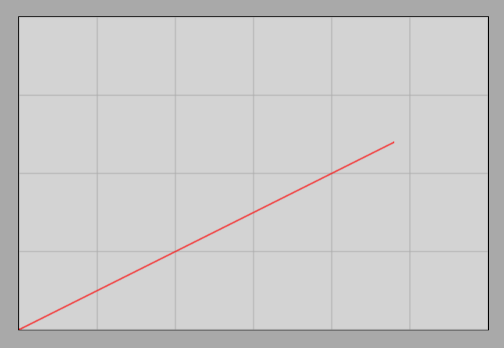

# Acceleration

## Uniformly Accelerated Motion

When the magnitude of an object's velocity or its direction of motion changes, we speak of accelerated motion. For now, we will concern ourselves with the simplest case, where the motion is rectilinear, meaning the direction of velocity does not change, only its magnitude increases or decreases.

> **We speak of uniformly accelerated motion when the velocity of an object changes by equal amounts in equal time intervals.**

### Demonstration
[Demonstration of uniform and uniformly accelerated motion using an air track](https://www.youtube.com/watch?v=PCLjIjAUBnw&t)

### Simulation
[Frictionless Motion on an Inclined Plane Simulator](https://alexerdei73.github.io/physics-engine/project/#94f47c36-ead0-4d85-a1ff-ac1827797ce9)

Both the demonstration and the simulation show that the object moves with acceleration down the incline in the frictionless case. For practice, let us plot the velocity-time graph of the object using the simulator! This is shown in the following figure:

Based on the graph, the velocity of the object increases by $0.5\text{ }\frac{\text{m}}{\text{s}}$ every second. The motion is therefore uniformly accelerated motion. The initial velocity is 0; the object starts from rest.

## The Concept and Formula of Acceleration

> **Acceleration is equal to the change in velocity per unit of time. It can be calculated as the quotient of the change in velocity and the time. Symbol: $a$, unit: $\frac{\text{m}}{\text{s}^2}$**

$$
a = \frac {\Delta v} {t} = \frac {v - v_0} {t}
$$

Acceleration is actually a vector quantity that always points in the direction of the velocity change vector. The velocity change vector is the difference between the final velocity vector and the initial velocity vector. Although this physical relationship holds true generally only for vectors, we are for now dealing with cases where the vectors lie along a single straight line and the direction of motion does not change, making it simpler to perform calculations in scalar form.

### Examples

1. During the simulation, the object moving down the incline accelerated from $0.5\text{ }\frac{\text{m}}{\text{s}}$ to $2\text{ }\frac{\text{m}}{\text{s}}$ in $3\text{ s}$. What is the acceleration?

$$
a = \frac {v - v_0} {t} = \frac {2\text{ }\frac{\text{m}}{\text{s}} - 0.5\text{ }\frac{\text{m}}{\text{s}}} {3\text{ s}} = 0.5\text{ }\frac{\text{m}}{\text{s}^2}
$$

Therefore, the acceleration of the object is $0.5\text{ }\frac{\text{m}}{\text{s}^2}$.

2. A car brakes from a velocity of $20\text{ }\frac{\text{m}}{\text{s}}$ to a velocity of $5\text{ }\frac{\text{m}}{\text{s}}$ in $6\text{ s}$. What is the acceleration of the car?

$$
a = \frac {v - v_0} {t} = \frac {5\text{ }\frac{\text{m}}{\text{s}} - 20\text{ }\frac{\text{m}}{\text{s}}} {6\text{ s}} = -2.5\text{ }\frac{\text{m}}{\text{s}^2}
$$

Our formula yields a negative value for the acceleration of the car during braking. The notation $a$ typically denotes the pure magnitude of the acceleration vector, which by definition cannot be negative. During braking, this formula actually gives the component of the acceleration vector along the direction of motion ($a_x$, if the motion occurs along the x-axis). The x-component of acceleration can take a negative value if the acceleration vector points opposite to the chosen axis—and this is precisely what happens during braking. Applying the formula using the plain letter $a$ instead of the notation $a_x$ is mathematically slightly imprecise, but it is used this way in high school practice for the sake of brevity.

> **In the case of braking (deceleration), the numerical value of acceleration is negative, which means that the direction of the acceleration vector is opposite to the instantaneous direction of motion.**

## Exercises

1. A competitor starts from zero velocity and reaches a velocity of $10\text{ }\frac{\text{m}}{\text{s}}$ in $8\text{ seconds}$. What is their average acceleration?

2. A train decelerates from a velocity of $15\text{ }\frac{\text{m}}{\text{s}}$ in $20\text{ seconds}$, and its velocity decreases to $5\text{ }\frac{\text{m}}{\text{s}}$. What is its acceleration?

3. A ball is thrown vertically upward. In the first second, its velocity decreases from $25\text{ }\frac{\text{m}}{\text{s}}$ to $15\text{ }\frac{\text{m}}{\text{s}}$. What is the value of gravitational acceleration from this measurement?

4. A motorcycle accelerates from $0\text{ }\frac{\text{m}}{\text{s}}$ to a velocity of $30\text{ }\frac{\text{m}}{\text{s}}$ in $5\text{ seconds}$. What is its acceleration?

5. Upon landing, an airplane brakes from a velocity of $60\text{ }\frac{\text{m}}{\text{s}}$ to a complete standstill in $15\text{ seconds}$. What is its acceleration during braking?
