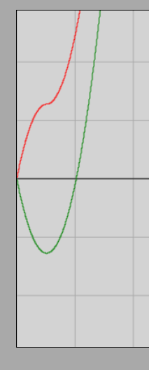

# Projectile Motion *

## Vector Components

We have seen that physical quantities such as velocity or acceleration are vector quantities that have a well-defined direction in addition to their magnitude. Geometrically, vectors add together in the exact same manner as consecutive displacements.

If we examine motion within a coordinate system, the position of points in a plane can be specified with two coordinates. In space, three coordinate axes are required, so the position of points there is determined by three coordinates.

Within a coordinate system, any vector can be translated parallel to itself anywhere; such a parallel translation does not change the vector itself. If we translate the tail of the vector to the origin (starting point) of the coordinate system, the tip of the vector can be uniquely specified by two or three coordinates—depending on the number of dimensions. For the sake of simplicity, we will only deal with planar vectors for now.

[Interactive Illustration of Vector Coordinates (GeoGebra)](https://www.geogebra.org/calculator/unkrfvjp)

The coordinate notation of vectors has the following form:

$$
\vec{a} = (a_x,\ a_y)
$$

Here, $a_x$ and $a_y$ are the coordinates of vector $\vec{a}$. These values determine the vector only in combination with the chosen coordinate system. If we rotate the coordinate system, the coordinates of the vector will change as well. In what follows, we will not move the fixed coordinate system.

Every vector $\vec{a}$ can be decomposed into the sum of two vectors that are parallel to the coordinate axes. These are called **vector components**. The component parallel to the $x$-axis is the $x$-component, whose length is $|a_x|$, and the component parallel to the $y$-axis is the $y$-component, whose length is $|a_y|$.

## Distance Traveled and the Displacement Vector

Let us examine an arbitrary motion during which an object, considered as a point mass, moves from a starting point to an endpoint! The vector pointing directly from the starting point to the endpoint is called the **displacement vector**; this is a vector quantity. The length of the actual path connecting the starting point and the endpoint is called the **distance traveled**.

When does the magnitude of the displacement vector equal the distance traveled? This can happen exclusively in rectilinear motions during which the moving object travels in a single direction throughout, meaning it does not reverse its direction of motion. In our studies so far, we have dealt with precisely such cases.

In what follows, we will also encounter cases where the path of motion is not straight (curved path), or it is straight but the object's direction of motion reverses during the process. It is important to note that the rule of the area under the velocity-time graph for calculating the distance traveled remains valid here as well, provided that we plot the *magnitude* of the velocity, which can never be negative.

However, we can also plot any coordinate of the velocity vector as a function of time. In this case, this velocity coordinate can take a negative value if that specific component of the velocity points opposite to the positive direction of the coordinate axis. If the velocity coordinate becomes negative, then the area under (or above) the graph curve must also be taken into account with a negative sign. The total net area under the velocity coordinate-time function curve, calculated this way with sign awareness (summed), gives not the distance traveled, but the **corresponding coordinate of displacement**.

We will see that our previously derived kinematic relationships all remain valid, except that the coordinates of displacement replace the distance traveled ($s$), and we must substitute the corresponding signed coordinates of the other vector quantities instead of their magnitudes. With this method, any complex uniformly changing motion—such as the various types of projectile motions—can be easily calculated.

## Vertical Projectile Motion

Let us throw a ball vertically upward with a certain initial velocity $v_0$! Let the ball launch from the origin of the coordinate system. Let the $x$-axis be horizontal, pointing from left to right, and let the $y$-axis point vertically upward.

The thrown ball rises vertically, then its velocity becomes zero for an instant, but it immediately begins to move downward, falling back along the same vertical path with increasing speed. Since the ball moves along the $y$-axis throughout, its $x$-coordinate remains zero during the motion ($x = 0$). Let us write the time dependence of the $y$-coordinate by substituting the $y$-coordinate of displacement for the distance traveled, and using the signed $y$-components of acceleration and velocity instead of their magnitudes!

During the motion, which takes place freely with negligible air resistance, the acceleration is constant throughout, points vertically downward, and its magnitude is the gravitational acceleration $g$. Since our axis points upward, the components of the acceleration vector are:

$$
\vec{a} = (a_x,\ a_y) = (0,\ -g)
$$

The initial velocity vector points vertically upward, so its components are:

$$
\vec{v}_0 = (v_{0x},\ v_{0y}) = (0,\ v_0)
$$

Starting from the origin ($y_0 = 0$), the $y$-coordinate of displacement is:

$$
\Delta y = y - y_0 = y - 0 = y
$$

Let us recall the quadratic law of motion for uniformly changing motion:

$$
s = v_0 \cdot t + \frac {a} {2} \cdot t^2
$$

Let us substitute the corresponding $y$-components of the vectors and the displacement in the $y$-direction into the formula:

$$
\Delta y = v_{0y} \cdot t + \frac {a_y} {2} \cdot t^2
$$

$$
y = v_0 \cdot t - \frac {g} {2} \cdot t^2
$$

### Simulation

[Vertical Projectile Motion Interactive Simulator](https://alexerdei73.github.io/physics-engine/project/#92e788c7-ec41-4a65-9505-a3fc8c1ad904)

Let us run the simulation, place the object at the origin of the coordinate system, and plot the distance traveled (**path length**) and the $y$-coordinate as a function of time!

> **Methodological Tip:** If we are logged out or do not have a user account, the changes made in the simulator are recorded only temporarily on our own computer. As soon as we log into our account, these temporary settings reset, and we get back the original values specified by the project creator.

The image of the graph obtained from the simulation:

The red curve shows the distance traveled ($s$), and the green curve shows the $y$-coordinate. Take into account that the simulation internally uses a reversed $y$-axis direction compared to our theoretical derivation, so the green curve must be mentally mirrored across the horizontal time axis. If we do this, it can be seen that during the ascending phase, the green and red lines overlap perfectly, and as soon as the direction of motion reverses at the peak, the two curves visibly separate—exactly as predicted in theory.

### Examples

1. A ball is thrown vertically upward with an initial velocity of $20.0\text{ }\frac{\text{m}}{\text{s}}$. Air resistance is negligible, and the value of gravitational acceleration is $9.81\text{ }\frac{\text{m}}{\text{s}^2}$. How high does the ball rise, and after how much time does it return to the starting point (to our hand)?

At the highest point of the trajectory, the instantaneous velocity of the body decreases to zero ($v = 0$). Let us write the relationship for the acceleration component to determine the rise time ($t$), denoting the unknown by $x$:

$$
-g = \frac {0 - v_0} {t}
$$

$$
-9.81 = \frac {-20.0} {x}
$$

$$
-9.81 \cdot x = -20.0
$$

$$
x = \frac {-20.0} {-9.81} \approx 2.039
$$

The duration of the ascent rounded to three significant figures is $2.04\text{ s}$. We suspect that the total return time will be exactly twice this value, since the fall and the ascent are symmetrical in the absence of air resistance. Let us calculate this from the displacement formula as well, since upon return, the displacement of the body becomes zero ($y = 0$):

$$
y = v_0 \cdot t - \frac {g} {2} \cdot t^2
$$

$$
0 = 20.0 \cdot x - \frac {9.81} {2} \cdot x^2
$$

$$
0 = x \cdot (20.0 - 4.905 \cdot x)
$$

Factoring out $x$, the product can be zero in two cases. The solution $x = 0\text{ s}$ refers to the initial moment of the throw, which is not of interest to us now. The sought time instant is given by the expression inside the parentheses:

$$
20.0 - 4.905 \cdot x = 0
$$

$$
20.0 = 4.905 \cdot x
$$

$$
x \approx 4.077
$$

The total return time rounded to three significant figures is indeed $4.08\text{ s}$, which is exactly twice the rise time. This proves that the durations of the ascending and downward falling phases are identical.

2. A pit with vertical walls is $10.0\text{ m}$ deep. Standing at the edge of the pit, we throw a ball vertically upward with an initial velocity of $10.0\text{ }\frac{\text{m}}{\text{s}}$. How much time elapses before the ball impacts the bottom of the pit, and what will its impact velocity be? Air resistance is negligible, and the gravitational acceleration is $9.81\text{ }\frac{\text{m}}{\text{s}^2}$.

Since the bottom of the pit is located $10.0\text{ meters}$ below the throwing point (origin), the coordinate of the body at the point of impact will be $y = -10.0\text{ m}$. Let us write the position coordinate equation, denoting the unknown time by $x$:

$$
y = v_0 \cdot t - \frac {g} {2} \cdot t^2
$$

$$
-10.0 = 10.0 \cdot x - \frac {9.81} {2} \cdot x^2
$$

$$
-10.0 = 10.0 \cdot x - 4.905 \cdot x^2
$$

Rearranging the quadratic equation:

$$
4.905 \cdot x^2 - 10.0 \cdot x - 10.0 = 0
$$

Let us apply the quadratic formula:

$$
x_{1,2} = \frac {-b \pm \sqrt {b^2 - 4ac}} {2a} = \frac {10.0 \pm \sqrt{(-10.0)^2 - 4 \cdot 4.905 \cdot (-10.0)}} {2 \cdot 4.905} = \frac {10.0 \pm \sqrt{100 + 196.2}} {9.81}
$$

$$
x_{1,2} = \frac {10.0 \pm 17.21} {9.81} \implies x_1 \approx 2.774;\ \ x_2 \approx -0.735
$$

Since the elapsed time can physically only be positive, the correct value is $t = 2.77\text{ s}$. The ball reaches the bottom of the pit after this amount of time. Let us calculate the instantaneous velocity at impact ($v_y$), denoting the unknown by $x$:

$$
-g = \frac {v_y - v_0} {t}
$$

$$
-9.81 = \frac {x - 10.0} {2.774}
$$

$$
x - 10.0 = -27.21
$$

$$
x = -17.21
$$

The magnitude of the impact velocity rounded to three significant figures is $17.2\text{ }\frac{\text{m}}{\text{s}}$. The negative sign obtained indicates that the direction of the velocity component $v_y$ is opposite to the upward-pointing $y$-axis, meaning that the object is moving downward at the moment of impact, just as happens in reality.

## Exercises

1. A ball is thrown vertically upward with an initial velocity of $15.0\text{ }\frac{\text{m}}{\text{s}}$. How high does the ball rise? How much time does it take to reach the maximum height? Air resistance is negligible, and the gravitational acceleration is $9.81\text{ }\frac{\text{m}}{\text{s}^2}$.

2. A ball is thrown vertically upward and returns to our hand after $5.0\text{ seconds}$. What was the initial velocity? The gravitational acceleration is $9.81\text{ }\frac{\text{m}}{\text{s}^2}$.

3. A ball is thrown vertically upward with a velocity of $12.0\text{ }\frac{\text{m}}{\text{s}}$. How much time does it take to reach a height of $10.0\text{ m}$ during the ascent? The gravitational acceleration is $9.81\text{ }\frac{\text{m}}{\text{s}^2}$.

4. A ball is thrown vertically upward, and after $3.0\text{ seconds}$ its velocity is $5.0\text{ }\frac{\text{m}}{\text{s}}$ upward. What was the initial velocity? The gravitational acceleration is $9.81\text{ }\frac{\text{m}}{\text{s}^2}$.

5. A ball is thrown vertically upward with a velocity of $18.0\text{ }\frac{\text{m}}{\text{s}}$. How much time does it take to reach a height of $15.0\text{ m}$? The gravitational acceleration is $9.81\text{ }\frac{\text{m}}{\text{s}^2}$.
