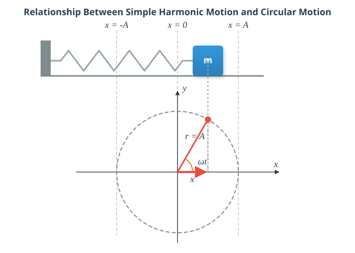

# Harmonic Oscillation

## Experiment

[Relationship Between Uniform Circular Motion and Simple Harmonic Motion](https://www.youtube.com/watch?v=ZlleypTKfGY)

The video demonstrates the physical connection between uniform circular motion and simple harmonic motion through simultaneous shadow projection. A plastic ball with an 8 cm diameter is mounted near the edge of a rotating disk driven by a speed reducer motor. Next to the rotating disk, a 20 N mass hangs from a vertical spring. When illuminated by a slide projector, the shadows cast on the screen show that the vertical component of the ball's circular motion matches the vertical oscillation of the mass on the spring exactly. This proves that simple harmonic motion can be mathematically modeled over time using sinusoidal functions.

## Simulation

[Relationship Between Uniform Circular Motion and Simple Harmonic Motion](https://alexerdei73.github.io/physics-engine/project/#7af99d9a-bc17-46b4-be37-20cbcb802374)

## The Concept of Simple Harmonic Motion

An object attached to a spring undergoes simple harmonic motion, and as can be seen from both the experiment and the simulation, this is closely related to uniform circular motion. When the objects are started appropriately, their motion remains synchronized in such a way that one coordinate (e.g., the x-coordinate) of the object performing uniform circular motion is identical at every instant to the x-coordinate of the object performing simple harmonic motion in a straight line parallel to the x-axis.

$$
x = A\cos(\omega t)
$$

From mathematics, we know that the coordinates of a point in a rectangular coordinate system are given by:

$$
x = r\cos \phi
$$

$$
y = r\sin \phi
$$

Here, $r$ is the distance from the origin, and $\phi$ is the angle of rotation measured from the positive x-axis. For circular motion, the angle of rotation is $\omega t$, and the radius $r$ of the circle is denoted here by $A$ and is called the amplitude. The variable $x$ is called the displacement, and the amplitude represents the maximum displacement, since the maximum value of the cosine function is 1. Instead of angular velocity, $\omega$ is now called the angular frequency (or radian frequency), and the previous relationship still holds true:

$$
\omega = \frac {2\pi} {T} = 2\pi f
$$

Here, the frequency $f$ is the reciprocal of the period $T$.

$$
f = \frac {1} {T}
$$

The unit of frequency is $\frac {1} {s}$, which is also called hertz, denoted by Hz. In circular motion, the reciprocal of the period is referred to as the rotational speed (or revolutions per unit time) and is denoted by $n$.

## Important Concepts

> **Displacement ($x$):** The signed distance of the oscillating body from its equilibrium position.

> **Amplitude ($A$):** The name given to the maximum displacement.

> **Frequency ($f$):** The number of oscillations completed per unit time ($1\text{ s}$). Its unit is the hertz (Hz). $1\text{ Hz} = \frac {1} {s}$

> **Period ($T$):** The time required to complete one full oscillation. It is the reciprocal of the frequency.

> **Angular Frequency ($\omega$):** $2\pi$ times the frequency.

> **Phase ($\phi$):** The angular displacement of an imaginary object performing uniform circular motion in synchronization with the harmonic oscillation. $\phi = \omega t$

> **Simple Harmonic Motion:** A motion where the displacement of an object moving along a straight line is equal at every moment to the x-coordinate of a real or imaginary object performing uniform circular motion in synchronization with it. The displacement can be described as a sine or cosine function of time.

## Example
An object attached to a spring performs simple harmonic motion. The amplitude of the motion is $0.2\text{ m}$, and the frequency is $2\text{ Hz}$.

- What is the period?
- What is the angular frequency?
- Write down the equation that gives the displacement as a function of time, if the displacement is at its maximum at $t=0$!
- Calculate the displacement at $t=0.150\text{ s}$!

$$
T = \frac {1} {f} = \frac {1} {2} = 0.5\text{ s}
$$

$$
\omega = 2\pi f = 2 \cdot \pi \cdot 2 \approx 12.566 \frac {1} {s}
$$

$$
x = A \cos (\omega t) = 0.2 \cdot \cos (12.566 \cdot t)
$$

$$
x = 0.2 \cdot \cos (12.566 \cdot 0.15) = -0.0618\text{ m}
$$

> **Hint:** When solving, you must make sure that the angle is measured in radians, so your calculator must be switched to radian (RAD) mode!

## Problems
1. A point-like body performing simple harmonic motion has an amplitude of $5\text{ cm}$ and a period of $0.4\text{ s}$. 
*   a) Determine the frequency and the angular frequency of the body's oscillation!
*   b) Write down the displacement-time function, assuming that the body is at its maximum positive displacement at the moment $t=0$!

2. The displacement-time function of a body is given by: $x(t) = 0.15 \cdot \cos(10\pi \cdot t)$, where the displacement is measured in metres and time in seconds. 
*   a) Read and calculate the amplitude, angular frequency, frequency, and period of the motion!
*   b) How far is the body from its equilibrium position at the moment $t = 0.05\text{ s}$?

3. A body hanging on a spring performs simple harmonic motion with an amplitude of $A = 8\text{ cm}$. Its motion is described by the relationship $x = A \cos(\omega t)$. 
*   What is the displacement of the body at the moment when the phase angle ($\phi = \omega t$) describing the motion is exactly $\frac{\pi}{3}$ radians? Give your answer in cm!
